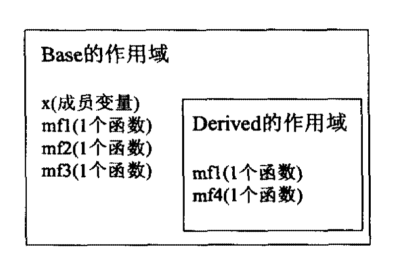

# Effective C++

## 00：导读

**类的构造函数声明为 `explicit` 可以阻止它们被用来执行隐式类型转换，但是仍可以执行显示类型转换**

```cpp
// 关于explicit
class B{
public:
    explicit B(int x = 0, bool b = true);	// default构造函数
}
void doSomething(B bObject);	// 函数，接收一个类型为B的对象
B bObj1(10);	// 没问题，根据int 28创建一个B，bool参数缺省为true
doSomething(bObj1);    // 没有问题，传给函数的参数是B类型对象
doSomething(20);	// 错误，int至B之间不能隐式转换
doSomething(B(20));	// 正确，使用B构造函数将int显示转换
```

**pass-by-value 意味着 “调用拷贝构造函数”**

## 02：尽量以const, enum, inline 替换＃define

Prefer consts,enums, and inlines to #defines

**静态变量static的作用是保证类里面至多只有一份该量实体**

```cpp
class GamePlayer {
private:
    static const int NumTurns = 5;	//常量声明式
	int scores[NumTurns];		   //使用该常量
} ;
```


**inline函数的作用就是替换函数宏定义**

```cpp
// 以a和b的较大值调用f
#define CALL_WITH_MAX(a, b) f((a) > (b) ? (a) : (b))

template<typename T>           					 // 由于我们不知道
inline void callWithMax(const T& a, const T& b)	 // T 是什么，所以采用
{										    //pass by reference-to-const
    f(a>b?a:b);
}
```

`＃include` 仍然是必需品，而`#ifdef`/`#ifndef` 也继续扮
演控制编译的重要角色。目前还不到预处理器全面引退的时候，

> - 对于单纯常量，最好以const 对象或enums 替换＃defines 。
> - 对于形似函数的宏(macros) ，最好改用inline 函数替换＃defines 。

## 03：尽可能使用const

它允许你指定一个==语义约束==（也就是指定一个“不该被改动”的对象），而编译器会强制实施这项约束。它允许你告诉编译器和其他程序员某值应该保待不变。只要这（某值保持不变）是事实，你就该确实说出来，因为说出来可以获得编译器的襄助，确保这条约束不被违反。

```cpp
char greeting[] = "Hello";
char* p = greeting;				// non-const pointer, non-constdata
const char* p = greeting;		// non-const pointer, const data
char* const p = greeting;		// const pointer, non-constdata
const char* const p = greeting;  // Const pointer, Const data
```

> 如果关键字const 出现在星号==左边==，表示==被指物是常量==；
>
> 如果出现在星号==右边==，表示==指针自身是常量==；
>
> 如果出现在星号两边，表示被指物和指针两者都是常量。

**关键字const 写在类型之前或写在类型之后、星号之前这两种写法的意义相同：**

```cpp
void fl(const Widget* pw);		// fl 获得一个指针，指向一个
							  // 常量的（不变的） Widg玩对象
void f2 (Widget const * pw) ;	// f2也一样
```

**迭代器声明为const（即T* const）是指这个迭代器不能指向别的东西，但所指向东西的值可以改变**

**如果希望迭代器指向东西的值不被改动（即const T*），则需要使用const_iterator**

```cpp
std: :vector<int> vec;
...
const std::vector<int>::iterator iter = vec.begin();//iter的作用像个T* const
*iter = 10;					// 没问题，改变iter 所指物
++iter;						// 错误！ iter 是const
std::vector<int>::const_iterator citer = vec.begin();//citer的作用像个const T*
*citer = 10;				// 错误！ ＊clter 是const
++citer;					// 没问题，改变citer 。
```

**函数返回值为const是为了防止对函数的返回值再做赋值操作**

```cpp
const Rational operator* (const Rational& lhs, const Rational& rhs);

Rational a, b, c;
...
(a * b) = c;  // 没意义的操作,在a * b 的成果上再调用operator=
```

**函数参数应尽量声明为const，除非想要改动参数，这可以防止把`'=='`打成`'='`**

**改善C+＋程序效率的一个根本办法是以`pass by reference-to-const`方式传递对象**

**const 成员函数:**

1. 可以得知哪个函数可以改动对象内容而哪个函数不行
2. 使“操作const 对象”成为可能
3. 通过`pass by reference-to-const`传递来的对象只能用const成员函数来处理
4. 真实程序中const 对象大多用千passed by pointer-to-const 或passed by
   reference-to-const 的传递结果

**const总结：**

- 将某些东西声明为const 可帮助编译器侦测出错误用法。const 可被施加千任
  何作用域内的对象、函数参数、函数返回类型、成员函数本体。
- 当`const` 和`non-const` 成员函数有着实质等价的实现时，令`non-const 版本`调
  用`const 版本`可避免代码重复。

## 04:确定对象被使用前已先被初始化

**C++ 规定，对象的成员变量的初始化动作发生在进入构造函数本体之前**

**想要default 构造类的一个成员变量时也可以使用成员初值列，只要指定初始化实参为空再给出那个成员的初值即可**

```cpp
ABEntry: :ABEntry()
:theName(),   // 调用theName的default 构造函数
theAddress(), // 为theAddress 做类似动作；
thePhones(),  //为thePhones 做类似动作；
nurnTimesConsulted(0) //将nurnTimesConsulted 显式初始化为0
{ }
```

==static对象==：其寿命从被构造出来直到程序结束为止，程序结束时static 对象会被自动销毁；

这种对象包括global 对象、定义千namespace 作用域内的对象、在classes 内、在函数内、以及在file 作用域内被声明为static 的对象；

函数内的static 对象称为==local static 对象==；

其他static对象称为==non-local static 对象==。

**总结：**

- 为内置型对象进行手工初始化，因为C++不保证初始化它们。
- 构造函数最好使用成员初值列(member initialization list) ，而不要在构造函数
  本体内使用赋值操作(assignment) 。初值列列出的成员变量，其排列次序应该
  和它们在class 中的声明次序相同。
- 为免除“跨编译单元之初始化次序”问题，请以local static 对象替换non-local
  static 对象。

## 05:了解C+＋默默编写并调用哪些函数

**关于构造和析构**

如果你自己没声明，编译器就会为它声明（编译器版本的）一个`copy 构造函
数`、一个``copy assignment 操作符``和一个``析构函数``。此外如果你没有声明任何构造函
数，编译器也会为你声明一个`default 构造函数`。所有这些函数都是==public 且inline==。

**编译以自己生成的拷贝构造和拷贝赋值是基于`base class`的**

**为什么赋值操作符的重载函数要返回一个自我的引用？**

为了实现连续赋值；如果不返回自我的引用的话返回的就是一个临时对象

```cpp
int a,b=2,c=3;
(a=b)=c;
// 先把b赋值给a括号内返回的就是a，然后再把c赋值给a
```


**总结**：

编译器可以暗自为class 创建default 构造函数、copy 构造函数、copy assignment 操
作符，以及析构函数。

## 06：若不想使用编译器自动生成的函数，就该
明确拒绝

**总结：**

- 为驳回编译器自动（暗自）提供的机能，可将相应的成员函数声明为private 并且
  不予实现。
- 使用像`Uncopyable `这样的`base class` 也是一种做法。

## 07: 为多态基类声明virtual 析构函数

**一个class含有`virtual函数`，该class通常为`base class`**

**只有当class 内含全少一个virtual 函数，才为它声明`virtual 析构函数`。**

**有pure virtual函数的class是抽象class，不能实例化对象**

**总结：**

- polymorphic （带多态性质的） base classes 应该声明一个virtual 析构函数。
- 如果class 带有任何virtual 函数，它就应该拥有一个virtual 析构函数。
- 只要将某类的析构设为pure virtual函数并实例化它就可以得到一个抽象类
- Classes 的设计目的如果不是作为base classes 使用，或不是为了具备多态性(polymorphically) ，就不该声明virtual 析构函数。

## 08：别让异常逃离析构函数

**C++ 不喜欢析构函数吐出异常！**

**总结：**

- 析构函数绝对不要吐出异常。如果一个被析构函数调用的函数可能抛出异常，析构函数应该捕捉任何异常，然后吞下它们（不传播）或结束程序。
- 如果客户需要对某个操作函数运行期间抛出的异常做出反应，那么class 应该提供一个普通函数（而非在析构函数中）执行该操作。

## 09： 绝不在构造和析构过程中调用virtual 函数

- 构造和析构期间不要调用virtual 函数，因为这类调用从不下降至derived class（比起当前执行构造函数和析构函数的那层）。

## 10：令`operator= `返回一个`reference to *this`

**为了实现“连锁赋值”，赋值操作符必须返回介个reference 指向操作符的左侧实参**

**这个协议适用于`+=` ，`-=`,`*=`,等等。**

## 11: 在`operator=` 中处理“自我赋值”

- 确保当对象自我赋值时operator= 有良好行为。其中技术包括比较”来源对象”和“目标对象”的地址、精心周到的语句顺序、以及copy-and-swap 。
- 确定任何函数如果操作一个以上的对象，而其中多个对象是同一个对象时，其行为仍然正确。
- Copying 函数应该确保复制“对象内的所有成员变量”及“所有base class 成分“。
- 不要尝试以某个copying 函数实现另一个copying 函数。应该将共同机能放进第三个函数中，并由两个coping 函数共同调用。

---


## 六：继承与面向对象设计

**==virtual函数==意味着“接口必须被继承”，==non-virtual函数==意味着“接口和实现都必须被继承”**

**==public继承==是一种==is-a==关系，即子类（derived class）is a 基类（base class）**

换句话说，如果D 以**public方式**继承了 B ，那么每一个D对象都是一个B对象，但是反过来不成立；

于是，某个函数的参数要接收的类型是B类型的，你传个D类型的对象也是完全正确的；

记住，只有**public继承方式**才有这种特性；

public继承主张能够施行于base class 对象身上的**每件事情**都可以施行于derived class对象身上！

## 33：避免继承而来的名称被覆盖

- local 作用域：函数花括号{}内的变量的作用域

- global 作用域：花括号外或类外等


- 名称覆盖规则：(name-hiding rules)，local作用域内与global作用域的同名变量，local作用域的会屏蔽掉global作用域的；

**基类与子类的作用域关系：**

子类的作用域被嵌套在了基类作用域内：



**编译器如何确定作用域：（作用域层级关系）**

local（函数体内）>> 子类作用域 >> 基类作用域  >> namespace空间  >> global 

```cpp
void Derived::mf4(){
    ...
    mf2();
    ...
}
```

拿函数 mf2() 来说，当编译器看到名称 mf2 时，首先查找 ==local 作用域==（也就是函数mf4()覆盖的区域）；没有找到时再查找外围作用域，也就是 ==class Derived 覆盖的作用域==；还没有找到时再往外，也就是 ==base class==，找到后停止查找，如果还没有找到那就再往外到==内含Base的那个namespace的作用域==，最后再是 ==global 作用域==

**如果子类里定义了和父类的同名函数（同名即可，参数不管），那父类的函数就完全被子类屏蔽掉了，子类对象掉的函数只能是子类中重新定义的那个**

**如果想去掉这层屏蔽，仍然想调用父类的该函数，可以使用==using 声明式==**

```cpp
using Base: :mfl; // 让Base class 内名为mfl 和mf3 的所有东西
using Base: :mf3; // 在Derived 作用域内都可见（并且 public)
```

---

## 34：接口继承和实现继承

