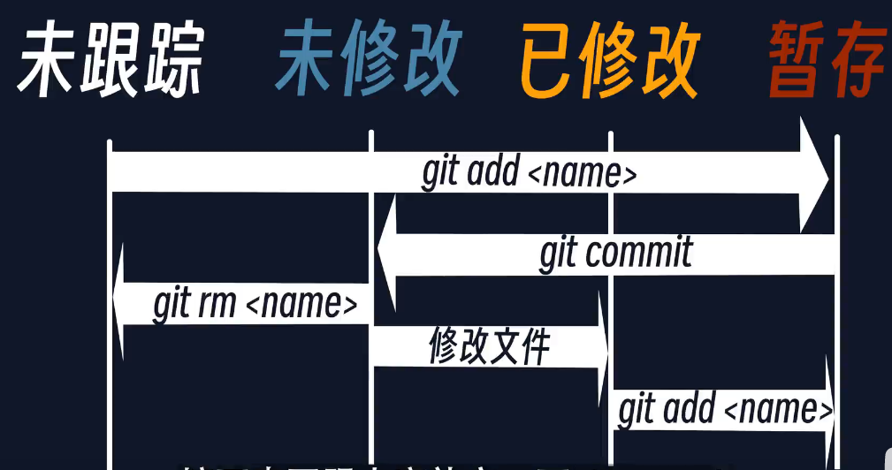
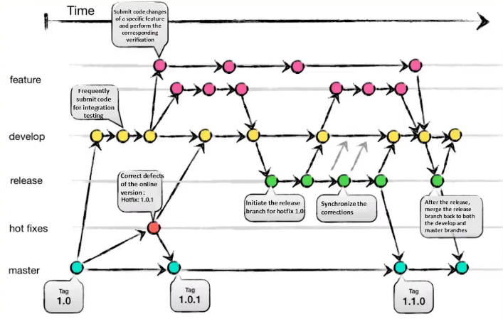

# Linux学习

## Git

版本控制系统（Version Control System）

是用来版本记录的，其主要功能是通过Git软件来实现的，GitHub只是一个远程托管存放代码的地方，GitHub可以托管你`push`上去的版本。

### 1.基本概念

**【工作目录】**：就是对应文件夹

**【暂存区/索引】：**对应命令`git add`，这一过程称为**注册**，对应动作为在`.git/index`中创建或者更新代码的一些属性信息，Git就是通过此文件来跟踪版本变更的；此外Git还会压缩代码文件并将这些压缩文件视为对象存储在`.git/objects/`目录中，如果代码有修改，则将其视为一个新的对象压缩并存储在`.git/objects/`目录中。

**【本地仓库】：**拥有`.git`目录的文件夹就是一个仓库。对应提交命令`git commit`，每次提交相当于生成一个**快照**，从而记录版本。

> 从文件被注册那一刻起，Git就开始使用索引来记录文件的内容，完成一次提交后，Git会及时创建并存储对该快照的引用。
>
> 暂存和提交：提交相当于交正式作业，暂存相当于作业先写了一点还没达到交的地步但想先记录下来，因此，写代码时可以多暂存，然后写到一定程度的时候再提交一次。
>
> `git log`命令可以显式项目历史

**【远程仓库】：**GitHub、GitLab

**【分支】：**从原有代码中生成一个新的测试代码版本。将代码项目的主分支命名为`main`，当打算对main中的代码进行改动时，最好的做法就是先见一个新分支，比如命名为`modification`，在该分支中修改代码。当 `modification`分支中的代码测试通过后，就可以合并到主分支了

**【clone】：**克隆是同时拷贝了代码文件和Git的版本跟踪文件，`pull`是只拷贝了代码文件，相当于只有最新的那个版本；

**【fork】：**clone是将文件从远程仓库拷贝到本地，fork是将文件从一个远程仓库拷贝到另一个远程仓库

### 2.设置Git环境

四个步骤：

1. 创建工作目录：新建一个文件夹
2. 初始化`.git/`目录： `git init`
3. 配置本地仓库选项： `git config`
   - 配置全局信息：`git config --global user.name “xxxxx”`，`git config --global user.email “xxxxx.com”`
   - Git全局配置信息在`主目录/.gitconfig`中，本地配置信息在`工作目录/.git/config`文件中。
   - 查看配置文件信息：`git config --list`
4. 确定远程仓库位置：
   - 在GitHub上新建一个仓库，并记住位置
   - 添加远程仓库地址：`git remote add origin “URL”`
   - 检查远程仓库地址的状态：`git Remote -v`
   - 若地址有问题：`git remote rm origin`删除远程仓库地址并重新设置

### 3.使用Git提交文件

四个步骤：

1. 创建或修改代码
2. 将代码添加到暂存区/索引
   - `git add`添加
   - `git status`查看状态，即查看是否添加成功
   - `git status`会输出已暂存待提交的文件
3. 将代码提交至本地仓库
   - `git commit -m "修改的原因及注释备注信息"`
   - 所有的提交注释被保存在`.git/COMMIT_EDITMSG`文件中
   - 如果不加`-m`参数就会调到`vim`编辑器中让你手动编辑`COMMIT_EDITMSG`文件
   - `git status`后会输出目前已没有待提交的文件
   - `git log` 查看所有提交日志
   - 本地分支名称默认为`master`，即主分支名。这个名称可以改，例如将主分支重命名为`main`：`git branch -m main`
4. 将代码推送至远程仓库
   - 推送前最好先确定当前分支名是否无误
   - 推送：`git push -u origin main`，` -u origin`指定推送的远程的上游（upstream）即起点为origin，推送的分支名为main分支。

### 4.使用Git拉取文件

1. 拉取最新版：`git pull origin main`
   - 本地有尚未上传到远程的文件时不能pull
2. 新成员接手：
   - 新成员接手项目时最好使用clone，而不要pull。clone能得到整个项目的所有历史。

### 本地部分


`git init`：文件夹 -> 仓库，这时候这个文件夹就变成了一个仓库

仓库中的文件一共有4种状态：

|                                     |                                     |                                     |                                     |
| ----------------------------------- | ----------------------------------- | ----------------------------------- | ----------------------------------- |
|  |  |  |  |


`git init`后，这个仓库（文件夹）里的每一个文件都有一个状态，git其实就是来用来记录这些文件的状态的。

未被跟踪那就是说：这个文件仅仅是文件夹里的一个普通文件，并没有被git进行版本管理，要使用版本管理就要去跟踪一个文件或者目录：

`git add <name> ` ：普通文件 -> 已跟踪文件 。

对文件修改后文件成为了`已修改`状态，还得使用`git add <name> `命令：

`git add <name> ` ：已修改状态 ->暂存（缓存）状态 。

`git commit <name> ` ：暂存（缓存）状态 -> 版本提交。这时候就生成了一个新的版本，注意`git commit`后文件的状态又回到了未修改状态，这是因为在新的版本下面他就是一个未修改过的状态

**各种状态之间的关系：**



需要**注意**的是，`git commit`后就是一个新的版本，文件的状态成了**未修改状态**

`git status` 查看当前仓库中文件的状态：

$\textcolor{red}{红色}$   表示已修改但没有暂存，`git add` 后就会变成绿色

$\textcolor{green}{绿色}$   表示已经暂存了，`git commit` 后就会变成未修改也未提交的状态

### remote部分

`git remote add origin url` ：让当前仓库连接到一个远程仓库上，远程仓库的名字叫`origin`，地址是`url`；

`git remote` ：查看当前仓库对应的远程仓库的名字

`git push origin master`：把当前仓库的内容`push`到远程`origin`仓库的`master`分支下

`git clone url`：远程仓库`clone`到本地

### branch分支



master分支就是一个发布版的分支，就是当前最新的版本

假如要开发一些新特性就在feature分支上修改，然后收集到develop分支上测试，假如没问题就可以准备发布了，就在release分支上，假如发布后经过验证也没有问题，就可以考虑吧release分支合并到master分支里。

## The Shell

**bash : Bourne Again Shell***

```yantao@yantao-virtual-machine:~$ ``` 冒号前面是主机名，当前所在的位置是 `~` (表示 “home”);`$`符号表示您现在的身份不是 root 用户.

shell 是一个编程环境，所以它具备变量、条件、循环和函数。当你在 shell 中执行命令时，您实际上是在执行一段 shell 可以解释执行的简短代码。如果你要求 shell 执行某个指令，但是该指令并不是 shell 所了解的编程关键字，那么它会去咨询 环境变量 `$PATH`,`echo $PATH`命令可显示当 shell 接到某条指令时，进行程序搜索的路径。当我们执行 `echo` 命令时，shell 了解到需要执行 `echo` 这个程序，随后它便会在 `$PATH` 中搜索由 `:` 所分割的一系列目录，基于名字搜索该程序。当找到该程序时便执行（假定该文件是 **可执行程序**)。

确定某个程序名代表的是哪个具体的程序，可以使用 `which` 程序。
```bash
yantao@yantao-virtual-machine:~$ which echo 
/bin/echo
```

也可以绕过 `$PATH`，通过直接指定需要执行的程序的路径来执行该程序。
```bash
yantao@yantao-virtual-machine:~$ echo hello
hello

yantao@yantao-virtual-machine:~$ /bin/echo hello
hello
```
shell 中的路径是一组被分割的目录，在 Linux 和 macOS 上使用 `/` 分割，而在Windows上是 `\`。

路径 `/` 代表的是**系统的根目录**，所有的文件夹都包括在这个路径之下，在Windows上每个盘都有一个根目录（例如： C:\）。

如果某个路径以 / 开头，那么它是一个 ==**绝对路径**==，其他的都是 ==**相对路径**== 。相对路径是指相对于当前工作目录的路径
```bash
yantao@yantao-virtual-machine:~$ ls
core  examples.desktop  MTO  OpenFOAM  openmpi  OpenMPI  PETSc  snap  swak4Foam  公共的  模板  视频  图片  文档  下载  音乐  桌面
yantao@yantao-virtual-machine:~$ cd /
yantao@yantao-virtual-machine:/$ ls
bin   cdrom  etc   initrd.img      lib    lost+found  mnt  proc  run   snap  swapfile  tmp  var      vmlinuz.old
boot  dev    home  initrd.img.old  lib64  media       opt  root  sbin  srv   sys       usr  vmlinuz
```

当前工作目录可以使用 `pwd` 命令来获取。此外，切换目录需要使用 `cd `命令。在路径中，`.` 表示的是当前目录，而 `..` 表示上级目录：
```bash
yantao@yantao-virtual-machine:~$ pwd
/home/yantao
```

shell 会实时显示当前的路径信息。一般来说，当我们运行一个程序时，如果我们没有指定路径，则该程序会在当前目录下执行。

大多数的命令接受标记和选项（带有值的标记），它们以 - 开头，并可以改变程序的行为。通常，在执行程序时使用 -h 或 --help 标记可以打印帮助信息，以便了解有哪些可用的标记或选项。

如果您想要知道关于程序参数、输入输出的信息，亦或是想要了解它们的工作方式，请试试 man 这个程序。它会接受一个程序名作为参数，然后将它的文档（用户手册）展现给您。注意，使用 q 可以退出该程序。
```bash
yantao@yantao-virtual-machine:~$ man ls

```

在 shell 中，程序有两个主要的“流”：它们的输入流和输出流。 当程序尝试读取信息时，它们会从输入流中进行读取，当程序打印信息时，它们会将信息输出到输出流中。 通常，一个程序的输入输出流都是您的终端。也就是，您的键盘作为输入，显示器作为输出。 但是，我们也可以==重定向==这些流！
最简单的重定向是 `< file` 和 `> file`。这两个命令可以将程序的输入输出流分别重定向到文件：

```bash
yantao@yantao-virtual-machine:~$ echo hello >hello.txt
yantao@yantao-virtual-machine:~$ cat hello.txt 
hello
yantao@yantao-virtual-machine:~$ cat <hello.txt 
hello
yantao@yantao-virtual-machine:~$ cat <hello.txt >hello2.txt
yantao@yantao-virtual-machine:~$ cat hello2.txt 
hello
```

`#` 在Bash中表示注释

## 关于参数

parameter 是统称，传递给命令的内容都可以称之为**参数（parameter）**。参数又具体分为：

- `argument` 。如果一个命令缺少了 argument，命令就不能执行，所以 argument 可以称之为**必选参数**，如：

  ```bash
  pip install click
  ```

- `flag` 。flag参数用于启用或禁用某些功能，它就是单独的一个参数。

  ```bash
  --help
  ```

- `option` 。option参数包含一个参数名和一个value：

  ```bash
  --cache-dir ./my-cache
  ```

  其中`--cache-dir`是参数名，`./my-cache`就是给该参数的值

## 常用命令

### cd

- `pwd` 查看当前操作文件路径
- `cd`：打开文件夹/切换路径
- `cd..`：打开上一级路劲
  - `-` 代表上次` cd` 的目录

  - `.` 代表当前目录

  - `.. `代表上一级目录

  - `~ `代表home目录

### ls

- 通过 `命令 --help` 来查看帮助：

  ```bash
  ls --help
  
  Usage： ls [OPTION]... [FILE]...
  ```

  其中，方括号表示可选参数，三个点代表0个或多个；

- `ls` 列出当前文件下所有的文件

  - 蓝色的是文件夹，白色的是文件

  - `ls *.XXX`：列出所有XXX类型的文件
  - `ls X*`：列出以`X`开头的文件

  - `？`也有与` *` 类似的作用，但是==*可代表多个字符，？只代表一个字符==

- `ls- l`

  ```bash
  drwxr-xr-x  3 yantao yantao 4096 Apr  3 23:20 OpenFOAM
  drwxr-xr-x  3 root   root   4096 Apr  4 10:09 src_code
  drwxr-xr-x 15 yantao yantao 4096 Apr  3 23:15 swak4Foam
  ```

  输出内容的每一行代表一个文件或子目录，其包括以下信息：

  - 文件类型和权限：第一列的` "-rw-r--r--" `表示文件类型（"-" 代表普通文件，"d" 代表子目录），接下来的 9 个字符表示文件的权限，2-4、5-7、8-10表示**文件所有者**、**文件所属用户组**和**其他用户**对文件的**读**`r`、**写**`w`、**执行**`x`权限。
  - 链接数：第二列的 "2" 表示子目录 subdir1 中有 2 个链接（一个是子目录本身，另一个是该子目录在其父目录中的链接）；对于普通文件，则显示其链接数。
  - 所有者和所属用户组：第三列和第四列分别表示文件或子目录的所有者和所属用户组。
  - 文件大小：第五列表示文件大小，对于子目录，则显示其包含的文件数和子目录数。
  - 最后修改时间：最后三列分别表示文件或子目录的最后修改日期、最后修改时间和名称。

### mv

change file‘s name or location

重命名或移动文件


### cp

==cp：复制文件==

- `cp [options] source dest`
- -a：此选项通常在复制目录时使用，它保留链接、文件属性，并复制目录下的所有内容。其作用等于dpR参数组合。
- -d：复制时保留链接。这里所说的链接相当于 Windows 系统中的快捷方式。
- -f：覆盖已经存在的目标文件而不给出提示。
- -i：与 -f 选项相反，在覆盖目标文件之前给出提示，要求用户确认是否覆盖，回答 y 时目标文件将被覆盖。
- -p：除复制文件的内容外，还把修改时间和访问权限也复制到新文件中。
- ==-r==：若给出的源文件是一个目录文件，此时将复制该目录下所有的子目录和文件。
- -l：不复制文件，只是生成链接文件。

### rm/ mvdir

` rm [OPTION]... [FILE]...`

- 删除文件：`remove filename`

- 删除文件夹

  需要注意的是，Linux中`removal`不是递归的，要删除一个文件夹得分两步

  - `rm -r 文件夹路劲` ，先递归删除文件夹下所有文件

  - `rmdir 文件夹名`，删除目录，`rmdir`只能删除空目录

### mkdir

要创建一个名为`my folder`的文件夹，必须这样：

```bash
mkdir "my folder"
# or
mkdir my\ folder
```

否则就是创建两个文件夹。

### man

```bash
man ls
```

### 清屏

`Ctrl`+`L`

`clear`

### tail

Print the last 10 lines of each FILE to standard output.

`tail -n1`：显式最后一行

### 流的概念

==程序与文件的交互==

输入流：键盘（default）

输出流：终端（default）

更改标准流到文件：

```bash
< FILE
> FILE
```

```bash
# default stream
echo hello
# rewire output 
echo > hello.txt
cat hello.txt
# amazing 
cat < hello.txt
# amazing ,creat a new file
cat < hello.txt > hello2.txt 
```

两个尖括号`>>`是`append`

```bash
cat < hello.txt >> hello2.txt 
```

两个尖括号`>>`是`append`

### 管道pipe

`|`符号：

take the output of the program to the left and make it the input of the program to the right right 

```bash
ls -l / | tail -n1 
ls -l / | tail -n1 > aaa.txt 
```

## data wrangling 数据整理

### `grep`

过滤出想要的内容

```bash
ssh myserver journalctl
 | grep sshd
 | grep "Disconnected from"
```

### `sed`

`sed` 是一个基于文本编辑器`ed`构建的”流编辑器” 。在 `sed` 中，您基本上是利用一些简短的命令来修改文件，而不是直接操作文件的内容（尽管您也可以选择这样做）。相关的命令行非常多，但是最常用的是 `s`，即*替换*命令

### 正则表达式

正则表达式非常常见也非常有用，例如： `/.*Disconnected from /`。正则表达式通常以（尽管并不总是） `/`开始和结束。大多数的 ASCII 字符都表示它们本来的含义，但是有一些字符也具有表示匹配行为的“特殊”含义。不同字符所表示的含义，根据正则表达式的实现方式不同，也会有所变。常见的模式有：

- `.` 除换行符之外的”任意单个字符”
- `*` 匹配前面字符零次或多次
- `+` 匹配前面字符一次或多次
- `[abc]` 匹配 `a`, `b` 和 `c` 中的任意一个
- `(RX1|RX2)` 任何能够匹配`RX1` 或 `RX2`的结果
- `^` 行首
- `$` 行尾


- cat 相当于vi，但是不能编辑

  - cat -n ：由 1 开始对所有输出的行数编号。
- 左键选中，中间粘贴
- 命令后加`&`表示后台运行
- `tab`：自动补全
  - 按两次会显示所有开头相同的文件或文件夹
- 方向键上：可以复制之前的命令
- 以 `.` 开头的文件是隐藏文件

  - `ls - a` 打开隐藏文件


- `touch` ：创建文件，touch其实是用于修改文件或者目录的时间属性，包括存取时间和更改时间。若文件不存在，系统会建立一个新的文件
- `mkdir` ：创建目录
- `rm`：移除文件
- `rm -d` ：移除目录


- `mv`：移动文件/重命名文件
- - 


- 打开文件

  - 命令：vi 文件名
   - 示例：打开当前目录下的aa.txt文件     vi aa.txt 或者 vim aa.txt

   - 注意：***使用vi编辑器打开文件后，并不能编辑，因为此时处于命令模式，点击键盘i/a/o进入编辑模式。***

## vi编辑器

**vi编辑器的3种模式**

基本上vi可以分为三种状态，分别是==命令模式==（command mode）、==插入模式==（Insert mode）和==底行模式==（last line mode），各模式的功能区分如下：

- **命令行模式**（command mode）

  控制屏幕光标的移动，字符、字或行的删除，查找，移动复制某区段及进入插入模式下，或者到底行模式。
  命令行模式下的常用命令：

  1. 控制光标移动：↑，↓，或者`h j k l`
  2. 删除当前行：`dd`
  3. 查找：`/`字符
  4. ***进入编辑模式：`i o a`***
     1. `i`：在光标所在字符前开始插入
     2. `a`：在光标所在字符后开始插入
     3. `o`：在光标所在行的下面另起一新行插入
  5. 进入底行模式：`:`

 - **编辑模式**（Insert mode）

   只有在Insert mode下，才可以做文字输入，==按「ESC」键可回到命令行模式。==

   -  ESC 退出编辑模式到命令行模式；

 - **底行模式**（last line mode）
   将文件保存或退出vi，也可以设置编辑环境，如寻找字符串、列出行号……等。
   底行模式下常用命令：

   - 退出编辑：   :`q`
   - 强制退出/取消编辑：   :`q!`
   - 保存并退出：  :`wq`
   - 查找字符：`/`
   - 设置显式行号：`set number`


---

## vim使用

终端输入`vimtutor`即有教程

**01**

 1. **光标在屏幕文本中的移动**既可以用箭头键，也可以使用 hjkl 字母键。
       h (左移)       j (下行)       k (上行)     l (右移)

  2. 欲进入 Vim 编辑器(从命令行提示符)，请输入：`vim 文件名 <回车>`

  3. 欲退出 Vim 编辑器，请输入 `<ESC> `  `:q! `  `<回车>` 放弃所有改动。
       或者输入` <ESC>   :wq   <回车>` 保存改动。

  4. 在正常模式下**删除光标所在位置的字符**，请按：` x`

  5. 欲插入或添加文本，请输入：

       `i`   输入欲**插入**文本   `<ESC>`             在光标前插入文本

      `A`     输入欲**添加**文本   `<ESC>`            在一行后添加文本

特别提示：按下 `<ESC>` 键会带您回到正常模式或者撤消一个不想输入或部分完整的命令。

**02**

  1. 欲从当前光标**删除至下一个单词**，请输入：`dw`
   2. 欲从当前光标**删除至当前行末尾**，请输入：`d$`
   3. 欲**删除整行**，请输入：`dd`

   4. 欲重复一个动作，请在它前面加上一个数字：2w
   5. 在正常模式下修改命令的格式是：
        operator   [number]   motion
      其中：
        operator - 操作符，代表要做的事情，比如 d 代表删除
        [number] - 可以附加的数字，代表动作重复的次数
        motion   - 动作，代表在所操作的文本上的移动，例如 w 代表单词(word)，
                   $ 代表行末等等。
   6. 欲**移动光标到行首**，请按数字0键：`0`
   7. 欲**撤消**以前的操作，请输入：`u `(小写的u)
      **欲撤消在一行中所做的改动**，请输入：`U `(大写的U)
      欲**撤消以前的撤消命令**，恢复以前的操作结果，请输入：`CTRL-R`

## GDB调试器

使用GDB必须要有可调式信息，通过为gcc编译器加上-g或-ggdb参数来生成带调试信息的可执行程序

```bash
gcc 123.c -g
```

- 启动可调式程序

```bash
gdb 可执行文件的名字
```

- gdb调试命令	
  - l	list,显示多行源代码
  - b    break,设置断点
  - r    run，开始执行程序
  - s    step，执行下一条，会进入子函数
  - n    next，执行下一句，不进入函数
  - c    continue，继续运行程序直到新断点
  - q    quit，退出GDB调试环境
  - p    print，打印变量值

- 实际使用流程

  ```bash
  gcc xxx.c -g
  gdb xxx.out
  l #列出程序的内容
  b 函数名字/行号 #设置断点，例如 b main 在main那行停下来
  r # 运行程序，会在断点处停下
  n # 下一步（不进入子函数），按第一n会先显示下一句要执行的命令，再按n才会执行那句
  p 变量名 # 打印当前变量的值
  s # 下一步（进入子函数）
  q # 退出GDB环境
  
  ```

  

