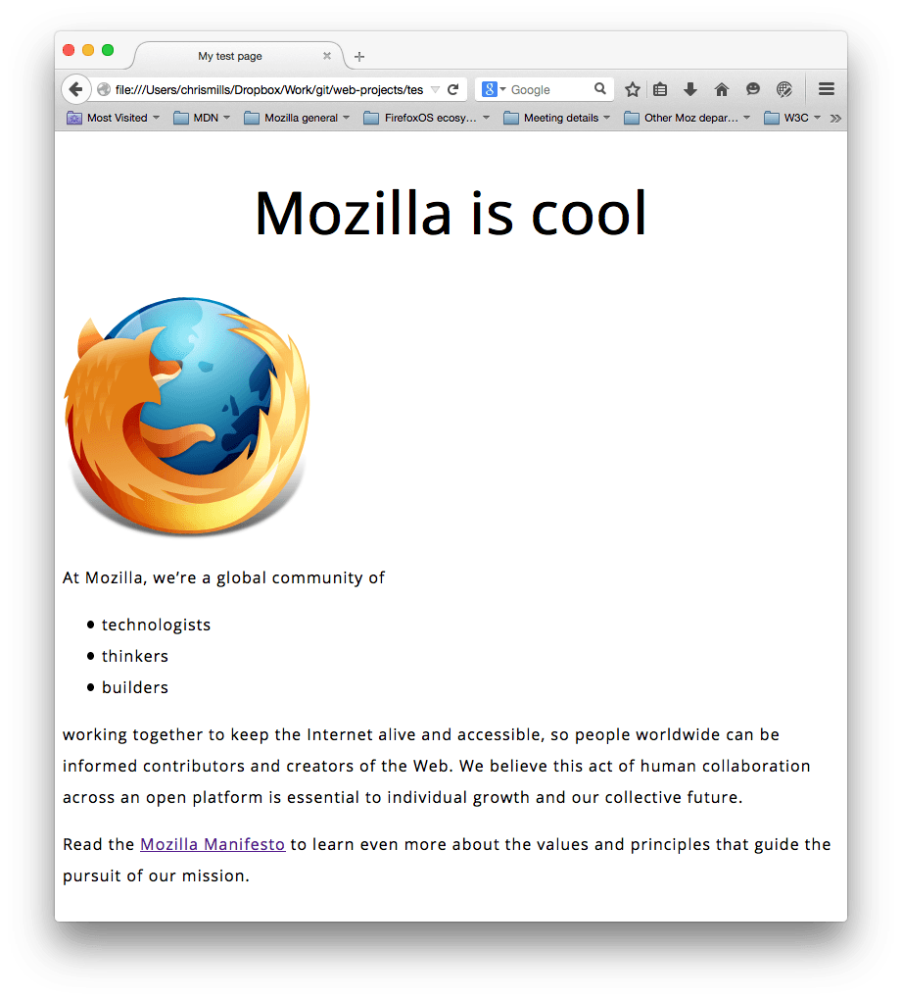
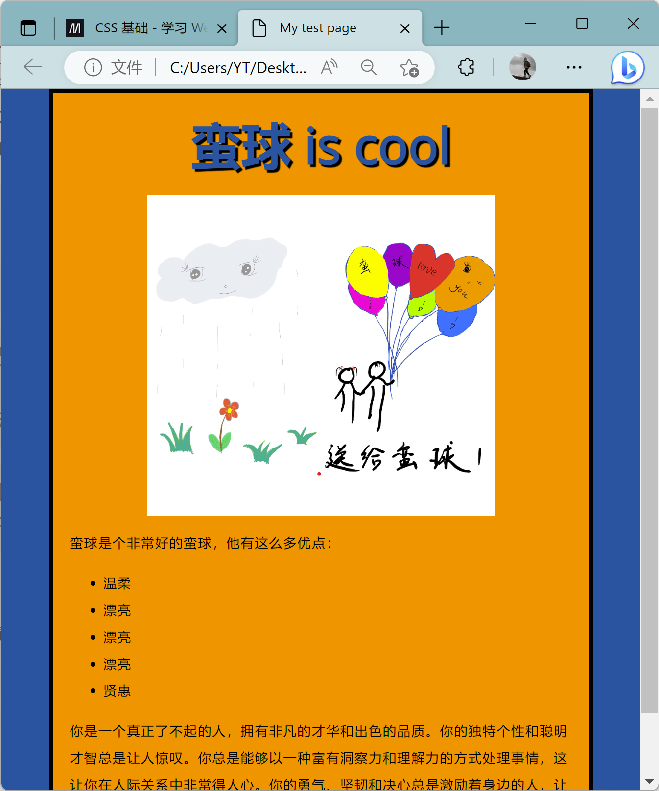

|标记性语言学习，包含`Markdown`，`HTML`,`CSS`，`JavaScript`|
|--|

# 1. Markdown

## 文字

正文回车要空一行，typora就不用了

```

代码块通过两行```输出（英文输入法）

- 斜体
要倾斜的文字左右分别用一个号`*`包起来

- 斜体加粗
要倾斜和加粗的文字左右分别用三个`*`号包起来

- 删除线
要加删除线的文字左右分别用两个`~~`号包起来

如果你写的代码是某种语言，那么可以在第一行末尾加上这个语言的名字，代码块内的代码就会执行对应的高亮语法
```

正文中的代码 ` #include<iostream>`通过两个``框出

- 有序列表，输入数字，加一个句点，然后空格即可，可以自动标号；

- 可以缩进空置多级列表；

1. 123
2. 456
3. 567
   1. 789
      1. 741
         1. 852
   
- 无序列表，输入 - ,然后空格
- **加粗**  两个** 
- *倾斜*      一个*
- ==高亮==：两个=

图片
---

`  `

## 超链接

`[文字描述](链接)`

## 改变字体颜色：


### 第一种：插入公式法

输入`$`，按`Esc`键会自动在后面加上一个`$`，然后在这两个之间输入公式。

```latex
$\textcolor{red}{这里输入你要改变颜色的文字}$
```

```latex
$\textcolor{GreenYellow}{GreenYellow} $
$\textcolor{Yellow}{Yellow}$
```

$\textcolor{GreenYellow}{这是黄绿色字体}$

$\textcolor{Red}{这是红色字体}$

### 第二种:使用HTML语法

```css
<font color='red'>内容</font>
<font color='blue'>内容</font>
在<><>之间插入内容就行了
```

<font color='blue'>这段文字是蓝色的</font>

<div>
    <div></div>
    <div></div>
    <div></div>
</div>

- Ctrl + Shift + V，即可预览md文件。（vscode下）然后双击相应位置即可修改对应内容

表格
---
语法：
```
表头|表头|表头
---|:--:|---:
内容|内容|内容
内容|内容|内容

第二行分割表头和内容。
- 有一个就行，为了对齐，多加了几个
文字默认居左
-两边加：表示文字居中
-右边加：表示文字居右
注：原生的语法两边都要用 | 包起来。此处省略
```
姓名|技能|排行
--|:--:|--:
刘备|哭|大哥
关羽|打|二哥
张飞|骂|三弟

## 引用

` > ` 符号

> hello world! 单行代码

> hello world!  多行代码按两次空格  
> hello world!  
> hello world!  

> hello world! 多层嵌套
>
> > hello world! 
> >
> > > hello world!

## 数学

### 公式编辑


一般公式分为两种形式，行内公式和行间公式。

- 行内公式：$ \Gamma(z) = \int_0^\infty t^{z-1}e^{-t}dt\,. $
- 行间公式：$$\Gamma(z) = \int_0^\infty t^{z-1}e^{-t}dt\,.$$
  对应的代码块为：

```latex
$ \Gamma(z) = \int_0^\infty t^{z-1}e^{-t}dt\,. $
$$\Gamma(z) = \int_0^\infty t^{z-1}e^{-t}dt\,.$$
```

行内公式是在公式代码块的基础上前面加上`$` ，后面加上`$` 组成的，而行间公式是在公式代码块前后使用`$$ `和`$$` 。

### 分段函数大括号

```
\begin{cases}

 “大括号内的内容”

\end{cases}
```


想在哪里对齐就哪里输一个`&`符号，上下两行会在`&`处对齐

### 括号与界定符(自适应括号)


**要拉伸括号是在括号左右加` \left` 和` \right`**
**只有一边符号时另一边用虚拟括号 \left.**

### 多行公式

```
\begin{align}

公式1
公式2
...

\end{align}
```


### 矩阵


矩阵元素用` & `分隔

和分段函数以及多行公式一样，要先写好环境` \begin{}` `\end{}`

- `matrix`改为`bmatrix`是带方括号的矩阵，b代表`bracke`t是方括号的意思
- `matrix`改为`pmatrix`是带圆括号的矩阵，`parenthesis`
- `matrix`改为`vmatrix`是带竖杠的矩阵，`vertical bar`

写矩阵要用`\bf`+字母,转置符号也应该是直立字符 $\bf A$，$\bf B^{\rm T}$
$$ \bf A $$

**$$\bf B^{\rm T}$$**

### 求和

`\sum `用来表示求和符号，其下标表示求和下限，上标表示上限。如:
`$\sum_{r=1}^n$`表示：$\sum_{r=1}^n$。
`$$\sum_{r=1}^n$$`表示：$$\sum_{r=1}^n$$

### 积分

`\int `用来表示积分符号，同样地，其上下标表示积分的上下限。如，`$\int_{r=1}^\infty$`：$\int_{r=1}^\infty$。
多重积分同样使用 int ，通过 i 的数量表示积分导数：
`$\iint$` ：$\iint$
`$\iiint$ `：$\iiint$ 
` $\iiint$ `：$\iiint$

### 公式颜色设置

```latex
 \textcolor{red}{\int_a^b}\textcolor{blue}{f(x)}\textcolor{green}{dx}\textcolor{brown}{=c}
```


$$
\textcolor{red}{\int_a^b}\textcolor{blue}{f(x)}\textcolor{green}{dx}\textcolor{brown}{=c}
$$

### 上标与下标

上标和下标分别使用`^ `与`_ `，例如`$x_i^2$`表示的是：$x_i^2$。

默认情况下，上、下标符号仅仅对下一个字符起作用。多个字符时使用`{..}` 包裹起来。如果使用`$10^10$ `表示的是$10^10$，而`$10^{10}$` 才是$10^{10}$。同时，大括号还能消除二义性，如`x^5^6 `将得到一个错误，必须使用大括号来界定`^`的结合性，如`${x^5}^6$ `：`${x^5}^6$`或者`$x^{5^6}$ `：${x^5}^6$。

### 关于数学公式中的直立文本（不是斜体数字格式）

- $\rm A$,`\rm A`(rm表示roman，罗马体)，、rm会对后面所有的字母都进行直立体显示，
- $\text{A B C}$​,  `\text{A B C}`支持空格、text仅对{}里的字符显示空格

### 公式中换行和空格

末尾//可表示换行

$a\,b$最短空格`\,`

$a\ b$短空格`\+Space `

$a\quad b$ 长空格是`\quad`

### 希腊字母


### 花体字母

- $\mathbf{ABCDEFGHIJKLMNOPQRSTUVWXYZ}$  `$\mathbf{ABCDEFGHIJKLMNOPQRSTUVWXYZ}$` 
- $\mathcal{ABCDEFGHIJKLMNOPQRSTUVWXYZ}$           `$\mathcal{ABCDEFGHIJKLMNOPQRSTUVWXYZ}$`
- $\mathit{ABCDEFGHIJKLMNOPQRSTUVWXYZ}$            `$\mathit{ABCDEFGHIJKLMNOPQRSTUVWXYZ}$`
- $\mathrm{ABCDEFGHIJKLMNOPQRSTUVWXYZ}$            `$\mathrm{ABCDEFGHIJKLMNOPQRSTUVWXYZ}$`
- $\mathsf{ABCDEFGHIJKLMNOPQRSTUVWXYZ}$                  `$\mathsf{ABCDEFGHIJKLMNOPQRSTUVWXYZ}$`
- $\mathtt{ABCDEFGHIJKLMNOPQRSTUVWXYZ}$                              `$\mathtt{ABCDEFGHIJKLMNOPQRSTUVWXYZ}$`
- $\mathbb{ABCDEFGHIJKLMNOPQRSTUVWXYZ}$              `$\mathbb{ABCDEFGHIJKLMNOPQRSTUVWXYZ}$`
- $\mathscr{ABCDEFGHIJKLMNOPQRSTUVWXYZ}$   `$\mathscr{ABCDEFGHIJKLMNOPQRSTUVWXYZ}$`
- $\mathfrak{ABCDEFGHIJKLMNOPQRSTUVWXYZ}$         `$\mathfrak{ABCDEFGHIJKLMNOPQRSTUVWXYZ}$`

### 标注符号


$$a \bar a \widehat {abc}$$

### 标注箭头


****


# 2. HTML

[原文地址](https://developer.mozilla.org/zh-CN/docs/Learn/Getting_started_with_the_web/HTML_basics)

超文本标记语言（**H**yper**T**ext **M**arkup **L**anguage）

是一种用来结构化 Web 网页及其内容的标记语言。网页内容可以是：一组**`段落`**、一个重点**`信息列表`**、也可以含有**`图片`**和**`数据表`**

HTML 不是一门编程语言，而是一种用于定义内容结构的*标记语言*。HTML 由一系列的[元素](https://developer.mozilla.org/zh-CN/docs/Glossary/Element)(element)组成，这些元素可以用来包围不同部分的内容，使其以某种方式呈现或者工作。一对[标签](https://developer.mozilla.org/zh-CN/docs/Glossary/Tag)(tag)可以为一段文字或者一张图片添加超链接，将文字设置为斜体，改变字号，等等。

### 元素

**元素**是网页的一部分，在 [XML](https://developer.mozilla.org/zh-CN/docs/Glossary/XML) 和 [HTML](https://developer.mozilla.org/zh-CN/docs/Glossary/HTML) 中，一个元素可以包含一个`数据项`，或是一块`文本`，或是一张`照片`，亦或是什么也不包含。一个典型的元素包括一个具有一些[属性](https://developer.mozilla.org/zh-CN/docs/Glossary/Attribute)的`开始标签`，中间的文本内容和一个`结束标签`：


**元素**和**标签**不是同一种概念。源代码中的标签用来标识元素的开始或结束，而元素是文档对象模型（[DOM](https://developer.mozilla.org/zh-CN/docs/Glossary/DOM)）中的一部分，文档对象模型会被[浏览器]渲染，展示为页面。

以一个段落元素为例：

```html
<p>My cat is very grumpy</p>
```


这个元素的主要部分有：

1. **开始标签**（Opening tag）：包含元素的名称（本例为 p），被大于号、小于号所包围。表示元素从这里开始或者开始起作用 —— 在本例中即段落由此开始。
2. **结束标签**（Closing tag）：与开始标签相似，只是其在元素名之前包含了一个斜杠。这表示着元素的结尾 —— 在本例中即段落在此结束。
3. **内容**（Content）：元素的内容，本例中就是所输入的文本本身。
4. **元素**（Element）：开始标签、结束标签与内容相结合，便是一个完整的元素。

### 元素属性（Attribute）


属性包含了关于元素的一些额外信息，这些信息本身不应显现在内容中。本例中，`class` 是属性名称，`editor-note` 是属性的值。

属性应该包含：

1. 在属性与元素名称（或上一个属性，如果有超过一个属性的话）之间的空格符。
2. 属性的名称，并接上一个等号。
3. 由引号所包围的属性值。

### [嵌套元素](https://developer.mozilla.org/zh-CN/docs/Learn/Getting_started_with_the_web/HTML_basics#嵌套元素)

也可以将一个元素置于其他元素之中 —— 称作**嵌套**。要表明猫咪非常暴躁，可以将“very”用 [`<strong>`](https://developer.mozilla.org/zh-CN/docs/Web/HTML/Element/strong) 元素包围，爆字将突出显示：

```html
<p>My cat is <strong>very</strong> grumpy.</p>
```

### [空元素](https://developer.mozilla.org/zh-CN/docs/Learn/Getting_started_with_the_web/HTML_basics#空元素)

不包含任何内容的元素称为空元素。比如 [``](https://developer.mozilla.org/zh-CN/docs/Web/HTML/Element/img) 元素：

```html

```

本元素包含两个属性，但是并没有 `</img>` 结束标签，元素里也没有内容。这是因为图像元素不需要通过内容来产生效果，它的作用是向其所在的位置嵌入一个图像。

### HTML文档详解

```html
<!DOCTYPE html>
<html>
  <head>
    <meta charset="utf-8">
    <title>My test page</title>
  </head>
  <body>
    
  </body>
</html>
```

这里有：

- `<!DOCTYPE html>` — 文档类型。HTML 尚在襁褓（大约是 1991/92 年）之时，`DOCTYPE` 用来链接一些 HTML 编写守则，比如自动查错之类。`DOCTYPE` 在当今作用有限，仅用于保证文档正常读取。现在知道这些就足够了。

- `<html></html>` — [`<html>`](https://developer.mozilla.org/zh-CN/docs/Web/HTML/Element/html) 元素。该元素包含整个页面的内容，也称作根元素。

- `<head></head>` — [`<head>`](https://developer.mozilla.org/zh-CN/docs/Web/HTML/Element/head) 元素。该元素的内容对用户不可见，其中包含例如面向搜索引擎的搜索关键字（[keywords](https://developer.mozilla.org/zh-CN/docs/Glossary/Keyword)）、页面描述、CSS 样式表和字符编码声明等。可以理解为`头文件`。
  - `<meta charset="utf-8">` — 该元素指定文档使用 UTF-8 字符编码，UTF-8 包括绝大多数人类已知语言的字符。基本上 UTF-8 可以处理任何文本内容，还可以避免以后出现某些问题，没有理由再选用其他编码。
  
  - `<title></title>` — [`<title>`](https://developer.mozilla.org/zh-CN/docs/Web/HTML/Element/title) 元素。该元素设置页面的标题，就是显示在浏览器标签页上的标题，也作为收藏网页的描述文字。
  
- `<body></body>` — [`<body>`](https://developer.mozilla.org/zh-CN/docs/Web/HTML/Element/body) 元素。该元素包含期望让用户在访问页面时看到的内容，包括文本、图像、视频、游戏、可播放的音轨或其他内容。

### [图像](https://developer.mozilla.org/zh-CN/docs/Learn/Getting_started_with_the_web/HTML_basics#图像)

重温一下 [``](https://developer.mozilla.org/zh-CN/docs/Web/HTML/Element/img) 元素：

```html

```


像之前所讲，该元素通过包含图像文件路径的地址属性 `src`，可在所在位置嵌入图像。

该元素还包括一个替换文字属性 `alt`，是图像的描述内容，用于当图像不能被用户看见时显示

`alt` 属性的关键字即“描述文本”。`alt` 文本应向用户完整地传递图像要表达的意思。

### [文本](https://developer.mozilla.org/zh-CN/docs/Learn/Getting_started_with_the_web/HTML_basics#标记文本)

本段包含了一些最常用的文本标记 HTML 元素。

#### [标题（Heading）](https://developer.mozilla.org/zh-CN/docs/Learn/Getting_started_with_the_web/HTML_basics#标题（heading）)

标题元素可用于指定内容的标题和子标题。就是`Markdown`的 `#`号。HTML 也包括六个级别的标题，一般最多用到 3-4 级标题。

```html
<h1>主标题</h1>
<h2>顶层标题</h2>
<h3>子标题</h3>
<h4>次子标题</h4>
...
```

> **备注**：不要使用标题元素来加大、加粗字体，因为标题对于 [无障碍访问](https://developer.mozilla.org/zh-CN/docs/Learn/Accessibility) 和 [搜索引擎优化](https://developer.mozilla.org/zh-CN/docs/Learn/HTML/Introduction_to_HTML/HTML_text_fundamentals#为什么我们需要结构化？) 等问题非常有意义。要保持页面结构清晰，标题整洁，不要发生标题级别跳跃。

#### [段落（Paragraph）](https://developer.mozilla.org/zh-CN/docs/Learn/Getting_started_with_the_web/HTML_basics#段落（paragraph）)

如上文所讲，[`<p>`](https://developer.mozilla.org/zh-CN/docs/Web/HTML/Element/p) 元素是用来指定段落的。通常用于指定常规的文本内容：

```html
<p>这是一个段落</p>
```

也就是说在标签`<p>`之间的就是正文部分了。

#### [列表（List）](https://developer.mozilla.org/zh-CN/docs/Learn/Getting_started_with_the_web/HTML_basics#列表（list）)

就是有序列表和无无序列表

Web 上的许多内容都是列表，HTML 有一些特别的列表元素。标记列表通常包括至少两个元素。最常用的列表类型为：

1. **无序列表**（Unordered List）中项目的顺序并不重要，就像购物列表。用一个 [`<ul>`](https://developer.mozilla.org/zh-CN/docs/Web/HTML/Element/ul) 元素包围。
2. **有序列表**（Ordered List）中项目的顺序很重要，就像烹调指南。用一个 [`<ol>`](https://developer.mozilla.org/zh-CN/docs/Web/HTML/Element/ol) 元素包围。

列表的每个项目都要用一个列表项目（List Item）元素 [`<li>`](https://developer.mozilla.org/zh-CN/docs/Web/HTML/Element/li) 包围，即`<ul>`或者`<ol>`包一个列表，列表里的每一项由 [`<li>`](https://developer.mozilla.org/zh-CN/docs/Web/HTML/Element/li) 包起来。

比如，要将下面的段落片段改成一个列表：

```html
<p>At Mozilla, we're a global community of technologists, thinkers, and builders working together… </p>
```

可以这样更改标记：

```html
<p>At Mozilla, we're a global community of</p>

<ul>
  <li>technologists</li>
  <li>thinkers</li>
  <li>builders</li>
</ul>

<p>working together… </p>
```

### [链接](https://developer.mozilla.org/zh-CN/docs/Learn/Getting_started_with_the_web/HTML_basics#链接)

链接非常重要 — 它们赋予 Web 网络属性。要植入一个链接，我们需要使用一个简单的元素 — [`<a>`](https://developer.mozilla.org/zh-CN/docs/Web/HTML/Element/a) — a 是 "anchor" （锚）的缩写。要将一些文本添加到链接中，只需如下几步：

1. 选择一些文本。比如“Mozilla Manifesto”。

2. 将文本包含在`<a>`元素内，就像这样：

   ```html
   <a>Mozilla Manifesto</a>
   ```

3. 为此`<a>`元素添加一个`href`属性，就像这样：

   ```html
   <a href="">Mozilla Manifesto</a>
   ```

4. 把属性的值设置为所需网址：

   ```html
   <a href="https://www.mozilla.org/zh-CN/about/manifesto/">Mozilla Manifesto</a>
   ```

如果网址开始部分省略了 `https://` 或者 `http://`，可能会得到错误的结果。在完成一个链接后，可以试着点击它来确保指向正确。

> **备注：** `href` 这个名字可能开始看起来有点令人费解，代表超文本引用（ **h**ypertext **ref**erence）。

### 小结

将这段文本以`.html`格式保存后打开可以看到最终效果

```html
<!DOCTYPE html>
<html>
  <head>
    <meta charset="utf-8">
    <title>My test page</title>
  </head>
  <body>
    <h1>这是一级标题</h1>
    
   <p>这是第一段正文</p>

<ul>
  <li>technologists</li>
  <li>thinkers</li>
  <li>builders</li>
</ul>	

<p>这是第二段正文</p>
  </body>
</html>
```


# 3. CSS

层叠样式表（**C**ascading **S**tyle **S**heet）是为网页添加样式的代码。

例如：怎样将文本设置为黑色或红色？怎样将内容显示在屏幕的特定位置？怎样用背景图片或颜色来装饰网页？

和 HTML 类似，CSS 也不是真正的编程语言，甚至不是标记语言。它是一门**样式表语言**，也就是说人们可以用它来选择性地为 HTML 元素添加样式。举例来说，要选择一个 HTML 页面里**所有**的段落元素，然后将其中的文本改成红色，可以这样写 CSS：

```css
p {
  color: red;
}
```

将该 CSS 文件连接至 HTML 文档，否则 CSS 代码不会对 HTML 文档在浏览器里的显示效果有任何影响。

CSS文件与HTML文档连接：

1. 打开`index.html`文件，然后将下面一行粘贴到文档头（也就是`<head>`和`</head>`标签之间）。

   ```html
   <link href="styles/style.css" rel="stylesheet">
   ```

2. 保存 `index.html` 并用浏览器将其打开。

> `rel="stylesheet"`指示被链接的文档是一个样式表
>
> `rel` 属性规定当前文档与被链接文档之间的关系，**relative**的意思。

### CSS规则集详解

让我们来仔细看一看上述 CSS：


整个结构称为 **规则集**（通常简称“规则”），各部分释义如下：

- 选择器（**Selector**）

  HTML 元素的名称位于规则集开始。它选择了一个或多个需要添加样式的元素（在这个例子中就是 `p` 元素）。要给不同元素添加样式只需要更改选择器就行了。

- 声明（**Declaration**）

  一个单独的规则，如 `color: red;` 用来指定添加样式元素的**属性**。

- 属性（**Properties**）

  改变 HTML 元素样式的途径。（本例中 `color` 就是 [`<p>`](https://developer.mozilla.org/zh-CN/docs/Web/HTML/Element/p) 元素的属性。）CSS 中，由编写人员决定修改哪个属性以改变规则。

- 属性的值（Property value）

  在属性的右边，冒号后面即**属性的值**，它从指定属性的众多外观中选择一个值（我们除了 `red` 之外还有很多属性值可以用于 `color` ）。

注意其他重要的语法：

- 每个规则集（除了选择器的部分）都应该包含在成对的大括号里（`{}`）。
- 在每个声明里要用冒号（`:`）将属性与属性值分隔开。
- 在每个规则集里要用分号（`;`）将各个声明分隔开。

如果要同时修改多个属性，只需要将它们用分号隔开，就像这样：

```css
p {
  color: red;
  width: 500px;
  border: 1px solid black;
}
```

### [多元素选择](https://developer.mozilla.org/zh-CN/docs/Learn/Getting_started_with_the_web/CSS_basics#多元素选择)

也可以选择多种类型的元素并为它们添加一组相同的样式。将不同的选择器用逗号分开。例如：

```css
p, li, h1 {
  color: red;
}
```

### [不同类型的选择器](https://developer.mozilla.org/zh-CN/docs/Learn/Getting_started_with_the_web/CSS_basics#不同类型的选择器)

选择器有许多不同的类型。上面只介绍了**元素选择器**，用来选择 HTML 文档中给定的元素。但是选择操作可以更加具体。下面是一些常用的选择器类型：

| 选择器名称                           | 选择的内容                                                   | 示例                                                         |
| :----------------------------------- | :----------------------------------------------------------- | :----------------------------------------------------------- |
| 元素选择器（也称作标签或类型选择器） | 所有指定 (该) 类型的 HTML 元素                               | `p` 选择 `<p>`                                               |
| ID 选择器                            | 具有特定 ID 的元素（单一 HTML 页面中，每个 ID 只对应一个元素，一个元素只对应一个 ID） | `#my-id` 选择 `<p id="my-id">` 或 `<a id="my-id">`           |
| 类选择器                             | 具有特定类的元素（单一页面中，一个类可以有多个实例）         | `.my-class` 选择 `<p class="my-class">` 和 `<a class="my-class">` |
| 属性选择器                           | 拥有特定属性的元素                                           | `img[src]` 选择 `` 而不是 ``     |
| 伪（Pseudo）类选择器                 | 特定状态下的特定元素（比如鼠标指针悬停）                     | `a:hover` 仅在鼠标指针悬停在链接上时选择 `<a>`。             |

选择器的种类远不止于此，更多信息请参阅 [选择器](https://developer.mozilla.org/en-US/docs/Learn/CSS/Building_blocks/Selectors)。

### [字体和文本](https://developer.mozilla.org/zh-CN/docs/Learn/Getting_started_with_the_web/CSS_basics#字体和文本)

> **备注：** 再一次说明，中文字体文件较大，不适合直接用于 Web Font。

在探索了一些 CSS 基础后，我们来把更多规则和信息添加至 `style.css` 中，从而让示例更美观。首先，让字体和文本变得更漂亮。

1. 第一步，以 [`<link>`](https://developer.mozilla.org/zh-CN/docs/Web/HTML/Element/link) 元素的形式添加进 `index.html` 文档头（ [`<head>`](https://developer.mozilla.org/zh-CN/docs/Web/HTML/Element/head) 和 `</head>` 之间的任意位置）。代码如下：

   ```css
    <link href="https://fonts.font.im/css?family=Open+Sans" rel="stylesheet" type="text/css">
   ```

   以上代码为当前网页下载 Open Sans 字体，从而使自定义 CSS 中可以对 HTML 元素应用这个字体。

2. 继续添加下列代码到相应的位置（ [`<head>`](https://developer.mozilla.org/zh-CN/docs/Web/HTML/Element/head) 和 `</head>` 之间），用你在 Google Fonts 找到的字体替代 `font-family` 中的占位行。（ `font-family` 意味着你想要你的文本使用的字体。）这条规则首先为整个页面设定了一个全局字体和字号（因为 `<html>` 是整个页面的父元素，而且它所有的子元素都会继承相同的 `font-size` 和 `font-family`）：

   ```css
   html {
     /* px 表示“像素（pixels）”: 基础字号为 10 像素 */
     font-size: 10px;
     /* Google fonts 输出的 CSS */
     font-family: 'Open Sans', sans-serif;
   }
   ```

   > **备注：** CSS 文档中所有位于 `/*` 和 `*/` 之间的内容都是 CSS 注释，它会被浏览器在渲染代码时忽略。你可以在这里写下对你现在要做的事情有帮助的笔记。

   > **备注：** `/*` `*/` 不可嵌套，`/*这样的注释是/*不行*/的*/`。且CSS 不接受 `//` 注释。

3. 接下来为文档体内的元素（[`<h1>` (en-US)](https://developer.mozilla.org/en-US/docs/Web/HTML/Element/Heading_Elements)、[`<li>`](https://developer.mozilla.org/zh-CN/docs/Web/HTML/Element/li) 和 [`<p>`](https://developer.mozilla.org/zh-CN/docs/Web/HTML/Element/p)）设置字号。将标题居中显示，并为正文设置行高和字间距，从而提高页面的可读性。

   ```css
   h1 {
     font-size: 60px;
     text-align: center;
   }
   
   p, li {
     font-size: 16px;
     /* line-height 后面可以跟不同的参数，如果是数字，就是当前字体大小乘上数字 */
     line-height: 2;
     letter-spacing: 1px;
   }
   ```

   Copy to Clipboard

可以随时调整这些 `px` 值来获得满意的结果，以下是大体效果：



### 一切皆盒子

编写 CSS 时你会发现，你的工作好像是围绕着一个一个盒子展开的——设置尺寸、颜色、位置，等等。页面里大部分 HTML 元素都可以被看作若干层叠的盒子。

并不意外，CSS 布局主要就是基于盒模型的。每个占据页面空间的块都有这样的属性：

- `padding`：即内边距，围绕着内容（比如段落）的空间。
- `border`：即边框，紧接着内边距的线。
- `margin`：即外边距，围绕元素外部的空间。


这里还使用了：

- `width` ：元素的宽度
- `background-color` ：元素内容和内边距底下的颜色
- `color` ：元素内容（通常是文本）的颜色
- `text-shadow` ：为元素内的文本设置阴影
- `display` ：设置元素的显示模式

### [更改页面颜色](https://developer.mozilla.org/zh-CN/docs/Learn/Getting_started_with_the_web/CSS_basics#更改页面颜色)

```css
html {
  background-color: #00539F;
}
```

这条规则将整个页面的背景颜色设置为 [所计划的颜色](https://developer.mozilla.org/zh-CN/docs/Learn/Getting_started_with_the_web/What_will_your_website_look_like)。

### [文档体格式设置](https://developer.mozilla.org/zh-CN/docs/Learn/Getting_started_with_the_web/CSS_basics#文档体格式设置)

```css
body {
  width: 600px;
  margin: 0 auto;
  background-color: #FF9500;
  padding: 0 20px 20px 20px;
  border: 5px solid black;
}
```

现在是 [`<body>`](https://developer.mozilla.org/zh-CN/docs/Web/HTML/Element/body) 元素。以上条声明，我们来逐条查看：

- `width: 600px;` —— 强制页面永远保持 600 像素宽。
- `margin: 0 auto;` —— 为 `margin` 或 `padding` 等属性设置两个值时，第一个值代表元素的上方**和**下方（在这个例子中设置为 `0`），而第二个值代表左边**和**右边（在这里，`auto` 是一个特殊的值，意思是水平方向上左右对称）。你也可以使用一个，三个或四个值，参考 [这里](https://developer.mozilla.org/zh-CN/docs/Web/CSS/margin#取值) 。
- `background-color: #FF9500;` —— 如前文所述，指定元素的背景颜色。我们给 body 用了一种略微偏红的橘色以与深蓝色的 [`<html>`](https://developer.mozilla.org/zh-CN/docs/Web/HTML/Element/html) 元素形成反差，你也可以尝试其他颜色。
- `padding: 0 20px 20px 20px;` —— 我们给内边距设置了四个值来让内容四周产生一点空间。这一次我们不设置上方的内边距，设置右边，下方，左边的内边距为 20 像素。值以上、右、下、左的顺序排列。
- `border: 5px solid black;` —— 直接为 body 设置 5 像素的黑色实线边框。

### [定位页面主标题并添加样式](https://developer.mozilla.org/zh-CN/docs/Learn/Getting_started_with_the_web/CSS_basics#定位页面主标题并添加样式)

```css
h1 {
  margin: 0;
  padding: 20px 0;
  color: #00539F;
  text-shadow: 3px 3px 1px black;
}
```

你可能发现页面的顶部有一个难看的间隙，那是因为浏览器会在没有任何 CSS 的情况下 给 [`<h1>` (en-US)](https://developer.mozilla.org/en-US/docs/Web/HTML/Element/Heading_Elements) 等元素设置一些默认样式。但这并不是个好主意，因为我们希望一个没有任何样式的网页也有基本的可读性。为了去掉那个间隙，我们通过设置 `margin: 0;` 来覆盖默认样式。

至此，我们已经把标题的上下内边距设置为 20 像素，并且将标题文本与 HTML 的背景颜色设为一致。

需要注意的是，这里使用了一个 `text-shadow` 属性，它可以为元素中的文本提供阴影。四个值含义如下：

- 第一个值设置**水平偏移值** —— 即阴影右移的像素数（负值左移）。
- 第二个值设置**垂直偏移值** —— 即阴影下移的像素数（负值上移）。
- 第三个值设置阴影的**模糊半径** —— 值越大产生的阴影越模糊。
- 第四个值设置阴影的基色。

### [图像居中](https://developer.mozilla.org/zh-CN/docs/Learn/Getting_started_with_the_web/CSS_basics#图像居中)

最后，我们把图像居中来使页面更美观。可以复用 body 的 `margin: 0 auto` ，但是需要一点点调整。 [`<body>`](https://developer.mozilla.org/zh-CN/docs/Web/HTML/Element/body) 元素是**块级**元素，意味着它占据了页面的空间并且能够赋予外边距和其他改变间距的值。而图片是**内联**元素，不具备块级元素的一些功能。所以为了使图像有外边距，我们必须使用 `display: block` 给予其块级行为。

```css
img {
  display: block;
  margin: 0 auto;
}
```

> **备注：** 以上说明假定所选图片小于页面宽度（600 pixels）。更大的图片会溢出 body 并占据页面的其他位置。要解决这个问题，可以： 1）使用 [图片编辑器](https://en.wikipedia.org/wiki/Raster_graphics_editor) 来减小图片宽度； 2）用 CSS 限制图片大小，即减小 `` 元素 [`width`](https://developer.mozilla.org/zh-CN/docs/Web/CSS/width) 属性的值（比如 `400 px`）。

> **备注：** 如果你暂时不能理解 `display: block` 和块级元素与行内元素的差别也没关系；随着你对 CSS 学习的深入，你将明白这个问题。`display` 属性的更多信息请查看 [参考页面](https://developer.mozilla.org/zh-CN/docs/Web/CSS/display) 。

最终效果：




# 4. JavaScript

JavaScript 是一门编程语言，可为网站添加交互功能（例如：游戏、动态样式、动画以及在按下按钮或收到表单数据时做出的响应等）。

[JavaScript](https://developer.mozilla.org/zh-CN/docs/Glossary/JavaScript)（缩写：JS）是一门完备的动态编程语言。当应用于 [HTML](https://developer.mozilla.org/zh-CN/docs/Glossary/HTML) 文档时，可为网站提供动态交互特性。

JavaScript 的应用场合极其广泛，简单到幻灯片、照片库、浮动布局和响应按钮点击，复杂到游戏、2D/3D 动画、大型数据库驱动程序等等。

JavaScript 相当简洁，却非常灵活。开发者们基于 JavaScript 核心编写了大量实用工具，可以使 开发工作事半功倍。其中包括：

- 浏览器应用程序接口（[API](https://developer.mozilla.org/zh-CN/docs/Glossary/API)）—— 浏览器内置的 API 提供了丰富的功能，比如：动态创建 HTML 和设置 CSS 样式、从用户的摄像头采集处理视频流、生成 3D 图像与音频样本等等。
- 第三方 API —— 让开发者可以在自己的站点中整合其他内容提供者（Twitter、Facebook 等）提供的功能。
- 第三方框架和库 —— 用来快速构建网站和应用。

## [“Hello World!”示例](https://developer.mozilla.org/zh-CN/docs/Learn/Getting_started_with_the_web/JavaScript_basics#“hello_world!”示例)

JavaScript 是最振奋人心的 Web 技术之一，而且在娴熟驾驭之后，你的网站在功能和创新力上将达到一个新的维度。然而，JavaScript 比 HTML 和 CSS 学习起来更加复杂一点。

首先，来看看如何在页面中添加一些基本的 JavaScript 脚本来建造一个“Hello world!”示例（[一切始于 Hello World](https://zh.wikipedia.org/wiki/Hello_World)）。

1. 首先，打开你的测试站点，创建一个名为 `scripts` 的文件夹。然后在其中创建一个名为 `main.js` 的文件。

2. 下一步，在`index.html`文件`</body>` 标签前的新行添加以下代码。

   ```js
   <script src="scripts/main.js" defer></script>
   ```

3. 与 CSS 的 [`<link>`](https://developer.mozilla.org/zh-CN/docs/Web/HTML/Element/link) 元素类似，它将 JavaScript 引入页面以作用于 HTML（以及 CSS 等页面上所有内容）：

4. 现在将以下代码添加到`main.js`文件中：

   ```js
   let myHeading = document.querySelector('h1');
   myHeading.textContent = 'Hello world!';
   ```

5. 最后，保存 HTML 和 JavaScript 文件，用浏览器打开 `index.html`。可以看到如下内容：

> **备注：** 我们将 [`<script> `](https://developer.mozilla.org/zh-CN/docs/Web/HTML/Element/script) 放在 HTML 文件的底部附近的原因是浏览器会按照代码在文件中的顺序加载 HTML。如果先加载的 JavaScript 期望修改其下方的 HTML，那么它可能由于 HTML 尚未被加载而失效。因此，将 JavaScript 代码放在 HTML 页面的底部附近通常是最好的策略。

### [发生了什么？](https://developer.mozilla.org/zh-CN/docs/Learn/Getting_started_with_the_web/JavaScript_basics#发生了什么？)

JavaScript 把页面的标题改成了“Hello world!” 。首先用 `querySelector()` 函数获取标题的引用，并把它储存在 `myHeading` 变量中。之后，把 `myHeading` 变量的属性 [`textContent`](https://developer.mozilla.org/zh-CN/docs/Web/API/Node/textContent) （标题内容）修改为“Hello world!” 。

> **备注：** 上面用到的两个函数都来自 [文档对象模型 (DOM) API](https://developer.mozilla.org/zh-CN/docs/Web/API/Document_Object_Model)，均用于控制文档。

## [JavaScript 快速入门](https://developer.mozilla.org/zh-CN/docs/Learn/Getting_started_with_the_web/JavaScript_basics#javascript_快速入门)

### [变量（Variable）](https://developer.mozilla.org/zh-CN/docs/Learn/Getting_started_with_the_web/JavaScript_basics#变量（variable）)

[变量](https://developer.mozilla.org/zh-CN/docs/Glossary/Variable) 是存储值的容器。要声明一个变量，先输入关键字 `let` 或 `var`，然后输入合适的名称：

```js
let myVariable;
```

> **备注：** 行末的分号表示当前语句结束，不过只有在单行内需要分割多条语句时，这个分号才是必须的。然而，一些人认为每条语句末尾加分号是一种好的风格。

> **备注：** 几乎任何内容都可以作为变量名，但还是有一些限制（请参阅 [变量命名规则](https://developer.mozilla.org/zh-CN/docs/Web/JavaScript/Guide/Grammar_and_types#变量)）。如果你不确定，还可以 [验证变量名](https://mothereff.in/js-variables) 是否有效。

> **备注：** JavaScript 对大小写敏感，`myVariable` 和 `myvariable` 是不同的。如果代码出现问题了，先检查一下大小写！

> **备注：** 想要了解更多关于 `var` 和 `let` 的不同点，可以参阅 [var 与 let 的区别](https://developer.mozilla.org/zh-CN/docs/Learn/JavaScript/First_steps/Variables#var_与_let_的区别)。

变量定义后可以进行赋值：

```js
myVariable = '李雷';
```

也可以将定义、赋值操作写在同一行：

```js
let myVariable = '李雷';
```

可以直接通过变量名取得变量的值：

```js
myVariable;
```

变量在赋值后是可以更改的：

```js
let myVariable = '李雷';
myVariable = '韩梅梅';
```

注意变量可以有不同的 [数据类型](https://developer.mozilla.org/zh-CN/docs/Web/JavaScript/Data_structures) ：

| 变量                                                         | 解释                                                         | 示例                                                         |
| :----------------------------------------------------------- | :----------------------------------------------------------- | :----------------------------------------------------------- |
| [String](https://developer.mozilla.org/zh-CN/docs/Glossary/String) | 字符串（一串文本）：字符串的值必须用引号（单双均可，必须成对）扩起来。 | `let myVariable = '李雷';`                                   |
| [Number](https://developer.mozilla.org/zh-CN/docs/Glossary/Number) | 数字：无需引号。                                             | `let myVariable = 10;`                                       |
| [Boolean](https://developer.mozilla.org/zh-CN/docs/Glossary/Boolean) | 布尔值（真 / 假）： `true`/`false` 是 JS 里的特殊关键字，无需引号。 | `let myVariable = true;`                                     |
| [Array](https://developer.mozilla.org/zh-CN/docs/Glossary/Array) | 数组：用于在单一引用中存储多个值的结构。                     | `let myVariable = [1, '李雷', '韩梅梅', 10];` 元素引用方法：`myVariable[0]`, `myVariable[1]` …… |
| [Object](https://developer.mozilla.org/zh-CN/docs/Glossary/Object) | 对象：JavaScript 里一切皆对象，一切皆可储存在变量里。这一点要牢记于心。 | `let myVariable = document.querySelector('h1');` 以及上面所有示例都是对象。 |

那么变量有什么用呢？我们说，编程时它们无所不在。如果值无法改变，那么就无法做任何动态的工作，比如发送个性化的问候，或是改变在图片库当前展示的图片。

### [注释](https://developer.mozilla.org/zh-CN/docs/Learn/Getting_started_with_the_web/JavaScript_basics#注释)

类似于 CSS，JavaScript 中可以添加注释。

```js
/*
这里的所有内容
都是注释。
*/
```

如果注释只有一行，可以更简单地将注释放在两个斜杠之后，就像这样：

```js
// 这是一条注释。
```

### [运算符](https://developer.mozilla.org/zh-CN/docs/Learn/Getting_started_with_the_web/JavaScript_basics#运算符)

[运算符](https://developer.mozilla.org/zh-CN/docs/Glossary/Operator) 是一类数学符号，可以根据两个值（或变量）产生结果。以下表格中介绍了一些最简单的运算符，可以在浏览器控制台里尝试一下后面的示例。

> **备注：** 这里说“根据**两个**值（或变量）产生结果”是不严谨的，计算两个变量的运算符称为“二元运算符”，还有一元运算符和三元运算符，下表中的“取非”就是一元运算符。

| 运算符     | 解释                                                         | 符号          | 示例                                                         |
| :--------- | :----------------------------------------------------------- | :------------ | :----------------------------------------------------------- |
| 加         | 将两个数字相加，或拼接两个字符串。                           | `+`           | `6 + 9;"Hello " + "world!";`                                 |
| 减、乘、除 | 这些运算符操作与基础算术一致。只是乘法写作星号，除法写作斜杠。 | `-`, `*`, `/` | `9 - 3;8 * 2; //乘法在 JS 中是一个星号9 / 3;`                |
| 赋值运算符 | 为变量赋值（你之前已经见过这个符号了）                       | `=`           | `let myVariable = '李雷';`                                   |
| 等于       | 测试两个值是否相等，并返回一个 `true`/`false` （布尔）值。   | `===`         | `let myVariable = 3;myVariable === 4; // false`              |
| 不等于     | 和等于运算符相反，测试两个值是否不相等，并返回一个 `true`/`false` （布尔）值。 | `!==`         | `let myVariable = 3;myVariable !== 3; // false`              |
| 取非       | 返回逻辑相反的值，比如当前值为真，则返回 `false`。           | `!`           | 原式为真，但经取非后值为 `false`： `let myVariable = 3;!(myVariable === 3); // false` |

运算符种类远不止这些，不过目前上表已经够用了。完整列表请参阅 [表达式和运算符](https://developer.mozilla.org/zh-CN/docs/Web/JavaScript/Reference/Operators)。

> **备注：** 不同类型数据之间的计算可能出现奇怪的结果，因此必须正确引用变量，才能得出预期结果。比如在控制台输入 `"35" + "25"`，为什么不能得到 `60`？因为引号将数字转换成了字符串，所以结果是连接两个字符串而不是把两个数字相加。输入 `35 + 25` 才能得到正确结果。

### [条件语句](https://developer.mozilla.org/zh-CN/docs/Learn/Getting_started_with_the_web/JavaScript_basics#条件语句)

条件语句是一种代码结构，用来测试表达式的真假，并根据测试结果运行不同的代码。一个常用的条件语句是 `if ... else`。下面是一个示例：

```js
let iceCream = 'chocolate';
if (iceCream === 'chocolate') {
  alert('我最喜欢巧克力冰激淋了。');
} else {
  alert('但是巧克力才是我的最爱呀……');
}
```

`if ( ... )` 中的表达式进行测试，用（上文所提到的）等于运算符来比较变量 `iceCream` 与字符串 `'chocolate'` 是否相等。如果返回 `true`，则运行第一个代码块；如果返回 `false`，则跳过第一块直接运行 `else` 之后的第二个代码块。

### [函数（Function）](https://developer.mozilla.org/zh-CN/docs/Learn/Getting_started_with_the_web/JavaScript_basics#函数（function）)

[函数](https://developer.mozilla.org/zh-CN/docs/Glossary/Function) 用来封装可复用的功能。如果没有函数，一段特定的操作过程用几次就要重复写几次，而使用函数则只需写下函数名和一些简短的信息。之前已经涉及过一些函数，比如：

```js
let myVariable = document.querySelector('h1');
```

```js
alert('hello!');
```

`document.querySelector` 和 `alert` 是浏览器内置的函数，随时可用。

如果代码中有一个类似变量名后加小括号 `()` 的东西，很可能就是一个函数。函数通常包括[参数](https://developer.mozilla.org/zh-CN/docs/Glossary/Argument)，参数中保存着一些必要的数据。它们位于括号内部，多个参数之间用逗号分开。

比如， `alert()` 函数在浏览器窗口内弹出一个警告框，还应为其提供一个字符串参数，以告诉它警告框里要显示的内容。

人人都能定义自己的函数。下面的示例是为两个参数进行乘法运算的函数：

```js
function multiply(num1, num2) {
  let result = num1 * num2;
  return result;
}
```

尝试在控制台运行这个函数，不妨多试几组参数，比如：

```js
multiply(4, 7);
multiply(20, 20);
multiply(0.5, 3);
```

**备注：** [`return`](https://developer.mozilla.org/zh-CN/docs/Web/JavaScript/Reference/Statements/return) 语句告诉浏览器当前函数返回 `result` 变量。这是一点很有必要，因为函数内定义的变量只能在函数内使用。这叫做变量的 [作用域](https://developer.mozilla.org/zh-CN/docs/Glossary/Scope)。（详见 [变量作用域](https://developer.mozilla.org/zh-CN/docs/Web/JavaScript/Guide/Grammar_and_types#variable_scope)。）

### [事件](https://developer.mozilla.org/zh-CN/docs/Learn/Getting_started_with_the_web/JavaScript_basics#事件)

事件能为网页添加真实的交互能力。它可以捕捉浏览器操作并运行一些代码做为响应。最简单的事件是[点击事件](https://developer.mozilla.org/zh-CN/docs/Web/API/Element/click_event)，鼠标的点击操作会触发该事件。可尝试将下面的代码输入到控制台，然后点击页面的任意位置：

```js
document.querySelector("html").addEventListener("click", function () {
  alert("别戳我，我怕疼。");
});
```

将事件与元素绑定有许多方法。在这里选用了 [`<html>`](https://developer.mozilla.org/zh-CN/docs/Web/HTML/Element/html) 元素，然后调用了它的 [`addEventListener()`](https://developer.mozilla.org/zh-CN/docs/Web/API/EventTarget/addEventListener) 方法，将事件名称（`'click'`）以及其回调函数（当事件发生时，调用该函数）传入该函数中作为调用参数。

刚刚我们传递给 `addEventListener()` 的函数被称为*匿名函数*，因为它没有名字。匿名函数还有另一种我们称之为*箭头函数*的写法，箭头函数使用 `() =>` 代替 `function ()`：

```js
document.querySelector('html').addEventListener('click', () => {
  alert('别戳我，我怕疼。');
});
```

## [完善示例网页](https://developer.mozilla.org/zh-CN/docs/Learn/Getting_started_with_the_web/JavaScript_basics#完善示例网页)

现在你已经具备了一些 JavaScript 基础，下面来为示例网页添加一些更酷的特性。

### [添加一个图像切换器](https://developer.mozilla.org/zh-CN/docs/Learn/Getting_started_with_the_web/JavaScript_basics#添加一个图像切换器)

这里将用新的 DOM API 为网页添加另一张图片，并用 JavaScript 使图片在点击时进行切换。

1. 首先，找到另一张你想要在你的页面上展示的图片，且尺寸与第一张图片尽可能相同。

2. 将这张图片储存在你的`images`目录下。

3. 将图片重命名为'firefox2.png'（去掉引号）。

4. 打开`main.js`文件，输入下面的 JavaScript 代码 ( 请删除刚才的 "hello world" 脚本)：

   ```js
   let myImage = document.querySelector('img');
   
   myImage.onclick = function() {
       let mySrc = myImage.getAttribute('src');
       if(mySrc === 'images/firefox-icon.png') {
         myImage.setAttribute('src', 'images/firefox2.png');
       } else {
         myImage.setAttribute('src', 'images/firefox-icon.png');
       }
   }
   ```

5. 保存所有文件并用浏览器打开 `index.html` 。点击图片可以发现它能够切换了！

这里首先把 [``](https://developer.mozilla.org/zh-CN/docs/Web/HTML/Element/img) 元素的引用存放在 `myImage` 变量里。然后将这个变量的 `onclick` 事件与一个匿名函数绑定。每次点击图片时：

1. 获取这张图片的 `src` 属性值。
2. 用一个条件句来判断`src`的值是否等于原始图像的路径：
   1. 如果是，则将 `src` 的值改为第二张图片的路径，并在 [``](https://developer.mozilla.org/zh-CN/docs/Web/HTML/Element/img) 内加载该图片。
   2. 如果不是（意味着它已经修改过）, 则把 `src` 的值重新设置为原始图片的路径，即原始状态。

### [添加个性化欢迎信息](https://developer.mozilla.org/zh-CN/docs/Learn/Getting_started_with_the_web/JavaScript_basics#添加个性化欢迎信息)

下面来添加另一段代码，在用户初次进入站点时将网页的标题改成一段个性化欢迎信息（即在标题中添加用户的名字）。名字信息会由 [Web Storage API](https://developer.mozilla.org/zh-CN/docs/Web/API/Web_Storage_API) 保存下来，即使用户关闭页面之后再重新打开，仍可得到之前的信息。还会添加一个选项，可以根据需要改变用户名字以更新欢迎信息。

1. 打开`index.html`，在`<script>`标签前添加以下代码，将在页面底部显示一个“切换用户”字样的按钮：

   ```js
   <button>切换用户</button>
   ```

   将以下 JavaScript 代码原封不动添加到`main.js`文件底部，将获取新按钮和标题的引用，并保存至变量中：

   ```js
   let myButton = document.querySelector('button');
   let myHeading = document.querySelector('h1');
   ```

2. 然后添加以下函数来设置个性化欢迎信息。（函数需要在调用后生效，下文中提供了两种对该函数的调用方式）

   ```js
   function setUserName() {
     let myName = prompt('请输入你的名字。');
     localStorage.setItem('name', myName);
     myHeading.textContent = 'Mozilla 酷毙了，' + myName;
   }
   ```

   该函数首先调用了`prompt()`函数，与`alert()`类似会弹出一个对话框。但是这里需要用户输入数据，并在确定后将数据存储在`myName`变量里。接下来将调用`localStorage`API，它可以将数据存储在浏览器中供后续获取。这里用`localStorage`的`setItem()`函数来创建一个`'name'`数据项，并把`myName`变量复制给它。最后将`textContent`属性设置为一个欢迎字符串加上这个新设置的名字。

3. 接下来，添加以下的`if ... else`块。我们可以称之为初始化代码，因为它在页面初次读取时进行构造工作：

   ```js
   if(!localStorage.getItem('name')) {
     setUserName();
   } else {
     let storedName = localStorage.getItem('name');
     myHeading.textContent = 'Mozilla 酷毙了，' + storedName;
   }
   ```

   这里首次使用了取非运算符（逻辑非，用`if ... else`表示）来检测`'name'`数据是否存在。若不存在，调用`setUserName()`创建。若存在（即用户上次访问时设置过），调用`getItem()`获取保存的名字，像上文的`setUserName()`那样设置`textContent`

4. 最后，为按钮设置 onclick 事件处理器。按钮按下时运行 setUserName() 函数。这样用户就可以通过按这个按钮来自由设置新名字了：

   ```js
   myButton.onclick = function() {
      setUserName();
   }
   ```

第一次访问网页时，页面将询问用户名并发出一段个性化的信息。可随时点击按钮来改变用户名。告诉你一个额外的福利，因为用户名是保存在 `localStorage` 里的，网页关闭后也不会丢失，所以重新打开浏览器时所设置的名字信息将依然存在:)

### [用户名为 null?](https://developer.mozilla.org/zh-CN/docs/Learn/Getting_started_with_the_web/JavaScript_basics#用户名为_null)

运行示例代码，弹出输入用户名的对话框，试着按下 取消 按钮。此时标题会显示为“Mozilla 酷毙了，null”。这是因为取消提示对话框后值将设置为 `null`，这是 JavaScript 中的一个特殊值，表示引用不存在。

也可以不输入任何名字直接按 确认，你的标题会显示为“Mozilla 酷毙了，”，原因么显而易见。

要避免这些问题，应该更新 `setUserName()` 来检查用户是否输入了 `null` 或者空名字：

```js
function setUserName() {
  let myName = prompt('请输入你的名字。');
  if(!myName) {
    setUserName();
  } else {
    localStorage.setItem('name', myName);
    myHeading.textContent = 'Mozilla 酷毙了，' + myName;
  }
}
```

用人话说就是：如果 `myName` 没有值或值为 `null`，就再次从头运行`setUserName()`。如果有值（上面的表达式结果不为真），就把值存储到 `localStorage` 并且设置标题。

# 5. 发布网站

在你已经写好了代码并且整理好了你网站的全部文件后，你需要将它们全部上线，这样别人才能看到。

## [有哪些方法可供选择？](https://developer.mozilla.org/zh-CN/docs/Learn/Getting_started_with_the_web/Publishing_your_website#有哪些方法可供选择？)

发布一个网页并不是三言两语就能简单说明的，这主要是因为我们有很多种方法去完成它。在这篇文章里我们并不准备讲述所有方法，而是从初学者的视角讨论以下三种常见的方式的利弊，然后带你看看我们将要使用的一种方法。

### [1. 获取主机服务和域名](https://developer.mozilla.org/zh-CN/docs/Learn/Getting_started_with_the_web/Publishing_your_website#获取主机服务和域名)

如果你想要完全控制你发布的网页，那么你将需要花钱购置：

- 主机服务——在主机服务提供商的 [Web 服务器](https://developer.mozilla.org/zh-CN/docs/Learn/Common_questions/Web_mechanics/What_is_a_web_server)上租用文件空间。将你网站的文件上传到这里，然后服务器会提供 Web 用户需求的内容。
- [域名](https://developer.mozilla.org/zh-CN/docs/Learn/Common_questions/Web_mechanics/What_is_a_domain_name)——一个可以让人们访问的独一无二的地址，比如 `http://www.mozilla.org` 或 `http://www.bbc.co.uk`。你可以从**域名注册商**租借域名。

许多专业的网站通过这种方法接入互联网。

此外，你将需要一个 [文件传输协议](https://developer.mozilla.org/zh-CN/docs/Glossary/FTP) 程序 ( 点击[钻研在网络上做某些事情要花费多少：软件](https://developer.mozilla.org/zh-CN/docs/Learn/Common_questions/Tools_and_setup/How_much_does_it_cost#软件)查看详细信息 ) 来将网站文件上传到服务器。不同的 FTP 程序涵盖了不同的范围，但是你通常需要使用主机服务提供商给你的详细信息（比如用户名、密码、主机名）登录到 Web 服务器。然后程序在两个窗口里分别显示本地文件和服务器文件，这样你就可以在它们之间进行传输

#### 寻找主机服务和域名的建议

- 你的家庭或办公 [网络服务提供商](https://developer.mozilla.org/zh-CN/docs/Glossary/ISP) 可能会提供一些受限制的的小型主机空间。它们的能使用的功能都会受到限制，但是它们会非常适合你的第一个实验的——联系一下他们！
- 有一些免费服务比如 [Neocities](https://neocities.org/) ， [Blogspot](https://www.blogger.com/) ，和 [Wordpress](https://wordpress.com/) 。重复一遍，一分钱一分货，不过它们对于你的初次实验可能会是很理想的。免费服务大部分也不需要 FTP 软件来上传文件——你只需要将文件拖入到它们网页的界面里。
- 有时公司会打包提供主机服务和域名。

### [2. 使用在线工具如 GitHub 或 Google App Engine](https://developer.mozilla.org/zh-CN/docs/Learn/Getting_started_with_the_web/Publishing_your_website#使用在线工具如_github_或_google_app_engine)

有一些工具能使你在线发布网站 :

- [GitHub](https://github.com/) 是一个“社交编程”网站。它允许你上传代码库并储存在 [Git](http://git-scm.com/) 版本控制系统里。然后你可以协作代码项目，系统是默认开源的，也就是说世界上任何人都可以找到你 GitHub 上的代码。去使用 GitHub，从中学习并且提高自己吧！你也可以对别人的代码那样做！这是一个非常重要、有用的社区，而且 Git/GitHub 是非常流行的 [版本控制系统](https://git-scm.com/book/zh/v2/起步-关于版本控制) — 大部分科技公司在工作中使用它。GitHub 有一个非常有用的特点叫 [GitHub pages](https://pages.github.com/)，允许你将网站代码放在网上。
- Google App Engine 是一个让你可以在 Google 的基础架构上构建和运行应用的强劲平台——无论你是需要从头开始构建多级 web 应用还是托管一个静态网站。参阅[How do you host your website on Google App Engine?](https://developer.mozilla.org/zh-CN/docs/Learn/Common_questions/Tools_and_setup/How_do_you_host_your_website_on_Google_App_Engine)以获取更多信息。

不同于大部分其他托管服务，这类工具通常是免费的，不过你只能使用有限的功能。

### [3. 使用像 CodePen 这样基于 Web 的集成开发环境](https://developer.mozilla.org/zh-CN/docs/Learn/Getting_started_with_the_web/Publishing_your_website#使用像_codepen_这样基于_web_的集成开发环境)

有许多 web 应用能够仿真一个网站开发环境。你可以在这种应用——通常只有一个标签页——里输入 HTML、CSS 和 JavaScript 代码然后像显示网页一样显示代码的结果。通常这些工具都很简单，对学习很有帮助，而且至少有免费的基本功能，它们在一个独特的网址显示你提交的网页。不过，这些应用的基础功能很有限，而且应用通常不提供空间来存储图像等内容。

使用一下以下几种工具，看看你最喜欢哪一个：

- [JSFiddle](https://jsfiddle.net/)
- [Glitch](https://glitch.com/)
- [JSBin](http://jsbin.com/)
- [CodePen](https://codepen.io/)

## [如何通过 GitHub 发布](https://developer.mozilla.org/zh-CN/docs/Learn/Getting_started_with_the_web/Publishing_your_website#通过_github_发布)

1. 首先， [注册一个 GitHub 账号，](https://github.com/join) 并确认你的邮箱地址。

2. 接下来，你需要创建一个新的资源库 ( repository ) 来存放你的文件。

3. 在这个页面上，在 *`Repository name`* 输入框里输入 `*username*.github.io`，`username` 是你的用户名。比如，我们的朋友 `bobsmith` 会输入 *`bobsmith.github.io`。同时勾选* *`Initialize this repository with a README`*，然后点击 *`Create repository`*。

4. 然后，将你的网站文件夹里的内容拖拽到你的资源库 (` repository` )，再点击`Commit changes`。

   > **备注：** 确保你的html文件名为 *index.html* 。

5. 现在将你的浏览器转到`username.github.io` 来在线查看你的网站。比如，

   如果用户名为 `chrisdavidmills`, 请转到 `chrisdavidmills.github.io`。

   > **备注：** 你的网站可能需要几分钟的时间才能投入使用。如果它不能立即工作，你可能需要等待几分钟，然后再试一次。

想要了解更多，请看 [GitHub Pages Help](https://help.github.com/categories/github-pages-basics/).
