# 第一份资料

[资料位置](E:\Pr进阶教程)

## 第一章

**重置Pr*：**双击后马上按住CTRL+shift+alt

**序列设置**

- 视频制式：

- - NTSC：30fps
  - PAL：25fps

- 视频帧大小：

- - 4k：3860×2160
  - 1080p：1920×1080
  - 720p：1280×720

- 像素长宽比：指每个像素的高宽比，通常为1

- 场：选无场（）逐行扫描。1080p中p的意思就是逐行扫描

- 显示格式：25fps时间码

**Pr缓存位置：**

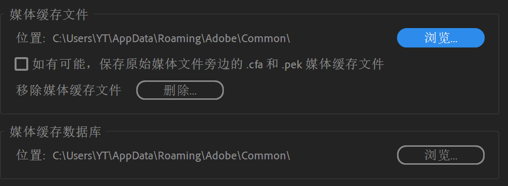

**面板部分：**

- 工作区面板布局恢复默认：`窗口`-`工作区`-`重置为保存的工作区`
- 双击每个子面板左上角面板的名字可以放大该面板至全屏，再次双击回到原来大小,快捷键:~

**时间条面板右键**

- 缩放为帧大小：将视频画幅与预览窗口大小进行匹配至相同，即让视频充满整个窗口
- 嵌套：相当于合并图层；可把两个轨道的视频合成一个轨道
- Alt+拖动：复制片段
- 颜色遮罩就是蒙版

**创建代理：**将大的视频在编辑的时候以小尺寸进行编辑，而在输出的时候用原来的高清格式输出，防止编辑的时候卡顿。编辑时打开代理，导出时要关闭代理。

**编辑预览面板上的两个分数：**

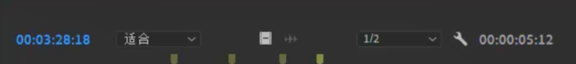

- 左边的：表示以多大的画幅来观察视频，低的话视频在画布上占的面积太小
- 右边的：表示以多好的质量来播放视频，低的话编辑起来不会太卡，预览播放卡顿时可以降低该值

**创建标记:M**

- 右键-*添加章节标记* 或 *添加 **flash** 标记,*可以给视频上的某一小节命名
- 标记入点:`I`
- 标记出点:`O`
- 一段有了入点和出点后,再把该视频拖到时间线上的时候就只脱了入点和出点之间这段
- 一段视频可以多次标记入点和出点,然后多次拖到时间线上,相当于预先剪辑了一下

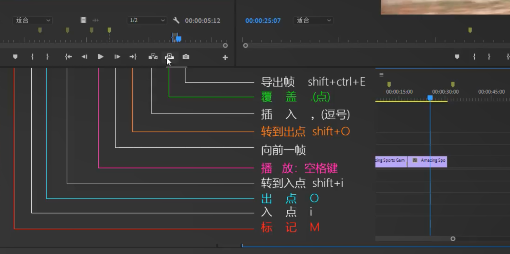

- 插入:是把入点和出点插到时间线位置处,相当于先从时间线处截断,再把该段加入到那里
- 覆盖:是把时间线后面的内容覆盖掉,相当于直接把时间线后面的内容删了
- 导出帧:即导出视频素材的一帧,把某一帧导出并加到时间线上时可以实现视频卡顿的效果

**素材箱的自由变换试图**:

- 可以自由的按任意大小和位置排列素材,对素材分类很方便
- 右击素材,将大小设为特大再标记入点和出点可以很快的对素材进行一个预剪辑
- 还可以以另一种逻辑排列一下素材:空白位置右键-另存为新布局,命名后便保存了一种素材布局逻辑;可保存多种布局

## 第二章:

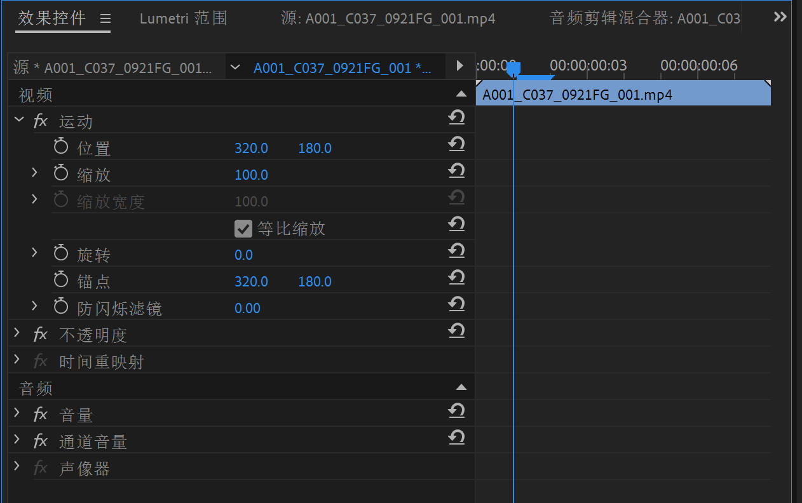

- 编辑-效果控件是用的最多的面板，可以设置与视频画面有关的很多东西，如位置、缩放等等；

- 在效果面板使用的任何一个效果都可以在效果控件面板进行参数调整

- 序列帧数与视频素材帧数不一致时，选择保持小的帧数会把多出的帧率直接删掉 

- 时间线：

- - 黄色：原素材，没有效果
  - 红色：使用了效果但没渲染
  - 绿色：渲染过的效果

- 渲染：回车键

- - 在时间线上添加入点和出点，按回车，就会只渲染入点到出点的效果

## 第三章：时间线及工具栏

- **工具栏工具左键长按两秒出现下拉选项**
- **时间线处直接截断：**`CTRL+K`

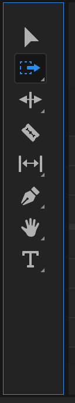

|                                                              |                                                              |
| :----------------------------------------------------------: | :----------------------------------------------------------- |
|        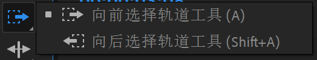        | 选中当前时刻后面或前面所有的片段，相当于一种多选             |
|                                                              | 1.把一个片段向前或向后托，临近的片段也跟着动，不会脱节；     |
| 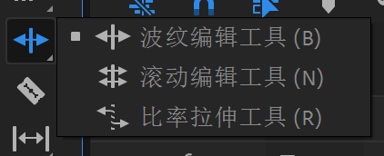 | 2. 把一个片段向前或向后托，临近的片段被拉长或压短，保持视频总长不变； |
|                                                              | 3.把一个片段拉长表示慢动作，压短表示快速播放                 |
| 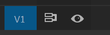 | V1（以此轨道为目标切换轨道）表示可以对当前轨道进行操作，截断、复制、粘贴等操作都是在这个轨道，要想对别的轨道也进行操作就要点开别的轨道的开关 |
|                                                              | 1. 可同时更改“时间轴”内某剪辑的入点和出点，并保留入点和出点之间的时间间隔不变。例如，如果将“时间轴”内的一个10秒剪辑修剪到了5秒，可以使用外滑工具来确定剪辑的哪个5秒部分显示在“时间轴”内。 |
| 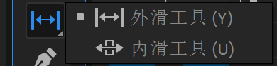 | 2.  选择此工具时，可将“时间轴”内的某个剪辑向左或向右移动，同时修剪其周围的两个剪辑。三个剪辑的组合持续时间以及该组在“时间轴”内的位置将保持不变。 |
| 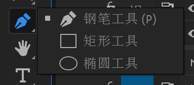 | 钢笔工具主要用来调整音频的大小，衰减等等；钢笔工具就是在序列上打关键帧的 |

- **变形稳定器不能和别的效果一起用，可先导出视频后再导入，再使用别的效果**

**曲线变速效果：**

- 选择工具-在序列上右键-时间重映射-速度

  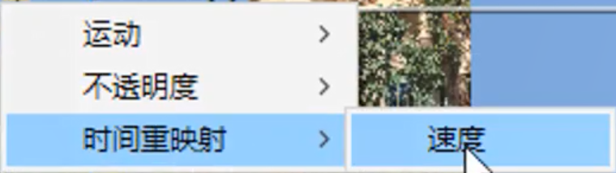

- 钢笔工具添加关键帧

  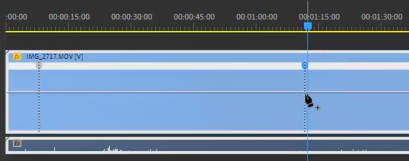

- 选择工具-向上或向下拖到线条变速

  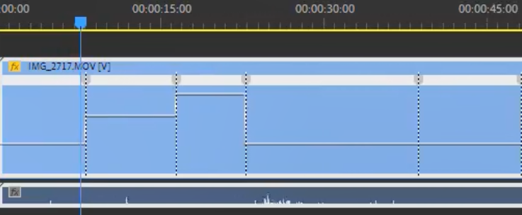

- 改变斜率，让变速平滑，向右拖动关键帧的点；再次平滑

  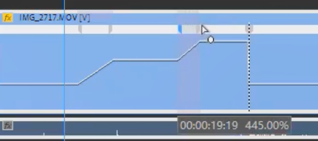

## 第四章：文字与图形

 

**Pr2018**后文字是作为一种基本图形的，总体在图形面板进行编辑，文字与矩形、椭圆等形状在一个轨道上的片段里存储，节省了轨道数量，并且一个片段里的各种图形有类似**ps的图层关系**

 

- 如何添加电影风格的上下黑条：效果控件-不透明度-矩形蒙版

- 新建字幕：字幕不是简单的文字，而是一个片段里面又根据文字分了好多个片段，编辑方式和添加文字不太一样

- - 素材面板右键-新建项目-字幕---开放式字幕

- 自动字幕：网站：网易见外工作台，导出字幕文件再拖到Pr里

- 保存新调的一种文字或图形样式以便下次使用：菜单栏-图形-导出为动态图形模板，然后就可以再图形面板的浏览面板下查看了

- KTV的MTV歌词动态播放效果：建两层文字，底层白色，顶层蓝色，然后对顶层的文字加一个矩形蒙版的关键帧（蒙版-蒙版路径前面的打勾），调整速度就可以有那种效果

- 从静止文字创建动态书写效果：

- - 新建项目-新建透明视频
  - 效果-书写-拉到刚才建的透明视频层
  - 才效果控件面板绘制笔画路径
  - 效果-轨道遮罩键-拉到文字那一层
  - 接着效果控件-轨道遮罩键-遮罩-选择透明视频层那一层

 

## 第五章：视频调色

 

- 混合模式之**滤色**：把那一层或那一轨道的黑色消除掉，比如黑色背景的logo使用滤色就可以得到类似透明背景的效果

- - 把一些黑色背景的光影素材添加到主体视频上面，再使用滤色，可以得到梦幻朦胧的效果
  - 同理，烟雾、下雨、下雪的效果都可以制造出来

- 视频抠像：

- - 纯色背景：效果-超级键-吸取背景颜色即可
  - 一帧一帧抠：效果控件-不透明度-钢笔扣出一张-蒙版路径打上关键帧-隔几针调整一下路径，不用太精细，边缘处加点羽化

- 视频磨皮：插件-效果-Beauty     Box，需要结合视频抠像一起使用

# 第二份资料(讲的很干脆)

资料位置:[哔哩哔哩_bilibili](https://www.bilibili.com/video/BV1SY411r7yc/?p=4&spm_id_from=333.1007.top_right_bar_window_history.content.click&vd_source=0ca12f825d8b78e1adfff58fc2cbac3a)

## 1.   剪辑流程与基础概念

### 项目设置

关于帧大小:

根据摄像机拍出来素材的帧率设置,不知道的话就选30fps

### 剪辑素材

`\`键：将时间轴的序列多放到合适大小

### 导出序列

**H.264和MP4：**

MP4就是一种视频格式，相当于一个容器来装东西；

H.264是一种编码方式，用来生成撞到MP4文件里的东西。

**CBR、VBR1次、VBR2次：**

CBR就是固定比特率编码，视频从头到尾都是一个码率，不科学

VBR就是可变比特率编码，给画面复杂变化剧烈的地方多给点码率，其余的地方为标准码率

1次和2次是因为，要知道视频哪里复杂变化剧烈得事先扫描一遍，否则怎么知道哪里要多给码率。

无脑选VBR2次

**码率设置多少？**

4k序列目标比特率最好为 **20Mbps-60Mbps**

1080p的序列为 **6Mbps-12Mbps**

## 2. 常用功能面板

### 关于快捷键

在 编辑-快捷键 查看

其中紫色的为全局快捷键，即在那个面板下都可以用

绿色的只有在一些特殊的面板中才可使用

可以点击“快捷键”里虚拟的`Ctrl`、`shift`、等等组合来查看该快捷键对应什么功能

也可以在“快捷键”里直接搜某个功能的快捷键是什么

`Ctrl+K`：切割所有轨道

### 源监控面板：快捷预览

那个用来预览素材的窗口叫 ：**源监视器**

快捷键`j`、`k`、`l`：

`j`是倒放，按多次实现多倍速倒放

`l`是正放，按多次就是多倍速播放

`k`就是暂停，相当于空格

### 源监控面板：标记功能

`M`

`i`

`o`

### 源监控面板：插入素材设置

时间轴面板多选快捷键：`shift`+`鼠标点选`

源监视器面板有个 **插入** 和 **覆盖** 按钮，点一下可以直接将源监视器看到的素材直接添加到时间轴

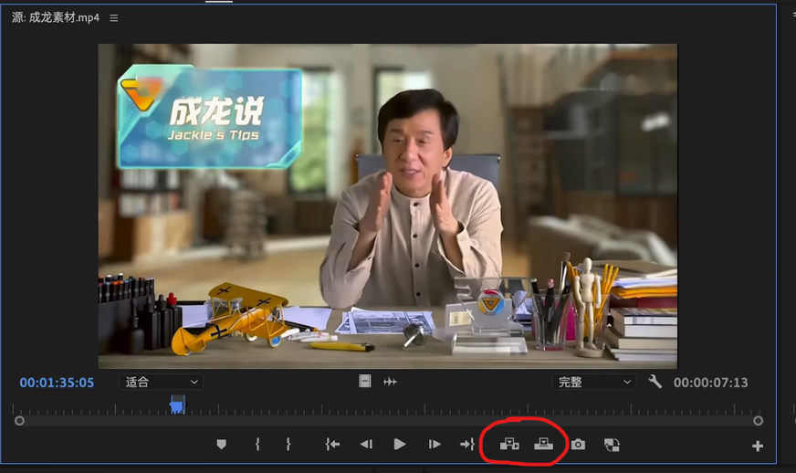

插入：时间线上当前位置的片段会被推到后面，快捷键是逗号：`，`

覆盖：直接覆盖掉时间线上当前位置后面的所有片段，快捷键是句号：`。`

一般就是插入

此外，**直接在素材箱里**选中某个素材片段后，按下 `，` 键盘也可以直接插入到时间线上的轨道上

### 节目面板

就是查看剪辑的这个面板

这个面板也有和源监视器面板的 **插入** 和 **覆盖** 类似的两个图标，但是功能不一样，他们叫**提升**和**提取**

提升：在**节目面板**标记一个入店和出点后，点提升就会将轨道上的这段给删掉，但是位置还空着

提取：同上，但删掉后的同时会自动把轨道后面的片段拉到前面来占住空出的位置

### 项目面板：自动匹配序列

就是左下角素材箱位置的这个面板

这个 面板的最左下角有个`项目可写`按钮，就是一把锁，锁了之后工程文件的东西就为只读模式，不能删改了

自动匹配到序列按钮：

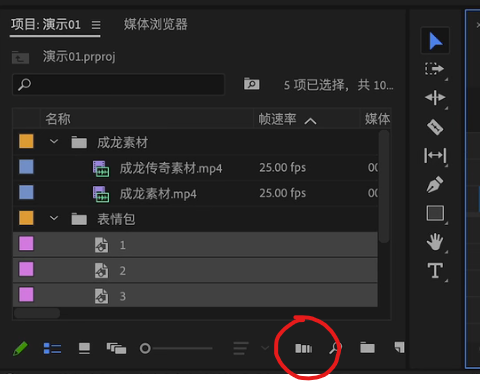

这个很好用，可以将一些图片序列按照一些标记位置（比如音乐卡点位置）自动放到轨道上

点击后，在`方法`一栏中选择 `在未编号处标记` 就可以实现上述效果

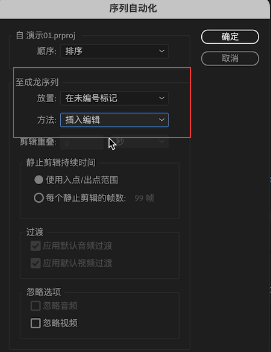

### 项目面板：

(`新建`里面的东西)

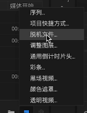

**脱机文件**

pr工程里看到的视频片段就是一个个链接，脱机文件就是通过保存的链接找不到那个视频了，所以出现脱机文件后，你得重新指定下文件的位置。

在`新建`菜单里有一个 `新建脱机文件`选项，其实就是先新建一个壳子放在轨道上，先占住位置，以后再通过指定这个脱机文件具体是哪一段视频。

**黑场视频**

就是加入一段纯黑片段

**颜色遮罩**

就是加入一段自己指定颜色的片段

**透明图层**

同理，加入一层透明图层，pr默认图层是黑色的，所以加了透明图层后看到的还是黑色

## 3.时间轴与工具面板

片段上的小三角代表这个素材的尽头。

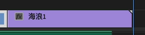

**比例拉伸**就是改变播放速度

**重新混合**工具可以实现把BGM拉长但听不出来

**外滑工具**也很好用