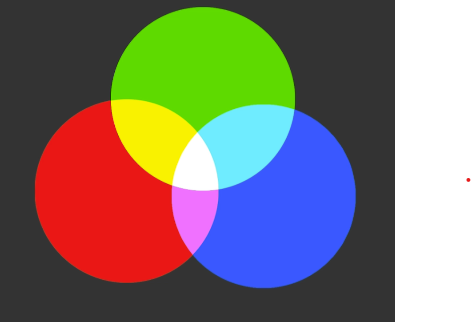
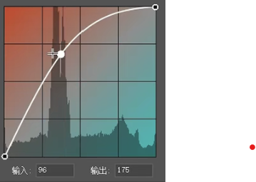
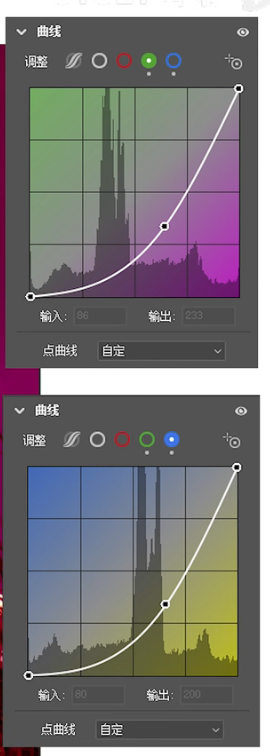
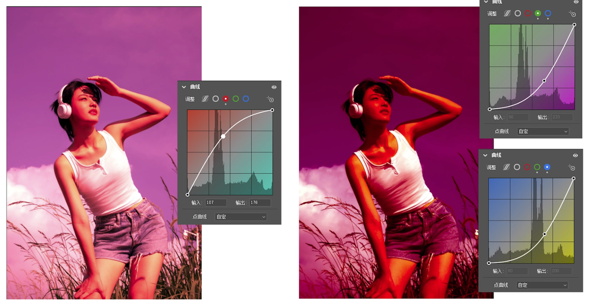
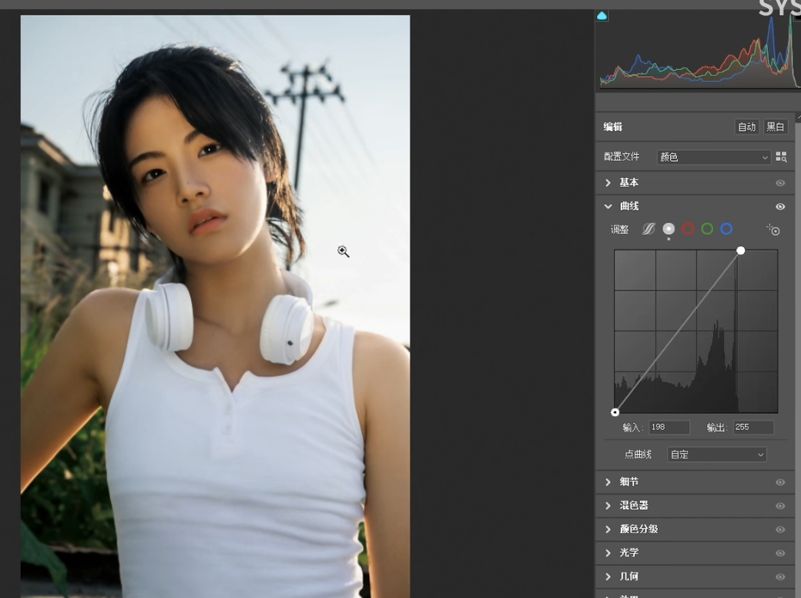
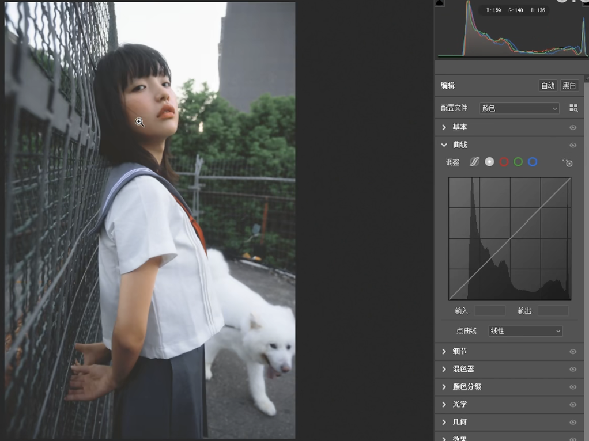
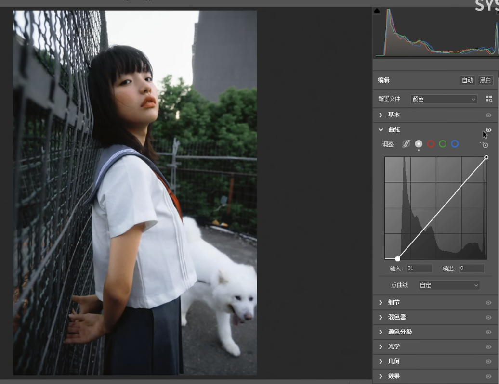
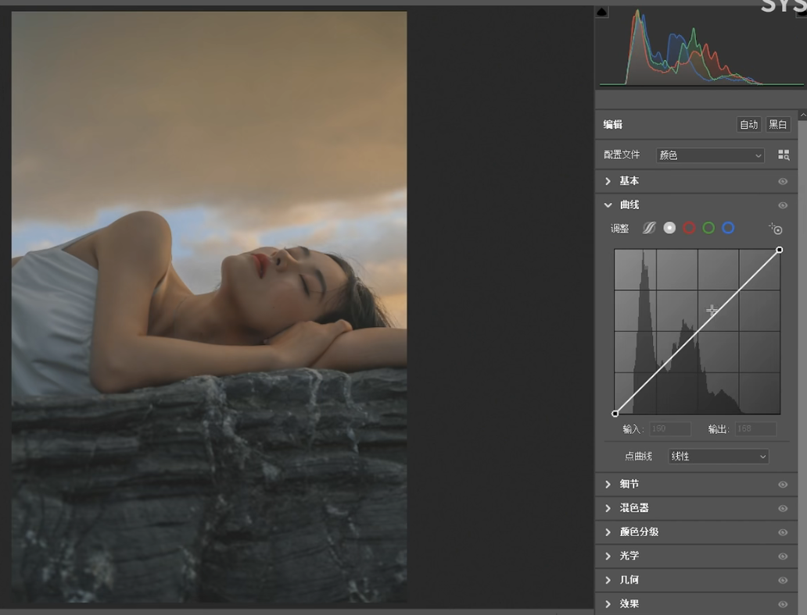
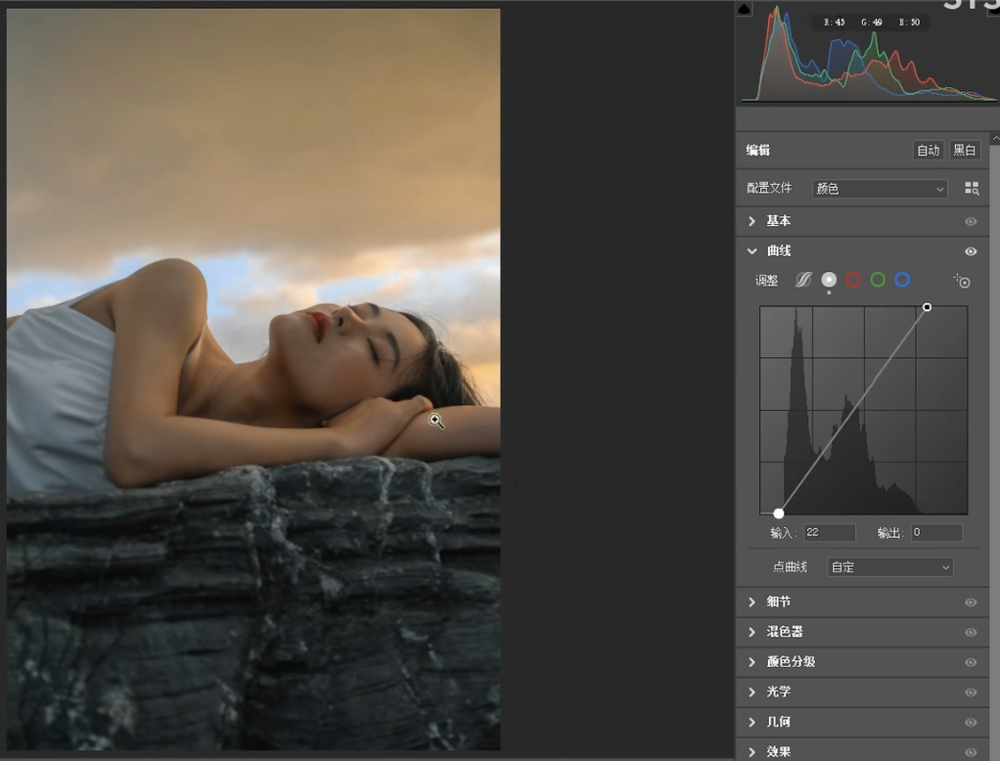
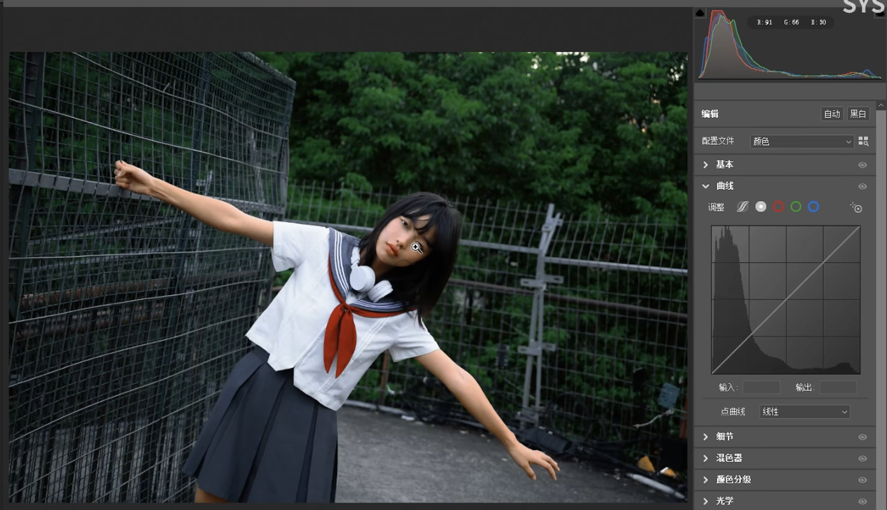

# 曲线

## 光的三原色

首先记住三对互补色：

红—青   绿—品   蓝—黄

如何增加红色？

1. 曲线提升红色，减少青色

   

2. 减绿、减蓝。因为绿色和蓝色的混合色也是青

   

两者都可以得到加红的效果，但有什么区别？

前者的曲线是向上拉的，所以在整体照片产生偏色的同时，也会被提亮，会得到一个亮红色；后者两个曲线都是往下拉的，所以在整体照片产生偏色的同时，也会被压暗，会得到暗红色。

**所以用曲线调色的时候我们得搞清楚自己需要亮色调还是暗色调！**

## 锚点

按住`ctrl`在画面中移动，曲线图上会自动产生锚点

## 曲线与直方图

|                         问题                         |                            调整前                            |                            调整后                            |
| :--------------------------------------------------: | :----------------------------------------------------------: | :----------------------------------------------------------: |
| 高光缺少信息(高光会变灰)，可以将最上方的锚点往左拖动 |  |  |
| 阴影处缺少信息（阴影会发灰），将最下方的锚点往右拖动 |  |  |
|                       照片发灰                       |  |  |
|               照片加灰（模拟胶片质感）               |  |  |

---

- 压暗背景提亮主题
  - 复制图层

  - 混合模式为正片叠底

  - 蒙版图主题
- 中性灰磨皮：
  - 新建空白图层
  - 混合模式为柔光
  - 新建黑白、压暗曝光观察层
  - 画笔白亮和按

---

- - 
