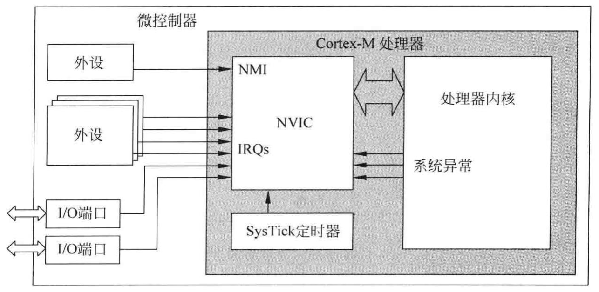

# 常见术语

- `多少位`：指的是内核（CPU）一次处理的数据宽度。

- `意法半导体（ST）`：半导体厂商。STM32芯片内部分为：**内核**+**片上外设**。相当于电脑的CPU + 主板、内存、显卡、硬盘…

- `ARM`既可以认为是一个公司的名字，也可以认为是对一类微处理器的通称，还可以认为是一种技术的名字。

  1. `ARM公司`（Advanced RISC Machines）是专门从事基于RISC（Reduced Instruction Set Computer ，精简指令集）技术进行芯片设计开发的公司，是知识产权供应商，只设计内核不生产芯片，他将有关内核的技术授权给各半导体厂商例如`ST`、`TI`、`Atme1`、`NXP`等厂商。这些厂商都是基于这个内核自己设计片上外设如`SRAM`、`ROM`、`FLASH`、`USART`、`GPIO`等，然后集成到一个硅片上形成芯片。

  2. `ARM微处理器`：原来的命名是`ARM1`、`ARM2`、…、`ARM11`，目前ARM处理器以`Cortex`来命名，并分成`Cortex-A`、`Cortex-R`、`Cortex-M`三个系列：

     1. `Cortex-A` 系列——针对日益增长的消费娱乐和无线产品设计，用于具有**高计算要求**、运行丰富操作系统及提供交互媒体和图形体验的应用领域，如智能手机、平板电脑、汽车娱乐系统等。
     2. `Cortex-R`系列——针对需要运行**实时操作**的系统应用，面向如汽车制动系统、动力传动解决方案、大容量存储控制器等深层嵌入式实时应用。
     3. `Cortex-M`系列——面向微控制器领域，主要针对**成本和功耗敏感**的应用，如智能测量、人机接口设备、汽车和工业控制系统、家用电器、消费性产品和医疗器械等。
     4. `Cortex-SC`系列——除了上述三大系列之外，还有一个主打安全的Cortex-SC系列（SC：SecurCore），主要用于政府安全芯片

  3. `ARM架构`：即`ARM指令集架构`，也称`ARM指令集`，是`CPU架构`的一种。指令集（ISA，Instruction Set Architecture）指的是针对CPU设计的机器指令集合，每个处理器都需要依赖一定的ARM架构来设计。`ARM架构`系列有：`ARMv1`、`ARMv2`、…、`ARMv7`、`ARMv8`…等

     > 除`ARM架构` 外，另一种主流的`CPU架构`是 `X86架构`。PC上的CPU英特尔和AMD采用的都是`X86指令集架构`，手机平板之类的设备采用 `ARM指令集架构`。
     >
     > `X86架构` 对应`复杂指令集`CISC

- `计算机五大组成部分`：运算器、控制器、存储器、输入设备、输出设备。他们之间的通信是通过**总线**

- `DMA`:（**Direct Memory Access**）DMA就是为了给内核（CPU）减负的，数据通信的时候可以不通过CPU而是交给DMA处理

- `寄存器`：在嵌入式开发中，写程序烧入芯片就可以实现控制。那么程序怎么就能控制我们的单片机工作呢？或者程序在控制什么东西呢？那个东西就是**寄存器**，嵌入式开发本质上就是在控制寄存器上的每个位的通断，并且这些寄存器都有其特定的功能。每个外设（如`GPI0`、`USART`、`I2C`、`SPI`.…）都对应有寄存器来对他们控制。

- `KEIL`：是公司的名称，也指`KEIL公司`的所有软件开发工具，2005年`Keil`由`ARM`公司收购。

- `uVision`：是`KEIL公司`开发的一个集成开发环境(IDE)。它只提供一个开发环境，并不提供能具体的编译和下载功能。`uVision IDE`通用于`KEIL`的开发工具中，如`MDK-ARM`，`KEIL C51`等。

  - `MDK(Microcontroller Development Kit)`，`MDK`的设备数据库中有很多厂商的芯片，是专门针对微控制器的开发工具，为满足基于MCU进行嵌入式软件开发的工程师需求而设计。`MDK-ARM`支持`ARM7`，`ARM9`，`Cortex-M4/M3/M1`，`Cortex-RO/R3/R4`等ARM微控制器内核。

  - `KEIL C51`：也称`PK51`，是`KEIL公司`开发的支持绝大部分`8051内核`的微控制器开发工具。

    > `C51`是51系列单片机开发工具，`MDK`是arm开发工具。要开发C51就得下载`C51的Keil`，要开发STM32就得下载`MDK-Arm`。

- `IAR`：也是一款嵌入式集成开发环境，全称是`IAR Embedded Workbench`，它是第三方的开发平台，支持绝大多数主流内核。包括 `C/C++` 编译器、代码分析工具 `C-STAT` 和 `C-RUN`、安全工具 `C-Trust` 和 `Embedded Trust` 等。

- `IBM`：是个公司，（International Business Machines Corporation，国际商业机器公司）。IBM公司是全球最大的计算机硬件、信息技术方案、业务解决方案的提供商。生活中有很多都是IBM提供的技术支持，银行或者金融什么的，一个小型机就几百万的样子，还有配套软件服务，更贵了。2004年`联想`收购了IBM的个人电脑业务，以及`ThinkPad` 这个品牌。硬盘产品部门后来出售给了`日立`。

- **关于位操作**：

  - 左移：从二进制的角度看现象，就是左移几位就在右边添几个0。从逻辑上来讲左移n位就是乘以2的n次方了。 	 	

  - 右移：从二进制角度看，则是在左边填0，右边去除移动的位数的位 。从逻辑上来讲右移就是除以2的n次方； （如遇到时1>>1， 便是0.）；

    ```c
    0x01 << pinpos;	// 将0x01向左移动pinpos位。最终的结果是第pinpos位置1
    a&=~(1<<x);		// 将a中的第x位置0     
    a|=(1<<x);		// 将a中的第x位置1
    a^=（1<<x);		// 异或操作，表示将a中的第x位取反	
    a&=~(3<<x);		// 将a中的第x位和第x+1位置0
    a|=(3<<x);		// 将a中的第x和第x+1位位置1
    *(*uint32_t)0x12302312=1;// 向地址0x12302312写入1	
    ```

  - MSB ："Most Significant Bit"，最高有效位，二进制数字中权值最高的位，通常表示数字的符号

  -  LSB  ： "Least Significant Bit" ，最低有效位，二进制数字中权值最低的位。

  - 在通信中，传输的位序高位先行还是低位先行（从 MSB 开始还是 LSB 开始）对数据的解释至关重要。

- **CMSIS：**（Common Microcontroller Software Interface Standard），通用微控制器软件接口标准。适用于基于 ARM Cortex处理器的微控制器，为处理器和外围设备提供接口。CMSIS 是工具、API、框架和工作流程的组合，由各芯片和软件供应商合作定义，开源。CMSIS在各种开发工具和微控制器中实现一致的软件层和设备支持，它引入上层定义但是不定义外围标准设备，所以可以用到各种基于 Arm Cortex 处理器的设备上。

  

  `CMSIS`翻译成中文就是ARM Cortex 微控制器/处理器软件接口标准。就是ARM公司制定标准，芯片厂商按照此标准编写相应的程序，实现统一的接口，方便开发人员的使用。它包括与软件相关的：`CMSIS-Core`、`CMSIS-Driver`、`CMSIS-DSP`、`CMSIS-NN`、`CMSIS-RTOS`。以及与调试相关的：`CMSIS-DAP`、`CMSIS-Zone`、`CMSIS-SVD`。

  - `CMSIS-Core`：是最基础最重要的。芯片厂商将芯片的启动代码、时钟配置、寄存器定义等封装成标准的文件，一般包含以下一些文件：
    - `Startup_xxxxx.s`——设备启动代码，包括复位处理程序和异常向量。
    - `System_xxxxx.c`——设备的基本配置文件，包括时钟和总线的配置。
    - `xxxx.h`寄存器定义及用户代码需要的包含文件，用于访问设备。在我们编程时需要将这些文件添加或包含到工程中
  - `CMSIS-Driver`：在CMSIS-Core的基础上将微控制器外设与中间件或通用应用程序代码做了一个统一的接口。目前，许多微控制器系列都提供了即用型CMSIS-Driver接口，避免了繁琐且耗时的驱动程序移植。
  - `CMSIS-DSP`：信号处理算法库，提供了超过60多种功能的DSP算法库，包括正余弦、矩阵计算、FFT等等，支持定点、浮点等数据类型。
  - `CMSIS-NN`：用于在Cortex M上进行**神经网络学习**。
  - `CMSIS-RTOS`：实时操作系统的通用API，简单来说就是将Freertos、Rtthread等操作系统再进行一次封装，形成通用的API函数。目的是使移植更方便。
  - `CMSIS-DAP`：一款Cortex-M内核处理器的开源调试器固件。官方给的源代码，使用的是NXP的单片机LPC4320做的。
  - `CMSIS-Zone`：主要用多核配置
  - `CMSIS-SVD`：系统视图描述 (SVD) 文件以基于格式化的 XML 提供了外设信息和其他设备参数。SVD 文件通常与设备参考手册中芯片供应商提供的信息相匹配。

# STM32入门

## 软件安装

**【MDK5简介】**：MDK5由两个部分组成;`MDK Tools`和 `Software Packs`。

- `MDK Tools`包括需要创建、构建和调试基于ARM的微控制器设备的嵌入式应用的所有组件。MDK Tools又分成三部分:
  - `MDK-Core`:由`Keil uVision IDE`和`Keil uVision Debugger`组成,主要应用在32位Cortex-M内核系列芯片;
  - `ARM C/C++Compiler`:由`ARM Compiler 5`和`ARM Compiler 6`组成;
  - `DS-MDK`:由`DS-5 IDE`和`DS-5 Debugger`组成，主要应用在32位Cortex-A 内核系列芯片。
- `Software Packs`中包含的设备支持，CMSIS库、中间件、板卡支持、代码模板和示例项目。通过`Software Packs`，我们可以安装最新的组件，从而支持新的器件、提供新的设备驱动库以及最新例程等，加速产品开发进度。Software Packs又分为: 
  - `Device`(芯片支持)，
  - `CMSIS`(ARM Cortex微控制器软件接口标准）
  -  `Mdidleware`(中间库) 

**【软件安装】**

1. 安装MDK5
2. 为KEIL5添加License
3. 在MDK5安装完成后，要让 MDK5支持`STM32F103`和 `STM32F4`的开发，还需要手动安装 `STM32F1F4`和`STM32F1`的器件支持包:`Keil.STM32F1xx_DFP.2.2.0.pack`、`Keil.STM32F4xx_DFP.2.11.0.pack `

## KEIL创建项目

**【方法一：使用 STM32 固件库新建项目工程】**

1. **新建文件夹**：

   |–项目文件夹

   ​	|–`CMSIS文件夹`：一些标准的库函数的文件

   ​	|–`USER文件夹`：标准库的外设驱动文件

   ​	|–`FWLIB文件夹`：主程序、主逻辑、工程的打开关闭

   ​	|–`DRIVER文件夹`：用户需要手写的一些文件，手写的初始化函数、手写的驱动函数等

2. 打开KEIL，新建项目，项目保存在`USER文件夹`下，名称为项目名称。

3. 在`Manage Project ltems`中建立对应的四个`组`并向其中添加库文件（.c文件）。`Project Targets` 对应项目名，`Groups` 对应各文件夹，`Files` 中添加库文件（.c文件）

   

4. 把库文件（.c文件）对应的头文件路径添加到工程中，在`魔法棒` 下`C/C++`下的`Include Paths` 下添加。

5. 添加全局宏定义标识符，在`魔法棒` 下`C/C++`下的`Preprocessc Symbols`下的`Define` 下添加

6. 时钟配置更改：默认25MHz，DragonFly用的是8MHz。不改的话串口、延时等会出现乱码。

至此建立了一个项目模板，以后的项目都可以以这个模板为基础。

**【方法二：KEIL5 快速新建项目工程】**

1. 不用再去拷贝所需的文件了，在选择完芯片类型后跳出来的页面直接勾选需要的包，必须勾选的有：

- `CMSIS/CORE` ：内核标准

- `Device/Startup` ：stm32系统启动所需

- `Device/StdPeriph Drivers/Framework` ：标准外设驱动固件库，不勾选会报错

- `Device/StdPeriph Drivers/Rcc` ：时钟，有外设就必须用时钟

  除了在新建项目时可以选择一些组件，在开发的过程中点击`Manage Run-Time Environment` 可以继续添加。

2. 管理一下文件目录：`Project Targets`改为项目名称，`Group1`改为`USER`，再新建一个`main.c文件`并将其添加到项目中的`USer` 下。

   > 注意：F103采用的是标准库，所以可以快速新建；F411采用的是HAL库，小马哥的四轴飞控开发用的都是标准库。

## 初识STM32

1. 通常所说的多少位是指：内核（CPU）一次处理的数据宽度，位数越多性能越强悍

2. STM32芯片内部可以粗略地划分为：`内核` + `片上外设` ，内核就相当于CPU，外设就相当于显卡、内存、硬盘等等

   

3. STM32选型：

   

4. STM32总线架构

   

   **主控部分**（左上）是 `内核 + 两个DMA控制器`，他们具有控制权，可以发出一些指令控制外设工作；**被控部分**（右下）就是外设，有硬盘、内存、`AHB`是`Advanced High-Performance Bus`高速总线，`APB`是` Advanced Peripheral Bus`先进外设总线；STM编程或者写驱动也就是针对这些外设的。

   内核通过**总线矩阵**来控制外设，主控总线依次为：

   - **指令总线**：`instruction` 内核通过它获取指令，此总线访问的对象是包含代码的存储器
   - **数据总线**：此总线访问的对象是包含代码或数据的存储器，内核通过此总线进行立即数加载和调试访问
   - **系统总线**：用于访问位于外设或SRAM中的数据，也可通过此总线获取指令(效率低于I-bus)。
   - **DMA存储器总线（S3、S4）**：DMA通过此总线来执行存储器数据的传入和传出。
   - **DMA外设总线**：DMA通过此总线访问AHB外设或执行存储器间的数据传输。

   > DMA在处理大量数据时效率非常高

## 初识寄存器

1. 写嵌入式代码的本质就是控制**寄存器**。其实不管我们用`库开发`还是`寄存器开发`我们本质上就是在控制寄存器上的每个位的通断，并且这些寄存器都有其特定的功能。换句话说每个外设(如 GPIO、USART、I2C、SPI……）都对应有寄存器来对他控制。如果把单片机比作一架钢琴的话，那么所有的外设的寄存器就是钢琴上的琴键，每个外设寄存器都对应着某种功能就像是每个琴键都对应着某个美妙音符。钢琴家用手指控制琴键发出悦耳声音就像我们用程序控制外设寄存器让外设勤劳的工作。可见寄存器的重要性！！！

   

2. 如何找到寄存器，控制寄存器通断操作？

STM32内部共有 `4G` 的地址空间，我们编程时就是按照地址来找到相应的寄存器来操作。存储器本身只具备容量信息不具有地址信息，他的地址是由芯片厂商或用户分配，给存储器分配地址的过程就称为**存储器映射**。

> **存储器映射**：例如一块内存芯片，它的地址线范围是 `A0 - A18`，数据线范围是 `D0 - D15`。他的地址一共有 $2^{19}=524,288个=512$K个，由于数据位宽是16位，相当于一个地址存了2个字节的数据，因此内存总容量是 $512*2=1024KB=1MB$ 。 
>
> 对于这个例子，拿到内存芯片只能知道它的容量也就是地址范围是  0-512K，但是具体的访问地址不一定这样，可能是100K-612K、也可能是1-512K+1等等搭配方式 ，具体映射到哪个地址段就是存储器映射需要做的事。
>
> STM32的存储器地址分配：地址线宽是32位的，`0x0000 0000 - 0xFFFF FFFF`，$2^{32}/1024/1024/1024=4$G个存储单元，每个存储单元就存储一个字节，因此总的存储容量就是4GB.

存储器映射图：


> **保留**是为后续更大容量或更多功能的芯片留出余量

如上图所示：在这4GB的地址空间中，ARM 公司已经平均分成了8个块，每块512MB。STM32F411只用到了4块，保留的没用，而且`内核外设`也几乎不用，主要使用的是标黄色的三个。每个块的用途如下：


**【1. 程序存储器Block0】**

Block0**主要**用于设计片内的FLASH，也就是用来存放代码。 `STM32F411CCU6`片内FLASH共`256KB`，这已经绰绰有余了。


- BOOT为启动方式：是从FLASH启动还是从RAM启动
- 所有的STM32的FLASH地址都是从 `0x08000000` 开始的

**【2. 数据存储器Block1】**

Block1用于设计片内的数据存储器(SRAM), STM32F411CCU6片内 SRAM是**128K**。这部分就相当于我们电脑的内存条。程序运行的`局部变量`、`堆栈`等都存储在这个范围内。

**【3. 外设Block2】**

Block2用于设计片上的外设寄存器，这是我们进行嵌入式控制的主要位置。外设都是挂在在**总线**上的，根据外设的总线速度不同，Block2被分成了`APB`和`AHB`两部分，其中`APB`又分为`APB1`和` APB2`,`AHB`分为`AHB1`和 `AHB2`。这些总线桥的总线速度不同，`AHB2` > `AHB1` > `APB2` > `APB1`，总线的速度也就对应了不同的外设速度。


Block2中，外设的地址具体划分情况如下：


每个具体的外设（GPIOx、TIMx等）的地址的详细映射情况，也就是每个外设各个寄存器的具体地址是由**寄存器映射**表获得，`TIM2`外设的部分寄存器映射情况：


【重要公式】：
$$
外设寄存器的地址 = 外设基地址 + 对应寄存器偏移地址
$$

> 偏移地址增量都是4，是因为每个寄存器有4个字节（32位）的数据长度
>
> 总线基地址+偏移  ==> 外设地址 ； 外设基地址+偏移 ==> 寄存器地址

**【标准库对外设和寄存器的封装：宏定义、指针+结构体】**

**外设的封装：**用**宏定义**对总线的基地址和外设的基地址进行封装

```c
#define GPIOA_BASE (AHB1PERIPH_BASE + 0x0000)    // GPIOA_BASE表示GPIOA外设的基地址
```

**外设寄存器的封装：**使用**结构体**进行封装，表示这块连续的存储空间都属于这个外设。寄存器一般都是是32位的，因此结构体的每个成员都是一个32位的数据；针对不同的外设定义不同类型的**结构体指针**，将结构体指针指向对应外设的基地址就可以访问这个外设的各个寄存器了。

> 封装的本质还是访问特定的内存空间：
>
> 1. 物理外设映射成内存空间，一个外设对应着一个特定的内存空间
> 2. 将一个特定的内存空间按功能划分成多个小块，每个小块就是一个寄存器，**寄存器就是一个32位的内存空间**
> 3. 一个外设的所有内存单元用一个结构体来描述，结构体的成员对应了这个外设的各个寄存器

后面有详细的笔记：STM32标准库对寄存器的封装！！！

## 初配寄存器

只要得到寄存器的地址就可以直接操作寄存器来配置外设了。

以`GPIOx_BSRR`为例：


- `x`表示端口A … E、H
- `y`表示每个端口的每一位
- `W`表示只可写
- 这个寄存器只可写，如果读它的话无论值是什么都返回 0x0000
- 这个寄存器可以通过字节（8位）、半字（16位）、字（32位）方式访问，也就是说最短是访问一个字节
- 这个寄存器每位的含义是：
  - `BSy` ：`1`-对相应的`ODRx`位进行置位，`0`-无操作
  - `BRy` ：`1`-对相应的`ODRx`位进行复位，`0`-无操作

**【如何看寄存器位图】**：

1. **寄存器名称**   

   一般寄存器名称就可以大概知道这个寄存器是干什么的。

2. **寄存器偏移地址及复位值**

   偏移地址为这个寄存器相对于**外设基地址**的偏移地址，复位值就是芯片复位后该寄存器默认值

3. **寄存器位表**

   看这个寄存器用了哪些位。

   STM32的寄存都是32位，但不是每个寄存器都将这32位都用完，有的寄存器只用其一部分位。

   接着就看位名称，`GPIOx_BSRR`的低16 位位名称为 `BS0-BS15`,高16 位名称为`BR0-BR15`；

   接着就看位权限：`w`就表示改为可写，`r`表示可读，`rw`表示可读可写

4. **寄存器位功能描述**

   最重要的部分，详细介绍了每一位的功能以及用法。我们得知对`BSy`位写0时不会影响`GPIOx_ODR`，对` BSy`位写1时会将`GPIOx_ODR`对应位给置1，也就是让对应引脚输出高电平；对 `BRy`位写1时会将`GPIOx_ODR`对应位给置为0

**【配置寄存器】**

要想让`GPIOA`端口都输出高电平，就需要将`GPIOA_BSRR` 的 `BSy`位都写1。根据上面讲的方法可得`GPIOA BSRR`的地址为`0x40020018`,寄存器操作为代码如下:

```c
// //设置GPIOA端口输出高电平
*(uint32 t*)(0x40020018) = 0xFFFF;
```

代码含义：`0x40020018`在我们看来是`GPIOA_BSRR`的地址，但是对编译器来说这只是一个普通的常量，将`0x40020018`强制转换成指针类型编译器才会认为他表示的是地址，(`uint32_t`表示32位无符号整型数据）然后在对这个地址进行`*`操作，也就是在这个地址的寄存器的低16位写1。

这就是程序对寄存器的直接操作，要是这样搞估计这世界上就没有搞单片机的程序员了。这时候我们需要请出我们的编程神器“`STM32标准库`”了，还记得第一节课新建工程时添加的`STM32f4xx.h `文件吗?这个文件已经将STM32所有的外设寄存器都给封装了一遍，并且起了让我们便于认识的别名。

## STM32标准库对寄存器的封装

最核心的原理：
$$
外设寄存器的地址 = 外设基地址 + 对应寄存器偏移地址
$$

**【标准库对总线基地址和外设基地址的封装】**

STM32库函数为了让编程更方便轻松，把总线基地址和外设基地址都以相应的**宏定义**起来，总线或者外设都以他们的名字作为宏名，封装在`stm32f4xx.h`文件中。

```c++
typedef unsigned int uint32_t;

#define PERIPH_BASE           ((uint32_t)0x40000000) // Peripheral base address in the alias region 

// 总线基地址
/*!< Peripheral memory map */
#define APB1PERIPH_BASE       PERIPH_BASE
#define APB2PERIPH_BASE       (PERIPH_BASE + 0x00010000)
#define AHB1PERIPH_BASE       (PERIPH_BASE + 0x00020000)
#define AHB2PERIPH_BASE       (PERIPH_BASE + 0x10000000)

// GPIO外设基地址
// 首先找到总线基地址 AHB1PERIPH_BASE
/*!< AHB1 peripherals */
#define GPIOA_BASE            (AHB1PERIPH_BASE + 0x0000)
#define GPIOB_BASE            (AHB1PERIPH_BASE + 0x0400)
#define GPIOC_BASE            (AHB1PERIPH_BASE + 0x0800)
#define GPIOD_BASE            (AHB1PERIPH_BASE + 0x0C00)
#define GPIOE_BASE            (AHB1PERIPH_BASE + 0x1000)
#define GPIOF_BASE            (AHB1PERIPH_BASE + 0x1400)
#define GPIOG_BASE            (AHB1PERIPH_BASE + 0x1800)
#define GPIOH_BASE            (AHB1PERIPH_BASE + 0x1C00)
#define GPIOI_BASE            (AHB1PERIPH_BASE + 0x2000)
#define GPIOJ_BASE            (AHB1PERIPH_BASE + 0x2400)
#define GPIOK_BASE            (AHB1PERIPH_BASE + 0x2800)
```

> 对总线和外设都是封装的它们的基**地址**

**【标准库对外设的寄存器的封装】**

对外设寄存器的封装与对外设的封装有所不同，是以**结构体**的形式来做的。这是因为，用上面的方法去定义每个`GPIO外设寄存器`的地址太繁琐了，`GPIOA`-`GPIOH`都各有一组功能相同的寄存器，它们只是地址不一样。为了更方便地访问寄存器，引入C语言中的**结构体**语法对寄存器进行封装：

```c
#define  __IO    volatile /*!< Defines 'read / write' permissions */
// volatile 指示编译器不要因优化而省略此指令，必须每次都直接读写其值。可以保证对特殊地址的稳定访问。比如IO口

typedef struct
{
  __IO uint32_t MODER;    /*!< GPIO port mode register,               Address offset: 0x00      */
  __IO uint32_t OTYPER;   /*!< GPIO port output type register,        Address offset: 0x04      */
  __IO uint32_t OSPEEDR;  /*!< GPIO port output speed register,       Address offset: 0x08      */
  __IO uint32_t PUPDR;    /*!< GPIO port pull-up/pull-down register,  Address offset: 0x0C      */
  __IO uint32_t IDR;      /*!< GPIO port input data register,         Address offset: 0x10      */
  __IO uint32_t ODR;      /*!< GPIO port output data register,        Address offset: 0x14      */
  __IO uint16_t BSRRL;    /*!< GPIO port bit set/reset low register,  Address offset: 0x18      */
  __IO uint16_t BSRRH;    /*!< GPIO port bit set/reset high register, Address offset: 0x1A      */
  __IO uint32_t LCKR;     /*!< GPIO port configuration lock register, Address offset: 0x1C      */
  __IO uint32_t AFR[2];   /*!< GPIO alternate function registers,     Address offset: 0x20-0x24 */
} GPIO_TypeDef;

// MODER、OTYPER...这些是变量名，也就是那块内存空间的变量的别名，不是指针！
```

> **__I ：输入口。**既然是输入，那么寄存器的值就随时会外部修改，那就不能进行优化，每次都要重新从寄存器中读取。也不能写，即只读，不然就不是输入而是输出了。 
> **__O ：输出口，**也不能进行优化，不然你连续两次输出相同值，编译器认为没改变，就忽略了后面那一次输出，假如**外部在两次输出中间修改了值，那就影响输出。**
> **__IO：输入输出口**，同上 

这段代码用`typedef`关键字声明了名为`GPIO_TypeDef`的结构体类型，结构体内有8个成员变量，变量名正好对应寄存器的名字。C语言的语法规定，**结构体内变量的存储空间是连续的**，其中32位的变量占用4个字节，16 位的变量占用2个字节。


也就是说，假如这个`GPIO_TypeDef `结构体的首地址为`0x40021C00`（这也是第一个成员`MODER`的地址），那么结构体中第二个成员`OTYPER`的地址即为`0x40021C00+Ox04` ﹐加上的这个`0x04` ，正是代表` MODER`所占用的4个字节地址的偏移量，其它成员相对于结构体首地址的偏移，在上述代码右侧注释已给出，其中的 BSRR代表 MODER所占用的4个字节地址的偏移量，其它成员变量相对于结构体首地址的偏移，在上述代码右侧注释已给出。这样的地址偏移与STM32的`GPIO外设`定义的寄存器地址偏移一一对应，**只要给结构体设置好首地址，就能把结构体内成员的地址确定下来,然后就能以结构体的形式访问寄存器了**。具体用法：

```c
GPIO_TypeDef *GPIOx;	//定义一个GPIo_TypeDef型结构体指针GPIOx
GPIOx = GPIOH_BASE;		//让结构体指针指向外设GPIOH的基地址，使地址确定下来
GPIOx->BSRRL = 0xFFFF;	//通过指针访问并修改GPIOH_BSRRL寄存器
GPIOx->MODER = 0xFFFFFFFF;	//修改GPIOH_MODER寄存器
GPIOx->OTYPER =OxFFFFFFFF;	//修改GPIOH_OTYPER寄存器
uint32_t temp;
temp = GPIOx->IDR;		//读取GPIOH_IDR寄存器的值到变量temp中
```

更进一步，直接使用宏定义好每个GPIO外设对应寄存器结构体的指针，并让指针指向各个GPIO的首地址，使用时我们直接用定义好的指针访问寄存器即可：

```c
#define GPIOA               ((GPIO_TypeDef *) GPIOA_BASE)
#define GPIOB               ((GPIO_TypeDef *) GPIOB_BASE)
#define GPIOC               ((GPIO_TypeDef *) GPIOC_BASE)
#define GPIOD               ((GPIO_TypeDef *) GPIOD_BASE)
#define GPIOE               ((GPIO_TypeDef *) GPIOE_BASE)
#define GPIOF               ((GPIO_TypeDef *) GPIOF_BASE)
#define GPIOG               ((GPIO_TypeDef *) GPIOG_BASE)
#define GPIOH               ((GPIO_TypeDef *) GPIOH_BASE)
#define GPIOI               ((GPIO_TypeDef *) GPIOI_BASE)
#define GPIOJ               ((GPIO_TypeDef *) GPIOJ_BASE)
#define GPIOK               ((GPIO_TypeDef *) GPIOK_BASE)

/*使用定义好的宏直接访问*/
/*访问GPIOH端口的寄存器*/
GPIOH->BSRRL = 0xFFFF;		//通过指针访问并修改GPIOH_BSRRL寄存器
GPIOH->MODER =0xFFFFFFE;	//修改GPIOH_MODER寄存器
GPIOH->OTYPER =OxFFFFFFF;	//修改GPIOH_OTYPER寄存器
uint32_t temp ;
temp = GPIOH->IDR;			//读取GPIOH_IDR寄存器的值到变量temp中
```

> 以后看到 `GPIOA`、`GPIOB`..知道它是指向对应外设的结构体指针，使用指针访问结构体内成员即可访问各寄存器。
>
> 这种方式开发就叫 **库开发**，区别于之前的 **寄存器开发**

**【STM32开发主要参考资料】**

《STM32F4中文参考手册》

《RMO383_STM32F411CCU6_Reference manual》

《DS10314_STM32F411CCU6_Datasheet》

《Cortex M3 与M4权威指南》英文版

# STM32实战

## 1、GPIO

`GPIO`是通用输入输出端口的简称，最基本的功能就输入和输出。它也是芯片内部与外部电路连接的唯一的接口。`STM32F411CCU6`共有3组GPIO端口,x=A、B、C ,每一组有16个I/O口，那么y=0…15。

**【GPIO8种工作模式】**

1. 输入浮空
2. 输入上拉
3. 输入下拉
4. 模拟输入
5. 具有上拉或下拉功能的开漏输出
6. 具有上拉或下拉功能的推挽输出
7. 具有上拉或下拉功能的复用功能推挽
8. 具有上拉或下拉功能的复用功能开漏

**【GPIO内部框图】**


- 保护二极管：高于5V，低于1.7V时保护
- 施密特触发器：作用就是将模拟的电信号转换成数字信号0-1，因为电压是一个范围，必须规定多少伏以上是1，多少伏一下是0。
- **黑色线**是最基本的输入输出，其中输出可以是内核控制`置位/复位寄存器`来写`输出数据寄存器`也可以是内核直接写`输出数据寄存器`；**黄色**表示复用功能即I/O口不经过内核直接连接到其他外设如串口等；**红色**表示模拟量输入输出，输出是从`DAC外设`输出去的

1. 上、下拉电阻

   确保芯片引脚默认状态下的电平是一个稳定的状态，如果这个引脚不工作但是电平状态未知的话会造成一些不可知的问题。GPIO初始化函数中的上拉和下拉选项只是针对输入模式而不是输出模式，在输出模式下，GPIO引脚直接被配置为输出高电平或低电平，而不受上拉或下拉电阻的影响。

2. 模拟输入

   信号经引脚进入输入通道然后不经过施密特触发器直接进入模拟输入。一般`ADC`采集电压时它的输入通道就会配置为模拟输入模式。电信号经过施密特触发器后信号只有0、1两种状态，这也就是为什么模拟信号源输入要在必须施密特触发器之前。

3. 复用功能输入
   输入信号经过施密特触发器后通过“**复用功能输入**”到片上外设。输入信号同时只能有一个去处，不可能既进入复用通道又进输入寄存器，这个流向由“`GPIO端口模式寄存器`”控制。

   > GPIO是芯片内部与外部电路连接的唯一的接口，但是STM32芯片内部外设繁多，这些外设与外部电路通信靠GPIO的基本功能不可能能全部完成，也就有了复用功能。**“复用”**是指片上其他外设对GPIO引脚进行控制，此时GPIO引脚可以视作是**内部外设**与**外部电路**通信的接口。
   > **复用功能输入**：GPIO引脚的信号经由复用功能输入通道，传输到STM32其他片上外设，由该外设读取引脚状态。例如使用串口(`USART`）通信时，`Rx`对应的GPIO引脚就需要配置成复用功能，由串口控制该引脚

4. 通用输入
   GPIO引脚传入的信号经过上、下拉电阻后，又经过施密特触发器，触发器将模拟信号转化高低电平，然后存储在`输入数据寄存器GPIOx_IDR`中，内核读取该寄存器就可以获取GPIO引脚的电平状态。

5. 开漏输出模式和推挽输出模式
   5部分，此部分是由`P-MOS`和`N-MOS`管组成的单元电路，这个电路是“**开漏输出模式**”和“**推挽输出模式**”的根源所在。所谓推挽和开漏，是根据这两个MOS管的工作方式来命名的。

   **推挽输出模式**时，在5部分中输入高电平时，上方的 `P-MOS` 导通，下方的`N-MOS` 关闭，对外输出高电平;在5部分输入低电平时，`N-MOS`管导通，`P-MOS`关闭，对外输出低电平。当引脚高低电平切换时，两MOS管轮流导通，一个负责**灌电流**,一个负责**拉电流**，其负载能力和开关速度都比普通的方式有很大的提高。推挽输出的低电平为`0V`，高电平为`3.3V`。

   推挽输出模式一般应用在输出电平为`0`和`3.3V`而且需要高速切换开关状态的场合。例如闪烁LED通信时对应引脚需要配置成推挽输出模式。

   **开漏输出模式**时，5部分上方的`P-MOS`管完全不工作。如果我们控制输出为`0`，则` P-MOS`管关闭，`N-MOS`管导通，使输出接地低电平，若控制输出为 1(它无法直接输出高电平)时，则P-MOS管和N-MOS管都关闭，所以引脚既不输出高电平，也不输出低电平，为`高阻态`。所以“开漏输出模式”想控制引脚输出1必须接上拉电阻(可用内部上拉，但建议在外部再接一个上拉电阻)。

   开漏输出模式应用场景：

   ①一般应用在`I2C`，`SMBUS`通讯等需要“`线与`”功能的总线电路。
   
   ②还用在电平不匹配的场合，如需要输出5V的高电平，就可以在外部接一个上拉电阻，上拉电源5V，并且把GPIO设置为开漏模式,当输出高阻态时，由上拉电阻和电源向外输出5V的电平。
   
6. 通用输出
   6部分，“`置位/复位寄存器（GPIOx_BSRR)`”是置位复位输出数据寄存器相应的位，而“`输出数据寄存器（GPIOx_ODR)`”，为第5部分双MOS管电路单元提供输入电平，从而控制GPIO引脚电平

7. 复用功能输出
   使用复用功能时片上外设输出的电平通过“`复用功能输出`”通道，进入第5部分双MOS管电路单元，进而控制GPIO引脚电平。

8. 模拟输出
   `DAC外设`输出通道一般会用此模式。

**【GPIO相关寄存器】**

GPIO的8种工作模式通过配置其相关寄存器实现

GPIO外设一共有九个寄存器分别为:

- GPIO端口模式寄存器(`GPIOx_MODER`)：设置通用输入、通用输出、复用功能模式、模拟模式
- GPIO端口输出类型寄存器(`GPIOx_OTYPER`)：设置输出推挽、开漏
- GPIO端口输出速度寄存器(`GPIOx_OSPEEDR`)：设置输出速度2MHz、25MHz、50MHz、100MHz
- GPIO端口上拉/下拉寄存器(`GPIOx PUPDR`)：设置无上下拉、上拉、下拉
- GPIO端口输入数据寄存器(`GPIOx_IDR`)：存端口输入数据，数据存在低16位，只可读
- GPIO端口输出数据寄存器(`GPIOx_ODR`)：存端口输出数据，数据存在低16位，可读可写
- GPIO 端口置位/复位寄存器 (`GPIOx_BSRR`) ：对端口进行置位复位，低16位写1表示对引脚置位，高16为写1表示对引脚复位
- GPIO端口配置锁定寄存器(`GPIOx_LCKR`)：设置是否锁定端口数据
- GPIO端口复用功能低位寄存器(`GPIOx_AFRL`)：设置端口引脚 0-7 的复用功能，其中每四位控制一个引脚可以选择的16个复用功能
- GPIO端口复用功能高位寄存器(`GPIOx_AFRH`)：设置端口引脚 8-16 的复用功能，其中每四位控制一个引脚可以选择的16个复用功能

通过配置寄存器得到不同的输入输出模式：


> GP = 通用
>
> PP = 推挽
>
> PU = 上拉
>
> PD = 下拉
>
> OD = 开漏
>
> AF = 复用功能

我们用的`STM32F411CCU6`共有3组`GPIO端口`,那么x=A…C ,每一组有16个I/O口，那么y=0…15。比如我们想将`PB8`配置成通用输出模式，我们就需要将`GPIOB_MODER` 的 `MODER3[1:0]`写入`01`；配置PB8为推挽模式那么我们就需要将`GPIOB_OTYPER` 的`OT8[1:0]`写入`0`；想在`ODRx`的2位置位，就需要给`GPIOx_BSRR`的`BS2`位写`1`，要对`ODRx`的2位复位，就需要给`GPIOx_BSRR`的 `BR2`位写1。

**【GPIO外设初始化】**

1. 使能GPIOx的时钟
2. 配置 GPIOx端口的第y个IO口PBy
3. 配置PBy的为输入还是输出模式（配置`GPIOx_MODER`）
4. 配置PBy的输出类型为推挽还是开漏（配置`GPIOx_OTYPER`）
5. 配置PBy的输出速度是多少MHz（配置`GPIOx_OSPEEDR`）

这些寄存器也不用我们挨个去找，标准库也提前将关于初始化GPIO外设相关的寄存器配置封装到了名叫`GPIO_InitTypeDef`结构体中，我们只需新建一个`GPIO_InitTypeDef`类型的结构体并指定结构体内变量的值，指定结构体内变量的值就是在配置对应的寄存器。然后将配置好的结构体的指针传给`GPIO_Init()`函数来完成GPIO的初始化。

GPIO外设相关的函数申明在`FWLIB/stm32f4xx_gpio.h`文件中，实现在`FWLIB/stm32f4xx_gpio.c`文件中，常用函数：

```c
void GPIO_DeInit(GPIO_TypeDef* GPIOx); // 以默认方式初始化

void GPIO_Init(GPIO_TypeDef* GPIOx, GPIO_InitTypeDef* GPIO_InitStruct);  
// 第一个参数指定要操作哪个GPIO外设
// 第二个参数传进去一个结构体，在这个结构体内我们已经指定了我们想要的配置，将其传给初始化函数让它按这种形式来初始化GPIO

void GPIO_SetBits(GPIO_TypeDef* GPIOx, uint16_t GPIO_Pin); 	 // 对某个引脚置位
void GPIO_ResetBits(GPIO_TypeDef* GPIOx, uint16_t GPIO_Pin); // 对某个引脚复位
```

> GPIO初始化对用户来说要做的就是新建并初始化一个`GPIO_InitTypeDef`类型的结构体，在这个结构体内指定我们想要的GPIO工作模式，然后将其传给`GPIO_Init()`函数从而完成GPIO的初始化

**【初始化详细代码】**

```c
#include "stm32f4xx.h"

int main()
{
  RCC_AHB1PeriphClockCmd(RCC_AHB1Periph_GPIOB, ENABLE);  // 初始化AHB1总线上的GPIOB外设的时钟

  GPIO_InitTypeDef  GPIO_InitStructure;				// 这个结构体存在普通内存中
  GPIO_InitStructure.GPIO_Pin = GPIO_Pin_8;			// 指定端口的IO口引脚
  GPIO_InitStructure.GPIO_Mode = GPIO_Mode_OUT; 	// 指定为通用输出模式
  GPIO_InitStructure.GPIO_OType = GPIO_OType_PP; 	// 指定输出方式为推挽输出
  GPIO_InitStructure.GPIO_Speed = GPIO_Speed_100MHz;// 指定输出速度为100MHz

  // 调用GPIO初始化函数
  GPIO_Init(GPIOB, &GPIO_InitStructure);			// 传指针是为了省内存
	while(1)
	{
		*(uint32_t*)(0x40020018) = 0xFFFF;
		GPIO_SetBits(GPIOB,GPIO_Pin_8);				// 置位，USER_LED灭
		delay(1000);
		GPIO_ResetBits(GPIOB,GPIO_Pin_8);			// 复位，USER_LED亮
		delay(1000);
	}
}
```

> 关于枚举类型：是一种将**常量值**与易读的**标识符**相关联的数据类型，即为一些常用常量值提供易读的标识符，这有助于提高代码的可读性，使代码更具表现力。**enum的都是常量，所以没有数据类型**

> 上面这部分代码只完成一个控制灯就占用了这么多行。正确的组织方式是新建一个`led.h`和`led.c`文件分别存储到`DRIVER`文件夹下的`inc`和`src`文件夹中，然后再将`led.c`文件添加到工程中的`DRIVER组`下，将`led.h`文件所在目录添加到``魔法棒` 下`C/C++`下的`Include Paths` `。DRIVER文件夹存放的是用户写的驱动代码。

```c
// GPIO_Init（）函数解析
void GPIO_Init(GPIO_TypeDef* GPIOx, GPIO_InitTypeDef* GPIO_InitStruct)
{
  uint32_t pinpos = 0x00, pos = 0x00 , currentpin = 0x00;
    /* pinpos 循环变量，遍历16次
     * pos 确定某次循环中具体的一位，即pos是一个只有一个位为1其他位都为0的值
     * currentpin 是传进来需要配置的那几位中的一位，是的一次可以初始化好几位
     */

  /* Check the parameters */
  assert_param(IS_GPIO_ALL_PERIPH(GPIOx));
  assert_param(IS_GPIO_PIN(GPIO_InitStruct->GPIO_Pin));
  assert_param(IS_GPIO_MODE(GPIO_InitStruct->GPIO_Mode));
  assert_param(IS_GPIO_PUPD(GPIO_InitStruct->GPIO_PuPd));

  /* ------------------------- Configure the port pins ---------------- */
  /*-- GPIO Mode Configuration --*/
  for (pinpos = 0x00; pinpos < 0x10; pinpos++)
  {
    pos = ((uint32_t)0x01) << pinpos;
    /* Get the port pins position */
    currentpin = (GPIO_InitStruct->GPIO_Pin) & pos;  // 第pos位是否是要配置的
    /* pos是一个只有一个位为1，其他位都为0的值。而传进来的GPIO_InitStruct->GPIO_Pin
     * 却有可能有多位是1，比如GPIO_InitStructure.GPIO_Pin = GPIO_Pin_0 | GPIO_Pin_1 
     * 就初始化了pin0和pin1两个脚
     */

    if (currentpin == pos)
    {
      // 先清除该引脚原有的工作模式设置，复位为00
      GPIOx->MODER  &= ~(GPIO_MODER_MODER0 << (pinpos * 2));// 移动0、2、4、6、...30位                                                                                                                                                                                                                                                                                                                 
        // 每个引脚的工作模式由MODER中的两位表示，因此需要左移 pinpos * 2 	
      // 再设置新的工作模式，将需要设置的那两位置1
      GPIOx->MODER |= (((uint32_t)GPIO_InitStruct->GPIO_Mode) << (pinpos * 2));

      // 如果是输出模式或复用功能模式的话
      if ((GPIO_InitStruct->GPIO_Mode == GPIO_Mode_OUT) || (GPIO_InitStruct->GPIO_Mode == GPIO_Mode_AF))
      {
        /* Check Speed mode parameters */
        assert_param(IS_GPIO_SPEED(GPIO_InitStruct->GPIO_Speed));

        /* Speed mode configuration */
        GPIOx->OSPEEDR &= ~(GPIO_OSPEEDER_OSPEEDR0 << (pinpos * 2)); // 先复位
        GPIOx->OSPEEDR |= ((uint32_t)(GPIO_InitStruct->GPIO_Speed) << (pinpos * 2)); // 再置位特定位

        /* Check Output mode parameters */
        assert_param(IS_GPIO_OTYPE(GPIO_InitStruct->GPIO_OType));

        /* Output mode configuration*/
          // OTYPER寄存器只用到16位
        GPIOx->OTYPER  &= ~((GPIO_OTYPER_OT_0) << ((uint16_t)pinpos)) ; // 复位
        GPIOx->OTYPER |= (uint16_t)(((uint16_t)GPIO_InitStruct->GPIO_OType) << ((uint16_t)pinpos)); //置位特定位
      }

      /* Pull-up Pull down resistor configuration*/
      GPIOx->PUPDR &= ~(GPIO_PUPDR_PUPDR0 << ((uint16_t)pinpos * 2));
      GPIOx->PUPDR |= (((uint32_t)GPIO_InitStruct->GPIO_PuPd) << (pinpos * 2));
    }
  }
}
```


## 2、USART

串口通讯是一种设备间非常常用的串行**通讯**方式，大部分电子设备都支持该通讯方式。并且它也是一个很好的**调试工具**，我们可以利用它输出调试信息到电脑屏幕。

**【通讯方式】**

串口（USART）是所学习的第一种通信总线，除串口外还有IIC、SPI等通讯方式，这些通信方式都具有下面的属性：

- 并行

- 串行

  - 同步：发送和接收采用同一时钟，字符无间隔一次性传输，快。`SPI`

    

    

  - 异步：不需要时钟同步，容易实现，慢，发送方传输字符的间隔时间不一定 `USART串口`用的就是这种

    

    

- 根据串行数据的传输方向分为

  

- 通信速率

  - 比特率：每秒钟传送的二进制位数，**bps**

  - 波特率：每秒钟调制信号变化次数。**Baud**

    $比特率 = 波特率 \times 单个调制状态对应的二进制位数$

    串行通信双方的波特率必须一致，因为双方识别位的时间间隔要相同。

  **【STM32 USART简介】**

  就是用硬件实现了上述串口协议，我们用软件进行下配置就可以使其正常工作。

  `USART` 的全称“`通用同步异步收发器`”，也就是说他可以同步通信也可以异步通信。STM32芯片具有多个USART 外设用于串口通讯，USART能够灵活地与外部设备进行全双工数据通信。

  `USART`不仅仅能实现简单的串口通信，还可以`LIN总线`等好多网络总线协议。

  


**【串口通信软件之IO口复用功能初始化】**

串口也是外设，他是通过GPIO的引脚与外界通讯的，这里就用到了GPIO的复用功能。

我们知道GPIO是芯片内部外设和外部电路的唯一接口，要串口通信就得与外界连接就要用到GPIO，但此时的GPIO不再是基本的通用输入输出，而要发挥其 **复用功能**作为串口外设的接口引脚。

GPIO端口复用功能寄存器指示：一个IO口可具有 16 个复用功能，由`GPIOx_AFRL`或`GPIOx_AFRH`寄存器控制中的4位来控制具体复用哪个功能。端口GPIOx的低8位引脚0-7的复用功能由`GPIOx_AFRL`寄存器进行控制：


GPIO复用功能配置函数：

```c
// 参数含义：（哪个GPIO，GPIOx的哪个引脚，为哪个外设提供复用功能）
// GPIO_AF取值为 0-15 ，分别代表上图中对应的具体外设
void GPIO_PinAFConfig(GPIO_TypeDef* GPIOx, uint16_t GPIO_PinSource, uint8_t GPIO_AF)
{
  uint32_t temp = 0x00;
  uint32_t temp_2 = 0x00;
  
  /* Check the parameters */
  
  temp = ((uint32_t)(GPIO_AF) << ((uint32_t)((uint32_t)GPIO_PinSource & (uint32_t)0x07) * 4)) ;// 先&运算，先拿到要设置的值及其位置
  GPIOx->AFR[GPIO_PinSource >> 0x03] &= ~((uint32_t)0xF << ((uint32_t)((uint32_t)GPIO_PinSource & (uint32_t)0x07) * 4));// 找到对应位清零
  temp_2 = GPIOx->AFR[GPIO_PinSource >> 0x03] | temp; // 对应位赋值
  GPIOx->AFR[GPIO_PinSource >> 0x03] = temp_2;
}

// 综上，就是设置寄存器GPIOx_AFR
```

> `uint16_t GPIO_Pin`是位选择，就是选择哪一个脚，那一位就是1
>
> `uint16_t GPIO_PinSource`是数字，0-15这种

由于要通信，也就是要在引脚上接收和发送高低电平，因此要将`TX`对应端口配置成“`复用推挽输出模式`”，将`RX`配置成`复用上拉输入模式`（上拉下拉无所谓）。

> 外设的复用功能引脚不是随意复用的，芯片的哪个引脚可以作为哪个外设的复用接口引脚要查芯片数据手册`《STM32f411xC Datasheet》`获得，比如可以复用为`USART1_TX`的端口只有`PA9` 、`PA15`、`PB9`三个口

**【串口通信软件之串口初始化】**

串口初始化相关函数：

```c
void USART_Init(USART_TypeDef* USARTx, USART_InitTypeDef* USART_InitStruct);//初始化
void USART_Cmd(USART_TypeDef* USARTx, FunctionalState NewState);//使能
void USART_SendData(USART_TypeDef* USARTx, uint16_t Data);//发送
uint16_t USART_ReceiveData(USART_TypeDef* USARTx);//接收
FlagStatus USART_GetFlagStatus(USART_TypeDef* USARTx, uint16_t USART_FLAG);//获取标志位
```

串口初始化过程：

1. 设置`USART_CR2`寄存器，根据StopBits设置`STOP`位[13:12] (停止位)
2. 设置`USART_CR1`寄存器，根据WordLength设置`M`位[12]（字长）、根据Parity设置`PCE`和`PS`位[10:9]（Parity校验使能和Parity校验选择）、根据Mode设置`TE`和`RE`位[3:2]（选择是发送还是接收）
3. 设置`USART_CR3`寄存器，根据HardwareFlowControl设置`CTSE` 和`RTSE`位[9:8]
4. 设置`USART_BRR`寄存器（Baud rate register），分为12位整数部分和4位小数部分
5. 执行`USART_Init()`函数完成1-4步
6. 执行`USART_Cmd()`函数使能串口外设

> 同GPIO，USART初始化对用户来说要做的还是新建并初始化一个`USART_InitTypeDef`类型的结构体，在这个结构体内指定我们想要的USART工作模式，然后将其传给`USART_Init()`函数从而完成USART的初始化。
>
> 因此，上图中关于底层的这些东西基本不用管，我们**主要关注**的是最上面第④部分，也就是直接关注要收发的数据。

模块化编程，最终的串口配置函数实现：

```c
// usart.h文件

#ifndef USART_H
#define USART_H
#include "stm32f4xx.h"

void USART_init(void);	// 在这个函数中完成串口的初始化和使能，init采用小写，这是为了与库函数区分

#endif

```

```cpp
// usart.c文件

#include "stm32f4xx.h"
#include "usart.h"
#include "stdio.h"

// USART肯定要用到IO引脚，因此先配置GPIO，这里要配置成GPIO的复用功能模式
void USARTGPIO_Config(void)
{
	GPIO_InitTypeDef  GPIO_InitStructure; //定义GPIO初始化结构体变量
  	RCC_AHB1PeriphClockCmd(RCC_AHB1Periph_GPIOA, ENABLE);//使能GPIOA时钟
	
    // 配置外设GPIO A 的9脚和10脚为外设 USART1 的复用功能模式
	GPIO_PinAFConfig(GPIOA, GPIO_PinSource9,GPIO_AF_USART1);
	GPIO_PinAFConfig(GPIOA, GPIO_PinSource10,GPIO_AF_USART1);
      // #define GPIO_AF_USART1  ((uint8_t)0x07)，7就代表复用USART1或USART2
	
	//Tx脚配置
  	GPIO_InitStructure.GPIO_Pin = GPIO_Pin_9; //GPIOB 9
  	GPIO_InitStructure.GPIO_Mode = GPIO_Mode_AF; //设置GPIOB9为复用模式
  	GPIO_InitStructure.GPIO_OType = GPIO_OType_PP; //设置GPIOB9输出类型为推挽模式
  	GPIO_InitStructure.GPIO_Speed = GPIO_Speed_100MHz; //设置GPIOB9输出速度为100MHz
	GPIO_InitStructure.GPIO_PuPd = GPIO_PuPd_UP; //设置GPIOB8为上拉模式
  	GPIO_Init(GPIOA, &GPIO_InitStructure);  // 初始化9脚
	
	//Rx脚配置
    // 不用再新建一个结构体，还用之前定义的结构体，将里面的值重新定义一下就行
  	GPIO_InitStructure.GPIO_Pin = GPIO_Pin_10; //GPIOB 10
  	GPIO_InitStructure.GPIO_Mode = GPIO_Mode_IN; //设置GPIOB10为输入模式
	GPIO_InitStructure.GPIO_PuPd = GPIO_PuPd_UP; //设置GPIOB10为上拉模式
  	GPIO_Init(GPIOA, &GPIO_InitStructure); // 初始化10脚	
}

// 再配置USART
void USART_init(void)
{
	USART_InitTypeDef USART_InitStructre; // 同GPIO，先定义USART的初始化结构体
	RCC_APB2PeriphClockCmd(RCC_APB2Periph_USART1, ENABLE);//使能串口USART1时钟！！！
	
	USARTGPIO_Config();//调用前面的GPIO配置，开启
	
    // 给USART的初始化结构体幅值，设置相关选型
	USART_InitStructre.USART_BaudRate = 115200;		// 设置波特率
	USART_InitStructre.USART_Mode = USART_Mode_Tx;	// 设置为发送
	USART_InitStructre.USART_Parity = USART_Parity_No;	// 设置没有校验位
	USART_InitStructre.USART_StopBits = USART_StopBits_1;	// 设置有1位停止位
	USART_InitStructre.USART_WordLength = USART_WordLength_8b;	// 设置数据传输位宽
	USART_InitStructre.USART_HardwareFlowControl = USART_HardwareFlowControl_None; // 不重要
	USART_Init(USART1,&USART_InitStructre);  // 初始化串口
	
	USART_Cmd(USART1, ENABLE); // 串口使能，让串口开始工作！！！
}

/*****************************************************************************
*函  数：int fputc(int ch, FILE *f)
*功  能：重写的一个printf()函数
*参  数：ch 要发送的数据
*返回值：无
*备  注：必须有这个才可以使用printf重定向至串口发送，而且需要包含<stdio.h>
*****************************************************************************/
int fputc(int ch, FILE *f)
{
  	USART_SendData(USART1,(uint8_t)ch);//使用USART1 发送数据ch
	while(USART_GetFlagStatus(USART1,USART_FLAG_TXE) == RESET)//等待发送完成
	{}
	return ch;
}

```

```c
// main.c文件

#include "stm32f4xx.h"
#include "led.h"
#include "usart.h"
#include "stdio.h"
void delay(int cnt);

int main()
{
	uint16_t i;
	LED_init();
	USART_init();
	
	while(1)
	{
		printf("0x01\r\n"); // 串口发送字符串“0x01\r\n”
		delay(200); 
	}
}

//粗略延时函数
void delay(int cnt)
{
	int i,j;
	for(i=0;i<cnt;i++)
	{
		for(j=0;j<0xfff;j++)
		{}
	}
}
```

## 3、时钟树

**【系统时钟】**

`RCC`：**Reset and clock control**

51单片机就一个时钟

stm32时钟系统比较复杂。因为stm32本身非常复杂，外设非常的多，但是并不是所有外设都需要系统时钟这么高的频率，比如看门狗以及 RTC（Real Time Clock） 只需要几十 k 的时钟即可。同一个电路，时钟越快功耗越大，同时抗电磁干扰能力也会越弱，所以对于较为复杂的 MCU一般都是采取**多时钟源**的方法来解决这些问题。

`AHB`：**Advanced High Performance Bus** 

`APB`：**Advanced Peripherals Bus**

`AHB`是stm32内部的主干道，芯片中的处理器、内存、及各种外设都连接在这一总线上，通过这一总线进行数据通信。

 `HCLK`就是`AHB`总线中的**时钟线**（相当于IIC通信中的SCL线），`HCLK`直接连入了处理器内核、内存以及DMA，为他们带去了时钟信号。假定`HCLK`的频率是72Hz，那内核、内存、DMA这些的频率也是72Hz。

在处理器内核中，有一个`SysTick`的定时器，用于为程序提供一个时间基准。`SysTick`定时器与`HCLK`的连接不是直连，而是多了一个分频器

串口、GPIO、IIC等外设并没有直接连接在AHB总线上，而是分门别类的连到了两个`APB`总线上，这两个`APB`就是专门用来连接外设的，他们通过桥接器连接到了`AHB`总线上，与处理器、DMA等连接在AHB总线上的部分进行通信。两个`APB`总线的时钟线也是来自`HCLK`，经分频器分频后的`PCLK1`提供给除定时器外的其他外设；经分频再倍频后的提供给了定时器。`PCLK2`与`PCLK1`一致，只不过ADC又多了一个专属的预分频器。


问题：`HCLK`是怎么来的？ 

从源头上说，这棵以`HCLK`为核心的时钟树的时钟源有两个：

- `HSI`：**High Speed Internal Clock**，高速内部时钟

- `HSE`：**High Speed External Clock**，高速外部-时钟

高速内部时钟`HSI`是STM32默认使用的时钟源，它内置在芯片内部，无需外接电路就可使用，频率是8MHz，但精度较差；高速外部时钟`HSE`由外部晶振提供，晶振的脉冲精度很高。

可以选择`HSI`、`HSE`或经过PLL锁相环倍频后的`HSE`之一接入到时钟树中，接入的这个数值称其为系统时钟`SYSCLK`，这个时钟经过分频器连接到时钟`HCLK`。


`CSS`：**Clock Security System**时钟安全系统，他可以在`HSE`发生故障时立即将时钟切换回内部时钟源`HSI`并产生中断。

看门狗与实时时钟`RTC`的时钟源是低速时钟`LSI`和`LSE`或者经1/128分频的`HSE`。

`MCO`：Master Clock Output 时钟输出功能，选择一种时钟信号输出到外部

`PLL`：**Phase locked loop**，锁相环

系统时钟初始化是在`system_stm32f4xx.c/SystemInit()`函数中，他是在启动的时候调用的，也就是说在main函数之前。

**【SysTick定时器】**

SysTick定时器属于内核中的一个外设，是一个 **24bit** 的向下递减的计数器，计数器每计数一次的时间为**1/SYSCLK**，一般我们设置系统时钟 SYSCLK 等于 100MHz（`100MHz对应10ns`）。当重装载数值寄存器的
值递减到 0 的时候，系统定时器就产生一次中断，以此循环往复。系统定时器一般用于操作系统，用于产生时基，维持操作系统的心跳，我们也时常利用它进行精确延时而又不占用外设资源。

SysTick 定时器一共有 4 个寄存器：

- CTRL：SysTick 控制及状态寄存器
- LOAD：SysTick 重装载数值寄存器
- VAL：SysTick 当前数值寄存器

工作原理：`SysTick->VAL` 寄存器的值每一个时钟周期将会减一，如果 `SysTick->VAL` 被 减 到 零 时` SysTick->LODA `的 值 将 会 立 即 装 载 进 入`SysTick->VAL` 中，并且 `SysTick->CTRL `的 `COUNTFLAG` 将会置 1 如果使能了定时器中断，系统将会进入 `SysTick `的中断。

具体查看`Cortex M3与M4权威指南.pdf`9.5节

**【SysTick 定时器配置】**

```c
/* System Tick Configuration
 * 初始化系统定时器及其中断，开始系统计时
 * 参数ticks为两次中断间隔的计数次数
 * 返回0代表函数运行成功，返回1表示运行失败
 */
__STATIC_INLINE uint32_t SysTick_Config(uint32_t ticks)
{
  if ((ticks - 1UL) > SysTick_LOAD_RELOAD_Msk) { return (1UL); }    /* Reload value 超过0xFFFFFF */

  SysTick->LOAD  = (uint32_t)(ticks - 1UL);                         /* set reload register */
  NVIC_SetPriority (SysTick_IRQn, (1UL << __NVIC_PRIO_BITS) - 1UL); /* set 中断优先级 */
  SysTick->VAL   = 0UL;                                             /* Load the SysTick Counter Value */
  SysTick->CTRL  = SysTick_CTRL_CLKSOURCE_Msk |
                   SysTick_CTRL_TICKINT_Msk   |
                   SysTick_CTRL_ENABLE_Msk;                         /* Enable SysTick IRQ and SysTick Timer */
  return (0UL);                                                     /* Function successful */
}

```

`SysTick_Config`函数将 SysTick 定时器配置成以 AHB（100MHz）时钟为SysTick 定时器计数时钟频率，使能了计数中断。也就是说每计数 ticks 次，系统就进行一次 SysTick 中断。如何将定时器配置成每 1ms 中断一次？

计数的时钟周期为 10ns(T=1/100Mhz),也就是说 `SysTick->VAL` 每递减一次数的时间是 10ns。那么 1ms 的时间需要 `SysTick->VAL` 递减 100000 次，所以 `SysTick->LODA` 就因该是 100000，也就是` ticks `这个参数就必须是 100000；
函数配置如下：

```c
SysTick_Config(SystemCoreClock/1000)；// 设置SysTick定时器 1ms 中断一次
```

定义SysTick定时器中断处理函数：

```c
// 先定义一个全局变量sysTickUptime，每一次中断都让sysTickUptime++；
volatile uint32_t sysTickUptime = 0;
```

```c
// 再定义中断函数：
// 定义在stm32f4xx_it.c文件下，所有的中断函数都定义在这个文件下
extern uint32_t sysTickUptime;
void sysTick_Handler (void)
{
  sysTickUptime++;  
}
```

以上中断函数的意思就是：每经过1ms `sysTickUptime` 加一。

如果我们想计时一段程序从开头到结束运行了多久，只 需 要 开 头 就 读 取 一 下
`StartTime=sysTickUptime `的值，再结尾再读一下 `EndTime=sysTickUptime`，然
后程序运行时间 = `EndTime-StartTime`；这也就是我们**程序计时**的原理。

程序毫秒计时器代码如下：

```c
// 毫秒计数器
uint32_t millis (void){
	return sysTickUptime；
}

```

## 4、中断

- 没有中断：CPU得等外设完成后再继续干活
- 有中断：CPU干自己的，有需要就向CPU申请中断，CPU再去处理，把等的那段时间节约下来了
- 有中断还可以实现CPU即时响应紧急情况，按键采用中断方式要比扫描方式灵敏！

- 中断产生后都是到一个固定的地址去执行程序，这些中断的固定地址列表就是**中断向量表**，我们编程基本不需要管这个中断向量表，编译器会自动跳转到我们写的中断处理函数。
- 所有的中断由`NVIC`进行管理

**【NVIC控制器】**

`NVIC` （**Nested Vectored Interrupt Controller**，嵌套中断向量控制器）：它是一个内核外设，是内核专门用来管理中断的，负责管理和分配中断请求，以确保系统可以响应外部事件和中断请求。当外部有很多中断同时进来，`NVIC` 就按照程序配置好的优先级给这些中断排好队，依次送入CPU执行。

` "Nested Vectored" `表示它支持嵌套中断处理。就是当一个中断正在处理时，如果发生更高优先级的中断请求，NVIC 可以暂停当前中断处理程序，执行更高优先级的中断处理程序，然后返回继续原始中断的处理。

 NVIC 还负责中断的使能和禁用，以及中断状态的清除。

NVIC 接收多个中断源产生的中断请求如图 ：



- `NMI`：不可屏蔽中断
- `IRQ`：中断请求

多数 `IRQ` 由定时器、I/O 端口和通信接口（如 USART 和 TIM）等外设产生。`NMI `通常由看门狗定时器或掉电检测器等外设产生，其余的异常则是来自处理器内核。

**【中断优先级】**

1. 抢占优先级

   控制中断嵌套，当一个中断设置了抢占优先级，那么它可以打断其他正在执行的中断，抢占优先级高的可以中断嵌套

2. 响应优先级：

   控制中断排队顺序，响应优先级高的可以优先执行

`NVIC`控制器相关寄存器被封装为了一个名为`NVIC_Type`的结构体，其中 `IP[240]`寄存器组用来控制各个中断的优先级，由 240 个 `8bit` 的寄存器组成，表示 240 个可屏蔽中断的优先级。其中 8 位只用了高 4 位来表示抢占优先级和响应优先级。这两个优先级各占几个位又要根据 `SCB->AIRCR` 中的中断分组设置来决定。 `SCB->AIRCR` 定义了抢占优先级和响应优先级共有5种组合方式，由`SCB->AIRCR` 的`bit10-8 `来确定具体是那种组合：

|  组  | `SCB->AIRCR` [10:8] | `IP`[7:4]分配情况 |           分配结果           |
| :--: | :-----------------: | :---------------: | :--------------------------: |
|  0   |         111         |        0:4        | 0位抢占优先级，4位响应优先级 |
|  1   |         110         |        1:3        | 1位抢占优先级，3位响应优先级 |
|  2   |         101         |        2:2        | 2位抢占优先级，2位响应优先级 |
|  3   |         100         |        3:1        | 3位抢占优先级，1位响应优先级 |
|  4   |         011         |        4:0        | 4位抢占优先级，0位响应优先级 |

例如：将`SCB->AIRCR` 的 [10:8]配置为101，则每个中断的`IP[x]`寄存器的高4位的前2位就代表抢占优先级，后2位代表响应优先级。也就是说每个中断的抢占优先级可以为为0、1、2、3，响应优先级可以为0、1、2、3。

**中断优先级的仲裁：**

1. 优先级的数值越小优先级的级别越高。
2. 抢占优先级 的优先级始终高于响应优先级

举个例子说明一下：假定设置中断优先级组为 2，然后设置

- 中断 A：抢占优先级为 2，响应优先级为 1；
- 中断 B：抢占优先级为 3，响应优先级为 0；
- 中断 C：抢占优先级为 2，响应优先级为 0；

那么这 3 个中断的优先级顺序为：中断 C > 中断 A > 中断 B。并且中断 A和中断 C 都可以打断中断 B，而中断 A 和中断 C 不可以相互打断。

> `NVIC 控制器`属于cortex-M4 内核的一部分，所以 NVIC 的寄存器封装在 `core_cm4.h` 中，NVIC 中断配置有关函数在` misc.c` 中

> `SCB`  **(System Control Block)**，它是处理器内部的一个特殊寄存器集， 是一个重要的系统级别寄存器集，用于控制和管理处理器的系统级别功能。`SCB` 包含一系列与处理器控制、异常处理、系统控制和中断控制相关的寄存器和功能。
>
> `SCB->AIRCR` **(Application Interrupt and Reset Control Register)**，用于控制中断、复位和系统控制。

**【中断配置】**

配置流程:

1. 配置中断优先级分组（一个程序中断优先级分组只能配置一次，程序执行时中断分组不能更改）
2. 配置对应外设中断，也是用结构体的形式（中断引脚，即那些外设需要中断，优先级）
3. 编写对应中断服务函数

对应库函数：

```c
// 1. 配置中断优先级分组
void NVIC_PriorityGroupConfig(uint32_t NVIC_PriorityGroup)
{
  // NVIC_PriorityGroup为对应寄存器SCB->AIRCR的bit10-8的5种取值，对应5个组
  /* Check the parameters */
  assert_param(IS_NVIC_PRIORITY_GROUP(NVIC_PriorityGroup));
  
  /* Set the PRIGROUP[10:8] bits according to NVIC_PriorityGroup value */
  SCB->AIRCR = AIRCR_VECTKEY_MASK | NVIC_PriorityGroup;
}


// 2. 外设中断配置
void NVIC_Init(NVIC_InitTypeDef* NVIC_InitStruct);
/*
 typedef struct
 {
   uint8_t NVIC_IRQChannel;    				   // 要初始化哪种中断               
   uint8_t NVIC_IRQChannelPreemptionPriority;  // 抢占优先级
   uint8_t NVIC_IRQChannelSubPriority;         // 响应优先级
   FunctionalState NVIC_IRQChannelCmd;         // 使能该中断通道
 } NVIC_InitTypeDef;
 */
```


**【外部中断EXTI】**

一共有 23 个EXTI 中断/事件，每个 GPIO 都可以被设置为输入线占用 `EXTI0` 至 `EXTI15`，另外7个用于特定的外设事件。例如，中断EXTI0是通过配置 `SYSCFG_EXTICR1`寄存器的 EXTI0[3:0] 位来选择它的输入引脚是 PA0、 PB0、 PC0、 PD0、 PE0、 PF0、PG0、 PH0 还是 PI0，其他 EXTIx的输入线的配置也是类似的。

外部中断初始化函数：

```c
// 1. 先初始化GPIO，同USART

// 2. 配置中断，即设置中断优先级分组及配置中断
void NVIC_PriorityGroupConfig(uint32_t NVIC_PriorityGroup)；
void NVIC_Init(NVIC_InitTypeDef* NVIC_InitStruct);

// 3. 初始化**外部**中断 EXTI peripheral 
RCC_APB2PeriphClockCmd(RCC_APB2Periph_SYSCFG, ENABLE)；// 先打开外部中断时钟
void EXTI_Init(EXTI_InitTypeDef* EXTI_InitStruct)；  
/* 
typedef struct
 {
   uint32_t EXTI_Line;               // 外部中短线几，一共有23个
   EXTIMode_TypeDef EXTI_Mode;       // 中断模式是事件还是中断
   EXTITrigger_TypeDef EXTI_Trigger; // 检测上升沿还是下降沿
   FunctionalState EXTI_LineCmd;     // 使能该中短线
 }EXTI_InitTypeDef;
*/

// 4. 将GPIO口与外部中断外设进行连接
void SYSCFG_EXTILineConfig(uint8_t EXTI_PortSourceGPIOx, uint8_t EXTI_PinSourcex);// 将哪个EXTI_GPIO与哪个引脚相连
 /*在SYSCFG_EXTICR1寄存器下设置外部中断和GPIO引脚的对应关系*/

// 5. 编写中断服务函数，只能在文件stm32f4xx_it.c下！！！
void EXTI1_IRQHandler(void)
{
	if(EXTI_GetITStatus(EXTI_Line1) == SET) //确定是中断线1的中断
	{
		printf("Exit Enter!!!\r\n");//中断服务代码
	}
	EXTI_ClearITPendingBit(EXTI_Line1); //处理完毕，清除中断标志
}
```


## 5、IIC通讯

`IIC`是继`USART`之后第二个通信总线，常用的总线有` USART`、`IIC`、`SPI`、`CAN` 等

`IIC：inter-integrated circuit`，是一种**同步半双工**的通信总线，由飞利浦开发，广泛应用于系统内多个IC之间的通信。

STM32F4 自带 IIC 硬件接口，通信速度最高能达到 400kHz。

硬件IIC的缺点是通用性不好，只能用那几个引脚

模拟IIC的优点是通用性强，移植方便，可以用任意引脚模拟

**【1、物理层】**


为主从机模型，时钟线由主机控制，主机具有完全的控制权。可以一主对多从。

- `SCL`：**Serial Clock**

- `SDA`：**Serial Data**

IIC 通讯中，`SDA` 和 `SCL` 都是由主机控制的，从设备只是能够将 `SDA` 线拉低而已。对于 `SCL` 线，从机是没有任何能力去控制的，从机只能被动跟随 `SCL`。

**【2、协议层】**

1、**起始信号**：当SCL为高时，SDA由高到低

​     **停止信号**：当SCL为高时，SDA由低到高

​     **起始和停止信号一般由主机产生！**


2、设备地址与数据方向

设备地址可以是7位或10位，7位的较广泛，紧跟设备地址位的一位用于指示对从机进行读取（1）还是写入（0）操作。


3、数据有效性

即什么时候读SDA线上的数据：SCL为高电平时读SDA线上的数据。SCL为低时SDA进行电平切换，为下一次数据传输做好准备。


4、应答与非应答

**应答**：接收方对发送方的应答，①确定数据接收成功，②确定还要继续接收数据 ；

​	SCL为高时，SDA为低电平表示应答信号

**非应答**：①确定数据接收成功，②确定不再继续接收数据了

​	SCL为高时，SDA为高电平表示非应答信号


8个数据位发送完后，第9个时钟上为接收方的应答信号。在发送数据时候SDA线由发送方控制，一个字节发送完成后SDA线控制权由接收方掌握，来产生应答信号。

5、通信格式

除了基本的读写，IIC通讯最常用的是**复合通信格式**，如图10-4，该传输过程有**两次起始信号**(S)。在第一次传输中，主机通过`SLAVE ADDRESS`寻找到从设备后，发送一段“数据”，这段数据表示从设备内部的寄存器或存储器地址；在第二次的传输中，对该地址的内容进行读或写。也就是说，第一次通讯是告诉从机要读写的地址，第二次则对该地址进行实际内容的读写。


**【3、GPIO模拟IIC时序】**

- 关于GPIO初始化：

  - IIC 一共就两条线，所以只需要两个 IO 口，其中 SDA 既需要输出又需要输入，所以模拟时需要输入与输出的模式切换。

  - SCL 为时钟线，由仅主机控制输出，所以只需要配置成输出模式。两条线都初始化为开漏模式，这是由IIC原理图决定的。

- 关于延时时间：

  - IIC总线上每个状态前后的延时时间长短是根据挂载在总线上的设备手册来决定的，每个设备的手册都会有IIC时序特性数据

  > delay_us(4)的作用：
  >
  > 1. 确保在SCL上的时钟脉冲变化之前SDA上的数据稳定。
  > 2. I2C外设可能需要一些时间来处理起始条件。延时可以确保I2C总线上的设备有足够的时间来准备接收或发送数据。
  >
  > delay的时候STM32的CPU是真的在等着的，因为它只有一个进程。


```c
/************************代码移植修改区************************************/
#define RCC_IIC_SCL    RCC_AHB1Periph_GPIOB  //端口时钟
#define IIC_SCL_PORT   GPIOB                 //端口
#define IIC_SCL        GPIO_Pin_6            //引脚

#define RCC_IIC_SDA    RCC_AHB1Periph_GPIOB  //端口时钟
#define IIC_SDA_PORT   GPIOB                 //端口
#define IIC_SDA        GPIO_Pin_7            //引脚

// IO操作函数	 
#define IIC_SCL_H    IIC_SCL_PORT->BSRRL |= IIC_SCL // SCL引脚置位，拉高SCL
#define IIC_SCL_L    IIC_SCL_PORT->BSRRH |= IIC_SCL // SCL引脚复位，拉低SCL
#define IIC_SDA_H    IIC_SDA_PORT->BSRRL |= IIC_SDA // SDA引脚置位，拉高SDA	 
#define IIC_SDA_L    IIC_SDA_PORT->BSRRH |= IIC_SDA // SDA引脚复位，拉低SDA	
#define READ_SDA    (IIC_SDA_PORT->IDR&IIC_SDA) ? 1 : 0 // 读取IDR寄存器SDA引脚的数据

// SDA模式切换
#define IIC_SCL_OFFSET (uint8_t)(log(IIC_SCL)/log(2))	// 求SCL所在引脚偏移量，log(2^y)/log(2)=y
#define IIC_SDA_OFFSET (uint8_t)(log(IIC_SDA)/log(2))	// 求SDA所在引脚偏移量
#define SDA_IN()  {IIC_SDA_PORT->MODER&=~(3<<(IIC_SDA_OFFSET*2));IIC_SDA_PORT->MODER|=0<<IIC_SDA_OFFSET*2;}	// MODE寄存器00为输入状态
#define SDA_OUT() {IIC_SDA_PORT->MODER&=~(3<<(IIC_SDA_OFFSET*2));IIC_SDA_PORT->MODER|=1<<IIC_SDA_OFFSET*2;} // MODE寄存器01为输出状态
/***********************************************************************/
// 1、IIC初始化
void IIC_Init(void)
{			
    GPIO_InitTypeDef  GPIO_InitStructure;
	
    // 使能GPIO端口时钟
    RCC_AHB1PeriphClockCmd(RCC_IIC_SDA, ENABLE);	
	RCC_AHB1PeriphClockCmd(RCC_IIC_SCL, ENABLE);

    // 初始化SCL引脚所在GPIO端口
    GPIO_InitStructure.GPIO_Pin = IIC_SCL;
    GPIO_InitStructure.GPIO_Mode = GPIO_Mode_OUT; 	// 输出模式
    GPIO_InitStructure.GPIO_OType = GPIO_OType_OD; 	// 开漏输出 
    GPIO_InitStructure.GPIO_Speed = GPIO_Speed_50MHz; 
    GPIO_Init(IIC_SCL_PORT, &GPIO_InitStructure);	
	
    // 初始化SDA引脚所在GPIO端口
	GPIO_InitStructure.GPIO_Pin = IIC_SDA;
    GPIO_InitStructure.GPIO_Mode = GPIO_Mode_OUT; 	// 输出模式
    GPIO_InitStructure.GPIO_OType = GPIO_OType_OD;  // 开漏输出类 
    GPIO_InitStructure.GPIO_Speed = GPIO_Speed_50MHz; 
    GPIO_InitStructure.GPIO_PuPd = GPIO_PuPd_UP; //仅仅对配置成输入时有效
    GPIO_Init(IIC_SDA_PORT, &GPIO_InitStructure);

    // 按照IIC协议，指定总线空闲状态下SCL和SDA都为高电平
	IIC_SCL_H;	// 拉高SCL
	IIC_SDA_H;	// 拉高SDA
}

// 2、模拟IIC起始、停止信号
void IIC_Start(void)
{
	SDA_OUT(); 	// 切换SDA为输出模式
	IIC_SDA_H;	// SDA初始为高
	IIC_SCL_H;	// SCL初始为高
	delay_us(4);// 稳定下
 	IIC_SDA_L; 	// 起始信号：当SCL为高时，SDA由高到低
	delay_us(4);// 稳定下
	IIC_SCL_L; 	// 同时拉低SCL线，防止误读SDA的数据。钳住IIC总线，准备发送或接收数据 
}  
void IIC_Stop(void)
{
	SDA_OUT();	// 切换SDA为输出模式
	IIC_SCL_L;	// 拉低SCL准备改变SDA状态
	IIC_SDA_L; 	// 拉低SDA，因为结束信号前一定是非应答信号，非应答信号SDA是高电平，因此要先拉低
  	delay_us(4);// 稳定下
	IIC_SCL_H; 	// 拉高SCL
	IIC_SDA_H; 	// 停止信号：当SCL为高时，SDA由低到高
  	delay_us(4);// 稳定下							   	
}

// 3、模拟应答与非应答信号
void IIC_Ack(void)
{
	IIC_SCL_L;	// 拉低SCL准备改变SDA状态
	SDA_OUT();	// 切换为输出模式，因为应答之前MCU是在从发送方接受数据是一个输入的状态，应答信号是数据接受完之后MCU要发送给发送方的，所以要改为输出状态
	IIC_SDA_L;	// 数据有效性，在SCL置高前先设置SDA的状态
	delay_us(1);
	IIC_SCL_H;	// 应答：SCL为高时，SDA为低；
	delay_us(2);
	IIC_SCL_L;	// 再拉低SCL，保证SDA电平保持时间比SCL长
}
void IIC_NAck(void)
{
	IIC_SCL_L;
	SDA_OUT();
	IIC_SDA_H;	
	delay_us(1);
	IIC_SCL_H;	// 非应答：SCL为高时，SDA为高；
	delay_us(1);
	IIC_SCL_L;
}

// 3、模拟主机等待从机应答的过程
uint8_t IIC_WaitAck(void)
{
	uint8_t ucErrTime=0;
	SDA_IN(); 			// 等待应答时SDA线控制权交给接收方，MCU的SDA应设置为输入模式等待从机的应答信号
	IIC_SDA_H;delay_us(1);	// 这句可有可无，因为现在是在读取   
	IIC_SCL_H;delay_us(1);	// 拉高SCL线，等待从机的应答信号 
	while(READ_SDA)
	{
		ucErrTime++;
		if(ucErrTime>250)	
		{
			IIC_Stop();		// 如果一直是高电平则说明读到的是非应答信号，那MCU就发一个停止信号，代表此次IIC总线通信结束
			return 1;
		}
	}					    // 如果检测到有低电平那说明读到了应答信号，那就拉低SCL停止等待应答，继续下个动作
	IIC_SCL_L; 	   
	return 0;  
} 

// 4、主机（MCU）发送与接收一个字节的数据
void IIC_SendByte(uint8_t data)
{
    uint8_t t;	// 循环变量
    SDA_OUT();	// 配置为输出模式
    IIC_SCL_L; 	// 拉低SCL准备开始数据传输
    for (t = 0; t < 8; t++)
    {
        if ((data & 0x80) >> 7)	// 设置SDA上的数据，先发送最高位
            IIC_SDA_H;	
        else
            IIC_SDA_L;
        data <<= 1;		// data左移一位，准备下次的最高位
        delay_us(1);	// 稳定下SDA上的数据
        IIC_SCL_H;		// 拉高SCL，从机设备准备开始读取SDA上的数据
        delay_us(1);	// 读取时间
        IIC_SCL_L;		// 拉低SCL，一位读取结束
        delay_us(1);	
    }
}
uint8_t IIC_ReadByte(uint8_t ack)
{
    uint8_t i, receive = 0;	// receive存接收到的值
    SDA_IN(); 		// 读取是从机往主机发，SDA应设置为输入模式 等待接收从机返回数据
    for (i = 0; i < 8; i++)
    {
        IIC_SCL_L;	// SCL控制权始终在MCU，主机要读数据就先拉低SCL
        delay_us(1);
        IIC_SCL_H;	// 拉高SCL准备开始读SDA，同时从机也是在SCL为高时在开始发送数据
        receive <<= 1;// 收到的数据左移一位，最低位留给下次要接收的，这样保证最先接收到的在最高位
        if (READ_SDA)	// SDA线上是高电平
            receive++; 	// receive最低位置1，如果SDA是低电平，那receive最低位还是0
        delay_us(1);
    }
    if (ack)
        IIC_Ack(); 		// 这个字节接收完还要接收，发送ACK
    else
        IIC_NAck(); 	// 这个字节接收完不再接收了，发送nACK
    return receive;		// 返回接收到的1字节数据
}

// 5、 MCU读取/写入指定设备的指定寄存器一个字节的值，这部分的顺序是按照MPU-9250的IIC协议来写的，可对照它的IIC时序逻辑图看
/*I2C_Addr为目标设备地址，reg为寄存器地址，*buf存读取数据的地址；返回1失败，0成功*/
uint8_t IIC_ReadByteFromSlave(uint8_t I2C_Addr,uint8_t reg,uint8_t *buf)
{
	IIC_Start();				// 发送一个起始信号
	IIC_SendByte(I2C_Addr<<1|0); // 发送从机地址，从机地址是7位，左移一位再将最低位置0表示对从机进行写入操作，写的就是从机寄存器的地址
	if(IIC_WaitAck()) 			// IIC_WaitAck()函数返回1表示从机非应答
	{
		IIC_Stop();				// 停止IIC
		return 1;				// 返回读取失败
	}
	IIC_SendByte(reg); 			// 如果收到应答则继续发送寄存器地址
	IIC_WaitAck();	  			// 等待应答
	
	IIC_Start();				// 复合通信格式，有两次起始信号
	IIC_SendByte(I2C_Addr<<1|1); //	再发送从机地址，这次最低位是1表示对从机进行读取操作，读从机要发给主机的数据	   
	IIC_WaitAck();				// 等待从机应答
	*buf=IIC_ReadByte(0);		// 把读到的一字节数据存到buf里，参数0表示接收完成后产生一个非应答信号停止数据传输
  	IIC_Stop(); 				// 本次通信停止
	return 0;					// 返回读取成功
}
uint8_t IIC_WriteByteToSlave(uint8_t I2C_Addr, uint8_t reg, uint8_t data)
{
    IIC_Start();                     // 发送一个起始信号
    IIC_SendByte(I2C_Addr << 1 | 0); // 发送从机地址
    if (IIC_WaitAck())               // 收到非应答
    {
        IIC_Stop(); 				// 停止IIC
        return 1;   				// 返回写入失败
    }
    IIC_SendByte(reg); 				// 如果收到应答则继续发送寄存器地址
    IIC_WaitAck();					// 等待接收从机的应答
    IIC_SendByte(data);				// MCU发送要写入从机的数据
    if (IIC_WaitAck())				// 如果非应答
    {
        IIC_Stop();					// 停止IIC
        return 1; 					// 返回数据写入失败
    }
    IIC_Stop(); 					// 如果收到应答则产生一个停止条件，1字节写入结束
    return 0;						// 返回写入成功
}

// 6、 MCU读取/写入指定设备的指定寄存器多个字节值
uint8_t IIC_ReadMultByteFromSlave(uint8_t I2C_Addr, uint8_t reg, uint8_t length, uint8_t *data)
{
    uint8_t count = 0;
    uint8_t temp;
    IIC_Start();
    IIC_SendByte(I2C_Addr << 1 | 0); 		// 发送从机地址
    if (IIC_WaitAck())
    {
        IIC_Stop();
        return 1; 						// 从机地址写入失败
    }
    IIC_SendByte(reg); 					// 发送寄存器地址
    IIC_WaitAck();
    IIC_Start();
    IIC_SendByte(I2C_Addr << 1 | 1); 	// 第二次发送地址
    IIC_WaitAck();						
    for (count = 0; count < length; count++)// length为数据的字节数
    {
        if (count != (length - 1))
            temp = IIC_ReadByte(1); 	// 1表示MCU接收完后发送一个ACK提醒从机MCU要继续接收
        else
            temp = IIC_ReadByte(0); 	// 0表示接收完最后一个字节后发送一个NACK提醒从机MCU停止接收

        data[count] = temp;				// data数组存收到的数据
    }
    IIC_Stop(); 						// 产生一个停止条件
    return 0;							// 返回读取成功
}
uint8_t IIC_WriteMultByteToSlave(uint8_t I2C_Addr, uint8_t reg, uint8_t length, uint8_t *data)
{

    uint8_t count = 0;
    IIC_Start();
    IIC_SendByte(I2C_Addr << 1 | 0); 	// 发送从机地址
    if (IIC_WaitAck())
    {
        IIC_Stop();
        return 1; 					// 从机地址写入失败
    }
    IIC_SendByte(reg); 				// 发送寄存器地址
    IIC_WaitAck();
    for (count = 0; count < length; count++)
    {
        IIC_SendByte(data[count]);
        if (IIC_WaitAck()) 			// 每一个字节都要等从机应答
        {
            IIC_Stop();
            return 1; 				// 返回数据写入失败
        }
    }
    IIC_Stop(); 					// 产生一个停止条件
    return 0;						// 返回写入成功
}
```

## 6、SPI通讯

`SPI`是继`IIC`之后第三个通信总线，常用的总线有` USART`、`IIC`、`SPI`、`CAN` 等，`SPI`的特点是它是一种高速总线。

`SPI：(Serial Peripheral Interface)`，即串行外设接口。是一种**高速同步全双工**的通信总线，由摩托罗拉公司提出。

**【1、物理层】**

SPI 接口采用主从模式架构`（Master Slave）`，支持一主一从和一主多从模式，但不支持多主模式。IIC是支持多主模式的


图中是一个主机连接着四个从机

SPI总线包含4条信号线：

1. SCK：`Serial Clock`，时钟信号，**由主机产生并控制。**
2. MOSI：`Master out Slave in`，主机数据输出，从机数据输入。
3. MISO：`Master in Slave out`，主机数据输入，从机数据输出。
4. CS：`Chip Select`，从机片选使能信号，由主机控制。有多少个从机就有多少个片选信号线。

**【2、协议层】**

SPI通信协议完全由主机控制，主机通信时序如下：


1、起始信号和停止信号

①和⑥分别表示通信起始信号和停止信号，分别通过主机将片选信号(CS)置低和置高实现的。

片选信号除了产生开始和结束信号，也通过置低从机的片选信号来选择与哪个从机进行通信。

2、时钟同步

SPI 总线是一个同步全双工的通信总线，所以 SPI 的数据传输是需要 SCK 时钟信号严格同步的，每一个 SCK 周期只传输一位数据，这一个周期里要完成数据的准备和采样，且数据的输入和输出是同时进行的。

3、数据有效性

SPI 在 SCK 时钟的同步下进行数据的准备和采样，如图13-2 的②③④⑤所示。NSS 为低后，在 SCK 的上升沿时 MISO 和 MOSI 进行数据准备，在SCK 的下降沿时读取 MISO 和 MOSI 上的数据。在 NSS 为高时，MISO 和MOSI 上的数据无效。

4、SPI 工作模式

实际上SPI 可以有四种工作模式，图 13-2 只是 SPI 的一种工作模式，他们的区别在于总线空闲时（未片选时） SCK 的电平状态以及总线数据采样的时刻。这四种模式的配置是通过配置“时钟极性 `CPOL`”和“时钟相位 `CPHA`”的电平来实现的。

- CPOL=0 时，SCK 引脚在空闲状态保持低电平；
- CPOL=1 时，SCK 引脚在空闲状态保持高电平；
-  CPHA=0 时，SCK 时钟的第一个边沿进行数据采样；
- CPHA=1 时，SCK 时钟的第二个边沿进行数据采样；

主机具体配置成哪种模式是由从机的模式决定的！

5、数据传输过程

SPI是同步通信，主机向从机发送数据的同时从机也在向主机发送数据（从机接收主机的数据时主机也在接收从机的数据），这是通过**移位寄存器**来实现的。如下图所示，主机和从机各有一个移位寄存器，**二者连接成环**，二者内分别存储着要发给对方的数据。随着时钟脉冲，主机移位寄存器的数据依次移到从机移位寄存器，同时从机移位寄存器的数据依次移入主机移位寄存器。当寄存器中的内容全部移出时，两个寄存器的内容完成交换，也就是从机读到了主机发送的数据，主机也读到了从机发送的数据。


**【3、STM32 的 SPI 外设】**

STM32 的 SPI 接口是由硬件实现的，即用硬件实现了SPI协议，通信也是纯靠硬件进行操作，我们只需配置相应寄存器设置相应参数，硬件就会自动的完成通信。STM32 的 SPI 外设简介如下：

- STM32 的 SPI 接口可以当作通讯的主机或从机
- SCK 时钟频率可配置为$\text f_{\text {pclk}}/2$、$\text f_{\text {pclk}}/4$、…等8种，$\text f_{\text {pclk}}$为`Peripheral Clock Frequency`，指SPI 外设的时钟频。通过配置外设时钟频率，可以控制外设模块的工作速度，以满足不同外设的要求。(STM32F411 芯片一共有 5 个 SPI 接口 SPI1~SPI5 这 5 个 SPI 分别挂载在 APB1 和 APB2 总线下)
- 完全支持 SPI 协议的 4 种模式，数据帧长度可设置为 8 位或 16 位
- 可设置数据 `MSB` 先行或 `LSB` 先行
- 它还支持双线全双工(前面小节说明的都是这种模式)、双线单向以及单线模式。其中双线单向模式可以同时使用 MOSI 及 MISO 数据线向一个方向传输数据，可以加快一倍的传输速度。而单线模式则可以减少硬件接线，当然这样速率会受到影响。（一般就是双线全双工模式）
- 还支持 `I2S 功能`，I2S 功能是一种音频串行通讯协议，MP3音频解码等。

STM32 的 SPI 外设硬件框图：


①：硬件接口，对应着 SPI 协议的四条信号线，SPI接口和STM32 芯片 I/O 口的对应关系要查手册

②：控制单元，STM32用这些可配置的寄存器和控制器来实现 SPI 的协议，使用时只需调用相应的配置函数和数据收发函数便可完成两个 SPI 器件的通信。``SPI_CR1`、`SPI_CR2`、`SPI_SR`是进行SPI 通信所必须配置的三个寄存器。比如 SPI 的主从模式，SCK 的频率，数据单位长度 8 位/16 位，LSB/MSB 先行，CPOL 和 CPHA 等。

③：数据通信单元， SPI 初始化配置完成后，数据的收发由数据通信单元进行自动控制。以 SPI 作为主机 MSB 先行收发数据的通信流程为：

1. 控制 NSS 信号线进入低电平，选中从器件发出通信开始信号；
2. 检查“发送缓冲区”是否为空(`SPI_SR` 的 `TXE` 位是否为 1)，如果为空，将所需要发送的数据写入“发送缓冲区”；
3.  “发送缓冲区”里的数据一次性写入“移位寄存器”，一旦“发送缓冲区”里的数据写入“移位寄存器”SPI 通信就正式开始；
4. “移位寄存器”通过 MOSI 信号线从高位一位一位的发送到接收方，由于 SPI 的通信时全双工的，所以 MOSI 每发出一位 MISO 就接收一位存入移位寄存器；
5.  直到一个数据单元发完(数据单元大小 8 位/16 位可配置)。“移位寄存器”里接收回来的数据将一次性写入“接收缓冲区”，这时 `SPI_SR` 的 `RXNE`位将置 1。也就是说“接收缓冲区”已有数据。这时就可以读取数据了。
6. 如果要发多组数据或者收多组数据，只需重复第 2,3,4,5 步。如果只收不发时，只需发送 `0xFF` 即可；
7.  当所有数据都通信完成控制 NSS 信号进入高电平，通信正式结束。

**【4、软件设计】**

SPI是一个外设，因此使用过程和GPIO、USART等外设的使用过程一致，包括开启外设时钟、初始化外设、使能外设、外设相关操作函数等

```c
// 0. 使能SPI外设时钟
RCC_APB1PeriphClockCmd(RCC_APB1Periph_SPI2,ENABLE); //SPI2挂载在APB1下

// 1. SPI初始化
void SPI_Init(SPI_TypeDef* SPIx, SPI_InitTypeDef* SPI_InitStruct);
/*
 * SPIx为SPI外设寄存器结构体指针,传递SPI1~5外设寄存器组的地址
 * #define SPI1_BASE             (APB2PERIPH_BASE + 0x3000)
 * #define SPI1                	 ((SPI_TypeDef *) SPI1_BASE)
 * SPI_InitStruct为SPI外设初始化结构体指针，传递SPI的主从模式、SCK的频率，数据单位长度、LSB/MSB先行等信息
 * SPI配置成什么模式是根据从机的要求来的！！！
 */

// 2. SPI使能，（打开SPI）
void SPI_Cmd(SPI_TypeDef* SPIx, FunctionalState NewState);
/*
 * typedef enum {DISABLE = 0, ENABLE = !DISABLE} FunctionalState;
 */

// 3. SPI数据读写
void SPI_I2S_SendData(SPI_TypeDef* SPIx, uint16_t Data);
uint16_t SPI_I2S_ReceiveData(SPI_TypeDef* SPIx);


// 自定义的SPI收发数据函数
uint16_t SPI_WriteRead(uint16_t data)
{
	uint16_t count=0;
	while(SPI_I2S_GetFlagStatus(SPI2,SPI_I2S_FLAG_TXE) != SET) //等待发送缓冲区为空
	{if(count++>200) break;}
	SPI_I2S_SendData(SPI2,data);//发送数据
	
    count=0;
	while(SPI_I2S_GetFlagStatus(SPI2,SPI_I2S_FLAG_RXNE) != SET) //等待接收缓冲区非空
	{if(count++>200) break;}
	return 	SPI_I2S_ReceiveData(SPI2);//返回接收到的数据
}
```

## 7、NRF24L01无线通信

`NRF24L01 `是一个非常经典的 `2.4G` 无线通信模块，他的资料丰富，操作简单，功耗低，很适合近距离点对点小数据量的通信。

` SI24R1`是一款功耗更小，功能更强并且完全兼容 NRF24L01 的芯片，工作在2.4GHz ISM 频段。

- 工作频率范围为 2400MHz-2525MHz，共有 126 个 1MHz 带宽的信道。
- 支持 2Mbps,1Mbps,250Kbps 三种数据速率。
- 只需要 MCU 通过 SPI 接口对芯片的几个寄存器配置即可以实现数据的收发通信。

8、通信协议
