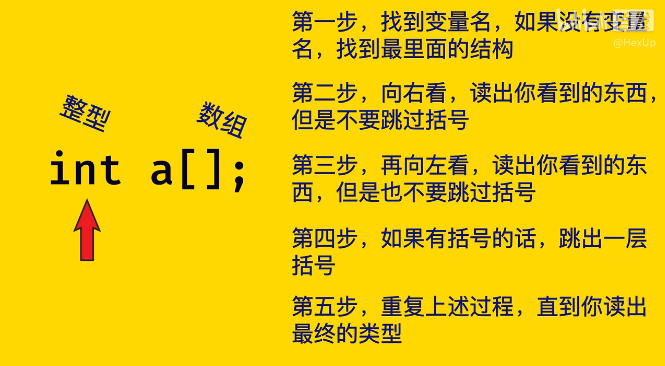
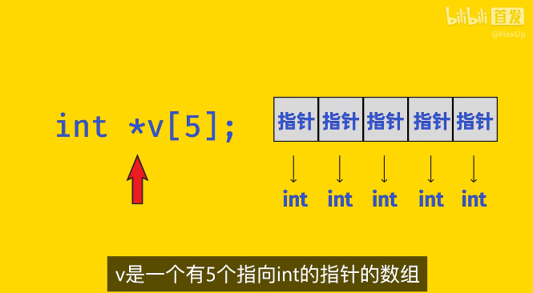
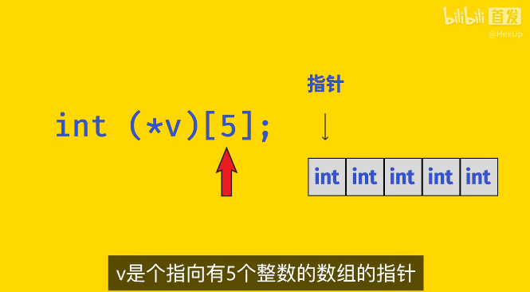
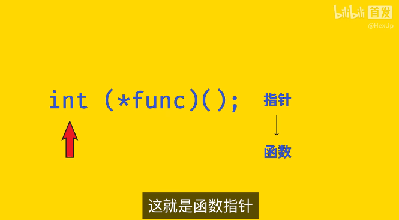
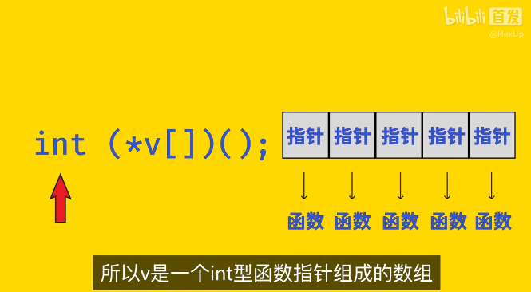
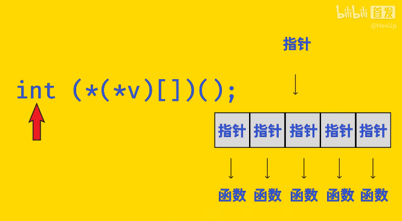

# C++学习

## 侯捷

- Header头文件的正规写法 **（防卫式声明）**
  - 告诉编译器，如果不曾定义过这个名词的话就把它定义出来，同一个程序第二次引入时因为已经定义过了所以就不会再定义一次。

  - 例如：complex.h

```cpp
//头文件正规写法

#ifndef _COMPLEX_
#define _COMPLEX_

...

#endif
```

- 构造函数

```cpp
class complex
{
public:
    complex (double r=0,double i=0)     //默认参数
                                        //构造函数
        : re (r),im (i)                 //初始列，在声明阶段初始化，相当于在函数体内赋值，但更快
    { }
private:
    double re, im;
}
```

---

## 复杂类型声明（指针数组等）













---

# 达内教育C++视频

## C++四种强制类型转换

```cpp
// 静态类型转换
static_cast<类型>(变量名); // 自定义类型的转换；隐式转换的逆转换，如把void*转为其他类型的指针
// 动态类型转换
dynamic_cast<类型>(变量名);// 用于多态特性父子类指针或引用之间的转换
// 常类型转换
const_cast<类型>(变量名); // 去除指针或引用的常属性
// 重解释类型转换
reinterpret_cast<类型>(变量名); // 用于任意类型指针或引用之间的转换; 指针和整形数之间的转换
```

## 函数重载原理

- C++编译器在编译函数时，会对函数进行换名，将参数类型信息整合到新的名字中，解决函数重载和名字冲突的矛盾


- 

## 缺省参数

- 可以为函数的全部参数<u>或部分</u>参数指定默认值（默认参数），调用该函数时如果未指定实参就取缺省值作为相应的实参
- 靠右原则，如果函数的某个参数具有缺省值，那么该参数右侧的所有参数都必须带缺省；
- 如果函数定义和声明分开，缺省参数要写在函数的声明位置，而**定义部分一定不能重复指定**；
- 掉函数的时候是根据函数的声明去进行规则检查，所以要在函数声明时指定默认形参；
- 声明函数时是可以不写形参变量名的

## 哑元

- 只有类型而没有变量名的参数称为“哑元”

  ```cpp
  void func(int/*哑元*/)
  ```

- 哑元对函数实现没有任何影响

- 哑元只是为了兼容旧代码，减少改动

  如果接口函数原来有两个参数，但升级后就剩一个参数了，为了减少代码改动量，仍保留函数的类型但没有变量名，这样就可以通过编译检查，这个类型参数对函数实现没有任何影响

- 操作符重载中区分前后`++`和前后`--`

## 内联函数

- 以空间换时间
- 简单的宏函数一般内联
- inline关键字仅表示人期望该函数进行**内联优化**，只是人对编译器的一个建议，但是否适合内联完全由编译器决定
- 有些函数（成员函数）没有加inline时也会被编译器内联优化，有些加了也会被编辑器忽略

## 动态内存管理

- 函数运行时产生的数据可以存在动态分配内存

- 链表等大小未知的数据结构适合存在空间较大的动态内存分配区

- malloc()函数的返回类型是`void*`,即可以指向任何数据类型的指针，所以还要强制转换下才能指向具体类型

  ```cpp
  int *pi=(int*)malloc(4);// c语言形式
  ```

- new()对比malloc()可以在分配内存的同时初始化，malloc()还得调用别的函数初始化

  ```cpp
  int *pi=new int(0);	// 动态分配后初始化为0
  int *parr= new int[5]{1,2,3,4,5};  // 动态分配数组并初始化
  ```

- 不能delete后再delete，可能会异常结束

- delete后一般再跟一句，让指针悬空，避免出现野指针

  ```cpp
  int* pi = new int;
  ...
  delete pi;	//	避免内存泄漏
  pi=NULL;	//	避免野指针
  ```


## 引用，左值，右值

- 左值：`lvalue`，可以放在赋值符号左边，可以被修改

- 右值：`rvalue`，只能放在赋值符号右边，不能被修改

- 普通引用也叫**左值引用**，即只能引用左值（这个值定义的时候是在=左边）

- 常引用既能引用左值也能引用右值

- 要引用右值必须使用`const`引用

- 函数的返回值在函数结束时就已经释放掉了，传给调用函数的值是个临时变量，**临时变量是右值**，所以你**不能用一个普通引用去接收一个函数的返回值**：
  ```cpp
  int& res = func();// error
  ```

- 要用引用接收一个函数的返回值，只能用常引用

  ```cpp
  const int& res = func(); // right
  ```

## 引用型函数形参作用

- 在函数中修改实参的值
- 提高传参效率
- **一般传递的是类类型的对象的时候开销较大，使用引用型参数，基本数据类型的画可以不用**

## const引用型函数形参作用

- 防止修改实参
- 也可以接收一个`const`型的实参，否则常属性的实参穿不进来，属于右值引用了

## 引用型函数返回值

- 函数返回值就是`return`后面数据的别名，避免了函数返回值的开销
- 函数中返回引用一定要保证在函数返回以后，改引用的目标依然有效
- **不能返回局部变量的引用**
- 可以返回全局变量、静态变量以及成员变量的引用
- 可以返回引用型参数的本身
- 可以返回调用对象自身的引用
- 可以返回堆中动态创建对象的引用

## 引用和指针

- 引用定义必须初始化，指针可以不初始化

- 引用初始化后不能再引用别的量，而指针可以重复利用

  ```cpp
  int& r = a;
  r = b;	// 这句的意思不是修改引用目标，即让r又引用b；这仅仅是个赋值操作，吧b赋值给r也就是赋值给a
  ```

- 可以定义指针的指针，不能定义引用的指针：引用本身就没有内存

- 二级指针

  ```cpp
  // 指针语法
  指向变量类型 * 指针变量名 = & 变量名;
  int *p = &a;
  int **pp = &p;//指向数据类型为指针的指针，也就是一个地址里面存的类型也是一个地址
  int* *pp = &p;// 可以看出指针指向的变量类型是指针
  ```

- 可以定义指针的引用，不能定义引用的引用

- 指针的引用：指针是可以有他的引用的

  ```cpp
  int*& rp = p;	// OK
  // 引用的基本语法
  类型 & 引用名 = 原变量名;
  ```

- 可以定义指针数组（数组内每个元素是指针），不能定义引用数组，但可以定义数组的引用

- 数组引用

  ```cpp
  int arr[3] = {1,2,3};
  // 数组指针
  int (*parr)[3] = arr; 
  // 数组引用
  int (&rarr)[3] = arr;
  ```

- 函数指针与函数引用：语法一致

  ```cpp
  void func(int a, int b){
      cout << a << b;
  }
  // 函数指针
  void (*pfunc)(int,int) = func;
  pfunc(10,20);
  // 函数引用
  void (&rfunc)(int,int) = func;
  rfunc(10,20);
  ```

## 类与对象

- 类中的数据和函数的前后顺序无所谓，类是一个整体
- protect是类的内部和子类中可以访问
- struct与class区别：struct默认访问属性是public，而class是private；
- 访问控制限定符（public、private）在类中可以出现多次；
- **封装，即通过类接口来访问和修改属性可以在接口函数内设定一些逻辑控制函数，对非法修改或操作加以限定，这样对类属性的修改更加合理安全！**
- 像这样对类中私有的不能直接访问的成员提供的公用的供外部调用的操作函数就叫做**接口**

## 构造函数

- 创建对象时被自动调用，没有显示调用

- 理解为建立一个对象要进行的一系列具体操作

- 只要创建对象一定调用构造函数，创建几个对象就调用几次，调用哪个由匹配参数情况决定

- 对象可以在**栈区**创建也可以在**堆区**创建，前者不用考虑销毁，后者才考虑销毁

- 在**栈区**创建对象数组并初始化

  ```cpp
  // 不初始化
  Student asrr[3];// 以默认方式构造三个Student对象，调用三次默认构造
  // 初始化方式
  Student sarr[3] = {			// 花括号
      Student("刘备",35,10012),// 构造
      Student("张飞",32,10011),
      Student("关羽",25,10010)}; // 注意分号
  // 访问
  sarr[0].name;
  ```

- **在栈区创建的对象和临时变量一样，离开主函数作用域后是自动释放的，所以在栈区创建对象的时候是不用关注销毁的**

- 在**堆区**创建对象：堆区创建的对象需要销毁，即`new`后要`delete`

  ```cpp
  // 创建单个
  Student* ps = new Student;	// 调用无参构造
  Student* ps1 = new Student("曹操",24,10086); 
  delete ps;	//一定要释放
  delete ps1;
  // 创建多个
  Student* parr = new Student[3];	// 调用无参构造
  Student* parr1 = new Student[3]{ // 有参
      Student("刘备",35,10012),
      Student("张飞",32,10011),
      Student("关羽",25,10010)}; // 注意分号
  // 访问 
  parr[0].who();	// (*(parr + 0)).who()
  // 销毁
  delete[] parr;
  delete[] parr1;
  ```

- 你不提供任何构造函数的额时候编译器才会帮你生成默认无参构造（也叫缺省构造），相反如果你定义了构造编译器就不会再生成缺省构造了

- **如果一个类定义了构造函数，无论是否有参数，编译器都不会再提供缺省构造函数**：

  要是你只定义了一个带参的构造函数，那么编译器就不再自动提供默认无参构造了，你不能再创建无参对象，只能提供你写的那个构造函数的方式创建对象

- **一个类中的数据成员即包含基本数据类型包含另一个类的对象**时的缺省构造：

  - 基本类型的成员变量不初始化
  - 类类型的成员变量（**成员子对象**）自动调用相应类的缺省构造来初始化

## 类型转换构造函数

- 给类对象赋值，赋值号右边的类型与类类型不一致时，编译器会吧该类型**隐式转换**为类类型生成一个临时变量，再把类类型的临时变量赋值给类对象，这期间调用了一次**类型转换构造函数** ；这样的隐式转换可读性不好，最好使用显式转换

  ```cpp
  Integer i;
  i = 100;	// 先把int 100隐式转换为Integer类型，生成的临时对象再赋值给i
  i = Integer(100);	// 显示转换，也是构造了一个临时对象
  ```

- **explicit 关键字**

- 在转换构造函数名前加一个关键字`explict` ，这样就不能通过隐式转换来狗仔临时对象了，必须进行显示转换

## 拷贝构造函数

- 拷贝构造函数的参数类型必须是==常引用==

  **引用**是必须的，如果你不采用引用传值，那从实参到形参就得有个拷贝操作，这个操作还是应该由拷贝构造完成的，没有怎么构造？

  **常**不仅是为了不改变原对象，最主要的是可以传**常对象**

- 拷贝赋值和拷贝构造的作用是完全一样的，不用定义`=`操作符

  ```cpp
  A a1(100);
  A a2(a1);
  A a2 = a1;	// 与上面完全一样，即使没有定义=操作符
  ```

- **没有定义拷贝构造，那编译器就会自己提供一个拷贝构造**

  - 对基本类型成员变量按字节复制
  - 对类类型成员变量（**成员子对象**）调用相应类型的拷贝构造函数

- **拷贝构造函数何时调用：**

  - 最基本的，用已定义对象新创建一个对象时；

  - 以对象的形式向函数传递参数时；

  - 从函数中返回对象时（这种实际中被编译优化了）

- 拷贝构造过程风险高且效率低，设计时应尽可能避免

  - 避免或建设对象的拷贝

  - 传递对象形式的参数时，使用引用型参数

  - 从函数返回对象时，使用引用函数返回值


## 多文件编程


- 要求在`.cpp`文件写函数定义时，在函数名前加**类名作用域限定符**`类名::`

- 编译连接多个`.cpp`文件：

  ```bash
  g++ *.cpp
  ```

## 初始化表

- 在构造函数体里面对成员变量初始化是先把成员变量定义出来，再赋初值

- 初始化表是定义成员变量的同时初始化，效率更高

- 必须使用初始化表的情景

  - 如果有类类型的成员变量（成员子对象），该类没有无参构造函数，则必须通过初始化列显示指明初始化方式

    ```cpp
    class B {
    public:
        // 成员子对象m_a没有无参构造函数，这使得不能使用无参构造来构造B类对象
        // 解决方法：显示指明成员子对象m_a的初始化方式
        // 注意m_a的初始化也不能放在花括号里，因为m_a对象是先构造的，必须得在B构造函数的外面构造好
        B(void):m_a(0){}
        A m_a;
    };
    ```

  - `const`型成员变量必须要在初始化表中初始化，因为`const`型数据必须在定义时就初始化

  - `引用`型成员变量必须要在初始化表中初始化

    ```cpp
    int i = 200;        // 准备的一个全局变量
    class A{
    public:
        A(void):m_c(100)，m_r(i){}
        const int m_c;	// const型成员变量
        int& m_r;		// 引用型成员变量
    };
    ```

- 类中成员变量按**变量声明顺序**依次初始化，而与初始化表中的顺序无关
- 不要用一个成员去初始化另一个成员，因为前一个成员有可能还没确定
- **`NULL`只能代表空指针，不能代表空字符串，空字符串要用`""`表示**

## this指针

- 本质是**类当中成员函数的一个隐藏参数**，也就是说调成员函数时会传给成员函数一个调用对象的指针

  ```cpp
  class User{
  public:
      User(){}
      void print(){
          cout << m_name << ',' << m_age  << endl;
      }
      /*编译之后*/
      void print(User* this){
          cout << this->m_name << ',' << this->m_age  << endl;
      }
  private:
      string m_name;
      int m_age;
  }
  int main{
      User u1;
      User u2;
      u1.print();
      /*编译之后*/
      User::print(&u1)
      u2.print();
      /*编译之后*/
      User::print(&u2)
  }
  ```

  

- 在成员函数里面访问其他成员的本质都是通过`this指针`实现的

- 对于成员函数可以认为`this指针`就指向该函数的调用对象；对于构造函数来说，指向的是正在创造的对象的地址

- this指针在编译后编译器会自动加在成员变量前，但是也可以人为显示的添加，（加也行不加也行）大多数情况下并不需要显式的使用this指针

- 必须显式使用this指针的场景

  - 通过this区分类中的成员变量和函数形参变量

  - 从成员函数中返回调用对象自身（返回自引用）**返回自引用时必须返回引用！**

    ```cpp
    return *this; // this是指针，*this就是对象了
    ```

## 常成员函数

- 在成员函数的形参表之后，函数体之前加上`const`关键字

- const实质是修饰该成员函数的形参`this指针`，即该函数的形参`this指针`是个常指针，所以不能在常函数中修改成员变量

  ```cpp
  class A{
  public:
      void print()const{}		    // 编译前
      void print(const A* this){}	// 编译后
  }
  ```

- 对于只对对象进行读取不做改变的成员函数都应加上`const`修饰，保证程序的健壮性

- `mutable` 与 `const` 是一对矛盾，如果非得让const函数修改对象的某个成员变量，那可以给该变量加个`mutable`修饰

  ```cpp
  mutable int m_data;
  ```

  

- 被`mutable` 修饰的变量可以在常函数中修改

- 被const关键字修饰的对象、对象的指针、对象的引用为常对象，

- **常对象只能调常函数**，不能调非常函数

- 非常函数既能掉非常函数，也可以调常函数，调常函数时有一个非常到常的转换，这种转换是种缩小权限的转换，可被编译器接受；但是从常到非常的转换就属于扩大权限了，是比较危险的

- 函数的常版本和非常版本理应构成重载

  - 常对象只能选择常版本
  - 非常对象优先选择非常版本

- 在常函数内部调用非常函数也是不可以的

## 析构函数

- 主要负责清理对象生命周期的动态资源
- 对象销毁时析构函数也会自动调用
  - 栈对象：离开作用域时（**作用域终止花括号`'}'`**）析构函数自动被调用
  - 堆对象：执行`delete操作`时析构函数自动被调用,，执行delete不仅释放掉了对象指针而且自动调用了对象的析构函数
- 通常情况下，若对象在生命周期的最后时刻并不持有任何动态分配的资源，也可以不定义析构函数

## 对象创建和销毁的过程

- 创建
  - 分配内存
  - 构造成员子对象（按声明顺序）
  - 执行构造函数代码
- 销毁
  - 执行析构函数代码
  - 析构成员子对象（按声明逆序）
  - 释放内存

## 深拷贝与浅拷贝

场景：类当中封装了**指针类型的成员变量**

- 浅拷贝

  复制了指针而**不复制指针所指向的内容**，即肤浅的拷贝

  默认拷贝构造和拷贝赋值均为浅拷贝

  导致不同对象之间数据共用，以及double free现象

  

- 深拷贝

  针对指针形式的成员变量，实现对指针指向内容的拷贝，即深拷贝

  必须自己定义

  

  ```cpp
  // 自定义深拷贝
  Integer(const Integer& that){
      cout << "自定义深拷贝" << endl;
      m_pi = new int;		// 先分配一块内存
      *m_pi = *that.m_pi;  // 再赋值
  }
  ```

- 总结：
  - 避免使用指针型成员变量
  - 尽量通过指针或引用向函数传参，减少拷贝构造的机会

## 拷贝构造与拷贝赋值

```cpp
// 拷贝构造
String s1 = "hello";
String s2 = s1; // 这是拷贝构造！！！
String s3(s1);	// 这也是拷贝构造

// 拷贝赋值
s2 = s3;		// 这才是拷贝赋值
```

## 静态成员

- 类的对象内存上独立存在互不共享，但有时需要某个成员可以为所以对象共有，内存唯一，以实现**对象之间内存共享**
- **全局变量**就可实现数据共享，但随处可访问便随处可修改，不安全
- 静态成员就是**被局限在类中使用的全局资源**，实现类多有对象的数据共享
- 静态成员就像C语言中的**全局变量**，静态函数就是**全局函数**
- **静态成员变量不属于对象**


- 普通成员变量在构造函数中完成定义和初始化，静态成员变量需要**在类的外部单独定义和初始化**

  ```cpp
  // 类外定义和初始化静态成员变量
  class A{
  pubic:
      int m_data;
      static int s_data;//这仅是声明
  }
  int A::s_data = 20;// 定义并初始化
  ```

  

- 静态成员变量存储在**全局区**，可以理解为被限制在类中使用的全局变量

- 静态成员变量受到**类的访问控制限定符**的约束

**静态成员函数**

- 静态成员函数**没有this指针参数**，因此也**不可能加const属性**，理解为被限制在类中使用的全局函数
- 静态成员函数**只能访问静态成员**，这也是因为它没有this指针参数，你访问哪个对象的成员呢？


---

- ；typedef：取别名
  ```cpp
  int Typename;
  typedef int Typename; Typename=int
  ```
  
- <*.h>表示优先中系统目录中查找 该头文件  比如`#include <stdio.h> ` 这是系统中的
- "*.h"表示优先从当前目录中查找  该头文件  比如`#include "head.h"  ` 这是你自己写的

- 文件布置
  在 OpenFOAM 中，所有代码都以注释段开头，使用有限体积的 CFD 类型文件都包括以下头文件:

 `#include "fvCFD.H"` 在此头文件种，仅包含类或函数的定义，函数的内容会在运行时以动态形式调用。

当 fvCFD.H 文件被引用后，在对应的编译设置文件 Make/options 中还需要添加如下命令

```
EXE_INC = \ 
			-I${LIB_SRC}/finiteVolume/lnInclude

EXE_LIBS = \
			-lfiniteVolume
```
这两句话指定了在编译时寻找头文件的位置和需要链接的函数库。

在 fvCFD.H 中，为了避免被多次引用，定义了如下宏变量
```
# ifndef fvCFD_H
# define fvCFD_H
<code>
#endif
```
当头文件已经引用过后，ifndef 判断返回 0，此时文件内直到 #endif 命令之间内容全部不会被再次引用。

在 fvCFD.H 中之后包含了一系列头文件，并以如下内容结束
```
#ifndef namespaceFoam
#define namespaceFoam
    using namespace Foam;
#endif
```
此代码定义了命令空间 Foam，在包含的库中所有的函数声明都属于命令空间 Foam，因此在调用库函数时必须使用。

在 c++ 代码中，必须包含 main 函数的实例，并且程序执行时是从此函数开始。在 c++ 的 main 函数中，使用以下参数并返回一个整数

```cpp
int main(int argc, char *argv[])
```


---
OpenFOAM c++ 编程基础
===
- 操作符
对于输入和输出可以使用标准库 iostream

```cpp
cout << "Please type an integer!" << endl;
cin >> myInteger;
```

其中操作符 << 和 >> 为输出和输入操作符，endl 为换行操作符。在 OpenFOAM 中推荐使用新的输出流 info，其优点是可以在并行计算情况中使用。

变量可以相加减，相乘除，并且当自定义类型指定了转化方法时还可以转化为其他类型的变量。在 OpenFOAM 中一些变量还可以使用算术运算符，但并非所有都可以。

c++ 中一些运算符包括 +、-、*、/ 等，以及其他标准运算符，例如 %、++、--、+=、-=、/=、%=等，用户自定义类型应自己定义这些运算符计算过程。

标准数学函数定义在标准库 cmath 中，因此并不是 c++ 的一部分，例如三角函数，指数函数和对数函数等。

- 分支
判断语句形式为： if (variable1 > variable2) {...CODE...} else {...CODE...}。
比较操作符包括：<、>、<=、>=、==、!=。
循环语句形式为：for (int; condition; change) {...CODE...}。

- 函数
在 c++ 中，函数可能有或者没有返回值，对于没有参数或返回值的函数，对应位置用 void 指定。在 c++ 中允许多个函数为同一函数名，只要其参数的个数或类型不同就不会在编译时报错。

变量域由花括号指定 {}，**一个在花括号内定义的变量，仅在此区域内可见**。可能有多个变量为同一个名字，但是在每个域内仅代表唯一的一个变量。**为了使用全局变量，可以用 :: 操作符指明变量所在的域。**

函数的调用前必须进行声明，函数的声明一般放在头文件内，如 #include "file.h" 或 #include <standardfile>。在编程时，将函数的声明和定义放在不同的文件中是一种良好的习惯，在 OpenFOAM 中也是采用这种方式。

如果**函数中某个参数需要改变变量值，那么参数的类型必须是引用**，例如

vodi change(double& x1)
**此时对应的变量 x1 将为参数的引用，而非函数内的局部变量**。在 c++ 内对函数进行调用时，需要对输入参数进行复制，**引用也可以避免对内存占用较多的变量进行复制**。**为了避免对输入参数进行错误的修改，也可以定义输入参数的类型为常量型引用**，即

- >void changeWord(const string& s)  
  

定义函数时可以给定参数的默认值，在函数调用时可以减少此参数的值。

- 类型
在 c++ 中变量可以包含不同的类型，在定义时可以用 int myInteger，或用 `const int myConstantInteger = 10 `来定义常数。在 c++ 中也可以自定义类型，并且在 OpenFOAM 中包含了多种自定义类型。

- 指针是指向内存空间的变量，指针变量可以从变量的定义看出

int *pint;
double *pdouble;
char *pchar;
可以用 typedef 来定义新的变量类型

typedef vector<int> integerVector;
integerVector iV;
这种方法可以简化大型程序，例如 OpenFOAM 代码的复杂度，使得代码易读性更好。

- 命名空间
当不同编程人员使用 c++ 写程序时可能会有命名重复的风险。
通过将声明的区域增加命名空间可以有效控制声明的变量是否可见，例如 OpenFOAM 中常用的

- using namespace Foam;
可以使所有定义在命名空间 Foam 内的声明可见。
定义命名空间的形式为

namespace name {
	// declarations
}
此时，新的定义就加入到了命名空间内，并且在此作用域内可以使用命名空间定义的其他代码。

- 面向对象
面向对象的思想是将关注点放在对象而非函数上。对象是类的实例，对于属于同一类的对象包含有相同的属性。面向对象的优势在于增加了代码的复用性，每个类可以为不同的目标进行设计和编写。在 c++中，类与变量类型是同一个概念，所以类也可以看做是一种新的变量类型。

- 对象声明
下面代码定义了 name 类及其公有或私有的方法和数据
```
class name{
public:
	// public member functions and data members
private:
	// hidden member functions and data members
}
```
- 类的公有属性（方法和数据）在类外部是可见的，而私有属性则不可见。
对于没有指定 public 或 private 的属性，其**默认是 private**。
类中方法和数据的声明与普通函数与变量相同。

- 类的使用
  定义类的对象方法为

  ```cpp
  name nameObject;
  ```

  一个类可以有多个对象，并且每个对象包含的属性都是相互独立的。可以声明对象的指针或引用，但是其调用类包含的方法时需要用 -> 符号，例如

>p1 = &nameObject; // reference
>p2 = new name;    // pointer
p1->write();
p2->write();

类中方法的定义可以在类的定义里，也可以在其外部。

>inline void name::write()
{
	// Contents of the member function.
}

例如上述代码定义了 name 类中的 write() 方法。在函数定义时，name:: 指出了方法 write 属于 name 类，而 **inline 关键字则指出方法会在调用处进行展开，而非像普通函数那样在内存空间中跳转。**对于直接定义在类中的方法，会自动使用 inline 关键字进行展开。

**在类的方法中可以自由方法类的所有数据和方法，而不受任何限制。**

和普通函数一样，类的声明和定义也应该分开，放在不同的文件内。在 OpenFOAM 中，大部分类都是使用此种模式。对于 inline 类型函数，需要将函数的定义放在对应的头文件内。

- 构造函数
  构造函数是类的对象在调用时使用的特定的初始化函数。当没有使用特定的构造函数时，即使用 null 构造函数，对象的所有属性都是未定义的。
  在初始化时，根据给定的参数不同调用对应的构造函数。下面给出了 Vector 类的构造函数的几个示例

  ```cpp
  // Constructors
  // Construct null
  inline Vector();
  // Construct given VectorSpace
  inline Vector(const VectorSpace<Vector<Cmpt>, Cmpt, 3>&);
  // Construct given three components
  inline Vector(const Cmpt& vx, const Cmpt& vy, const Cmpt& vz);
  // Construct from Istream
  inline Vector(Istream&;)
  ```

- 析构函数
当对内存空间申请后，在类的析构函数中必须对内存进行释放。为保证所有内容都得到释放，最好显式的对析构函数进行定义。
在析构函数中不需要任何参数，并且函数名与类名相同，但是函数名前增加了 ~ 符号。
定义的对象在离开作用域时应该释放其空间，特别是使用 new 关键字申请对象应手动使用 delete 进行删除。

- 常数成员函数
常数关键字 constant 可以用于修饰成员函数。**对于常数类型成员函数，其含义是函数内对象不会进行修改**。常数的成员函数定义方法为在参数后添加 const 修饰符，例如

> template <class Cmpt>
inline const Cmpt& Vector<Cmpt>::x() const
{
	return this->v_[X];
}

- 友元
**友元 friend 代表一个函数或类可以访问某个类的私有属性**。一个类可以声明哪些类型为自己的友元，但是无法声明自己为哪些类型的友元。

- 操作符
操作符定义了如何对特定的类型进行操作。标准操作符包括以下几种

**操作符应当被定义为成员函数或友元函数**，函数名为 operatorX，其中 X 用对应的操作符号代替。

在 OpenFOAM 中为所有的类型都定义了对应的操作符，包括 iostream 符 << 和 >>。

- 静态成员
**静态成员在类之中具有单独的实例，即所有对象中都一样**。静态成员使用关键字 static，可以应用在数据成员或成员函数中。由于**静态成员不属于任何一个特定的对象，因此调用时必须用类名进行调用**，如

```cpp
className::staticFunction(parameters);
```

- 继承
一个类可以继承另一个已有类的属性，并扩展包含其他属性。继承的定义方法为

```cpp
class newClass : public oldClass { ...members... }
```

在 OpenFOAM 中，类的继承形式为

```cpp 
template <class Cmpt>
class Vector
:
	public VectorSpace<Vector<Cmpt>, Cmpt, 3>
```

这里，Vector 是 VectorSpace 的一个子类。

子类的名字可以与父类相同，此时父类中所有同名成员会被隐藏，即使父类与子类成员函数的变量个数不同。

隐藏的父类成员可以通过 oldClass::member 方式访问。在类中的定义的不同访问属性中，private 成员无法在子类中访问，而 public 和 protected 属性成员可以。子类可以有多个父类，从而合并各个类的特性。

- **==虚函数==**
虚成员函数**主要用于动态绑定，即根据运行时调用的方式来确定具体函数**。
虚函数使用 virtual 关键字，**通过使用指针指向父类的对象来实现动态绑定** ，指针可以指向任何子类，即令`p = new subClass (...parameters...)`，从而使用 p->memberFunction 来调用具体函数。

具有至少一个虚函数的类为虚类，虚类无法实例化对象，主要作用是规定子类的定义方式。

- 模板
大部分类的定义都是针对特性数据类型，但是有些操作是与数据类型无关的，此时与其将相同的算法针对不同的类型定义许多遍，更常用的方法是定义模板使之适用于任意类型。
模板类在定义时在类前添加如下代码

```cpp
template<class T>
```

其中 T 是一般参数，代表任意类型，关键字 class 定义了 T 为类型变量。一般参数随后在类的定义中使用指定的类型进行定义，**模板类在构造对象时的形式**为

```cpp
templateClass<type> templateClassObject;
```

OpenFOAM 广泛使用模板，为了使代码易读性更好，通常将模板类名字用 typedef 重新定义，例如

```cpp
typedef List<vector> vectorList;
```

上面代码将 vectorList 定义为 vector 数据类型的模板 List 类的别名。

