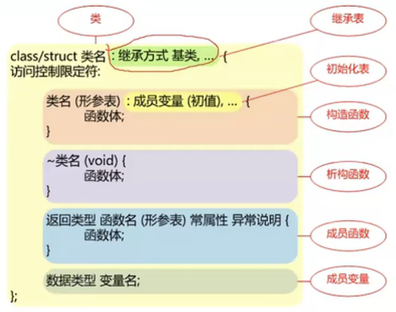
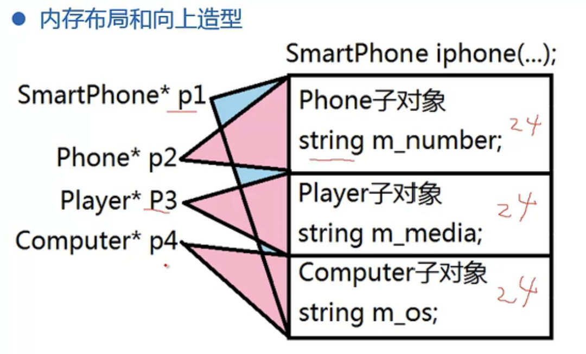

# C++学习

## 侯捷

- Header头文件的正规写法 **（防卫式声明）**
  - 告诉编译器，如果不曾定义过这个名词的话就把它定义出来，同一个程序第二次引入时因为已经定义过了所以就不会再定义一次。

  - 例如：complex.h

```c
//头文件正规写法

#ifndef _COMPLEX_
#define _COMPLEX_

...

#endif
```

- 构造函数

```cpp
class complex
{
public:
    complex (double r=0,double i=0)     //默认参数
                                        //构造函数
        : re (r),im (i)                 //初始列，在声明阶段初始化，相当于在函数体内赋值，但更快
    { }
private:
    double re, im;
}
```

---

## 复杂类型声明（指针数组等）

|  |  |
| ------------------------------------------------------------ | ------------------------------------------------------------ |
|  |  |
|  |  |
|  |                                                              |

> **总结：**数组的指针和函数的指针都是带括号的！

`int (*v)[5]` 这个声明表示 `v` 是一个指针，指向一个包含5个整数的一维数组，这种声明通常用于处理**二维数组**的某一行。例如，如果你有一个二维数组 `arr`，你可以使用这个指针来指向其中的一行：

```cpp
int arr[3][5]; // 一个3行5列的二维数组
int (*v)[5];   // 一个指向包含5个整数的一维数组的指针

v = arr; // 将指针指向二维数组的第一行

// 现在，你可以通过指针 v 来访问第一行的元素
int element = v[1][2]; // 访问第二行的第三个元素
element=(*(v+1))[2];		// 和上面一行等效,注意括号
```

【解释】：

1. `v[1][2]` 的解释：
   - `v[1]` 表示访问 `v` 所指向的二维数组的第二行。
   - 然后，`[2]` 表示访问这一行的第三个元素。
2. `(*(v+1))[2]` 的解释：
   - `(v+1)` 移动指针 `v` 到下一行，也就是第二行。
   - `*(v+1)` 表示解引用指针 `(v+1)`，也就是得到了第二行的一维数组，即 `arr[1]`。这仍然是一个指向一维数组的指针。
   - 然后，`[2]` 表示访问这一行的第三个元素。

但是处理一维数组时有区别：

```cpp
int arr1[3] = {1, 2, 3};
int (*p1)[3];
p1 = arr1;	// 错误
p1 = &arr1; // 正确,使用 & 取得数组的地址并赋给指针

// 注意：访问方式
cout << p1[0] << endl;     // 错误，解引用一次，输出的是赋值
cout << (*p1)[0] << endl;	// 正确
cout << p1[0][0] << endl;	// 正确
```

【解释】：

1. 实际上 `arr1` 和 `&arr1` 拿到的地址值是一样的，但是含义不同。
2. 一般情况下数组名 `arr1` 是可以隐式转换为指针的，只是转换后的类型是 `int *` ，也就是一般的指针类型，这种指针进行加一操作后只向后移动一个 `int` 的长度。
3. 但是我们定义的指针 `p1` 是 `int (*)[3]` 类型，也就是说，指针 `p1` 进行加一操作后将向后移动**3**个 `int` 的长度，也就是移向数组的第二行，二者含义显然不同
4. 因此，应该明确强制取一维数组 `arr1` 的地址将其赋值给指针 `p1` ，才可以达到使用数组指针来操作二维数组的目的。
5. 注意，`p1` 定义的时候既出现了 `*` 又出现了 `[]` ，这说明 `p1` 是一个二重指针，所以要访问元素值就要做两次解引用。

> 为什么二维数组名不用取地址也可以赋值给数组指针？
>
> 因为将二维数组名作为指针加一后，含义本身就是访问下一整行，和数组指针含义一致。
>
> 官方解释：二维数组名隐式转换为指向第一行的指针！

> **注意：**二维数组名即二重指针解引用一次（一个`*`号）任然是个指针！此时要访问元素值，要么再使用一个`*`号解引用一次，要么使用 `[]` 来访问。

一些例子：

```cpp
int arr[2][3] = { 1, 2, 3, 4, 5, 6 };
int(*p)[3];
p = arr;

// 解引用两次才能拿到值，解引用一次拿到的只是地址，* 和 [] 符号都代表解引用
cout << (*(p + 1))[0] << endl;  // 解引用(p+1)得到第二行的指针，[]符再次解引用拿到第二行的第一个值，即4
cout << (*p + 1)[1] << endl;   // 解引用p得到第一行的指针，+1将指针向后移动一位，指向2，[]符号再次解引用拿到当前位置再往后的值，即3
cout << *(*p + 1) << endl;	// 解引用p得到第一行的指针，+1将指针向后移动一位，指向2，*再解引用一次，拿到当前位置的值即2
```

> **注意：**不管定义指向二维数组还是一维数组的指针，都只能使用 `int (*v)[5]` 这种数组指针的形式，`int **` 是不可以的，它表示一个指向指针数组的指针。

## `protected`和`private`

- `private` 访问权限限制最严格，只有在类内部可以访问，类的外部和子类都无法访问；
- `protected` 访问权限限制次之，类内部和子类可以访问，类的外部无法访问，他就是专门用来给子类访问的。

## const与指针

```cpp
// 常量(的)指针
const char *p;	// const修饰的是char，就是说：p所指向的内存地址所对应的值是const，因此不可修改；但指针所指向的内存地址是可以修改的

// 指针常量
char *const p;	// const修饰的是指针p，也就是说：指针p所指向的内存地址是const，不可修改;但p所指向内存地址所对应的值是可以修改的
```

- `char const *p` 与`const char *p`效果相同

- 主要看的就是const所处的位置：

  > 1) const 在`*`前：表示const修饰的是所申明的类型。常量指针
  >
  > 2) const 在`*`后：表示const修饰的是指针。指针常量
  >
  > 3) `*`前后均有：表示const同时修饰类型和指针。指向常量的指针常量

- 加深记忆：

  > $*$（指针）和 const（常量） 谁在前先读谁 ；$*$象征着地址，const象征着内容；**谁在前面谁就不允许改变。**

- ```cpp
  int const *p1 = &b;//const 在前，定义为常量指针，p1指的内容不可变;*p1 = a是错误的,而p1 = &a是正确的。
  int *const p2 = &c;//*在前，定义为指针常量，p2不可指向别的量;p2= &a是错误的，而*p2 = a 是正确的。
  ```

- 指针在使用之前必须要初始化，否则会出现未定义的行为（Undefined Behavior）

  ```cpp
  int *p;
  *p = 9;
  // 可以编译通过，但运行时会出错
  ```

  当程序编译时，编译器不会检查指针是否被初始化，因为指针变量的值可以在运行时进行修改。因此，在编译期间无法检测到指针未被初始化的问题。这就意味着，如果指针未被正确初始化，程序可能在运行时产生难以预测的行为。

  为了避免这种情况，应该始终在定义指针变量时进行初始化，以确保它指向有效的内存地址。如果不确定指针应该指向哪里，可以将其初始化为空指针（`NULL` 或者 `nullptr`），这样在使用指针之前，就可以通过判断指针是否为空来确保它指向了有效的内存地址。

## 一些重要结论

- 只能在循环体内和`switch`语句体内使用`break`语句。 
- 当创建对象数组时，每个数组元素都会自动进行初始化，都会调用对象的构造函数。

- 类的成员变量不能在定义时初始化，只能通过构造函数实现，所以在一个类定义时出现`int val=1;`这样的成员一定是错的。

- 类的友元函数可以访问类的所有成员！！！

- 类中定义的常数据成员只能通过类构造函数的初始化列来初始化，不能在类中就初始化

- 关于类成员初始化顺序：

  - 按类中成员变量的声明顺序初始化
  - 但是有成员子对象时，一定是先初始化成员对象而不是基本类型的变量！

  ```cpp
  class C{
  public:
      int val;
      A aObj;
      B bObj;
      ...
      C():...{}	// 此构造函数先初始化的不是 val ，而是A对象aObj
  };
  ```

- 可以`void *`，但是不能`void &`，即不能用`NULL`引用，但可以有`NULL`指针

- 纯虚函数没有函数体，因为纯虚函数的作用就是用来当不能为虚函数提供一个有意义的实现时，让类直接作为抽象类。

- 子类必须实现基类中的纯虚函数，否则该子类也是抽象类，无法实例化。

- 基类对象可以被派生类对象的引用或指针所引用，但不能直接赋值给派生类对象。基类对象和派生类对象在内存中的结构不同，赋值会出现类型不匹配的问题。若需要将基类对象赋值给派生类对象，需要进行显式类型转换。

- 编译器禁止声明和定义时同时定义默认参数值，一般是只在函数声明时定义默认参数，而在函数定义时坚决不再定义，否则就是重定义，例如：

  ```cpp
  void foo(int x = 0, int y = 1);//声明时定义默认参数
  
  // 函数定义
  void foo(int x = 2, int y )//err 定义时坚决不再定义默认参数
  {
      std::cout << "x = " << x << ", y = " << y << std::endl;
  }
  ```

  

- 默认构造函数就是无参构造函数，用来建立不初始化的对象：

  ```
  AA a;// 调用无参构造（默认构造）
  AA a(3); // 调用带参构造
  ```

  > 需要注意的是如果你自己定义了一个带参构造,那编译器就不会自动生成默认(无参)构造了,这个时候你就不能使用`AA a;`这样的语句来建立对象了。要使用`AA a;`这样的语句，你就得自己定义下无参构造函数。总结下就是最好自己定义。

- **虚函数不得是静态成员函数**

- 在 C++ 中，**不允许为重载运算符提供默认参数**，默认参数只能用于普通函数。

- **==不能将字符串常量赋值给一个字符数组==**，必须使用字符串拷贝函数`strcpy()`,这是因为**C语言不能对数组整体赋值！**

  ```cpp
  char a[] = "Hello, world!";//这不是赋值，是定义数组a的时候直接初始化，这种是可以的
  char a[3][4];a[0]="AAA"; // err
  // 要将字符串"AAA"赋值给字符数组a[0]，必须使用字符串拷贝函数strcpy()
  strcpy(a[0], "AAA");
  ```

- 关于释放内存和删除指针

  **堆区指针：**在 C++ 中，删除指针的本质是将该指针所指向的内存区域的空间释放掉，以便将该空间交还给操作系统或堆内存管理器。所以说删除指针包含释放内存。删除指针并不会“删除”它所指向的内存，而是告诉操作系统可以将该内存重新分配给其他程序或操作系统使用。具体来说，删除指针可以分为以下两个步骤：

  1. 释放指针所指向的内存区域的空间。这个过程由 `delete` 运算符完成，`delete `运算符会根据指针所指向的内存空间的大小，从堆内存中释放相应大小的空间。也就是说 `delete` 运算符是来释放内存的，而不是字面意思删除了一个指针。

  2. 让指针指向空值。一旦内存空间释放掉，指针就不再有效，为了避免产生悬挂指针，应该把指针设为 `null `或` nullptr`，以便之后检测该指针是否被有效赋值过。

     一个删除堆区指针的完整过程

     ```cpp
     int* ptr = new int; // 使用 new 运算符分配一个 int 类型的对象
     // 执行一些操作，最终需要释放该对象的内存
     delete ptr; // 使用 delete 运算符释放分配的内存
     ptr = nullptr; // 必须！！！将指针设置为 nullptr，以防止被误用
     ```

     

     > 这里有两点需要注意：
     >
     > 1. 在释放指针所指向的内存后，应该将指针设置为 `nullptr` 或 `0`，这是为了保该指针不会被误用。如果没有将指针设置为 `nullptr` 或 `0`，该指针可能会继续指向已经释放的内存，导致未定义的行为，例如程序崩溃或数据损坏。
     >
     > 2. 另外还需要注意的是，在使用 `delete` 运算符释放指针所指向的内存之前，应该确保该内存中的数据确实已经不再需要使用了，并且没有其他指针指向该内存。否则，在释放内存后，其他指针可能还会继续访问这个已经释放的内存，导致未定义的行为。**悬挂指针**

  **栈区指针：**在 C++ 中，栈区的指针会在其所在的函数结束时自动被销毁，不需要手动删除。也就是不需要管

  **释放内存：**释放内存的本质是将先前动态分配的内存块返回给操作系统，以便该内存可以被其他程序或操作系统重新使用。

- **静态成员函数只可以直接访问类的静态成员，不能直接访问非静态成员！静态函数的作用就是为了处理静态数据成员的，所以不能访问非静态成员。**

- `char ` 和`char **` ：

  - `char **` 表示一个指向指针的指针，通常用于表示指向二维字符数组或字符串数组的指针。例如：

    ```cpp
    char *strings[] = {"apple", "banana", "orange"};
    char **pp = strings;
    ```

    在这个例子中，`strings` 是一个字符串数组，它的元素是指向各个字符串的指针。`pp` 是一个指向指针的指针，它指向 `strings` 数组的第一个元素，也就是一个指向字符串 "apple" 的指针。

  - `char*` 表示一个指向字符的指针，通常用于表示一个 C 风格的字符串。例如：

    ```cpp
    char *str = "hello world";
    ```

    在这个例子中，`str` 是一个指向字符串 "hello world" 的指针，它指向该字符串的第一个字符 `'h'`。

- 拷贝构造函数的参数类型必须是==引用==，而且得是==常引用==，如果值传递的话会无限递归调用拷贝构造，拷贝构造函数将无限调用自身。

- **`const`不可用于修饰非成员函数，只能用于成员函数，表示该成员函数不会修改调用该函数的对象。对于非成员函数，没有所属的对象，因此也就没有所谓的“修改对象”了。**

- **友元函数没有`this`指针**

- 不能重载的运算符：

  - 作用域运算符 `::`
  - 条件运算符 `?:`
  - 成员运算符 `.` 和 `->`
  - `sizeof` 运算符
  - `typeid` 运算符

- 只能重载为类成员函数的运算符：

  - `=` 运算符

  - 下标运算符`[]`

  - 调用运算符`()`

  - 成员访问运算符`->`

    > 这是因为这些运算符都是作用于类的对象上的，而只有类成员函数可以访问类的私有成员变量。

- 定义类时编译器自动生成的四个函数：

  - 默认无参构造函数`ClassName();`

  - 拷贝构造函数`ClassName(const ClassName& obj);`

  - 拷贝赋值运算符函数`ClassName& operator=(const ClassName& obj);`

  - 析构函数`~ClassName();`

- 在类的声明中，`静态数据成员`**不能**在类内初始化。应该在类外进行定义和初始化。

- **类定义只是一种类型声明，它并不是在内存中分配空间的操作。**

- 在C++中，如果你想使用一个变量，那么这个变量必须要被声明和定义。==**声明**只是告诉编译器这个变量的类型和名字，而**定义**则是为这个变量分配内存空间==。通过声明编译器知道该变量的类型和名字但不关心它存在哪，声明是为了在使用该变量时进行类型检查；而定义才是在开辟内存空间

- 类模板的成员函数都是模板函数

- 在函数声明中，`a[]`和`*a`是等价的，都表示指针类型的形参。而且可以感性地认为在使用时`a[n]`和`*(a+n)`也是一样的，都是取得指向的内容而不是指针。

  ```cpp
  void foo(int a[], int n);
  //可以等价地写为：
  void foo(int *a, int n);
  //在函数声明中，这两种形式的参数类型都表示一个指向整型数组的指针。在函数定义中，也可以使用这两种形式之一来声明函数参数。例如：
  
  void foo(int a[], int n)
  {
    // 函数体
  }
  
  // 或者
  
  void foo(int *a, int n)
  {
    // 函数体
  }
  
  //在函数调用时，实参也可以是指向整型数组的指针或整型数组本身，如下所示：
  
  
  int arr[10];
  foo(arr, 10);  // 传递整型数组
  foo(&arr[0], 10);  // 传递指向整型数组第一个元素的指针
  ```

- 类的成员函数可以直接访问该类的所有成员，包括私有成员。

- 常成员函数在**声明**和**定义**时都要加 `const` 关键字，以表示该函数不会修改成员变量的值。声明和定义都需要加 `const`，否则编译器会报错。

- C++ 规定了后缀`++`和`--`运算符必须有一个` int` 形参，来区别前缀和后缀形式的调用。即后缀`++`和`--`运算符函数需要使用一个额外的` int` 参数，而前缀`++`和`--`运算符没有额外参数。调用前缀运算符时相当于直接调用：`++obj`或`--obj`；调用后缀时相当于`obj++(0)`或`obj--(0)`,只不过这个参数不用我们输。

---

# 达内教育C++视频

## C++四种强制类型转换

```cpp
// 静态类型转换
static_cast<类型>(变量名); // 自定义类型的转换；隐式转换的逆转换，如把void*转为其他类型的指针
// 动态类型转换
dynamic_cast<类型>(变量名);// 用于多态特性父子类指针或引用之间的转换
// 常类型转换
const_cast<类型>(变量名); // 去除指针或引用的常属性
// 重解释类型转换
reinterpret_cast<类型>(变量名); // 用于任意类型指针或引用之间的转换; 指针和整形数之间的转换
```

## 函数重载原理

- C++编译器在编译函数时，会对函数进行换名，将参数类型信息整合到新的名字中，解决函数重载和名字冲突的矛盾


## 缺省参数

- 可以为函数的全部参数<u>或部分</u>参数指定默认值（默认参数），调用该函数时如果未指定实参就取缺省值作为相应的实参
- **靠右原则**，如果函数的某个参数具有缺省值，那么该参数右侧的所有参数都必须带缺省；
- 如果函数定义和声明分开，缺省参数要写在函数的声明位置，而**定义部分一定不能重复指定**；
- **调函数的时候是根据函数的声明去进行规则检查，所以要在函数声明时指定默认形参；**
- 声明函数时是可以不写形参变量名的

## 哑元

- 只有类型而没有变量名的参数称为“哑元”

  ```cpp
  void func(int/*哑元*/)
  ```

- 哑元对函数实现没有任何影响

- 哑元只是为了兼容旧代码，减少改动

  如果接口函数原来有两个参数，但升级后就剩一个参数了，为了减少代码改动量，仍保留函数的类型但没有变量名，这样就可以通过编译检查，这个类型参数对函数实现没有任何影响

- **操作符重载中区分前后`++`和前后`--`**

## 内联函数

- 以空间换时间
- 简单的宏函数一般内联，而且**内联函数就是用来替换C语言中的宏函数的**
- `inline` 关键字仅表示人期望该函数进行**内联优化**，只是人对编译器的一个建议，但是否适合内联完全由编译器决定
- 有些函数（**在类内部实现的成员函数**）没有加`inline`时也会被编译器内联优化，有些加了也会被编辑器忽略

## 动态内存管理

- 函数运行时产生的数据可以存在动态分配内存

- 链表等大小未知的数据结构适合存在空间较大的动态内存分配区

- `malloc()`函数的返回类型是`void*`,即可以指向任何数据类型的指针，所以还要强制转换下才能指向具体类型

  ```cpp
  int *pi=(int*)malloc(4);// c语言形式
  ```

- `new()`对比`malloc()`可以在分配内存的同时初始化，`malloc()`还得调用别的函数初始化

  ```cpp
  int *pi=new int(0);	// 动态分配后初始化为0
  int *parr= new int[5]{1,2,3,4,5};  // 动态分配数组并初始化
  ```

- `delete`后一般再跟一句，让指针悬空，避免出现野指针

  ```cpp
  int* pi = new int;
  ...
  delete pi;	//	避免内存泄漏
  pi=NULL;	//	避免野指针
  ```

- 不能`delete`后再`delete`，可能会异常结束

## 引用，左值，右值

- 左值：`lvalue`，可以放在赋值符号左边，可以被修改；左值指的是表达式所代表的内存位置，即可以取地址的表达式。比如，变量、数组、结构体、指针等都是左值。

- 右值：`rvalue`，不可以放在赋值符号左边，不能被修改；右值指的是表达式的值，即计算完成后的结果。右值不能取地址，因为它们没有对应的内存位置。常见的右值包括字面量、临时变量、函数返回值等

  ```cpp
  // 下面的x和y都是左值
  int x = 1;
  int y = x;
  
  // 下面的表达式中，1和x+y都是右值
  int x = 1, y = 2;
  int z = x + y; // x+y是右值
  
  int a = 5; // 正确，a 是左值
  5 = a; // 错误：5 是右值
  int b = a + 3; // (a + 3) 是右值
  ```

- 一般的引用就是**左值引用**，即一般的引用只能引用左值

- 常引用可以引用左值，也可以引用右值

- 所以要引用右值就必须要使用`const`引用

- 函数的返回值在函数结束时就已经释放掉了，传给调用函数的值是个临时变量，**临时变量是右值**，所以你**不能用一个普通引用去接收一个函数的返回值**：
  ```cpp
  int& res = func();// error
  ```

- 要用引用接收一个函数的返回值，只能用**常引用**

  ```cpp
  const int& res = func(); // right
  ```
  
- 函数既可以返回右值也可以返回左值。当函数返回一个`非引用类型`的值时，返回的是一个右值。而当函数返回一个`引用类型`时，返回的是一个左值。

  ```cpp
  #include <iostream>
  using namespace std;
  
  int& func(int& x) {// 返回引用类型
      return ++x;
  }
  
  int main() {
      int a = 10;
      func(a) = 20;
      cout << a << endl; // 输出 21
      return 0;
  }
  
  ```

  在这个例子中，`func`函数返回的是参数`x`的引用，因此返回的是一个左值。在`main`函数中，可以将`func(a)`看作一个左值，因此可以将其赋值为一个新的值。执行`func(a) = 20;`时，实际上是将`a`的值加1，再将其赋值为20，因此最终`a`的值为21。

## 引用型函数形参作用

```cpp
xxxx func(int& a, double& b);// 引用型形参
```

- 在函数中修改实参的值
- 提高传参效率
- **一般传递的是类类型的对象的时候开销较大，使用引用型参数，基本数据类型的话可以不用**

`const`引用型函数形参作用

- 防止修改实参
- 传递临时对象，即也可以接收一个`const`型的实参（例如函数返回值等临时对象），否则如果用一般引用的话常属性的实参穿不进来，属于右值引用了。在函数调用时，如果实参为临时对象，则可以使用常量引用类型的函数形参进行接收。

## 引用型函数返回值

```cpp
int& func(xxxx , xxxx);// 引用型函数返回值
```

```
int& func(int& a, int& b) {
    // 函数体
    return a; // 返回的是a的引用
}
```

- 函数返回值就是`return`后面变量的别名，避免了函数返回值的开销
- 函数中返回引用一定要保证在函数返回以后，改引用的目标依然有效（即被引用的不能是临时对象）
- **不能返回局部变量的引用**
- 可以返回`全局变量`、`静态变量`以及`成员变量`的引用
- 可以返回引用型参数的本身
- 可以返回调用对象自身的引用
- 可以返回堆中动态创建对象的引用

## 引用和指针

- 引用定义必须初始化，指针可以不初始化（但最好初始化，否则容易报未定义错误）

- **引用初始化后不能再引用别的量**，而指针可以重复利用

  ```cpp
  int& r = a;
  r = b;	// 这句的意思不是修改引用目标，即让r又引用b；这仅仅是个赋值操作，把b赋值给r也就是赋值给a
  ```

- 可以定义指针的指针，不能定义引用的指针：引用本身就没有内存

- 二级指针

  > 指针语法：指向变量类型 * 指针变量名 = & 变量名;

  ```cpp
  int *p = &a;
  int **pp = &p;//指向数据类型为指针的指针，也就是一个地址里面存的类型也是一个地址
  int* *pp = &p;// 可以看出指针指向的变量类型是指针
  ```

- 可以定义指针的引用，不能定义引用的引用（好像也可以）

- 指针的引用：指针是可以有他的引用的

  ```cpp
  int*& rp = p;	// OK
  // 引用的基本语法
  类型 & 引用名 = 原变量名;
  ```

- 可以定义指针数组（数组内每个元素是指针），不能定义引用数组，但可以定义数组的引用

- 数组引用

  ```cpp
  int arr[3] = {1,2,3};
  // 数组指针
  int (*parr)[3] = arr; 
  // 数组引用
  int (&rarr)[3] = arr;
  ```

- 函数指针与函数引用：语法一致

  ```cpp
  void func(int a, int b){
      cout << a << b;
  }
  // 函数指针
  void (*pfunc)(int,int) = func;
  pfunc(10,20);
  // 函数引用
  void (&rfunc)(int,int) = func;
  rfunc(10,20);
  ```

## 类与对象

- 类中的数据成员和函数成员的前后顺序无所谓，类是一个整体
- protect是类的内部和子类中可以访问
- struct与class区别：struct默认访问属性是public，而class是private；
- 访问控制限定符（public、private）在类中可以出现多次；
- **封装，即通过类接口来访问和修改属性可以在接口函数内设定一些逻辑控制函数，对非法修改或操作加以限定，这样对类属性的修改更加合理安全！**
- 像这样对类中私有的不能**直接访问**的成员提供的公用的供外部调用的操作函数就叫做**接口**

## 构造函数

- 创建对象时被自动调用，没有显式调用

- 可以理解为为建立一个对象要进行的一系列具体操作

- 只要创建对象一定调用构造函数，创建几个对象就调用几次，调用哪个构造函数由匹配参数情况决定

- 对象可以在**栈区**创建也可以在**堆区**创建，前者不用考虑销毁，后者才考虑销毁

- 在**栈区**创建对象数组并初始化

  ```cpp
  // 不初始化
  Student asrr[3];// 以默认方式构造三个Student对象，调用三次默认构造
  // 初始化方式
  Student sarr[3] = {			// 花括号
      Student("刘备",35,10012),// 构造
      Student("张飞",32,10011),
      Student("关羽",25,10010)}; // 注意分号
  // 访问
  sarr[0].name;
  ```

- **在栈区创建的对象和临时变量一样，离开主函数作用域后是自动释放的，所以在栈区创建对象的时候是不用关注销毁的**

- 在**堆区**创建对象：堆区创建的对象需要销毁，即`new`后要`delete`

  ```cpp
  // 创建单个
  Student* ps = new Student;	// 调用无参构造
  Student* ps1 = new Student("曹操",24,10086); // 申请空间并初始化
  delete ps;	//一定要释放
  delete ps1;
  // 创建多个
  Student* parr = new Student[3];	// 调用无参构造
  Student* parr1 = new Student[3]{ // 有参
      Student("刘备",35,10012),
      Student("张飞",32,10011),
      Student("关羽",25,10010)}; // 注意分号
  // 访问 
  parr[0].who();	// (*(parr + 0)).who()，注意下标运算符[]拿到的是对象,parr[0]表示对象数组的第一个对象，而不是指针！
  // 销毁
  delete[] parr;
  delete[] parr1;
  ```

- 你不提供任何构造函数的额时候编译器才会帮你生成默认无参构造（也叫**缺省构造**），相反如果你定义了构造编译器就不会再生成缺省构造了

- **如果一个类定义了构造函数，无论是否有参数，编译器都不会再提供缺省构造函数**：

  要是你只定义了一个带参的构造函数，那么编译器就不再自动提供默认无参构造了，你不能再创建无参对象，只能以你写的那个构造函数的方式创建对象

- 一个类中的数据成员既包含**基本数据类型**也包含**另一个类的对象**时的缺省构造：

  - 基本类型的成员变量不初始化
  - 类类型的成员变量（**成员子对象**）自动调用相应类的缺省构造来初始化

## 类型转换构造函数

- 给类对象赋值，赋值号右边的类型与类类型不一致时，编译器会把该类型**隐式转换**为类类型生成一个临时变量，再把类类型的临时变量赋值给类对象，这期间调用了一次**类型转换构造函数** ；这样的隐式转换可读性不好，最好使用显式转换

  ```cpp
  Integer i;
  i = 100;	// 先把int 100隐式转换为Integer类型，生成的临时对象再赋值给i
  i = Integer(100);	// 显示转换，也是构造了一个临时对象
  ```

- **explicit 关键字**

- 在转换构造函数名前加一个关键字`explict` ，这样就不能通过隐式转换来构建临时对象了，必须进行显示转换

## 拷贝构造函数

- 拷贝构造函数的参数类型必须是==常引用==

  ==**引用**==是必须的，如果你不采用引用传值，那从实参到形参就得有个拷贝操作，这个操作还是应该由拷贝构造完成的，没有怎么构造？

  ==**常**==不仅是为了不改变原对象，最主要的是可以传**常对象**

- 拷贝赋值和拷贝构造的作用是完全一样的，`=`操作符叫拷贝赋值运算符函数

  ```cpp
  A a1(100);
  A a2(a1);
  A a2 = a1;	// 把这种叫拷贝赋值；即使没有定义=操作符也没错，因为它调用的仍然是拷贝构造函数，
  
  a1 = a2; // 这种才调用拷贝赋值运算符函数，即A& operator=(const A& other);
  ```

- **没有定义拷贝构造，那编译器就会自己提供一个拷贝构造**

  - 对基本类型成员变量按字节复制
  - 对类类型成员变量（**成员子对象**）调用相应类型的拷贝构造函数

- **拷贝构造函数何时调用：**

  - 最基本的，用已定义对象新创建一个对象时；

  - 以对象的形式向函数传递参数时；

  - 从函数中返回对象时（这种实际中被编译优化了）

- 拷贝构造过程风险高且效率低，设计时应尽可能避免

  - 避免或建设对象的拷贝

  - 传递对象形式的参数时，使用引用型参数

  - 从函数返回对象时，使用引用函数返回值


## 多文件编程


- 要求在`.cpp`文件写函数定义时，在函数名前加**类名作用域限定符**`类名::`

- 编译连接多个`.cpp`文件：

  ```bash
  g++ *.cpp
  ```

## 初始化表

- 在构造函数体里面对成员变量初始化是先把成员变量定义出来，再赋初值

- 初始化表是定义成员变量的同时初始化，效率更高

- 必须使用初始化表的情景

  - 如果有类类型的成员变量（成员子对象），该类没有无参构造函数，则必须通过初始化列显式指明初始化方式

    ```cpp
    class B {
    public:
        // 成员子对象m_a没有无参构造函数，这使得不能使用无参构造来构造B类对象
        // 解决方法：显示指明成员子对象m_a的初始化方式
        // 注意m_a的初始化也不能放在花括号里，因为m_a对象是先构造的，必须得在B构造函数的外面构造好
        B(void):m_a(0){}
        A m_a;
    };
    ```

  - `const`型成员变量必须要在初始化表中初始化，因为`const`型数据必须在定义时就初始化

  - `引用`型成员变量必须要在初始化表中初始化

    ```cpp
    int i = 200;        // 准备的一个全局变量
    class A{
    public:
        A(void):m_c(100)，m_r(i){}
        const int m_c;	// const型成员变量
        int& m_r;		// 引用型成员变量
    };
    ```

- 类中成员变量按**变量声明顺序**依次初始化，而与初始化表中的顺序无关
- 不要用一个成员去初始化另一个成员，因为前一个成员有可能还没确定
- **`NULL`只能代表空指针，不能代表空字符串，空字符串要用`""`表示**

## this指针

- 本质是**类当中成员函数的一个隐藏参数**，也就是说调成员函数时会传给成员函数一个调用对象的指针

  ```cpp
  class User{
  public:
      User(){}
      void print(){
          cout << m_name << ',' << m_age  << endl;
      }
      /*编译之后*/
      void print(User* this){
          cout << this->m_name << ',' << this->m_age  << endl;
      }
  private:
      string m_name;
      int m_age;
  }
  int main{
      User u1;
      User u2;
      u1.print();
      /*编译之后*/
      User::print(&u1)
      u2.print();
      /*编译之后*/
      User::print(&u2)
  }
  ```

  

- 成员函数里面访问其他成员的本质都是通过`this指针`实现的

- 对于成员函数可以认为`this指针`就指向该函数的调用对象；对于构造函数来说，指向的是正在创造的对象的地址

- this指针在编译后编译器会自动加在成员变量前，但是也可以人为显示的添加，（加也行不加也行）大多数情况下并不需要显式的使用this指针

- 必须显式使用this指针的场景

  - 通过this区分类中的成员变量和函数形参变量（形参名和类成员变量名一样时）

  - 从成员函数中返回调用对象自身（返回自引用）**返回自引用时返回类型必须是引用！**

    ```cpp
    return *this; // this是指针，*this就是对象了
    ```

## 常成员函数

- 在成员函数的形参表之后，函数体之前加上`const`关键字

- const实质是修饰该成员函数的形参`this指针`，即该函数的形参`this指针`是个常指针，所以不能在常函数中修改成员变量

  ```cpp
  class A{
  public:
      void print()const{}		    // 编译前
      void print(const A* this){}	// 编译后
  }
  ```

- 对于只对对象进行读取不做改变的成员函数都应加上`const`修饰，保证程序的健壮性

- `mutable` 与 `const` 是一对矛盾，如果非得让const函数修改对象的某个成员变量，那可以给该变量加个`mutable`修饰

  ```cpp
  mutable int m_data;
  ```

  

- 被`mutable` 修饰的变量可以在常函数中修改

- 被const关键字修饰的对象、对象的指针、对象的引用都为常对象，

- **常对象只能调常函数**，不能调非常函数

- 非常对象既能掉非常函数，也可以调常函数，调常函数时有一个非常到常的转换，这种转换是种缩小权限的转换，可被编译器接受；但是从常到非常的转换就属于扩大权限了，是比较危险的

- 函数的常版本和非常版本理应构成重载

  - 常对象只能选择常版本
  - 非常对象优先选择非常版本

- 在常函数内部调用非常函数也是不可以的

## 析构函数

- 主要负责清理对象生命周期的动态资源
- 对象销毁时析构函数也会自动调用
  - 栈对象：离开作用域时（**作用域终止花括号`'}'`**）析构函数自动被调用
  - 堆对象：执行`delete操作`时析构函数自动被调用,，执行delete不仅释放掉了对象指针而且自动调用了对象的析构函数
- 通常情况下，若对象在生命周期的最后时刻并不持有任何动态分配的资源，也可以不定义析构函数

## 对象创建和销毁的过程

- 创建
  - 分配内存 `new`
  - 构造成员子对象（按类中声明顺序）
  - 执行构造函数代码
- 销毁
  - 执行析构函数代码
  - 析构成员子对象（按类中声明逆序）
  - 释放内存 `delete`

## 深拷贝与浅拷贝

场景：类当中封装了**指针类型的成员变量**

- 浅拷贝

  复制了指针而**不复制指针所指向的内容**，即肤浅的拷贝

  默认拷贝构造和拷贝赋值均为浅拷贝

  导致不同对象之间数据共用，以及double free现象

  

- 深拷贝

  针对指针形式的成员变量，实现对指针指向内容的拷贝，即深拷贝

  必须自己定义

  

  ```cpp
  // 自定义深拷贝
  Integer(const Integer& that){
      cout << "自定义深拷贝" << endl;
      m_pi = new int;		// 先分配一块内存
      *m_pi = *that.m_pi;  // 再赋值
  }
  ```

- 总结：
  - 避免使用指针型成员变量
  - 尽量通过指针或引用向函数传参，减少拷贝构造的机会

## 拷贝构造与拷贝赋值

```cpp
// 拷贝构造
String s1 = "hello";
String s2 = s1; // 这是拷贝构造！！！
String s3(s1);	// 这也是拷贝构造

// 拷贝赋值
s2 = s3;		// 这才是拷贝赋值
```

## 静态成员

- 类的对象内存上独立存在互不共享，但有时需要某个成员可以为所以对象共有，内存唯一，以实现**对象之间内存共享**
- **全局变量**就可实现数据共享，但随处可访问便随处可修改，不安全
- 静态成员就是**被局限在类中使用的全局资源**，实现同一类多个对象的数据共享
- 静态成员就像C语言中的**全局变量**，静态函数就是**全局函数**
- **静态成员变量不属于对象**


- 普通成员变量在构造函数中完成定义和初始化，静态成员变量==必须==**在类的外部单独定义和初始化**

  ```cpp
  // 类外定义和初始化静态成员变量
  class A{
  pubic:
      int m_data;
      static int s_data;//这仅是声明
  }
  int A::s_data = 20;// 定义并初始化
  ```

  

- 静态成员变量存储在**全局区**，可以理解为被限制在类中使用的全局变量

- 静态成员变量受到**类的访问控制限定符**的约束

**静态成员函数**

- 静态成员函数**没有this指针参数**，因此也**不可能加const属性**，理解为被限制在类中使用的全局函数
- 静态成员函数**只能访问静态成员**，这也是因为它没有this指针参数，你访问哪个对象的成员呢？

## 操作符重载

以复数相加为例

```cpp
const Complex operator+(const Cpmplex& that)const{
    Comlpex tmp(m_r+that.m_r , m_i+that.m_i);// 临时对象
    return tmp;
}
```

**==注意：三个const一个都不能少！==**

- 第一个const：如果不加会出现给相加的结果赋值的情况，如`(a+b)=c;`逻辑上不应该出现这种
- 第二个const：如果不加则右操作数是常对象时报错
- 第三个const：如果不加则左操作数（即调用对象）是常对象时报错

**可以是成员函数形式或全局函数形式**

- 友元函数可以定义在类的内部，但他的本质还是**全局函数**
- 输出流操作符相当于个双目操作符，左边是输出流对象，右边是你要输出的对象
- 输出流操作符重载只能是全局的，因为`cout`是标准输出流类的一个对象，你不可能去在标准输出流类中去添加东西

## 继承



### 公有继承特性：

- **成员访问限定符**`protect`是介于`public`和`private`之间的，如果有继承，指的是当前类和子类可访问，如果没有继承那就和private一样

- **`public`继承方式**的**任何子类对象都是基类的对象**，语法上可以使用子类对象直接访问基类成员并调用基类成员函数，如同就是基类对象在访问他们一样；逻辑上也是说的通的，例如一个学生肯定是一个人，包含人的任何属性和行为

- 子类对象中包含基类对象的部分可以称作“**基类子对象**”

  

- 向上造型（upcast）

  -  把子类指针转换为基类指针

    ```cpp
    // Student*==>Human*:向上造型
    Human* ph = &s;
    ```

  - 从`student*`到`human*`的转换是一种**操作性缩小**的转换！

  - 操作性缩小的转换是安全的，**可以隐式转换**的.

  - 由于操作性被缩小了，所以指针`ph`无法访问`Student类`的特有成员

  - 基类指针是可以指向**由该基类派生出的所有类的对象**的，常用作函数接口处

- 向下造型（downcast）

  - 把基类指针转换为子类指针

    ```cpp
    // Human* ==>Student*:向下造型（不合理）
    Student* ps = ph;
    ```

  - **放大了**指针的操作范围，不安全，**不能隐式转换**

  - 只能显示转换

    ```cpp
    Student* ps = static_cast<Student*>(ph);
    // 把基类指针类型强制转换为子类指针，这样ps就可以访问子类的特有成员了
    ```

  - 这种转换是有风险的，即使你用一个子类类型的指针指向一个基类对象，由于基类并不含有子类的特有成员，相当于基类对象的内存比子类对象的内存短，如果你还用子类类型指针访问属于子类的成员就会出现未知数据，因为压根就没有那些数据。
  
- 子类继承基类的成员

  - 子类可以直接访问基类的公有和保护成员，就如同它们是子类的成员一样
  - **基类的私有成员**也会被继承，物理上表现为子对象占用内存包含基类私有成员的内存，但是由于是基类私有的，因此**子类也不能直接访问**
  - 要访问基类的私有成员，可以让基类提供**公有的或保护的成员函数接口**来间接访问

- 子类隐藏基类的成员

  - 即子类和基类存在同名成员的情况

  - 基类成员函数和子类成员函数**作用域不同**，**不能构成重载关系**！

  - 当通过子类对象访问同名函数时**只会访问子类自己的**

  - 如果还希望访问基类的成员，那可以通过作用**域修饰符**来特别说明`“类名::”`

  - 类后面加个 `::` 也相当于一种作用域限定，限定在某个特定的类里面

    ```cpp
    // 基类函数
    void fun();
    // 子类函数
    void fun(int i);
    Derived d;//子类对象
    d.fun(); //error
    d.fun(123);//ok
    d.Base::fun();//ok!
    ```


> 重载的三个条件：
>
> - 函数名相同
> - 参数不同
> - 作用域相同！

### 继承方式和访问控制属性

- **继承方式关键字**和**访问控制关键字**是有联系的
- 访问控制限定符：影响访问该类成员的**位置**
  - （在该类内还是类外访问）
  - 友元函数本身是个全局函数，但声明友元后就可以访问类的所以成员了


- 继承方式：影响**通过子类访问基类中成员的可访问性**

  
  
  ==无论怎么继承，在**子类中**都是可以访问基类的public和protect的，继承方式只影响基类中的数据被继承后对这个子类来说是private还是public还是protected！==

基类的成员被继承后的访问属性：

- **在基类内**：基类的public、protect、private当然都可以访问
- **在基类外子类中**：无论哪种继承，基类的public和protect可在子类中访问，private就不行了，他是子类私有的
- **在子类外**（例如在主函数中创建对象再访问）：这个时候还要看子类的继承方式了
  - 子类public继承：**继承后基类成员的访问属性不变**，基类的public可访问，基类的Protect相当于子类的protect，在子类外不能访问但子类的子类可以访问
  - 子类ptotect继承：**继承后基类的公有变成了保护**，因此基类的成员在子类外不能访问，子类的子类可以访问
  - 子类private继承：**继承后基类的公有和保护都变成了私有**，当然基类的所以成员都不能访问
- 子类的子类也是基类的子类，继承具有**传递性**
- 注意**向上造型的语法（定义一个基类指针指向子类对象）**特性在私有继承和保护继承中不再适用，即这种隐式转换不能完成 。因为私有继承后基类的所有东西都成子类的私有了，当然不能在子类的外面访问了。

### 子类的构造和析构

- 如果子类构造函数没有显式指明基类部分(基类子对象)的初始化方式，那么编译器将会自动调用**基类的无参构造函数**来初始化基类子对象，有点像成员子对象

- 如果希望以有参的方式来初始化基类部分，必须使用**初始化列表**来显式指明，不能在函数体内赋值了，也有点像成员子对象

  ```cpp
  class Derived:public Base{
  public:
      // Base(i)显式指明基类子对象的初始化方式  
      // m_mem(i)显式指明成员子对象的初始化方式
      Derived(int i):Base(i),m_mem(i){}
      // 注意m_mem是个成员对象，在初始化列表中直接对这个对象进行初始化，前面的Base(i)是通过创建基类对象的方式初始化基类成员，因为还没有个基类成员对象
  };
  ```

- 一定是先初始化基类再初始化子类的

- 子类对象的创建过程

  - 分配内存
  - 构造基类子对象（==按继承表顺序==）
  - 构造成员子对象（==按声明顺序==）
  - 指向子类构造函数代码 

- 子类的析构函数，无论是自己定义的还是编译器缺省提供，都会自动调用基类的析构函数完成基类子对象的销毁

- 析构过程和构造过程是**对称相反**的

- 子类对象的销毁过程

  - 指向子类析构函数代码
  - 析构成员子对象（==按声明逆序==）
  - 析构基类子对象（==按继承表逆序==）
  - 释放内存

- 注意向上造型语法引起的内存释放问题

  ```cpp
  Base* pb = new Derived;
  // ...
  delete pb;// 有内存泄露的风险，解决方式：虚析构函数
  // delete的过程
  // 1）pb->析构函数
  // 2）销毁内存
  // 显然，pb是个基类指针，只会调用基类的析构函数，子类和成员子对象的析构并没有完成
  ```

## 多重继承


- 手机就相当于一个多重继承

  ```cpp
  // 多重继承的子类
  class SmartPhone:public Phone,public Player,public Computer{
  public:
      SmartPhone(const string& number,const string& media,const string& os):Phone(number),Player(media),Computer(os){}
  };
  ```

- 内存布局和向上构造

  - 子类对象中的多个基类子对象按继承表顺序依次被构造，并从低地址到高地址依次排列。

  - 向上造型时，编译器会根据各个基类子对象的内存布局，进行适当的偏移计算，以保证指针的类型与其所指向目标对象的类型一致

    ```cpp
  SmartPhone* p1 = &iphone;
    // 向上造型
    Phone* p2 = p1;
    Player* p3 = p1;
    Computer* p4 = p1;
    // 四个指针的地址是有偏移的
    ```
  
  - 引用的情况与指针类似，引用本身就是指针

  

- 名字冲突问题

  - 指多重继承时各个基类之间的名字冲突，报歧义错误

  - 解决方法(1)：显式的加上了类名和作用域限定符

    ```cpp
    Derived d;
    d.Base1::func();
    d.Base2::func(100);  
    ```

  - 解决方法(2)：使用`using声明`，将基类中的函数声明到当前子类内，这样这两个函数都在一个作用域下，这样就可以构成重载关系了

    ```cpp
    class Derived:public Base1,public Base2{
    public:
        // 将基类函数引入到当前子类作用域，让他们形成重载
        using Base1::func;
        using Base2::func;
    }
    ```

  - 推荐方法(1)！！！

### 继承二义性

继承二义性指的是当一个派生类继承了两个基类，而这两个基类又有一个共同的基类，并且这个共同的基类中有一些成员在两个基类中有不同的实现，从而导致派生类无法确定该继承哪个基类的这些成员。

为了解决继承二义性问题，可以使用以下方法之一：

1. 使用作用域限定符来指定调用哪个基类的成员函数。
2. 虚拟继承，这是一种特殊的继承方式，可以防止继承二义性的出现。虚拟继承会使得共同基类在继承体系中只存在一个实例，这样就避免了派生类对基类成员的二义性解析。虚拟继承可以通过在基类之间使用关键字 `virtual` 来实现，例如：

```cpp
class BaseA {
public:
    virtual void foo() { std::cout << "foo from BaseA\n"; }
};

class BaseB {
public:
    virtual void foo() { std::cout << "foo from BaseB\n"; }
};

class Derived : public virtual BaseA, public virtual BaseB {
};

int main() {
    Derived d;
    d.foo();  // 这里会输出 "foo from BaseA"，因为 BaseA 在 Derived 中的声明先于 BaseB。
    return 0;
}
```

在这个例子中，`Derived` 类从 `BaseA` 和 `BaseB` 虚拟继承，这意味着 `Derived` 类只包含一个 `BaseA` 对象和一个 `BaseB` 对象，并且这两个对象共享一个 `foo` 函数。

### 钻石继承

```cpp
/* 钻石继承
	 A		// 公共基类
    /  \
   B    C	// 中间类
    \  /
      D		// 末端子类
*/
```

- 存在问题：公共基类子对象在末端子类对象中存在多份，即浪费内存又容易出现逻辑混乱


- 解决方法：**虚继承**

  - 让公共基类子对象实例唯一，并可以为所有中间类共享

  - 语法：在继承表加上`virtual`关键字修饰；位于继承链末端的子类负责构造公共基类子对象

    ```cpp
    class A{};
    class B:virtual public A{};
    class C:virtual public A{};
    ```

  - 虚继承后底层实现：会给A和B内填一个指针，指向D中的A类子对象，这样B和C也可以访问D里的A类子对象，最终继承结构变成下面这种多重继承的方式

  - 

    

  - 加了`virtual`关键字后对中间类B和C的对象没有任何影响，只对末端子对象有影响


## 多态

- 基类函数声明为虚函数后，子类同名函数自动变虚，形成同名覆盖

- **没有函数覆盖就没有多态**

  ```cpp
  Derived d;
  Base* pb = &d;	// pb称指向子类对象的基类指针
  ```

- 题外话：引入了缓冲区`buf`概念（篮子，一起操作）

> cpp/多态.cpp

### 函数重写和多态

- 如果将基类中的某个成员函数声明为虚函数，那么子类中与该函数具有相同原型的函数也变成了虚函数，并且对基类中的版本形成覆盖，即**函数重写**（也叫**虚函数覆盖**）
- 如果子类提供了对基类虚函数的有效覆盖，那么通过**指向子类对象的基类指针**，或者通过引用子类对象基类引用调用该虚函数，实际被执行的函数将是子类重点覆盖版本而不是基类中的原始版本，这就是**多态**
- 多态的重要意义在于，一般情况下，调用哪个类的成员函数是由**调用者指针或引用本身的类型**决定的，而当多态发生时，调用哪个类的成员函数则由调用者指针或引用的**实际目标对象的类型**决定。
- 这样以来，源自同一类型的同一种激励，尽然可以产生多种不同的响应，也就是**对于同一个函数调用能够表达出不同的状态**，即为多态

### 虚函数覆盖的条件

**函数重写的要求（虚函数覆盖的条件）**

- 只有**类中的成员函数**才能声明为虚函数，全局函数、静态成员函数及构造函数都不能虚，析构可以虚。
- 虚函数关键字`virtual`**加在基类中**才能作为虚函数被覆盖，子类该函数自动变虚，不用显式再加；基类必须加，子类不用加。
- 加在基类中虚函数在子类中的版本和基类中的版本要具有相同的**函数签名**，即**函数名、参数表、常属性**一致；
- 对于**析构函数**来说，子类和基类析构函数名不可能一致，但是也满足虚函数覆盖
- 那**返回值**的情况呢？
  - 基类虚函数返回基本类型数据：子类版本必须返回想同类型数据
  - 基类虚函数返回**基类类型的指针或引用**(`A* , A&`)：允许子类中的版本返回其**子类类型指针或引用**（`B* , B&`）。这是因为子类就是基类的特例

**产生多态语法的条件**

- **没有虚函数的覆盖就没有多态**，但是有虚函数的覆盖不一定有多态，充分不必要

- 要满足函数重写语法要求外，要实现多态还**必须通过指针或引用调用虚函数**，（this指针！！！）不能是基类对象调用

  ```cpp
  Derived d;
  Base b = d;// 用子类对象拷贝构造基类
  b.func();	// 基类对象无法实现多态
  Base& b = d;	// yong引用
  b.func() ;// OK
  ```

- 虚函数多态的实现80%是通过`this指针`实现的

  - this是成员函数的隐藏参数，指向调用对象

  - 对一个成员函数来说，它里面的this指针的类型一定是当前该类的类类型

  - 如果用子类对象调用基类成员函数，那传给这个函数的this指针不就是个指向子类对象的基类指针吗

  - 在这个函数内再去调用真正的虚函数就可以实现多态，通常就是这样，把虚函数声明为一个`protect`，再通过另一个成员函数去调虚函数实现多态

    ```cpp
    {// 类内
    virtual void func(){}
    // void foo(Base* this=&d)
    void foo(){
        // this->func()
        func();
    }
    };
    Derived d;
    d.foo(); // 多态
    ```

  - 类内的函数是可以互相调用的

- this指针只能在成员函数中表现多态语法，在在构造和析构内使用this调用虚函数是不能体现多态语法的！

### 纯虚函数和抽象类

- 如果一个虚函数仅为了实现多态语法表达一个抽象的行为而并没有具体的实现，即只有声明定义为空，这样的虚函数被称为**纯虚函数**或**抽象方法**；

  ```cpp
  class X{
      virtual 返回类型 函数名（形参表）=0;	// =0就是为了省掉写函数花括号，=0就是函数体是空的意思
  }
  ```

- 如果类中包含有纯虚函数，那这个类就是**抽象类**

- 如果类所有成员都为纯虚函数，那叫**纯抽象类**

- 只要是抽象类就不能创建抽象类的对象，无论类里有没有数据成员：如果你创建了那不就可以通过对象调用里面的虚函数嘛，可是虚函数纯虚的也就是没有定义，怎么调，调它干什么

### 虚析构函数

- 一个类的构造里面有动态资源分配，那就要在析构函数里释放掉动态资源
- 如果基类的析构函数声明为虚函数，那么子类的虚构函数也自动成为虚函数，对基类析构函数进行覆盖，表现出多态语法特性
- 基类的析构函数不会自动调用子类的析构函数
- delete一个使用了向上造型语法即delete一个指向子类对象的基类指针，实际执行的**仅是基类的析构函数**，子类的不会被执行，有内存泄露的风险
- 解决方法：**声明基类析构函数为`virtual`**,这样子类析构函数也变为了virtual，实现了虚函数覆盖，满足多态特性，这样delete基类指针时会**执行实际子类对象的析构函数**，而子类对象析构函数再调用基类析构函数完成内存的完全释放，避免了内存泄露
- 实际开发中即使基类没有动态内存要释放，也要显式把析构函数写出来再加上`virtual声明`，以防内存泄漏

## 运行时的类型信息

### ` typeid`操作符

- 如果类型直接存在多态继承关系，`typeid`可以确定基类指针实际指向的子类对象的类型

### 动态类型转换 `dynamic_cast<>()`

- C++中，**静态**一般指的是编译器在编译期完成的，**动态**指的是在程序运行时完成
- 在多态语法中，`dynamic_cast<>()`要比`static_cast<>()`更安全，即不会无脑强制转换，而会先检查下类型以防向下转换

## 异常机制

- 传统的错误处理
  - 通过返回值表示错误：代码臃肿
  - 远程跳转处理错误：栈对象有失去析构的风险

### C++ 异常机制

- 结合两种的优点，形式上一部到位，同时保证所有栈对象得到正确的析构
- 语法：
  - 异常抛出：`throw 异常对象`
  - 异常的检测和捕获
    - `try{// 可能发生异常的代码}`
    - `catch(异常类型1){// 针对异常类型1的处理}`
    - `catch(异常类型1){// 针对异常类型1的处理}`
    - ...
    - 优点像switch和case
- 关机在于捕捉到异常后，错误语句所在处的右花括号还会执行，所以会析构对象

- 处理流程：

  

  

- 实际中异常抛出的是一个类类型的对象

### 函数的异常说明

- 用于在函数声明时显式说明函数可能抛出的异常类型，这样函数调用者看到后就知道该函数有哪些抛出异常，就知道如何写catch语句了

  ```cpp
  返回类型 函数名（形参表）throw(异常类型){}
  ```

- 对函数体实现无影响

- 如果函数抛出了异常说明以外的错误，那么这个异常不会被捕获，即使你写了捕获语句也不会捕获；这种异常只能被系统捕获，系统捕获后就**直接杀死进程**：

  ```bash
  已放弃（核心已转储）
  ```

- 异常说明的两种极端形式
  - **不写异常说明**：表示可以抛出任何异常（写了你就不能超出写的那些异常）
  - **空异常说明**：`throw()`，表示不会抛出任何异常，就不用写catch语句了

> 异常.cpp

### 标准异常类

- 标准C++库中使用`exception类`专门表示异常

  ```cpp
  class exception
  ```

- 里面有一个虚函数`what()`，利用多态语法来减少`catch语句`的分支,即让自己的异常类继承`exception类`，这样就可以利用一个catch来处理多种多样的异常类型

- 通过让自己的异常类**继承标准异常类`exception类`**，就可以只写一个catch语句而处理所有异常类型

> 标准异常类.cpp

## IO流(了解下)

### 格式化函数

- 就是一些函数

  ```cpp
  cout << 10 / 3 << endl;// 默认6位精度，3.33333
  cout.precision(10);	// 10位精度
  cout << 10 / 3 <<  endl;// 3.333333333
  ```

- 用来设置输出格式，不用记

### 流控制符

- 就是一些全局函数

  ```cpp
  cout << setprecision(10) << 10 / 3 << endl;
  ```

  


# OpenFOAM c++ 编程基础


---

- ；typedef：取别名
  ```cpp
  int Typename;
  typedef int Typename; Typename=int
  ```
  
- <*.h>表示优先中系统目录中查找 该头文件  比如`#include <stdio.h> ` 这是系统中的
- "*.h"表示优先从当前目录中查找  该头文件  比如`#include "head.h"  ` 这是你自己写的

- 文件布置
  在 OpenFOAM 中，所有代码都以注释段开头，使用有限体积的 CFD 类型文件都包括以下头文件:

 `#include "fvCFD.H"` 在此头文件种，仅包含类或函数的定义，函数的内容会在运行时以动态形式调用。

当 fvCFD.H 文件被引用后，在对应的编译设置文件 Make/options 中还需要添加如下命令

```
EXE_INC = \ 
			-I${LIB_SRC}/finiteVolume/lnInclude

EXE_LIBS = \
			-lfiniteVolume
```
这两句话指定了在编译时寻找头文件的位置和需要链接的函数库。

在 fvCFD.H 中，为了避免被多次引用，定义了如下宏变量
```
# ifndef fvCFD_H
# define fvCFD_H
<code>
#endif
```
当头文件已经引用过后，ifndef 判断返回 0，此时文件内直到 #endif 命令之间内容全部不会被再次引用。

在 fvCFD.H 中之后包含了一系列头文件，并以如下内容结束
```
#ifndef namespaceFoam
#define namespaceFoam
    using namespace Foam;
#endif
```
此代码定义了命令空间 Foam，在包含的库中所有的函数声明都属于命令空间 Foam，因此在调用库函数时必须使用。

在 c++ 代码中，必须包含 main 函数的实例，并且程序执行时是从此函数开始。在 c++ 的 main 函数中，使用以下参数并返回一个整数

```cpp
int main(int argc, char *argv[])
```

- 操作符：对于输入和输出可以使用标准库 iostream

```cpp
cout << "Please type an integer!" << endl;
cin >> myInteger;
```

其中操作符 << 和 >> 为输出和输入操作符，endl 为换行操作符。在 OpenFOAM 中推荐使用新的输出流 info，其优点是可以在并行计算情况中使用。

变量可以相加减，相乘除，并且当自定义类型指定了转化方法时还可以转化为其他类型的变量。在 OpenFOAM 中一些变量还可以使用算术运算符，但并非所有都可以。

c++ 中一些运算符包括 +、-、*、/ 等，以及其他标准运算符，例如 %、++、--、+=、-=、/=、%=等，用户自定义类型应自己定义这些运算符计算过程。

标准数学函数定义在标准库 cmath 中，因此并不是 c++ 的一部分，例如三角函数，指数函数和对数函数等。

- 分支
判断语句形式为： if (variable1 > variable2) {...CODE...} else {...CODE...}。
比较操作符包括：<、>、<=、>=、==、!=。
循环语句形式为：for (int; condition; change) {...CODE...}。

- 函数
在 c++ 中，函数可能有或者没有返回值，对于没有参数或返回值的函数，对应位置用 void 指定。在 c++ 中允许多个函数为同一函数名，只要其参数的个数或类型不同就不会在编译时报错。

变量域由花括号指定 {}，**一个在花括号内定义的变量，仅在此区域内可见**。可能有多个变量为同一个名字，但是在每个域内仅代表唯一的一个变量。**为了使用全局变量，可以用 :: 操作符指明变量所在的域。**

函数的调用前必须进行声明，函数的声明一般放在头文件内，如 #include "file.h" 或 #include <standardfile>。在编程时，将函数的声明和定义放在不同的文件中是一种良好的习惯，在 OpenFOAM 中也是采用这种方式。

如果**函数中某个参数需要改变变量值，那么参数的类型必须是引用**，例如

vodi change(double& x1)
**此时对应的变量 x1 将为实参的引用，而非函数内的局部变量**。在 c++ 内对函数进行调用时，需要对输入参数进行复制，**引用也可以避免对内存占用较多的变量进行复制**。**为了避免对输入参数进行错误的修改，也可以定义输入参数的类型为常量型引用**，即

```c
void changeWord(const string& s)  
```

定义函数时可以给定参数的默认值，在函数调用时可以减少此参数的值。

- 类型
在 c++ 中变量可以包含不同的类型，在定义时可以用 int myInteger，或用 `const int myConstantInteger = 10 `来定义常数。在 c++ 中也可以自定义类型，并且在 OpenFOAM 中包含了多种自定义类型。

- 指针是指向内存空间的变量，指针变量可以从变量的定义看出

```c
int *pint;
double *pdouble;
char *pchar;
```

可以用 typedef 来定义新的变量类型

```c
typedef vector<int> integerVector;
integerVector iV;
```

这种方法可以简化大型程序，例如 OpenFOAM 代码的复杂度，使得代码易读性更好。

- 命名空间
当不同编程人员使用 c++ 写程序时可能会有命名重复的风险。
通过将声明的区域增加命名空间可以有效控制声明的变量是否可见，例如 OpenFOAM 中常用的

- `using namespace Foam`;
  可以使所有定义在命名空间 Foam 内的声明可见。
  定义命名空间的形式为

  ```cpp
  namespace name {
  	// declarations
  }
  ```


  此时，新的定义就加入到了命名空间内，并且在此作用域内可以使用命名空间定义的其他代码。

- 面向对象
面向对象的思想是将关注点放在对象而非函数上。对象是类的实例，对于属于同一类的对象包含有相同的属性。面向对象的优势在于增加了代码的复用性，每个类可以为不同的目标进行设计和编写。在 c++中，类与变量类型是同一个概念，所以类也可以看做是一种新的变量类型。

- 对象声明
下面代码定义了 name 类及其公有或私有的方法和数据
```cpp
class name{
public:
	// public member functions and data members
private:
	// hidden member functions and data members
}
```
- 类的公有属性（方法和数据）在类外部是可见的，而私有属性则不可见。
对于没有指定 public 或 private 的属性，其**默认是 private**。
类中方法和数据的声明与普通函数与变量相同。

- 类的使用
  定义类的对象方法为

  ```cpp
  name nameObject;
  ```

  一个类可以有多个对象，并且每个对象包含的属性都是相互独立的。可以声明对象的指针或引用，使用指针调用类包含的方法时需要用 -> 符号，例如
  
  ```cpp
  p1 = &nameObject; // reference
  p2 = new name;    // pointer
  p1->write();
  p2->write();
  ```
  
  类中方法的定义可以在类的定义里，也可以在其外部。例如
  
  ```cpp
  inline void name::write()
  {
  // Contents of the member function.
  }
  ```
  
  上述代码定义了 name 类中的` write() `方法。在函数定义时，`name::` 指出了方法` write() `属于 `name` 类，而 **`inline `关键字则指出方法会在调用处进行展开，而非像普通函数那样在内存空间中跳转。**对于直接定义在类中的方法，会自动使用 `inline` 关键字进行展开。
  
  **在类的方法中可以自由访问类的所有数据和方法，而不受任何限制。**
  
  和普通函数一样，类的声明和定义也应该分开，放在不同的文件内。在 OpenFOAM 中，大部分类都是使用此种模式。对于` inline` 类型函数，需要将函数的定义放在对应的头文件内。

- 构造函数
  构造函数是类的对象在调用时使用的特定的初始化函数。当没有使用特定的构造函数时，即使用 `null 构造函数`，对象的所有属性都是未定义的。
  在初始化时，根据给定的参数不同调用对应的构造函数。下面给出了 `Vector` 类的构造函数的几个示例

  ```cpp
  // Constructors
  // Construct null
  inline Vector();
  // Construct given VectorSpace
  inline Vector(const VectorSpace<Vector<Cmpt>, Cmpt, 3>&);
  // Construct given three components
  inline Vector(const Cmpt& vx, const Cmpt& vy, const Cmpt& vz);
  // Construct from Istream
  inline Vector(Istream&;)
  ```

- 析构函数
当对内存空间申请后，在类的析构函数中必须对内存进行释放。为保证所有内容都得到释放，最好显式的对析构函数进行定义。
在析构函数中不需要任何参数，并且函数名与类名相同，但是函数名前增加了 `~ `符号。
定义的对象在离开作用域时应该释放其空间，特别是使用 `new` 关键字申请对象应手动使用` delete `进行删除。

- 常数成员函数
  常数关键字 `const`可以用于修饰成员函数。**对于常数类型成员函数，其含义是函数内对象不会进行修改**。常数的成员函数定义方法为在参数后添加` const` 修饰符，例如

  ```cpp
  template <class Cmpt>
  inline const Cmpt& Vector<Cmpt>::x() const
  {
  return this->v_[X];
  }
  ```

- 友元
**友元 `friend` 代表一个函数或类可以访问某个类的私有属性**。一个类可以声明哪些类型为自己的友元，但是无法声明自己为哪些类型的友元。

- 操作符
操作符定义了如何对特定的类型进行操作。标准操作符包括以下几种

**操作符应当被定义为成员函数或友元函数**，函数名为 `operatorX`，其中` X` 用对应的操作符号代替。

在 OpenFOAM 中为所有的类型都定义了对应的操作符，包括 `iostream` 符` << `和` >>`。

- 静态成员
**静态成员在类之中具有单独的实例，即所有对象中都一样**。静态成员使用关键字 `static`，可以应用在数据成员或成员函数中。由于**静态成员不属于任何一个特定的对象，因此调用时必须用类名进行调用**，如

```cpp
className::staticFunction(parameters);
```

- 继承
一个类可以继承另一个已有类的属性，并扩展包含其他属性。继承的定义方法为

```cpp
class newClass : public oldClass { ...members... }
```

在 OpenFOAM 中，类的继承形式为

```cpp 
template <class Cmpt>
class Vector
:
	public VectorSpace<Vector<Cmpt>, Cmpt, 3>
```

这里，`Vector` 是` VectorSpace `的一个子类。

子类成员的名字可以与父类相同，此时父类中所有同名成员会被隐藏，即使父类与子类成员函数的变量个数不同。

隐藏的父类成员可以通过 `oldClass::member` 方式访问。在类中的定义的不同访问属性中，`private` 成员无法在子类中访问，而 `public` 和` protected` 属性成员可以。子类可以有多个父类，从而合并各个类的特性。

- **==虚函数==**
虚成员函数**主要用于动态绑定，即根据运行时调用的方式来确定具体函数**。
虚函数使用 `virtual` 关键字，**通过使用指针指向父类的对象来实现动态绑定** ，指针可以指向任何子类，即令`p = new subClass (...parameters...)`，从而使用` p->memberFunction` 来调用具体函数。

具有至少一个虚函数的类为虚类，虚类无法实例化对象，主要作用是规定子类的定义方式。

- 模板
大部分类的定义都是针对特性数据类型，但是有些操作是与数据类型无关的，此时与其将相同的算法针对不同的类型定义许多遍，更常用的方法是定义模板使之适用于任意类型。
模板类在定义时在类前添加如下代码

```cpp
template<class T>
```

其中` T `是一般参数，代表任意类型，关键字 `class `定义了` T `为类型变量。一般参数随后在类的定义中使用指定的类型进行定义，**模板类在构造对象时的形式**为

```cpp
templateClass<type> templateClassObject;
```

OpenFOAM 广泛使用模板，为了使代码易读性更好，通常将模板类名字用 typedef 重新定义，例如

```cpp
typedef List<vector> vectorList;
```

上面代码将 `vectorList` 定义为 `vector `数据类型的模板` List` 类的别名。

