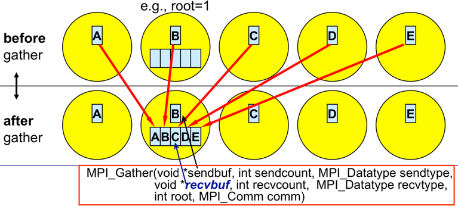

课程名称： **[Introduction to Parallel Programming](https://www.futurelearn.com/courses/interactive-hands-on-introduction-to-parallel-programming/1/todo/105942)**

单位： **[Partnership for Advanced Computing in Europe (PRACE)](https://www.futurelearn.com/partners/prace)**


电脑会把电脑资源分配给**进程**，资源有：cpu资源、内存资源、磁盘资源、网络资源等。==**进程是电脑分配资源的最小单位**。==

每个进程都有自己的**虚拟地址空间**

**线程**可以理解为一个进程内许多的功能，打开一个进程内的一个功能就对应打开一个线程，线程之间的来回切换一起完成了一个大的功能。所以，一个进程至少包含一个线程，而且线程之间是共享进程的资源的。

一个进程至少包含一个线程，这被称为他的**主线程**，主线程是进程中的第一个线程，一般由父进程或操作系统创建，而进程中的其他线程一般都是由主线程创建的。

==**线程是操作系统调度与执行的基本单位；**==

一个线程必须要在进程的前提下运行；

一个进程包含多个线程；

不同的进程之中很难做到数据共享，但一个进程的不同线程之间共享数据很容易；

进程之间不会相互影响

# week 1

解决工程与科学问题计算挑战的两种途径：

1. **distributed serial computing**.

   不在乎计算时间，又叫 **grid computing**

2. **parallel** **computing**

   求解问题被划分到几个 compute cores 或节点上，又叫 **supercomputing**

程序通常被编写和编译成指令(**instructions**)，在一个处理器上串行执行(见下图)。只有将这个problem 划分为独立的子问题subproblems，这些子问题在许多可用的processors处理器上并行执行，才可以实现加速。


计算机底层硬件可以认为是**CPUs** 和 **memory** 的组合，这二者对于并行计算而言都是必不可少的。过去，每个节点只有一个处理器，许多这些节点被组合成一个集群。近年来，一个名为Beowulf的计算节点集群正在升级，每个节点都有多个核，并且共享内存。每个核也可以有许多processor sockets线程和多个线程，以及使用GPU加速。这种硬件架构的编程模型是多种编程语言的组合。例如，OpenMP的并行化方式，它可以很容易地在一台计算机上完成，无论这台计算机是你的个人电脑、笔记本电脑还是远程计算机。OpenMP是实现自动并行化的一种非常简单的方法。只需要从一个串行程序开始，然后用`pragma`指令升级它就能得到运行更快的多线程代码。

## 1.3 Interactive notebook use

**Jupyter Notebook**是基于网页的用于交互计算的应用程序。简而言之，Jupyter Notebook是以网页的形式打开，可以在网页页面中**直接编写代码**和**运行代码**，代码的**运行结果**也会直接在代码块下显示的程序。


点击Launch按钮就能到达他们的**Jupyter Notebook**平台的页面

**Google Colaboratory**也是一个Jupyter notebooks平台

也可以使用 **Blinder**


## 1.4 Hello World

**OpenMP**：open  Multi-processing:最简单的并行途径

通过使用并行构造器（**the `parallel` construct**）来生成一组线程并开始并行执行，例如:

```C
#pragma omp parallel num_threads(2)
  {
    printf("Hello World!\n");
  }
```

这里

- `#pragma omp`表示OpenMP executable directive，
- `parallel`是 construct ，
- `num threads(2)`表示要使用的线程数。

该OpenMP指令应用于接下里的{…}之间的语句。在我们的例子中就是“Hello World!”print语句。

注意，要实现并行是要添加一些头文件的。

## 1.5 Architectures and memory models

**多年来，已经出现了不同的多节点并行化方法==（multi-node approaches to parallelization）==。唯一真正有趣的方法是==Message Passing Interface(MPI)==，我们将在本周介绍它，并在第3周详细介绍。与==OpenMP==中的“自动”并行化相反，我们需要==MPI==中的手动并行化。**

A combination of both approaches, so called ==hybrid model== with OpenMP and MPI can be also done in a very simple way to gain a bit of performance regarding memory or CPU utilisation (see image below). Latest hardware architectures have ==non-uniform memory access called NUMA==（非一致性内存访问）, hence memory regarding the cores is not symmetric but mostly asymmetric.因此内核的内存不是对称的，而主要是非对称的。


并行计算就是在代码并行执行的时候使用尽可能多的核，理想情况就是100%并行化，这只是在多个处理器上并行处理多个相同的子问题，如下图所示：


这种计算实际上不被认为是**高性能计算**(**HPC**)。还有许多其他的解决方案，例如，通常是分布式的 grid computing 或可以租用的云计算。这些正在被解决的问题实际上并不是相互依赖的，因此这里的并行度是100%，进程之间不需要通信。在高性能计算上运行这样的问题将意味着超级计算机的利用不足，因为高性能计算的要点是在多个节点上拥有紧密耦合的计算核。在这种非依赖性的情况下，您可以获得相当好的伸缩性，也就是说，您的程序可以在一个核上和在一百万个核上运行得一样好，因为没有相互依赖性。这类简单得令人尴尬的问题的一个例子是搜索某个函数的最优值，而您不知道它的最优位置，因此您贪婪地搜索该域。

**HPC：High Performance Computing**

**Socket**：multiple CPUs / Cores 卡槽


how nodes in a supercomputer are interconnected：


关于并行计算的总结：

1. good understanding of the problem being solved in parallel
2. identifying how much of the problem can be run in parallel
3. bottleneck analysis and profiling give a good picture on scalability of the problem
4. optimization and parallelization of parts that consume most of the computing time
5. the problem needs to be dissected(切分) into parts functionally and logically(功能和逻辑）

## 1.6 Amdahl's and Gustafson's laws

**Amdahl’s law：**


speed up 与代码并行部分的比例 和 处理器个数有关

500个处理器的时候计算速度已经提升了20倍，但再增加处理器数量计算速度不再有效地提升


## 1.7 Languages for parallel programming

并行编程实际上指的是某种编程语言中的**并行范式** **paradigms** 

这样的 paradigms 通常以**应用程序编程接口**(Application Programming interface, **api**)的形式提供，这些api安装在用户系统上，**可以用作指令或扩展，从而将并行化的代码编译为可执行程序**。

> OpenMP、MPI、CUDA 等等，这些本质上都是 MPI

历史上，并行编程的第一个host语言是C/ c++和Fortran。这些语言仍然是使用经典范例如OpenMP和MPI的标准，也是 accelerated programming 的标准，例如**CUDA**和**OpenCL**。虽然Python作为一种解释语言并不是并行编程的常见选择，但它的一些库，例如Cython，使用了类似于OpenMP的并行化范式来加速Python程序或脚本。存在一个支持MPI的Python库(**mpi4py**)，尽管它在HPC中使用不多。另一方面人工智能领域用于机器学习和深度学习的专门Python库大量使用加速器(**GPU**)的并行范式。

一些可作为 **API** 的 **parallelization paradigms**:

- **Open Multi-Processing (OpenMP)**
- **Message Passing Interface (MPI)**
- **Open Accelerators (OpenACC)**
- **Compute Unified Device Architecture (CUDA)**
- **Open Computing Language (OpenCL)**

## 1.9 Brief intro to OpenMP

**OpenMP (Open specifications（规范） for Multi Processing) is an API for shared-memory parallel computing. It was developed as an open standard for portable and scalable （可移植和可扩展的）parallel programming, primarily designed for Fortran and C/C++. It is a flexible and easy to implement solution, which offers a specification for a set of ==compiler directives==（编译器指令）, ==library routines==（库例程） and ==environment variables==.**

The OpenMP API is comprised of three components:

- **Compiler Directives**：编译器指令
- **Runtime Library Routines**：运行时库例程
- **Environment Variables**：环境变量

许多编译器都支持编译OpenMP的指令

1. **Compiler Directives**

编译器指令在源代码中以comments（注释）的形式存在，编译代码只有指定了适当的**编译器标志**（**compiler flag**）（`-fopenmp` ）时，才会在编译时考虑这些指令。使用OpenMP编译器指令可以：

- 生成一个并行区域
- 在线程之间分割代码块
- 在线程之间分发循环迭代（loop iterations）
- 序列化代码
- 线程之间同步工作

编译器指令的语法：

```cpp
sentinel directive-name [clause, ...]
```

2. **Runtime Library Routines**

这些 routines 用来：

- 设置和查询
  - 线程数
  - 动态线程特性
  - 嵌套的并行性
- 查询
  - 线程 ID
  - 祖先的线程标识符
  - 时钟时间和分辨率
  - 并行区域及其水平
- 设置、初始化和终止：
  - locks
  - 嵌套 locks

在C/ c++中，所有的  runtime library routines 都是 subroutines  （感觉就是子函数），例如在C语言中查询线程数的  runtime library routine 是一个 subroutine :

```cpp
// 查询线程数
int omp_get_num_threads(void)
```

还要注意，在C/ c++中必须包含特定的头文件：

```cpp
#include <omp.h>
```

3. **Environment Variables**

OpenMP环境变量可以通过以下方法来控制并行代码在运行时的执行:

- setting:
  - number of threads 线程数
  - thread stack size 线程堆栈大小
  - thread wait policy
  - maximum levels of nested parallelism 嵌套并行性的最大级别
- specifying how loop interations are divided
- binding（绑定） threads to processors
- enabling/disabling:
  - nested parallelism
  - dynamic threads

OpenMP环境变量的设置与其他环境变量一样，取决于所使用的shell，例如，您可以通过以下方式设置bash中的OpenMP线程数:

```bash
export OMP_NUM_THREADS=2
```

#### 使用OpenMP指令编译代码

```bash
gcc hello_world.c -o hello_world -fopenmp
```

其中：`-fopenmp` 被认为是 **compiler flag** （编译器标志），它告诉编译器编译时要考虑 OpenMP 编译指令。

## 1.10 OpenMP memory, programming and execution model

OpenMP 基于**多处理器**(**multi-processor**)或**多核**(**multi-core**)机器的**共享内存模型**(**shared memory model**)。

共享内存类型可以分为

- **UMA (Uniform memory Access)**
- **NUMA (Non-Uniform memory Access)**

在OpenMP中，程序完全通过**使用线程来实现并行**，称为==**基于线程的并行**（**thread-based parallelism.**）==

==**线程是可以调度的最小处理单元**==

A thread is the smallest unit of processing that can be scheduled. 

**一个线程只能存在于单个进程的资源中。当进程结束时，线程也会消失**

Threads can exist only within the resources of a single process.

**最大线程数等于处理器内核数乘以每个内核可用的线程数**。

The maximum number of threads is equal to the number of processor cores times threads per core available.

**实际使用的线程数由用户或所使用的应用程序定义。**

OpenMP是一种简单的进行**“自动”并行化**的方法。实际上，OpenMP是一个**显式编程模型**(*programming model*)，它为用户提供了对并行化的所有控制。尽管不是严格意义上的自动，**==OPenMP的并行化是通过在串行程序中插入编译器指令，从而“自动”地将其转换为并行程序来实现的==**。此外，OpenMP也提供了复杂的编程方法，例如插入子例程来设置**多层并行性(multiple levels of parallelism)、锁(locks)和嵌套锁(nested locks)**等.

OpenMP的执行模式是==fork-join模型==(**fork-join model**)。OpenMP程序开始执行时是一个**主线程**，串行执行，在遇到第一个并行区域构造(**parallel region construct**)后，主线程创建一个并行线程组(a team of parallel threads)——一个fork。**parallel region construct**中的可执行语句由那组并行线程组(**team threads**)并行执行。在**team threads**完成并行区域构造中的语句执行之后，它们之间会发生同步，最后它们终止合并成一个 **join**，这时候主线程就是剩下的唯一线程。


**让我们总结一下目前为止我们讨论过的OpenMp的一些术语(terminology)：**

| **Term**         | **Description**                    |
| ---------------- | ---------------------------------- |
| OpenMP thread    | OpenMP指定的正在运行的进程         |
| thread team      | 一个任务上合作的一组线程           |
| master thread    | 协调线程的主线程                   |
| thread safety    | 指定多线程的正确执行               |
| OpenMP directive | 带有OpenMP编译器的OpenMP代码行     |
| construct        | OpenMP可执行指令                   |
| clause           | 在执行期间控制变量作用域的**参数** |

## 1.11 for loop

`for` **OpenMP construct (directive-name) in C**

对数组a和b进行求和：

```c
#pragma omp parallel shared(a,b,c,chunk) private(i)
  {
  #pragma omp for schedule(dynamic,chunk) nowait
  for (i=1; i <= N; i++)
    c[i] = a[i] + b[i];
  }  /* end of parallel section */
```

其中：

- in the `parallel` **construct**
  - the **clause** `shared(a,b,c,chunk)`：表示数组a、b、c和变量 `chunk` 被所有线程共享
  - the **clause** `private(i)`:表示变量 `i` 对每个线程都是私有的，每个线程都有自己唯一的副本
- in the `for` **construct**
  - the **clause** `schedule(dynamic,chunk)` :表示for循环的迭代将按 `chunk `的大小动态分布
  - the **clause** `nowait` :表示线程在完成各自的工作后不会同步

```c
// file vector_add.c
#include <stdio.h>
#include <stdlib.h>
#include <omp.h>
#define CHUNKSIZE 202
#define N     2021

int main(int argc, char** argv){

int i, chunk;
float a[N], b[N], c[N];

/* Some initializations */
for (i=1; i <= N; i++){
  a[i] = i * 1.0;
  b[i] = 2020.0 - a[i];
}
chunk = CHUNKSIZE;

#pragma omp parallel shared(a,b,c,chunk) private(i)
  {

  #pragma omp for schedule(dynamic,chunk) nowait
  for (i=1; i <= N; i++)
    c[i] = a[i] + b[i];

  }  /* end of parallel section */
  
  for(i = 1; i <= N; i++){
        if (i % 101 == 0)
          printf("%.5f + %.5f = %.5f\n", a[i], b[i], c[i]);
    }
  
  return 0;
}
// gcc vector_add.c -o vector_add -fopenmp
```

#### 1.13 Brief intro to MPI

**Message Passing Interface (MPI)**是针对开发人员和用户的消息传递库(**message passing libraries**)。MPI主要处理并行消息传递编程模型。现有许多开源MPI实现，它们用于开发可移植和可伸缩的大规模并行应用程序。

最新发布的MPI标准目前是MPI 4.0，使用MPI library 时应该注意下MPI库所支持的标准的版本和特性。支持许多 **host languages** (C/ c++， Fortran, Python, Java…)下表中列出了两种最常用的MPI库和用于Linux系统的MPI编译器。

| MPI library  | Language | Compiler  |
| :----------- | :------- | :-------- |
| ==MVAPICH2== | C        | `mpicc`   |
|              | C++      | `mpicxx`  |
|              |          | `mpic++`  |
|              | Fortran  | `mpif77`  |
|              |          | `mpif90`  |
|              |          | `mpifort` |
| ==Open MPI== | C        | `mpicc`   |
|              | C++      | `mpiCC`   |
|              |          | `mpic++`  |
|              |          | `mpicxx`  |
|              | Fortran  | `mpif77`  |
|              |          | `mpif90`  |
|              |          | `mpifort` |

MPI最初是用在 **distributed memory** architectures 的，但现在也在 **shared memory** 或 **hybrid memory** 架构上运行。然而，不管底层机器的物理架构如何，内存模型本质上是一个 **distributed memory model** 。因此，这种设计适合于HPC系统上的可伸缩性。编程模型（**The programming model**）是显式的，也就是说，正确识别并行性并使用MPI构造实现并行算法的责任在于用户。

**Message-Passing programming paradigm**可以描述为以下下几点：

- 数据分布在 processors ( cores )之间
- 每个processors ( cores )同时对不同的数据执行操作
- processors ( cores )之间可能需要彼此交互


**MPI程序中的每个processor ( core )上运行一个 sub-program ，子程序在每个processor ( core )上通常是相同的。每个子程序的变量名称相同，但位置和数据不同( distributed memory )，即所有变量都是私有的。processors ( cores )之间通过特殊的发送和接收 routines ( message passing )进行通信。**

MPI既提供 point-to-point communications，也提供 collective communications 。

## 1.14 Messages and communication


MPI中的通信类型通常与所涉及的进程 ***processes*** 数量有关。消息传递的最简单形式是点对点通信 ***point-to-point communication***，即一个进程向另一个进程发送消息。在集体通信 ***collective communication*** 中，一次通信涉及几个进程。这种通信分为三类:同步 **synchronization** 、数据移动 **data movement** 和集体计算 **collective computation** 。关于操作的完成，有两种类型:阻塞操作和非阻塞操作 **blocking and non-blocking operations.** 

---

#### Messages

Messages 就是在子程序 *sub-programs* 之间移动的数据包 *packets of data* 。


**message-passing system** 的必要信息是：

- 数据的 size 和 type
- 指向已发送或已接收数据的指针 pointer
- 发送和接收的过程，即优先级 rank
- message 的标签 tag
- the communicator 即 MPI_COMM_WORLD

---

#### 1. point-to-point communication

即两个进程之间的通信，进程之间由他们在 ***communicator*** 中的 ***ranks*** 来区分。


**Blocking routines** ：return only after completion of operations

- `MPI_Send(...)`
- `MPI_Recv(...)`

**Non-blocking routines** ：return immediately and allow sub-programs to perform other work

- `MPI_Isend(...)`
- `MPI_Irecv(...)`

---

#### **2. Collective communication**

***Collective operations*** 的种类：

- ***synchronization*** 同步：**全局同步**，processes wait until all members of the group have reached the synchronization point。`MPI_Barrier()`

- ***data movement*** ：**仅传输数据** broadcast, scatter/gather, all to all
- ***collective computation* (reductions)** ：**传输并执行数据操作** one member of the group collects data from the other members and performs an operation (min, max, add, multiply…) on that data

**collective communication 的几个例子**

1. Broadcast


由`MPI_Bcast(...)` 实现，一个进程在 ***communicator*** 中向所有的进程发送相同的数据。

2. Scatter：数据选择性地分配传输


由 `MPI_Scatter(...)` 实现，由 ***root process*** 在 ***communicator*** 向所有的进程发送数据。

scatter 与 broadcast 的区别：

- `MPI_Bcast` 给所有的 process 发送相同的数据
- `MPI_Scatter`  将数据块 ***chunks of data*** 发送到不同的进程: after the call，sender 只有原始数据的一部分 available

3. Gather


by using `MPI_Gather(...)` ，是 Scatter 的逆运算，从许多 processes 中取得数据并 gather them to one single process.

4. Reduce


by using `MPI_Reduce(...)`. 在每个进程上取得一个输入 array，并向根进程返回一个输出 array。输出的就是 ***Reduce***（化简）后的result。上图显式了 ***Sun Reduce*** ，除了 Sum 还有很多别的 Reduce。


## 1.15 Programming point of view

### 1. MPI program structure


 typical MPI program in C/C++ 的 structure：

- include MPI 头文件
- 声明变量和函数，定义原型 ***prototypes*** 等
- 主程序
  - serial code
  - parallel code：MPI环境的初始化，MPI code (work, calls 等)，MPI环境的终止***termination***

例如：

```c
#include <mpi.h>

int main() {

  // 在任何MPI routine 开始之前都有先调用 MPI_Init()
  MPI_Init(NULL,NULL);

  // 所有 MPI 函数或 routine 的格式都是 MPI_Xxxxxx(parameter, ...)
  MPI_Xxxxxx(parameter, ...);

  // 所有进程在最后都要调用 MPI_Finalize()，从此之后再无 MPI 调用
  MPI_Finalize();

  return 0;
}
```

+++

### **2. Compilation of MPI programs**

必须使用支持 MPI 的编译器或特殊的 MPI 编译器进行编译，例如对 C

的编译：

```bash
$ mpicc hello_world.c -o hello_world
```

### **Running MPI programs**

```bash
$ mpirun -np num ./prg
```

例如，使用4个进程 processes (处理器 processor )运行生成的可执行文件

```bash
$ mpirun -np 4 ./hello_world
```

## 1.16 MPI Hello World!

注意：这个例子没有使用任何一个 MPI routines， 也就是说没有进程之间的通信以及进程ID等，可以编译后可以在许多处理器上独立运行

```cpp
// file hello_world.c
#include <stdio.h>
#include <mpi.h>

int main(int argc, char** argv){
    printf("Hello World!\n");
    
    return 0;
}
```

```bash
$ mpicc hello_world.c -o hello_world
$ mpirun -np 4 --allow-run-as-root ./hello_world
```

## 1.18 Graphics accelerators

待续...


# week 3 Message Passing Interface

一个 **MPI 程序**包含若干(**np**)个**进程**。每个 **mpi 进程** 都<u>运行一份相同的代码</u>，进程的行为由通讯域(communication world)和该通讯域下的 id(rank id)所决定。

关于 **np**：表示你要用来运行这个并行程序的节点数，如果不是在集群环境上，你一个CPU就一个节点，进程数也就是一个最多，本地机子默认的编号就是0。你N的不同无异于就是把程序跑N遍而已。

MPI的编程方式，是“一处代码，多处执行”。

**mpirun** 是MPI程序的启动脚本，它简化了并行进程的启动过程，尽可能屏蔽了底层的实现细节，从而为用户提供了一个通用的MPI并行机。在用mpirun命令执行并行程序时，参数-np指明了需要并行运行的进程个数。**mpirun首先在本地结点上启动一个进程，然后根据/usr/local/share/machines.LINUX文件中所列出的主机，为每个主机启动一个进程**。若进程数比可用的并行节点数多，则多余的进程将重新按照上述规则进行。按这个机制分配好进程后，一般会给每个节点分一个固定的标号，类似于身份证了，到时再消息传递中会用到。

MPI 是一个库，不是一门语言。可以被fortran，c，c++等调用。MPI允许静态任务调度，显示并行提供了良好的性能和**移植性**，用MPI编写的程序可直接在多核集群上运行。在集群系统中，集群的各节点之间可以采用 MPI 编程模型进行程序设计，每个节点都有自己的内存，可以对本地的指令和数据直接进行访问，各节点之间通过互联网络进行消息传递，这样设计具有很好的可移植性，完备的异步通信功能，较强的可扩展性等优点。

用 `mpicc` 编译过的程序执行时用户也可以不用mpirun, 而直接运行目标程序`./a.out`

**如何理解并行计算的计算流程呢？**

按并行的方式写一段并行的程序，然后在集群环境里主机上运行`mpirun`的时候指定需要的进程数。接着，计算机在集群环境下尽可能找到对应 的节点，分配进程任务并给他们编号。此后，将程序拷贝一份给每一个节点，每个节点在这个共同的工作中都担任着一份角色。接着，他们就按程序中设计的方式，各自运行着由自己编号决定的自己的那一段代码，相互之间进行通讯，最后共同完成这项任务。那么，不同节点程序进行有早晚，如何保证协调一致有序进行呢？比如说，你可以等呀，可以找个地方先寄存一下你给别人的消息之类的。这就涉及到了MPI通讯的**阻塞型**和**非阻塞型**通讯模式


## Ⅰ. Communicators and communication in MPI

### 3.2 Communicator in MPI

当我们启动 MPI 时，整个环境将这个 application 中涉及的所有 processes 和 cores 放在一起，并将它们绑定在一个称为 **communicator** 的东西中。

**communicator** 就像一个集合，它将所有进程绑定在一起，并确保只有在一个应用程序中的进程才能彼此通信。

最常用的 **默认 communicator** 是：

```c
MPI_COMM_WORLD
```

它已经在头文件中预定义过了：

```c
mpi.h
```


#### Ranks and Size

当需要使用 communicator 时，经常使用 MPI COMM WORLD。一旦初始化了 MPI 环境，所有的进程都将在这个 communicator 中。**rank** 就是用来区分 communicator 中不同的 process 。当初始化 MPI 环境时，MPI 通信器将为每个进程指定一个编号。这就是 **rank** ：它从0开始，以 **size**-1 结尾。在上图中，启动了具有七个 cores 的 application，每个核心都有一个  **rank**。

在初始化MPI环境时，**rank** 是给每个 processor 的编号，也是可以用来识别进程的编号。**size** 告诉我们通信器中包含的进程总数，即应用程序中有多少个进程。例如，当 **size**  为10时，**rank** 就是0~9。

**get  Rank and Size** ：

```c
// 获取并行环境参数
MPI_Comm_rank(MPI_Comm comm, int *rank)	// 获取进程ID
MPI_Comm_size(MPI_Comm comm, int *size);// 获取总进程数
```


### 3.3 Hello World 2.0

- 每个进程都输出下它的 rank 和 MPI_COMM_WORLD 的 size
- 只有 rank 是 0 的进程输出打印语句

```c
// file hello-world.c
#include <stdio.h>
#include <mpi.h>

int main()
{
    int rank, size;	//先定义，这两个值由程序执行参数确定：mpirun -np N
    
    MPI_Init(NULL, NULL);
    
    // 获取并行环境参数
    MPI_Comm_rank(MPI_COMM_WORLD, &rank);
    MPI_Comm_size(MPI_COMM_WORLD, &size);
    if (rank == 0) {
        printf("Hello world!\n");
    }
    printf("I am process %i out of %i.\n", rank, size);
    
    MPI_Finalize();
}
// mpicc hello-world.c -o hello-world && mpirun -np 4 --allow-run-as-root hello-world
```


### 3.4 Messages and communications

通常，process 之间传递的信息可以是一些整数，一些其他值，甚至是数组等。**Messages are packets of data moving between sub-programs**. 

如果我们把将要在进程之间共享的 information 打包成一些 Message ，这样就可以通过 communication network 发送它们，其他进程也可以作为 message 接收它们。这就是 data and information 在process之间传递的方式。当然，为了有效地发送和接收消息，总是需要指定一些重要的信息


需要特别指定的重要信息有：

- **Data size and type**

  The sender needs to specify what kind of data is being sent.  if we are sending an array of 100 numbers, we need to specify that the size equals 100. And we would also need to mention what is the type of the data. So, whether it is a character? Is it a double integer? And so on.

- **Pointer to sent or received data**

  we would need two pointers. These pointers are from the sender that will need to point to its own memory to mention, OK, the data I’m trying to send is here. And then the receiver will need to specify the memory where it would like to receive this data.

- **Sending process and receiving process, i.e., the *ranks***

  The MPI environment will need to know who is the sender and who is the receiver. This is where the **ranks come in**. So, for our previous example we would specify that the rank `0` is the sender and the rank `2` is the receiver.

- **Tag of the message**

  当有多个 Messages 时用来让 receiver 区分不同的 Message

  A tag is a simple number that we can assign any value from which a receiver can identify the message. For instance, if we would send two messages we can assign one tag as,  `0` and the other one as tag `1`. This helps the receiver identify and differentiate between messages. But usually if we will have only one message, we can just put the tag as `0`.

- **The communicator, i.e., `MPI_COMM_WORLD`**

  The last argument we will need to specify is what the communicator in which we are sending the messages is.In our case here, it would be the `MPI_COMM_WORLD`, but we would eventually learn better about the functions as we will do more exercises and hands on practice.

#### MPI Datatypes

The MPI environment defines its own basic data types.

| C Datatype | MPI Datatype |
| :--------- | :----------- |
| char       | MPI_CHAR     |
| int        | MPI_INT      |
| long       | MPI_LONG     |
| float      | MPI_FLOAT    |
| double     | MPI_DOUBLE   |

if you’re trying to send an integer, then the type is

```c
MPI_INT
```

we will explore that there is also a way for the user to define its **own derived data type**. For instance, if we’re using **`struct` in C**, then we can define that struct as a new MPI data type. This proves to be very useful because we can just send everything in one message.


> 通俗地说，MPI_Send的六个元素的大概意思就是，我要从内存的那个位置开始，连续取多少个某种类型的数据，这就是消息数据。信封上写上这是要送给序号为多少的节点的第几封信，指明这是申通快递寄过去，这就是消息信封的三个元素。反之亦然，MPI_Recv就要开辟从某个位置开始的多少个这种类型的数据内存，然后去找对方寄送给自己的第N封消息，要是申通的，如果收到了，反馈一个**状态**。

## Ⅱ.  Types of communication in MPI

### 3.6 Different types of communication in MPI

两种区分 MPI 中通信类别的方法：

- 根据包含的进程数

  - **point to point communication** ：only two processes involved in the communication,
  - **collective communication**：multiple processes that are involved，一对多，多对一和多对多

- 根据阻塞和非阻塞(blocking and non blockin)

  - **blocking routine**：returns only when the operation has completed，如果发送一个消息(`MPI_Send()`)，在收到接收方返回已收到消息的信息(`MPI_Recv()`)之前，不能进行下一步操作。

    

  -  **non blocking**：more complicated than the simpler blocking counterpart. it returns immediately and allows the sub-program to perform other work. 如果我们向接收者发送一些东西，我们可以在中间执行一些其他任务，在一段时间后，我们可以检查接收者是否真的返回了信息。许多实际应用程序通常采用这种通信类型。

    

  

####  Point-to-Point Communication

In order to do so, the environment has to know who is the sender and who is the receiver and this is taken care of by specifying the **ranks** of the processes.


#### Sending paradigms

In order to send a message with Point-to-Point Communication, we use the function：

```cpp
MPI_Send(void *buf, int count, MPI_Datatype datatype, int dest, int tag, MPI_Comm comm);
```

其中：

- `buf` is the pointer to the data with `count` elements and each of them is described with datatype. So first of all, we have to specify the address of the data that we would like to send. It’s a pointer to the data of the sender and then the second argument is actually the number of elements we send. For example, if we just send 1 integer, the size will be 1. If you send an array with 100 integers, this will be 100 and so on. The third argument  is the `datatype`. So, if we are sending an integer, we will have to specify here `MPI_INT` and so on.
- `dest` is the rank of the destination process. In this argument we specify the rank of the receiver. So, for instance, in the previous example, this will be `5`.
- `tag` is an additional integer information sent with the message. **`tag` is basically a number to identify the message**. So, usually if we just send only one message, we can just put the `0` tag there or maybe any number that we would like.
- The last argument is the communicator and as we already discussed we usually use `MPI_COMM_WORLD`.

这些参数是MPI环境需要的最重要的信息，以便知道将要发送什么数据以及发送给谁。

#### Receiving paradigms

 for the communication to work, we need two processes and two ranks. So, one will call the `MPI_Send` function and the other will similarly call `MPI_Recv` to receive. 

the receive function：

```cpp
MPI_Recv(void *buf, int count, MPI_Datatype datatype, int source, int tag, MPI_Comm comm, MPI_Status *status);
```

- The `buf/count/datatype` describe the received data. In the first argument we specify the address of the data, i.e., the address where we would like to receive the data and similarly, we put the data type here.

- `source` is the rank of the sender process. We have to have the rank of the sender process. In the previous example we would specify number `3`, because the rank with number three is trying to send us a message.

- Similar to `MPI_Send`, we also have a `tag` here. It is really important to make sure that we match this number with the sender. So, if the sender specifies that the message has tag `0`, the receiver also has to specify the same number here. **Otherwise, this will be an infinite loop** as we will not receive anything because we would not match our receive function call with the send function call.

- The next argument is the communicator and again we would just use the `MPI_COMM_WORLD`.

- The last argument is not so important for us at the moment as this is something that we will be learning in the next exercise. For now we will just use

  ```cpp
  MPI_STATUS_IGNORE
  ```

communication 示意图：


the sender would like to send this buffer array that has `n` floats over to some other process. 

we have to be careful when we write these functions that all of these have to match. 

the receiver has to call the receiver function with the same data type. it has to first define an array where it would like to receive this data, the receive buffer. The communicator, of course, has to be the same because they are bound in the same program. But **we usually use the `MPI_COMM_WORLD` communicator**. The next important part is that the `tag` has to match. And finally, the type of the message or type of the data has to match.

### 3.7 Send and receive

```cpp
%%file ping.c
#include <stdio.h>
#include <mpi.h>

int main()
{
    int i, rank;
    float buffer[1];
    MPI_Status status;

    MPI_Init(NULL, NULL);
    
    MPI_Comm_rank(MPI_COMM_WORLD, &rank);	// 要进程间通信就要用到 rank
    // 之前只是声明了一个rank变量，这一句应该才真正给各进程分配了rank号

    if (rank == 0)
    {
      printf("I am %i before send ping \n", rank);
      MPI_Send(buffer, 1, MPI_FLOAT, 1, 17, MPI_COMM_WORLD);
    }
    else if (rank == 1)
    {
      MPI_Recv(buffer, 1, MPI_FLOAT, 0, 17, MPI_COMM_WORLD, &status);
      printf("I am %i after  recv ping \n", rank);
    }

    MPI_Finalize();
}
// mpicc ping.c -o ping && mpirun -np 4 --allow-run-as-root ./ping
```

### 3.8 ping and pong

ping 是发，pong是收

Two processes ping pong a token back and forth, incrementing it until it reaches a given value.

1. Process 0 sends a message to process 1 (ping).
2. After receiving this message, process 1 sends a message back to process 0 (pong).
3. Each time a message is sent, the token is incremented by 1.
4. Repeat this ping pong until the value of token reaches 6, i.e. 3 pings and 3 pongs.

```cpp
%%file ping.c
#include <stdio.h>
#include <mpi.h>

int main()
{
    int rank;
    float token[1] = {12};
    MPI_Status status;

    MPI_Init(NULL, NULL);
    MPI_Comm_rank(MPI_COMM_WORLD, &rank);

    // 进程 0 执行的部分：
    if (rank == 0)
    {
      while (token[0] > 6) {
          printf("I am %i before send ping \n", rank);
          token[0]--;
          MPI_Send(token, 1, MPI_FLOAT, 1, 17, MPI_COMM_WORLD);
          MPI_Recv(token, 1, MPI_FLOAT, 1, 23, MPI_COMM_WORLD, &status);
          printf("I am %i after recv pong \n", rank);
      }
    }
    
    // 进程 1 执行的部分：
    else if (rank == 1)
    {
      while (token[0] > 6) {
          MPI_Recv(token, 1, MPI_FLOAT, 0, 17, MPI_COMM_WORLD, &status);
          printf("I am %i after recv ping \n", rank);
          printf("I am %i before send pong \n", rank);
          token[0]--;
          MPI_Send(token, 1, MPI_FLOAT, 0, 23, MPI_COMM_WORLD);
      }
    }

    MPI_Finalize();
}
// mpicc ping.c -o ping && mpirun -np 4 --allow-run-as-root ping
```


### 3.9 What happens with a different number of pings and pongs ?

nothing...


### 3.10 Rotating information around a ring

In this exercise you will get to experiment with blocking and non-blocking communication.

This is a small example of **ring communications**, . Each process is sending its data to its right neighbour and receiving the data from its left neighbour (in a ring). If we use blocking routines, there is a risk of deadlocks(锁死) and serializations. **All processes can be stuck(卡死) at `MPI_Send` because they are waiting for the `MPI_Recv` to be called.**

如果使用同步通信协议(synchronous communication protocol ) 下实现的`MPI-Send()`，一般情况下这种是很容易卡死的。但是仍希望这个错误的程序仍然能够工作，因为只发送了一个小的` int 1` 消息，而不是巨大的双精度数组。

下面的程序循环向下一个进行发送 ring 上当前进程的 rank 并把每个 processor 的 rank 加起来。相邻 rank 的计算是通过`modulo` (取模/取余操作)完成的。为发送和接收使用两个不同的 buffers，这是 non-blocking 常用的方式。


```cpp
#include <stdio.h>
#include <mpi.h>

int main()
{
    int rank, size;
    int snd_buf, rcv_buf;
    int right, left;
    int sum, i;
    MPI_Status status;

    MPI_Init(NULL, NULL);
    MPI_Comm_rank(MPI_COMM_WORLD, &rank);
    MPI_Comm_size(MPI_COMM_WORLD, &size);
    
	// 通过取余方式获得相邻的rank
    right = (rank+1)      % size;// 获取右边的rank
    left  = (rank-1+size) % size;// 获取左边的rank

    sum = 0;
    snd_buf = rank; //store rank value in send buffer
    for(i = 0; i < size; i++) 
    {
        MPI_Send(&snd_buf, 1, MPI_INT, right, 17, MPI_COMM_WORLD); //send data to the right neighbour
        MPI_Recv(&rcv_buf, 1, MPI_INT, left,  17, MPI_COMM_WORLD, &status); //receive data from the left neighbour
        snd_buf = rcv_buf; //prepare send buffer for next iteration
        sum += rcv_buf; //sum of all received values
    }
    printf ("PE%i:\tSum = %i\n", rank, sum);

    MPI_Finalize();
}
```

上述代码的执行过程可以用下图表示：


- substitute `MPI_Send` with `MPI_Ssend` (explicit synchronous send).You will see a deadlock and you will need to kill the program .

- 为了解决这个问题就需要写一个分支：Use the trick: `if rank == `, then do first receive and then send, for example. 

  ```cpp
  for(i = 0; i < size; i++) 
      {
          if (rank == 0) {
              MPI_Ssend(&snd_buf, 1, MPI_INT, right, 17, MPI_COMM_WORLD);
              MPI_Recv(&rcv_buf, 1, MPI_INT, left,  17, MPI_COMM_WORLD, &status);
          } else {
              MPI_Recv(&rcv_buf, 1, MPI_INT, left,  17, MPI_COMM_WORLD, &status);
              MPI_Ssend(&snd_buf, 1, MPI_INT, right, 17, MPI_COMM_WORLD);
          }
          snd_buf = rcv_buf;
          sum += rcv_buf;
      }
  ```

  

- if you run the program with 1 process. It will still deadlock. The program is still wrong due to bad performance and it will still deadlock when running with only 1 process.

### 3.11 Dynamic Receiving with `MPI PROBE` and `MPI STATUS`

**`MPI_Send()`中的 `count` 等参数未知时怎么办？**

- 方案一：`MPI_Send`再发送一个单独的关于个数的消息，效率低！
- 方案二：使用两个函数 `MPI_Probe` and `MPI_Status` to obtain the size of sent data.

In order to learn more about these functions and how to use them we need to grasp some concepts that follow.

#### Wildcards(通配符)

`MPI_Recv()` 函数原型：

```cpp
MPI_Recv(void *buf, int count, MPI_Datatype datatype, int source,int tag, MPI_Comm comm, MPI_Status *status);
```

the receiver can use *<u>wildcards</u>* in some of those arguments. This means in the function `MPI_Recv()` , the receiver can just put the *<u>source</u>* as:

```cpp
MPI_ANY_SOURCE
```

and this would imply that it doesn’t care from where the message will come allowing to receive from any source. For example, if you all would send me a message and I would just like to read one of the messages I would use this. So, I wouldn’t care who was sending me the information and I would just read it from one of the sources. 

Similarly, we can do this to the *<u>tag</u>*. In the function where we have to mention the `number` of the tag we can just use:

```cpp
MPI_ANY_TAG
```

allowing us to receive a message having any tag.

---

#### `MPI_Status` and `MPI_Probe`

**当接收函数参数使用了通配符时，只能提供`MPI_Status` 来获得发送者和 tag 的信息！**

`MPI_Status` 是个结构体变量，它包含了许多重要的信息，如

- the rank of the sender
- The tag of the message
- The length of the message

```cpp
// 上述三点的代码：
status.MPI_SOURCE
status.MPI_TAG
MPI_Get_count(MPI_Status *status, MPI_Datatype datatype, int *count)
```

So, this `Status` struct has some attributes that can provide us with additional information about the sender. For instance, like we saw if we use the **`MPI_ANY_SOURCE`** or **`MPI_ANY_TAG`**, then in that case `Status` is **the only way** of how we can find out who the sender actually was. So, using the first two we can get the information about who is the sender and the tag of the message. We will also see that we can use the `Status` struct to call the function `MPI_Get_count()` that actually gives us the size of the message. So, if we don’t know how many `numbers` or if we don’t how large the message is going to be, we can use the `MPI_Get_count` function to deduce what was the size of the message. 

**`MPI_Probe` is a function that is used to probe(探测) for an incoming message before actually receiving it.** 

作用：receiver 可以检查是否有消息正在在等待它回应。

This function is similar to the receive function, but it is much more quicker as it executes without actually receiving the message. So, as the name `MPI_Probe` suggests, it probes for an incoming message. Basically the receiver can check whether there is a message waiting for it. We call it using

```cpp
MPI_Probe(int source, int tag, MPI_Comm comm, MPI_Status* status);
```

**It can be thought of as an `MPI_Recv` that does everything but receive the message, yet we can get a lot of information out of it**. Once we have that information, we can actually use `MPI_Recv` to receive the actual message.

#### exercise

Process 0 sends a random amount of numbers to a receiver and the receiver then finds out how many numbers were sent. Instead of receiving and simply providing a large buffer to handle all possible sizes of messages, we use `MPI_Probe` to query the message size before actually receiving it.

```cpp
//%%file recv.c
#include <stdio.h>
#include <stdlib.h>
#include <mpi.h>
#include <time.h>
#include <sys/time.h>

int main()
{
    int rank;
    MPI_Init(NULL, NULL);
    MPI_Comm_rank(MPI_COMM_WORLD, &rank);

    int number_amount;
    if (rank == 0) {
        const int MAX_NUMBERS = 100;
        int numbers[MAX_NUMBERS];
        // Pick a random amount of integers to send to process 1
        srand(time(NULL));
        number_amount = (rand() / (float)RAND_MAX) * MAX_NUMBERS;

        // Send the amount of integers to process 1
        MPI_Send(numbers, number_amount, MPI_INT, 1, 0, MPI_COMM_WORLD);
        printf("I am %i and I sent %d numbers to 1\n", rank, number_amount);
    }
    else if (rank == 1) {
        MPI_Status status;
        // Probe for an incoming message from process 0
        MPI_Probe(0, 0, MPI_COMM_WORLD, &status);

        // Get the size of the message
        MPI_Get_count(&status, MPI_INT, &number_amount);
        // Allocate a buffer just big enough
        int* number_buf = (int*)malloc(sizeof(int) * number_amount);

        // Receive the message
        MPI_Recv(number_buf, number_amount, MPI_INT, 0, 0, MPI_COMM_WORLD, MPI_STATUS_IGNORE);
        printf("I am %i and I dynamically received %d numbers from 0.\n", rank, number_amount);
        free(number_buf);
    }

    MPI_Finalize();
}
// mpicc recv.c -o recv && mpirun -np 2 --allow-run-as-root recv
```


## Ⅲ. Collective communications

### 3.13 Basic collective communications

**We have to keep in mind that in these communications involving a group of processes, the routines are called by all processes in a communicator. So, simply put all the processes that are involved in this communication need to call the same routine.**简单地说，所有参与通信的进程都需要调用相同的例程。

Examples of these types of communication are

- Broadcast
- Scatter
- Gather
- Reduction

#### Broadcast

Broadcast is the simplest one of all the forms of collective communication and it is used to send out user input or parameters to all processes. **The essential idea(基本思想) of the broadcast is that we select one process to send the same data to all other processes in the communicator**. Usually we use broadcast at the beginning of the algorithm in cases where we would like to distribute the user input or some parameters of the algorithm. 

For instance, if we don’t use parallel IO (input-output), the usual case is that we read a file with one processor and then we distribute the contents with the broadcast.

To execute this we will be using the function

```cpp
MPI_Bcast(void* data, int count, MPI_Datatype datatype, int root, MPI_Comm communicator);
```

Similar to most functions we have learnt so far, in the arguments of the broadcast function we would like to specify the data, so the *<u>pointer</u>* of the data we would like to share. Again, we specify how *<u>many</u>* of data there is and what is its *<u>type</u>*. However, an interesting difference we will notice here is that <u>there is no sender source or receiver</u>. 

But actually what this `root` tells us is that here we specify the rank of the process that distributes the data. <u>All other processes that are not the root receive the message</u>.(但实际上  `root` 告诉我们的是我们在这里指定了分配数据的进程的等级。非根进程的所有其他进程都将接收该消息） 

Although the root process and receiver processes do different jobs, they all call the same `MPI_Bcast` function!

At the end of the arguments we have to specify the communicator.

For example, suppose we have initialized the MPI application with five processors, which implies ranks zero to four. Now we would like the rank `1` to send a string, a **character array**（字符数组） that contains the letters `r-e-d` to all other processes. As mentioned already in order for this to work, the rank `1`, as well as all other processes that we would like to be involved in this communication have to call the same function and the prototype of this function.

 

So, here suppose `red` is contained in the array called `buf`. There are three elements we would like to distribute among all other processes. Their data type is character, so we use `MPI_CHAR`. **The root is `1`, so the process that is sending or broadcasting the data has rank `1`,** followed by the communicator `MPI_COMM_WORLD`. So, the function for the image above would be

```cpp
MPI_Bcast(buf, 3, MPI_CHAR, 1, MPI_COMM_WORLD);
```

We can see that it’s a pretty simple but very useful routine. 

**Remember only that this exact function call has to be called by every process involved, the root and all of the receiving processes.**


### 3.14 Broadcast

#### 全局同步：MPI_Barrier


如图所示：P3最先到达barrier，但是它停下来了等了等后面的P0，P1，P2，然后四个进程都在barrier之后，再次开始出发，执行。

这种通讯中，所有的进程都要调用 MPI_Barrier （没法确定谁快，谁先到了谁等，谁就block）。当所有进程的状态都处于阻塞等待状态时，说明全都到齐了，可以再次出发了。

```cpp
MPI_Barrier(MPI_COMM_WORLD);       //所有进程均调用 
```

==MPI_Barrier是确保进程之间同步的唯一方法。==

#### Exercise

1. Go to the exercise and complete the program that uses `MPI_Bcast` routine to broadcast an array with 10.000.000 numbers from process with rank 0.

2. Write your own broadcast function using `MPI_Send` and `MPI_Recv` routines.

```cpp
void my_Bcast(void* data, int count, MPI_Datatype datatype, int root, MPI_Comm communicator);
```

3. Measure the time of both routines using the MPI function `MPI_Wtime` when running with 2, 4, 8 processors. What do you make of the differences at different scales?

```cpp
double MPI_Wtime(void); // 返回调用处理器上的已用时间。
```

```cpp
%%file bcast.c
#include <stdio.h>
#include <mpi.h>

void my_Bcast(void* data, int count, MPI_Datatype datatype, int root, MPI_Comm communicator) 
{
    int rank, size, i;
    MPI_Comm_rank(communicator, &rank);
    MPI_Comm_size(communicator, &size);
    
    // TODO:
    // If we are the root process, send our data to everyone
    if (rank == root) {
        for (i = 0; i < size; i++) {
            if (i != rank) {
                MPI_Send(data, count, datatype, i, 0, communicator);
            }
        }
    } else {
    // If we are a receiver process, receive the data from the root
    MPI_Recv(data, count, datatype, root, 0, communicator, MPI_STATUS_IGNORE);
    }
}

int main()
{
    int rank, i;
    int num_elements = 10000000; // size of array
    int num_trials = 10; // number of timing experiments

    MPI_Init(NULL, NULL);
    MPI_Comm_rank(MPI_COMM_WORLD, &rank);

    double total_my_bcast_time = 0.0;
    double total_mpi_bcast_time = 0.0;
    int* data = (int*)malloc(sizeof(int) * num_elements); // create array

    for (i = 0; i < num_trials; i++) {
        // TODO:
        // broadcast with MPI_Bcast
        // time MPI_Bcast
        // synchronize before starting timing and before obtaining final time
        
        // Synchronize before starting timing
        MPI_Barrier(MPI_COMM_WORLD);
        total_mpi_bcast_time -= MPI_Wtime();
        MPI_Bcast(data, num_elements, MPI_INT, 0, MPI_COMM_WORLD);
        // Synchronize again before obtaining final time
        MPI_Barrier(MPI_COMM_WORLD);
        total_mpi_bcast_time += MPI_Wtime();
        

        // TODO:
        // broadcast with my_Bcast
        // time my_Bcast
        
        MPI_Barrier(MPI_COMM_WORLD);
        total_my_bcast_time -= MPI_Wtime();
        my_Bcast(data, num_elements, MPI_INT, 0, MPI_COMM_WORLD);
        MPI_Barrier(MPI_COMM_WORLD);
        total_my_bcast_time += MPI_Wtime();

    }

    // Print resulting times
    if (rank == 0) {
        printf("Avg my_Bcast time = %lf\n", total_my_bcast_time / num_trials);
        printf("Avg MPI_Bcast time = %lf\n", total_mpi_bcast_time / num_trials);
    }

    free(data);
    MPI_Finalize();
}
// mpicc bcast.c -o bcast && mpirun -np 2 --allow-run-as-root bcast
```

### 3.15 Disscussion


### 3.16 Scatter and Gather

#### Scatter

- *broadcast*: 根节点给每个节点发送相同的数据
- *scatter*：分散，使）散布在各处。顾名思义，要把某些数据先分散开然后分别传给不同的节点。这表示我们需要将数据分成相等的部分，以便每个进程接收相同的部分，这意味着通信器中的每个进程将只得到那些数据中的一部分。

**函数原型：**

```cpp
MPI_Scatter (void *sendbuf, int sendcount, MPI_Datatype sendtype, void *recvbuf, int recvcount, MPI_Dataype recvtype, int root, MPI_Comm comm)
```

下面的例子中，根处理器的排名为1，它希望将这个由5个数字组成的数组分散到所有其他进程。


`sendcount` 和 `recvcount` 是相等的，表示的不是发送数据的总数，而是发送给每个处理器的数据的个数，即每个处理器所获得的数据的比例

The only thing we need to be careful with in this function is the `sendcount` and `recvcount` because this is the number that dictates how many elements will be sent to each process and not the number of whole elements.

Another important thing to be noted is that when this function is finished, the sender (in our example the process with rank `1`) will not get the information of the whole data. In our example, this would mean that after communication rank `1` will have only a part of the data, i.e., `B`.

**The difference** between `MPI_Bcast` and `MPI_Scatter` is that while `MPI_Bcast` sends the same piece of data to all processes whereas `MPI_Scatter` sends chunks of data to different processes.

#### Gather

 Gather is the inverse of Scatter. The gather function quite literally gathers all the information back to the original root process. 

the **basic idea** in many MPI applications is that **we have some data, we scatter it, so that every process computes something and then we gather back the information together in one process**. The function is quite similar to `MPI_Scatter`：

```cpp
MPI_Gather(void *sendbuf, int sendcount, MPI_Datatype sendtype, void *recvbuf, int recvcount, MPI_Dataype recvtype, int root, MPI_Comm comm)
```



The main difference here is that since only one process, i.e., the root gathers all the information it is the only one that needs to have a valid receive buffer. 

All other calling processes can pass `NULL` for `recvbuf` since they do not receive anything as they just send the data to the root process. 

Finally, once again to be noted and remembered is that the `recvcount` parameter is the count of elements received per process and not the total summation of counts from all processes!


### 3.17 Scatter and Gather


#### Exercise

**write an MPI program that computes the average of an array of elements using** `MPI_Scatter` **and** `MPI_Gather`**.**

This quite simple program demonstrates how one can use MPI to **divide work across processes, perform computation on subsets of data and then combine the smaller results into the final result.**

The program takes the following steps:

1. The root process (process `0`) creates an array of generated random numbers.
2. Scatter the random numbers from the root process to all other processes, giving each process an equal amount of numbers.
3. Each process computes the average of their subset of numbers.
4. The root process gathers each individual average and computes the total average on now a much smaller array of numbers.

```cpp
%%file gather.c
#include <stdio.h>
#include <stdlib.h>
#include <time.h>
#include <sys/time.h>
#include <mpi.h>

int main()
{
    int i, rank, size;
    int num_elements_per_proc = 3;
    int num_elements;
    // seed the random number generator
    srand(time(NULL));

    MPI_Init(NULL, NULL);

    MPI_Comm_rank(MPI_COMM_WORLD, &rank);
    MPI_Comm_size(MPI_COMM_WORLD, &size);

    // create a random array of elements on the root process
    // total size will be the number of elements per process times the number of processes
    float *rand_nums = NULL;
    if (rank == 0) {
        num_elements = num_elements_per_proc * size;
        rand_nums = (float *)malloc(sizeof(float) * num_elements);
        for (i = 0; i < num_elements; i++) {
            rand_nums[i] = (rand() / (float)RAND_MAX);
        }
    }

    // for each process, create a buffer that will hold a subset of the array
    float *sub_rand_nums = (float *)malloc(sizeof(float) * num_elements_per_proc);

    // scatter the random numbers from the root process to all other processes
    // TODO: scatter
	MPI_Scatter(rand_nums, num_elements_per_proc, MPI_FLOAT, sub_rand_nums,
              num_elements_per_proc, MPI_FLOAT, 0, MPI_COMM_WORLD);
    // compute the average of your subset
    float sub_avg = 0.f;
    for (i = 0; i < num_elements_per_proc; i++) {
        sub_avg += sub_rand_nums[i];
    }
    sub_avg = sub_avg / num_elements_per_proc;
    printf("I am process %i out of %i, average result = %f \n", rank, size, sub_avg);

    // gather all partial averages down to the root process
    float *sub_avgs = NULL;
    if (rank == 0) {
        // memory allocation needed only on root process
        sub_avgs = (float *)malloc(sizeof(float) * size);
    }
    // TODO: gather
    MPI_Gather(&sub_avg, 1, MPI_FLOAT, sub_avgs, 1, MPI_FLOAT, 0, MPI_COMM_WORLD);

    // compute the total average of all numbers from the partial averages
    if (rank == 0) {
        float avg = 0.f;
        // TODO: compute final average of values in sub_avgs
        for (i = 0; i < size; i++) {
            avg += sub_avgs[i];
        }
        avg = avg / size;
        printf("Avg of all elements is %f\n", avg);

        // compute average across the original data for comparison
        float original_data_avg = 0.f;
        for (i = 0; i < num_elements; i++) {
            original_data_avg += rand_nums[i];
        }
        original_data_avg = original_data_avg / num_elements;
        printf("Avg computed across original data is %f\n", original_data_avg);

    }

    // Clean up
    if (rank == 0) {
        free(rand_nums);
        free(sub_avgs);
    }
    free(sub_rand_nums);

    MPI_Finalize();
}
// mpicc gather.c -o gather && mpirun -np 4 --allow-run-as-root gather
```


## Ⅳ Addvanced Collective operators


### 3.18 MPI_Reduce

#### 什么是 Reduce？

简单地说，**data reduction** involves reducing a set of numbers into a smaller set of numbers via some function.

For example, let’s say we have a list of numbers (1, 2, 3, 4, 5). Then reducing this list of numbers with the sum function would produce:

```
sum(1, 2, 3, 4, 5) = 15
```

Similarly, if we would use another function say, multiply, the multiplication reduction would yield

```
multiply(1, 2, 3, 4, 5) = 120.
```

Quite simply, this is what an MPI reduction function does.


#### `MPI_Reduce`

`MPI_Reduce` is basically what we did in the scatter/gather with an additional functionality. 

In a way what the reduce routine does is basically similar to scatter/gather, but we also specify an MPI function like sum, multiplication, maximum or something similar.  So, the MPI library uses those functions directly on this data that gives us the reduced result immediately. **We don’t have to call the gather routine and then manually program to get the sum, but instead the library does it for us.** 

Therefore, `MPI_Reduce` takes an array of input elements on each process and returns an array of output elements to the root process. The output elements contain the reduced result.


Let’s assume that we’re trying to compute a sum, but different numbers are scattered across different processes. If we would have our numbers (1, 2, 3, 4, 5) we would call `MPI_Reduce` on this data and we will also need to mention the function that we would like to reduce the data, e.g., the sum. Then the root process will get the sum as a result. 

 the prototype of the `MPI_Reduce`

```cpp
MPI_Reduce(void* send_data, void* recv_data, int count, MPI_Datatype datatype, MPI_Op op, int root, MPI_Comm communicator);
```

The arguments of this routine are pretty similar to the ones we have seen so far. So, the `send_data` parameter is an array of elements that each process wants to reduce. Following that is the `recv_data` that is only relevant on the process with a rank of root as it contains the reduced result. Then we mention the `count`, i.e., the number or quantity of the data and the datatype. 

However, this is where the `MPI_Reduce` function is different. Here we also mention the *operation* in the op parameter, i.e., the operation that we wish to apply to our data. The list of **reduction operations** in the MPI library is as follows:

| Function    | `MPI_Op`   |
| :---------- | :--------- |
| Maximum     | `MPI_MAX`  |
| Minimum     | `MPI_MIN`  |
| Sum         | `MPI_SUM`  |
| Product     | `MPI_PROD` |
| Logical AND | `MPI_LAND` |
| Logical OR  | `MPI_LOR`  |

### 3.19 Computing average with MPI_Reduce


#### Exercise

The program takes the following steps:

1. Each process creates an array of generated random numbers.
2. Each process performs the `local_sum` calculation.
3. Reduce the `local_sum` to the root process (process `0`) using `MPI_SUM`.
4. The root process calculates the final average.

```cpp
%%file reduce.c
#include <stdio.h>
#include <stdlib.h>
#include <time.h>
#include <sys/time.h>
#include <mpi.h>

int main()
{
    int i, rank, size;
    int num_elements_per_proc = 3;
    int num_elements;
    // seed the random number generator to get different results for each processor
    srand(time(NULL)*rank);

    MPI_Init(NULL, NULL);

    MPI_Comm_rank(MPI_COMM_WORLD, &rank);
    MPI_Comm_size(MPI_COMM_WORLD, &size);

    // create a random array of elements on all processes
    float *rand_nums = NULL;
    rand_nums = (float *)malloc(sizeof(float) * num_elements_per_proc);
    for (i = 0; i < num_elements_per_proc; i++) {
        rand_nums[i] = (rand() / (float)RAND_MAX);
    }

    // sum the numbers locally
    float local_sum = 0.f;
    // TODO
    for (i = 0; i < num_elements_per_proc; i++) {
        local_sum += rand_nums[i];
    }
    printf("Local sum for process %d : %f, avg = %f\n",
             rank, local_sum, local_sum / num_elements_per_proc);


    // reduce all of the local sums into the global sum on root process
    float global_sum;
    // TODO: reduce
    MPI_Reduce(&local_sum, &global_sum, 1, MPI_FLOAT, MPI_SUM, 0, MPI_COMM_WORLD);

    // print the result
    if (rank == 0) {
        // TODO
        printf("Total sum = %f, avg = %f\n", global_sum,
            global_sum / (size * num_elements_per_proc));
    }

    // clean up
    free(rand_nums);

    MPI_Finalize();
}
// mpicc reduce.c -o reduce && mpirun -np 4 --allow-run-as-root reduce
```


#### 3.20 Calculate Pi!

**In this exercise you will get to practice using both broadcast and reduce MPI routines.**

This exercise is a simple program to calculate the value of Pi derived from integral by approximation using Riemann sum. Here is a reminder that we are evaluating this integral

$\pi = \int_{0}^1 \frac{4}{1+x^2}~dx$

and can be approximated numerically using Riemann sum:

$\pi \approx \sum_{i=0}^{n-1}f(x_i+h/2)h$

#### Exercise

1. Root process (process `0`) asks the user for the number of integral intervals and then broadcasts this number to all of the other processes.
2. Each process then locally adds up every n-th interval.
3. Finally, the sums computed are added together using reduction.

```cpp
%%file pi.c
#include <stdio.h>
#include <mpi.h>

int main()
{
    int rank, size, i;
    double PI_value = 3.141592653589793238462643;
    double mypi, pi, w, sum, x;

    MPI_Init(NULL, NULL);
    MPI_Comm_size(MPI_COMM_WORLD, &size);
    MPI_Comm_rank(MPI_COMM_WORLD, &rank);

    int n = 0;
    if (rank == 0) {
        //printf("Enter the number of intervals:");
        //scanf("%d",&n);
        if (n==0) n = 1024*size;
    }
    // TODO: broadcast
    MPI_Bcast(&n, 1, MPI_INT, 0, MPI_COMM_WORLD);

    w = 1.0 / n;
    sum = 0.0;
    for (i = rank + 1; i <= n; i += size) {
        x = w * ((double)i - 0.5);
        sum += 4.0 / (1.0 + x*x);
    }
    mypi = w * sum;

    // TODO: reduce
    MPI_Reduce(&mypi, &pi, 1, MPI_DOUBLE, MPI_SUM, 0, MPI_COMM_WORLD);

    if (rank == 0) {
        printf("pi is approximately %.16f, Error is %.16f\n",
           pi, fabs(pi - PI_value));
    }

    MPI_Finalize();
}
// mpicc pi.c -o pi && mpirun -np 4 --allow-run-as-root pi
```


### 3.21 MPI_Allreduce

就是把 reduced 后的结果不止传给根节点，而是传给每个节点

 **The** `MPI_Allreduce` **stands out from the** `MPI_Reduce` **in a peculiar way: in** *Allreduce* **all of the processes get the reduced result.**

Many parallel applications require accessing the reduced results across all processes rather than only the root process. This is where `MPI_Allreduce` is mostly used as it reduces the values and distributes the results to all processes. Simply put, *Allreduce* is basically the *reduce* and the *broadcast* function combined. The prototype for `MPI_Allreduce` is quite similar to the `MPI_Reduce` and it looks like

```cpp
MPI_Allreduce(void* send_data, void* recv_data, int count, MPI_Datatype datatype, MPI_Op op, MPI_Comm communicator);
```

However, a major difference would be that here is no `root` in the argument because all the processes will get the data. Everything else is pretty much the same. We have two pointers for the send and receive data. We have the number of elements sent by each processor followed by the data type. Then similar to the reduce function we have the MPI operation that we want to use to reduce the data and of course finally the communicator.

Since we are already familiar with the reduce function it would be easier for us to learn about the *Allreduce* through the following exercise.

```cpp
%%file allreduce.c
#include <stdio.h>
#include <mpi.h>

int main()
{
    int rank, size;
    int sum;

    MPI_Init(NULL, NULL);
    MPI_Comm_rank(MPI_COMM_WORLD, &rank);
    MPI_Comm_size(MPI_COMM_WORLD, &size);

    // Compute sum of all ranks
    MPI_Allreduce(&rank, &sum, 1, MPI_INT, MPI_SUM, MPI_COMM_WORLD);

    printf("PE%i:\tSum = %i\n", rank, sum);

    MPI_Finalize();
}
// mpicc allreduce.c && mpirun -np 4 --allow-run-as-root a.out
```


### 3.22 计算标准差 standard deviation

$$\sigma = \sqrt{ \frac{\sum |x-\bar{x}|^2}{n} }$$

Standard deviation is one of the problems that requires doing multiple reductions : First you must **compute the average of all numbers**. After the average, **the sums of the squared difference from the mean** are computed. **The square root of the average of the sums** is the final result. After this description, we know there will be at least two sums of all numbers, which means **two reductions**.

#### Exercise

### Exercise

The program takes the following steps:

1. Each process creates an array of generated random numbers.
2. Each process computes the `local_sum` and sums them using `MPI_Allreduce`.
3. After the `global_sum` is available on all processes, each process computes the `mean` so that `local_sq_diff` can be computed.
4. Reduce the `local_sq_diff` to the root process (process `0`).
5. The root process calculates the standard deviation by taking the square root of the mean of the global squared differences.

#### Note

We are using `rand()` to generate random numbers which are uniformly distributed on interval [a,b] (in our case [0,1]). Hence, we know that `mean = (a+b)/2 = 1/2` and `stddev = (a+b)/sqrt(12) = 1/sqrt(12) = 0.2887`.

```cpp
%%file deviation.c
#include <stdio.h>
#include <stdlib.h>
#include <time.h>
#include <sys/time.h>
#include <math.h>
#include <mpi.h>

int main()
{
    int i, rank, size;
    int num_elements_per_proc = 3;

    MPI_Init(NULL, NULL);
    MPI_Comm_rank(MPI_COMM_WORLD, &rank);
    MPI_Comm_size(MPI_COMM_WORLD, &size);

    // seed the random number generator uniquely for each processor
    srand(time(NULL)*rank);
    // create a random array of elements on all processes
    float *rand_nums = NULL;
    rand_nums = (float *)malloc(sizeof(float) * num_elements_per_proc);
    for (i = 0; i < num_elements_per_proc; i++) {
        rand_nums[i] = (rand() / (float)RAND_MAX);
    }

    // sum the numbers locally
    float local_sum = 0;
    for (i = 0; i < num_elements_per_proc; i++) {
        local_sum += rand_nums[i];
    }

    // reduce all of the local sums into the global sum
    // in order to calculate the mean
    float global_sum;
    // TODO: reduce
    MPI_Allreduce(&local_sum, &global_sum, 1, MPI_FLOAT, MPI_SUM, MPI_COMM_WORLD);
    float mean = global_sum / (num_elements_per_proc * size);

    // compute the local sum of the squared differences from the mean
    float local_sq_diff = 0;
    // TODO: calculate the sum of squared differences
    for (i = 0; i < num_elements_per_proc; i++) {
        local_sq_diff += (rand_nums[i] - mean) * (rand_nums[i] - mean);
    }

    // reduce the global sum of the squared differences to the root process
    float global_sq_diff;
    // TODO: reduce
    MPI_Reduce(&local_sq_diff, &global_sq_diff, 1, MPI_FLOAT, MPI_SUM, 0, MPI_COMM_WORLD);

    // standard deviation is the square root of the mean of the squared differences
    // print the result
    if (rank == 0) {
        float stddev = sqrt(global_sq_diff / (num_elements_per_proc * size));
        printf("Mean - %f, Standard deviation = %f\n", mean, stddev);
    }

    // clean up
    free(rand_nums);

    MPI_Finalize();
}
mpicc deviation.c -lm && mpirun -np 4 --allow-run-as-root a.out
```

# Week 4. Advanced communication in MPI


### 4.1 welcome

A better approach to parallelisation is to overlap computing and communication with non-blocking communication.

### 4.2 Non-Blocking communications


Suppose in the previous example, if we would do it using blocking communication. In that case we would basically *serialize* our code (see image below) and as we can see some of the processes would need to wait; our resources are wasted. This clarifies the need for some other clever way to send messages via this ring without so much waiting time and this is where the non-blocking communication comes into play.


As we already saw in the previous week, that non-blocking routine returns immediately and allows the sub-program to perform other work so we can do some work between and this is useful because, for instance, we can send a message, do some operations, and then we can receive the message. So, these three parts are essential in the non-blocking communications.

**non-blocking communication is divided into three phases:（阶段）**

- 发起非阻塞通信:大写字母I `MPI_Isend` and `MPI_Irecv`

  ```cpp
  MPI_Isend (void *buf, int count, MPI_Datatype datatype, int dest, int tag, MPI_Comm comm, MPI_Request *request);
  MPI_Irecv (void *buf, int count, MPI_Datatype datatype, int source, int tag, MPI_Comm comm, MPI_Request *request);
  ```

- do some other  work or operations 

- wait for non-blocking communication to complete and we do this by calling the `MPI_Wait` function. This completes the whole process. This request is just another struct in MPI similar to *status*, so we just define it as similar to status and then put on the pointer there. The prototype of this function looks like:

  ```cpp
  MPI_Wait (MPI_Request *request, MPI_Status *status);
  ```

### Non-blocking send and receive


The idea here is that first we initialize the **non-blocking send** and we send the message. So, primarily we initiate non-blocking send to the right neighbour. As we know in non-blocking communication after we have done that, we can do some work. In our case we will receive the message via the classical receive function. So, in this ring example, receive the message from the left neighbour. And finally at the end, we have to call the `MPI_Wait` function in order to check if everything was done and for the non-blocking send to complete.

 it is non-blocking in this ring example that helps us, so that every process can start the sending, but at the same time, we can still do something else.

In similar ways we can initiate the **non-blocking receive**. So in our ring example it would mean that we initiate non-blocking receive from the left neighbour. This would imply that we will receive something, but maybe not now, maybe later, and we do some work. In this case it would mean sending information to the following receiver so, send the message to the right neighbour. Finally, we would call the `MPI_Wait` function to wait for non-blocking receive to complete.


### 4.3 Rotating information around a ring (non-blocking)

#### Exercise

1. Substitute `MPI_Send` with `MPI_Isend` (non-blocking synchronous send) and put the wait statement at the correct place. Keep the normal blocking `MPI_Recv`. Run the program.

```cpp
%%file ring.c
#include <stdio.h>
#include <mpi.h>

int main()
{
    int rank, size;
    int snd_buf, rcv_buf;
    int right, left;
    int sum, i;
    MPI_Status status;
    MPI_Request request; //added request variable

    MPI_Init(NULL, NULL);
    MPI_Comm_rank(MPI_COMM_WORLD, &rank);
    MPI_Comm_size(MPI_COMM_WORLD, &size);

    right = (rank+1)      % size;
    left  = (rank-1+size) % size;

    sum = 0;
    snd_buf = rank;
    for(i = 0; i < size; i++) 
    {
        MPI_Issend(&snd_buf, 1, MPI_INT, right, 17, MPI_COMM_WORLD, &request); //substitute send with issend
        MPI_Recv(&rcv_buf, 1, MPI_INT, left,  17, MPI_COMM_WORLD, &status);
        MPI_Wait(&request, &status); //wait right after receive
        //only after this wait you are allowed to modify the send buffer
        //you must not modify the buffer between the issend and the wait
        snd_buf = rcv_buf;
        sum += rcv_buf;
    }
    printf ("PE%i:\tSum = %i\n", rank, sum);

    MPI_Finalize();
}
// mpicc ring.c && mpirun -np 3 --allow-run-as-root a.out
```


