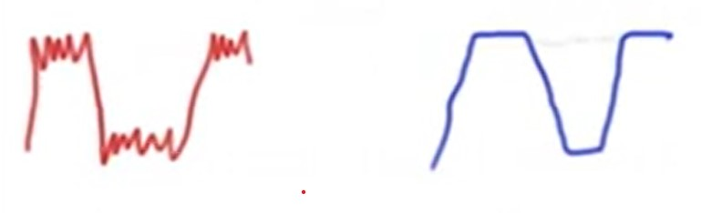
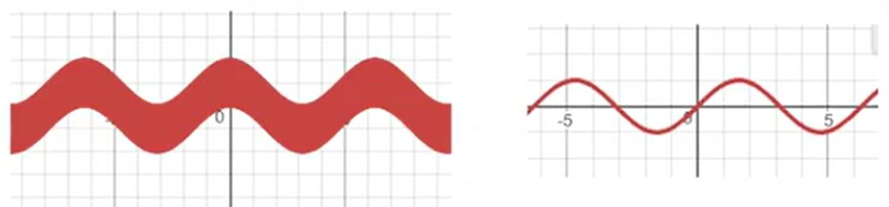
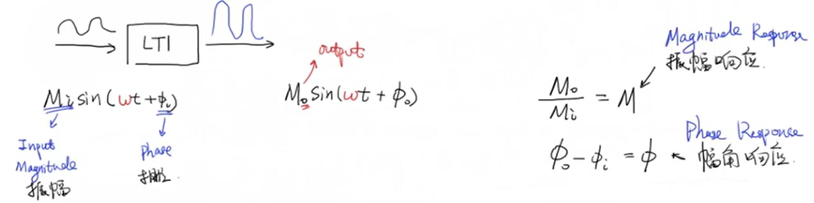
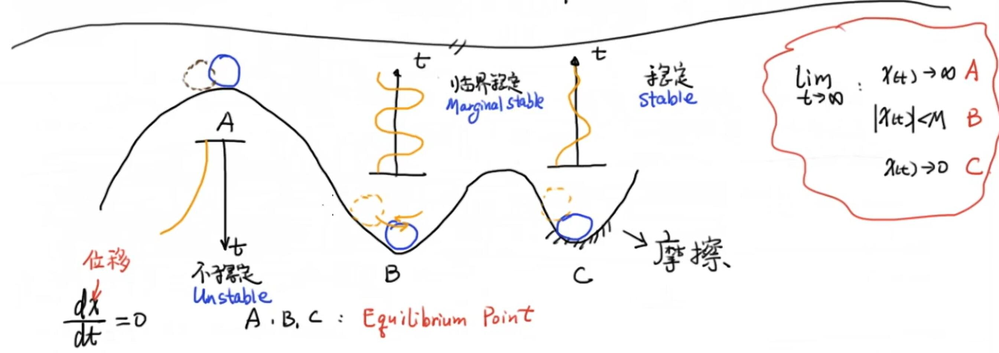
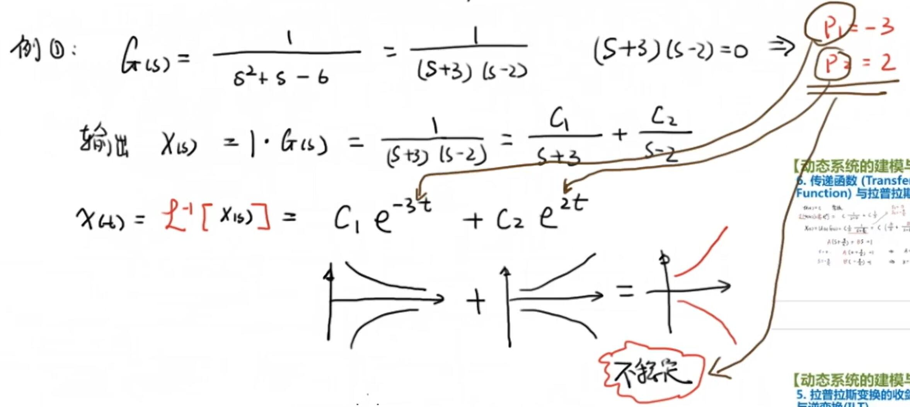
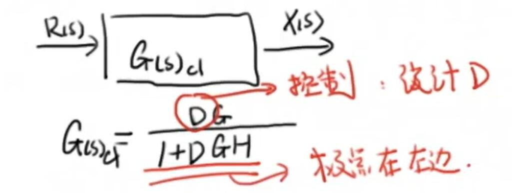
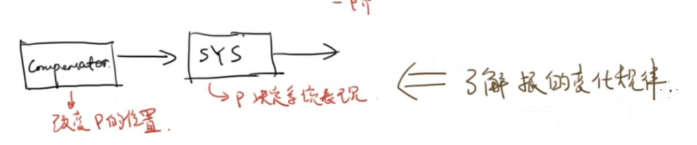
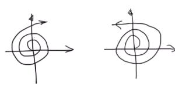

[B站up主DR_CAN，控制之美]([DR_CAN的个人空间_哔哩哔哩_bilibili](https://space.bilibili.com/230105574/channel/seriesdetail?sid=1569595))


控制所干的事就是设计这个控制器，系统的传递函数就是通过系统的建模与分析得到的

[无人机高度 PID 控制很直观的动画演示(rossning92.github.io)](https://rossning92.github.io/pid-simulation/)


# 0、工程数学基础

## 1、特征值与特征向量

`eigenvalue & eigenvector`

**【定义】**：对于一个给定的线性变换 $A$ ，它的特征向量 $\vec v$ 经过这个线性变换的作用之后，得到的新向量仍然与原来的特征向量 $\vec v$ 保持在同一直线上。数学描述为：
$$
A\vec v=\lambda \vec v
$$
其中，$\lambda$ 为标量，即特征向量的长度在该线性变换下缩放的比例，称其为**特征值**。

举例：

设线性变换 $A$ 为：$A=\begin{bmatrix}
1 & 1\\
4 & -2
\end{bmatrix}$，向量 $\vec v_1=\begin{bmatrix}
1 \\
2 
\end{bmatrix}$ ，向量 $\vec v_1$ 经过线性变换 $A$ 作用后的结果为：
$$
A \vec v_1=
\begin{bmatrix}
1 & 1\\
4 & -2
\end{bmatrix}
\begin{bmatrix}
1 \\
2 
\end{bmatrix}=
\begin{bmatrix}
3 \\
0 
\end{bmatrix}
$$


从图上就可以看出，变换后的向量与变换前的向量并不共线，因此，向量 $\vec v_1$ 不是线性变换 $A$ 的特征向量。

再令向量 $\vec v_2=\begin{bmatrix}
1 \\
1 
\end{bmatrix}$ ，向量 $\vec v_2$ 经过线性变换 $A$ 作用后的结果为：
$$
A \vec v_2=
\begin{bmatrix}
1 & 1\\
4 & -2
\end{bmatrix}
\begin{bmatrix}
1 \\
1 
\end{bmatrix}=
\begin{bmatrix}
2 \\
2 
\end{bmatrix}=
2\begin{bmatrix}
1 \\
1 
\end{bmatrix}=
2\vec v_2
$$
可以看出，向量 $\vec v_2$ 经过线性变换 $A$ 作用后得到的新向量与向量 $\vec v_2$ 在同一条直线上。因此，向量 $\vec v_2$ 就是矩阵 $A$ 的特征向量，而这个缩放比例 $2$ 就是矩阵 $A$ 的特征值。

【**求解特征值与特征向量**】

**有几个特征值就有几个特征向量**
$$
A\vec v=\lambda \vec v \\
A\vec v-\lambda \vec v=0 \\
(A-\lambda  I)\vec v=0
$$
我们要求特征向量，因此 $\vec v$ 不能为零，因此，矩阵 $A-\lambda  I$ 的行列式就得为零。即：
$$
|A-\lambda  I|=0\\
\begin{vmatrix}
1-\lambda & 1 \\
4 & -2-\lambda
\end{vmatrix}=0\\
(\lambda-2)(\lambda+3)=0 \\
\begin{cases} 
  \lambda_1=2\\
  \lambda_2=-3
\end{cases}
$$
得到特征值后再带入方程 $(A-\lambda  I)\vec v=0$ 中，得到两个特征值对应的特征向量：
$$
\begin{bmatrix}
1-2 & 1 \\
4 & -2-2
\end{bmatrix}\vec v_1=0 ;\\
\begin{bmatrix}
1-(-3) & 1 \\
4 & -2-(-3)
\end{bmatrix}\vec v_2=0
$$
满足上式的所有向量 $\vec v_1$ 和 $\vec v_2$ 都是特征向量，它们的方向是一样的只是长度不一样无所谓。可分别求出两个特征值对应的两个特征向量：
$$
\begin{cases} 
  \lambda_1=2\\
  \lambda_2=-3
\end{cases}\ \ \ \vec v_1=\begin{bmatrix}
1 \\
1 
\end{bmatrix}\ \ \ \vec v_2=\begin{bmatrix}
1 \\
-4
\end{bmatrix}
$$
**【应用：化对角矩阵，解耦】**

矩阵 $P=\begin{bmatrix}
\vec v_1 & \vec v_2
\end{bmatrix}=\begin{bmatrix}
 1 & 1 \\ 1 & -4
\end{bmatrix}$，称 $P$ 为过渡矩阵。
$$
AP=A\begin{bmatrix}
\vec v_1 & \vec v_2
\end{bmatrix}=
A\begin{bmatrix}
 v_{11} &  v_{21}\\
 v_{12} &  v_{22}
\end{bmatrix}=
\begin{bmatrix}
A\begin{bmatrix}
 v_{11}\\
 v_{12} 
\end{bmatrix} & A\begin{bmatrix}
 v_{21}\\
 v_{22} 
\end{bmatrix}
\end{bmatrix}
$$
根据特征值定义：
$$
A\begin{bmatrix}
 v_{11}\\
 v_{12} 
\end{bmatrix}=\lambda_1\begin{bmatrix}
 v_{11}\\
 v_{12} 
\end{bmatrix}，
A\begin{bmatrix}
 v_{21}\\
 v_{22} 
\end{bmatrix}=\lambda_2\begin{bmatrix}
 v_{21}\\
 v_{22} 
\end{bmatrix}
$$
因此有：
$$
AP=\begin{bmatrix}
 \lambda_1\begin{bmatrix}
 v_{11}\\
 v_{12} 
\end{bmatrix}  &
 \lambda_2\begin{bmatrix}
 v_{21}\\
 v_{22} 
\end{bmatrix}
\end{bmatrix}=
\begin{bmatrix}
 \lambda_1v_{11} & \lambda_2v_{21}\\
 \lambda_1v_{12} & \lambda_2v_{22}
\end{bmatrix}=
\begin{bmatrix}
 v_{11} & v_{21}\\
 v_{12} & v_{22}
\end{bmatrix}\begin{bmatrix}
\lambda_1 & 0\\
 0 & \lambda_2
\end{bmatrix}=P\begin{bmatrix}
\lambda_1 & 0\\
 0 & \lambda_2
\end{bmatrix}
$$
令这个对角矩阵为 $\Lambda=\begin{bmatrix}
\lambda_1 & 0\\
 0 & \lambda_2
\end{bmatrix}$，则得出：
$$
AP=P\Lambda
$$
两边左乘 $P^{-1}$ 可以得到：
$$
P^{-1}AP=P^{-1}P\Lambda \ \ \Rightarrow \ \ \ {\color{Red} P^{-1}AP=\Lambda}
$$
**【应用】**

有一个状态空间的微分方程组为：
$$
\begin{cases} 
  \frac{\mathrm{d} x_1}{\mathrm{d} t} =x_1+x_2 \\
  \frac{\mathrm{d} x_2}{\mathrm{d} t} =4x_1-2x_2
\end{cases}
\Rightarrow \frac{\mathrm{d} }{\mathrm{d} t} {\begin{bmatrix}
x_1 \\
x_2
\end{bmatrix}}={\begin{bmatrix}
1 & 1 \\
4 & -2
\end{bmatrix}}\begin{bmatrix}
x_1 \\
x_2
\end{bmatrix} \\
$$

$$
\dot{x} =Ax
$$

现在的目标是求解 $x$ ，我们令：
$$
\color{Red}x=Py \\
$$
$y$ 为一个未知中间量，则有：
$$
\dot{x} =P\dot{y} \\
Ax=APy
$$
将上面两个式子带入 $\dot{x} =Ax$ ，得到：
$$
P\dot{y}=APy
$$
两边左乘 $P^{-1}$ ，有：
$$
\dot{y}=P^{-1}APy\qquad \Rightarrow \\
{\color{Red} \dot{y}=\Lambda y}
$$
 这是一个很漂亮的公式，他把整个系统解耦了，可以很容易的求得 $y_1,y_2$：
$$
\dot{y}=\Lambda y =\begin{bmatrix}
 2 & 0 \\ 0 & -3
\end{bmatrix}y\ \ \Rightarrow 
\begin{cases} 
  \dot{y_1}=2y_1 \\
  \dot{y_2}=-3y_2
\end{cases}\ \ \Rightarrow 
\begin{cases} 
  y_1=C_1e^{2t} \\
  y_2=C_2e^{-3t}
\end{cases}
$$
有了 $y_1,y_2$ 后再代入 $x=Py$ 去求  $x_1,x_2$：
$$
x=Py=
\begin{bmatrix}
 1 & 1 \\ 1 & -4
\end{bmatrix}
\begin{bmatrix}
 C_1e^{2t} \\
 C_2e^{-3t}
\end{bmatrix}=
\begin{bmatrix}
 C_1e^{2t}+C_2e^{-3t} \\
 C_1e^{2t}-4C_2e^{-3t}
\end{bmatrix}
$$

## 2、复数 欧拉公式

**【复数的三种表达方式】**


1. 代数式： $z=a+b\rm i$ ，$\text{Re}(z)=a,\text{Im}(z)=b$ 。

2. 几何式（极坐标）：只需知道**角度**和**长度**就可以描述一个复数。长度：$|z|=\sqrt{a^2+b^2}$ , 角度：$\theta=\arctan{\frac ba}$ 

3. 指数形式：$z=|z|e^{\text{i}\theta}$​，其中 $|z|=\sqrt{a^2+b^2}$ , $\theta=\arctan{\frac ba}$ 

   【证明】：结合第二种方式和第一种方式。由 2 可以得出：
   $$
   a=|z|\cos \theta \\
   b=|z|\sin \theta
   $$
   再带入 1 式：
   $$
   z=|z|\cos \theta + |z|\sin \theta \text{i}=|z|(\cos \theta +\text{i} \sin \theta)=|z|e^{\text{i}\theta}
   $$

**【欧拉恒等式】**


考虑一个特殊的复数： $|z|=1$ , $\theta=\pi$ .用指数形式写就是
$$
z=e^{i\pi}=-1+0\text{i}=-1\ \ \ \Rightarrow \ \ \ e^{i\pi}+1=0
$$
**【共轭】**


实部相等，虚部互为相反数。换句话说， $|z_1|=|z_2|$ , $\theta_1=-\theta_2$  。因此，如果一个复数为 :
$$
z=|z|e^{i\theta}
$$
那它的共轭就是：
$$
\bar z=|z|e^{-i\theta}
$$
## 3、用 MATLAB 搭建传递函数

**【核心思想】**：从传递函数推出微分方程，在 simulink 中使用积分模块 $\frac 1s$. 

比如一个模块：


这个模块的意思就是：
$$
\frac{Y(s)}{U(s)}= \frac{b_0+b_1s}{a_0+s}
$$
对其进行推导：
$$
a_0Y(s)+sY(s)=b_0U(s)+b_1sU(s)
$$
两边进行逆变换得到时间函数：
$$
a_0y(t)+\dot y(t)=b_0u(t)+b_1\dot u(t) \\
\dot y(t)-b_1\dot u(t)=b_0u(t)-a_0y(t)
$$
接下来只需复现这个等式就可以搭建完成模块，复现这个等式只需使用简单的数学环节就可以


## 4、卷积

**【卷积&线性时不变系统的冲激响应】**

假设有一运算符 $\omicron\{\}$ ，它的输入为 $f(t)$ ，输出为 $x(t)$ ,即：
$$
\omicron\{f(t)\}=x(t)
$$
**线性**：符合叠加原理，即
$$
\omicron\{f_1(t)+f_2(t)\}=x_1(t)+x_2(t) \\
\omicron\{af(t)\}=ax(t) \\
\omicron\{a_1f_1(t)+a_2f_2(t)\}=a_1x_1(t)+a_2x_2(t)
$$
**时不变**：不管在什么时间点，当你对系统施加同样的输入的时候，它的输出都是相同的。
$$
\omicron\{f(t)\}=x(t)\ \ \ \ \Rightarrow\ \ \ \ \omicron\{f(t-\tau)\}=x(t-\tau)
$$


 一个线性的弹簧阻尼系统就可以看成一个 LTI 系统。


对系统施加一个短暂的外力输入，它的位移反应就会开始振动然后衰减。然后来看连续的输入：


可以将一个连续的输入看成是多个离散的短暂输入，这些个短暂的输入之间存在延迟，因此输出也有延迟，然后系统总的输出就是这些个离散的短暂输入响应的一个加和。

某一个时刻，系统的输出就是系统对 t 时刻之前所有输入响应的加和。在上图中，我们将一个连续的输入看成了三个短暂的输入，那在 t 时刻，系统的输出就是这三个输入响应的加和。$\Delta T \rightarrow 0$ 时，这个加和就变成了积分。

看两个辅助函数：
$$
\delta (t)=
\begin{cases} 
  0 \ \ \ \ \ t \ne 0 \\
\infty \ \ \ t=0
\end{cases}\ \ \ \ \ \ \ \  \ \ \ \ \
\delta_{\Delta} (t)=
\begin{cases} 
  \frac{1}{\Delta T}  \ \ \ \ \ 0<t< \Delta T\\
  0 \ \ \ \ \ \ \ \ \ \ \ \ else
\end{cases}
$$

$$
\lim_{\Delta T \to 0}\delta_{\Delta} (t)=\delta (t)
$$

给系统输入这个 $\delta_{\Delta} (t)$ ，我们将输出称为 $h_{\Delta} (t)$ ：


分别来拿看看不同的输入下，系统的输出情况：

|                      输入$f(t)$                      |                   输出$x(t)$                    |
| :--------------------------------------------------: | :---------------------------------------------: |
|                $\delta_{\Delta} (t)$                 |                $h_{\Delta} (t)$                 |
|           $\delta_{\Delta} (t-i\Delta T)$            |           $h_{\Delta} (t-i\Delta T)$            |
|           $A\delta_{\Delta} (t-i\Delta T)$           |           $Ah_{\Delta} (t-i\Delta T)$           |
| $\Delta T f(i\Delta T)\delta_{\Delta} (t-i\Delta T)$ | $\Delta T f(i\Delta T)h_{\Delta} (t-i\Delta T)$ |

对于离散的每一个矩形块，$A=底*高=\Delta T\cdot f(i\Delta T)$ 

当时间 $t=i\Delta T$ 时，输出为所有的加和：
$$
x(t)=\sum_{i=0}^{i} {\Delta T f(i\Delta T)h_{\Delta} (t-i\Delta T)}
$$
当 $\Delta T \rightarrow 0$ 时：
$$
\lim_{\Delta T \to 0} :h_{\Delta} (t)=h(t),\Delta T=d\tau,i\Delta T=\tau
$$
所以：
$$
\lim_{\Delta T \to 0}x(t)=\int_{0}^{t} f(\tau)h(t-\tau)d\tau =f(t)*h(t)
$$
可以看出，对于一个线性时不变系统来讲， **冲击响应 $h(t)$ 可以完全定义系统。** 如果得到一个系统的冲激响应，我们就可以把它和任意的输入来做卷积，得到的就是任意输入在这个系统下的响应。比如在一个房间猛敲一下，得到这个房间系统的冲击响应，再把这个响应和说话声做卷积，得到的就是在这个房间里说话的声音。

**【数学证明】**


$$
频域：&Y(s)=X(s)H(s) \\
时域：&y(t)=x(t)*h(t)
$$
拉氏变换定义：
$$
X(S)=\mathcal{L} [x(t)]=\int_{0}^{\infty } {x(t)e^{-st}\mathrm{d}t}
$$
卷积定义：
$$
x(t)*g(t)=\int_{0}^{t} x(\tau)g(t-\tau)\mathrm{d}\tau
$$
证明：
$$
\mathcal{L} [x(t)*g(t)]=X(s)G(s)
$$

$$
\mathcal{L} [x(t)*g(t)]=\int_{0}^{\infty} \int_{0}^{t} x(\tau)g(t-\tau)\mathrm{d}\tau e^{-st}\mathrm{d}t
$$

先来看下积分区域，把积分顺序进行变换：


$$
\mathcal{L} [x(t)*g(t)]&=\int_{0}^{\infty} \int_{0}^{t} x(\tau)g(t-\tau)\mathrm{d}\tau e^{-st}\mathrm{d}t \\
 &=\int_{0}^{\infty} \int_{\tau}^{\infty }x(\tau)g(t-\tau)e^{-st}\mathrm{d}t\mathrm{d}\tau
$$
对于里面这个积分，令：
$$
t-\tau=u,t=u+\tau,\mathrm{d}t=\mathrm{d}u+\mathrm{d}\tau=\mathrm{d}u
$$
换元后得到：
$$
\mathcal{L} [x(t)*g(t)]&=\int_{0}^{\infty} \int_{0}^{t} x(\tau)g(t-\tau)\mathrm{d}\tau e^{-st}\mathrm{d}t \\
 &=\int_{0}^{\infty} \int_{\tau}^{\infty }x(\tau)g(t-\tau)e^{-st}\mathrm{d}t\mathrm{d}\tau \\
 &=\int_{0}^{\infty} \int_{0}^{\infty }x(\tau)g(u)e^{-s(u+\tau)}\mathrm{d}u\mathrm{d}\tau \\
 &=\int_{0}^{\infty}x(\tau)e^{-s\tau}\mathrm{d}\tau \int_{0}^{\infty }g(u)e^{-su}\mathrm{d}u \\
 &=X(s)G(s)
$$
**结论：**
$$
\mathcal{L} [x(t)*g(t)]=\mathcal{L} [x(t)]\mathcal{L} [g(t)]=X(s)G(s)
$$


# 1. 动态系统的建模与分析

## 1、动态系统建模

描述系统的数学模型

建立依据：

- 电路系统：KCL，KVL
- 流体系统：质量守恒定律
- 机械系统：牛顿定律等

## 2、拉普拉斯变换

**laplace transform**

重要的数学工具，控制理论的基础，把一个时域的函数$f(t)$转换到复数域$F(s)$,大大简化系统分析的难度和复杂程度。

定义：
$$
\mathcal L[f(t)]=F(s)=\int_0^\infty f(t)e^{-st}\mathrm {d}t
$$
其中：
$$
s=\sigma+\mathrm{j}\omega
$$
也就是说将原来的横轴 $t$ 变成了一个二维的复平面，实轴是 $\sigma$ ，虚轴是 $\omega$ ，在这个复平面上看系统的极点和零点的位置。也就是说 $F(s)$ 是一个三维的函数。

当 $\sigma=0$ 时：拉氏变换就是傅里叶变换。
$$
F(s)=F(\omega)=\int_0^\infty f(t)e^{-\mathrm{j}\omega t}\mathrm {d}t
$$
**【常见函数的拉氏变换：】**

|     f(t)     |         F(s)         |            备注             |
| :----------: | :------------------: | :-------------------------: |
|  $e^{-at}$   |    $\frac 1{a+s}$    |          用定义推           |
|  $\sin at$   |  $\frac a{s^2+a^2}$  | 用欧拉公式把$\sin$ 变成指数 |
|   $f'(t)$    |     $sF(s)-f(0)$     | 用定义推，使用一次分部积分  |
|   $f''(t)$   | $s^2F(s)-sF(s)-f(0)$ |                             |
|  $\cos at$   |  $\frac s{s^2+a^2}$  |          结合2、3           |
|      1       |     $\frac 1 s$      |        $e^{-at},a=0$        |
| $\delta (t)$ |          1           |                             |

对于一个简单的RCL电路系统，系统的动态方程为一个微分方程：


$$
e_i=Li''+Ri'+\frac1Ci
$$
其中，电压e_i为输入，电流i为输出。要分析系统即分析电流的变化本质上就是要求解微分方程，输入和输出即系统之间是一个卷积的关系：


因此，要分析这样一个系统，即涉及到微分方程求解，有涉及到卷积，非常复杂，而且不直观，这时候就出现了拉普拉斯变换。通过拉普拉斯变换，微分方程变为代数方程，卷积运算变为乘法运算。

将电路系统的微分方程进行拉氏变换有：
$$
sE(s)=Ls^2I(s)+RsI(s)+\frac1C I(s)\\
I(s)=\frac{s}{Ls^2+Rs+\frac1C}E(s)
$$
这样就把一个微分方程变成了代数方程，很直观很简单，框图就是：


## 3、逆变换

>  在经典控制理论和现代控制理论中，分析和研究的对象是**常系数微分方程**，对应的系统就是**线性时不变系统**。

微分方程是描述动态世界的一种数学手段，动态的世界就是不断变化的，写成数学语言就是一个状态变量随时间不断的变化。直接分析微分方程比较复杂，拉氏变换可以简化分析过程，有时候甚至不需要求解微分方程，直接观察传递函数就可以对系统的表现进行判断了。

用拉氏变换求解微分方程的步骤：

1. 从时域转化到频域：拉氏变换
2. 求解代数方程
3. 从频域转化到时域：逆变换

逆变换：留数法

从逆变换可以发现：传递函数的极点最后进入到了时间函数中 $e^{at}$ 中的 $a$ ，因此：**微分方程的解和极点是密不可分的**，极点的实部部分进入到e的多少次方，虚部部分进入到旋转或者振荡的部分。

## 4、微分方程，拉氏变换和传递函数之间的关系

水箱进出水系统的微分方程：
$$
\dot x(t)+\frac gRx(t)=u(t)
$$
X：系统输出，即液面的高度；u:系统输入，即进水流量；R是流阻

拉氏变换：
$$
sX(s)+\frac gRX(s)=U(s) \\
\frac {X(s)}{U(s)}=\frac1{s+\frac gR}&=G(s)\ \ \ \ (Transfer Function)
$$
进行分析：

假定系统的输入为常数，u(t)=C，变换到频域：
$$
L[u(t)]=L[Ce^0]=C\frac 1{s+0}=C\frac 1s
$$
输出为：
$$
X(s)=U(s)G(s)=C\frac1s\frac1{s+\frac gR}=C(\frac As+\frac B{s+\frac gR})\\
=\frac {CR}{g}(\frac1s-\frac1{s+\frac gR} )
$$
将输出逆变换到时域：
$$
x(t)=L^{-1}[X(s)]=\frac {CR}{g}(e^{0t}-e^{-\frac gR t})\\
=\frac {CR}{g}(1-e^{-\frac gR t})
$$
输出图像可绘制为：


这是典型**的一阶系统的响应**，系统的关键点就在于输出的两个指数部分，$e^{0t}和e^{-\frac gR t}$，0t表明不随时间变化，后面的表明逐渐衰减，因此系统一定是稳定的。

而这两个系数还出现在了$U(s)G(s)$的分母部分，令这个分母部分为零就得到了系统输出的时间函数中对应的e上面的指数部分，这就是极点，有了极点这个概念，就可以**理解经典控制的理念**了。

> **理解经典控制的理念**：就是我们通过设计不同的系统输入$U(s)$，然后用$U(s)$乘以$G(s)$,然后去配置系统的极点，让它的极点达到我们希望的地方，从而达到控制系统输出$x(t)$的目的。

## 5、一阶系统

流体系统是一个典型的一阶系统：


一阶系统传递函数的一般形式：


单位阶跃函数：
$$
u(t)=\begin {cases}
0\ \ \ t=0 \\
1\ \ \ t>0
\end{cases} \\

U(s)=L[u(t)]=\frac 1s
$$
给一阶系统施加一个阶跃输入，则系统输出为：
$$
X(s)=\frac 1s\frac {a}{s+a}=\frac 1s -\frac {1}{s+a}
$$
求逆变换得到系统输出的时间函数：
$$
x(t)=L^{-1}[X(s)]=1-e^{-at}
$$
这里面的 $a$ 对系统的响应起到了决定性的作用。把输出画成图就是：


a越大，收敛越快，但最终都是收敛到1。

引入**时间常数**的概念：`time constant`:
$$
t=\tau=\frac 1a
$$
当$t=\tau$时，系统输出为：
$$
x(\tau)=1-e^{-1}=0.63
$$
就表示，当$t=\tau$时，系统的输出达到最终状态的`63%`

又引入**稳定时间**的概念：就是四倍的时间常数
$$
t_{ss}=4\tau=\frac4a
$$
当$t=t_{ss}$时，系统输出为：
$$
x(t_{ss})=1-e^{-4}=0.98
$$
就表示，当$t=t_{ss}$时，系统的输出达到最终状态的`98%`


> 注意：**时间常数**是系统特有的，对于一个一阶线性系统来说，时间常数是可以区别这个系统不同于其他系统的重要特征，因此用时间常数来做**系统识别**

系统识别的过程：


假定输入流量为C，若稳定时间为4那就说明4s时候达到了98%，因此可以计算出输入流量应该是$C=5$，这就是系统识别的结果

这种分析的方法叫`step test`，可以用来分析系统的特性。

如果把一阶系统的传递函数拿给学**信号处理**的同学来看，这就是一个**低通滤波器**，也就是说：



输出只反映了低频率的变化而没有高频率的变化。对于这个流体系统来说，**这个容器就起到了抵抗高速变化的作用**，因为它**有积累**。**可以说有积累的都是低通滤波器，对高速的变化不敏感**。比如，最典型的积累就是积分：
$$
cosx+cos100x\ \ 积分后\Rightarrow sinx+\frac1{100}sin100x
$$


从图片就可以看出，输出时候这个高配的部分就被过滤掉了。其实这个过滤就是把高配的部分给缩小了100倍。

## 6、一阶系统的频率响应&滤波器

对于一个线性时不变系统（LTI）来说，当一个正弦信号通过他的时候，在稳定状态下，系统的输出和输入的频率相同，只是幅值和相位发生了变化，对应幅频响应和相频响应。



例如如下系统：输入信号进过一个积分和扩大的线性变换，输出的信号频率未发生改变，只是赋值和相位有所变化。


**【频率响应推导】：**

>预备数学知识

这里有一个预备知识：

假设有一个信号为这样：
$$
u(t)=A\sin \omega t+B\cos \omega t
$$
其中 $A，B$ 为任意常数。可以推导出如下结论：
$$
A\sin \omega t+B\cos \omega t=\sqrt{A^2+B^2}(\frac A{\sqrt{A^2+B^2}}\sin \omega t+\frac B{\sqrt{A^2+B^2}}\cos \omega t)\\=
\sqrt{A^2+B^2}(\cos \varphi\sin\omega t+\sin\varphi\cos \omega t)\\
=\sqrt{A^2+B^2}(\sin(\omega t+\varphi))
$$
其中：
$$
\varphi=\arctan \frac BA
$$
因此：一个一般形式的正弦信号 $M(\sin(\omega t+\varphi))$ 可以写成 $u(t)=A\sin \omega t+B\cos \omega t$ 的形式。 


分析下一阶系统的频率响应：

典型的一阶系统：
$$
G(s)=\frac a{s+a}
$$
令$s=\mathrm{j}\omega$：
$$
G(\mathrm{j}\omega)=\frac a{a+\mathrm{j}\omega}=\frac {a(a-\mathrm{j}\omega)}{(a+\mathrm{j}\omega)(a-\mathrm{j}\omega)}=\frac {a^2-a\mathrm{j}\omega}{a^2+\omega^2}\\
=\frac {a^2}{a^2+\omega^2}+(-\frac {a\omega}{a^2+\omega^2})\mathrm{j}
$$


> 这个$G(j\omega)$就是一个复数，不要想太复杂

计算幅值响应：
$$
|G(\mathrm{j}\omega)|=\sqrt{\frac{1}{1+(\frac{\omega}{a})^2}}
$$
从这个表达式可以看出：

- 当$\omega<<a$时，$|G(j\omega)|\rightarrow1$
- 当$\omega$增大时，$|G(j\omega)|$减小
- 当$\omega=a$时，$|G(j\omega)|=0.707$
- 当$\omega>>a$时，$|G(j\omega)|\rightarrow0$

画成图就是：(纵坐标改成20log就是伯德图)


可以看出随着频率上升振幅显著减少，是典型的低通滤波器。 

生活中有很多的系统都表现出低通滤波器的性质：比如空调房间内的温度、水箱系统、RC系统等。这些系统都表现出一个相同的性质，就是无论你输入的频率有多快（空调开关频率、水阀开关频率、电压变化频率），系统的状态输出都不会发生很快频率的变化（房间温度、液面高度、电容电压）。通过观察这些系统可以发现：系统中都存在一个“**容器**”，容器在数学上就是一个积分，积分的拉氏变换就是 $\frac 1s$，对应频率响应就是$-\frac1{\omega}\mathrm{j}$，对应赋值响应就是$\frac1{\omega}$，随着频率增大，幅值是越来越小的。而从直观的角度来看，容器提供了一种缓冲机制，而这个缓冲为系统的反应带来了一些延迟，从而抵消了高速变化输入的影响。


如何实现高通滤波？
$$
|G(j\omega)|=\sqrt{\frac{1}{1+(\frac{\omega}{a})^2}}
$$
让上述式子中的$\omega$和a变换一下位置就可实现了，对应传递函数就是$G(s)=\frac{s}{s+a}$

## 7、二阶系统

由牛顿第二定律决定，现实生活的运动现象普遍都是二阶的，典型系统就是弹簧阻尼振动系统。

分析二阶系统就是用一个阶跃信号，输入乘以传递函数得到输出，再逆拉氏变换后看响应的时间函数，从而评估控制器和系统的性能。

评估指标就有上升时间、超调量，稳态时间等等

## 8、二阶系统频率响应

典型二阶系统的传递函数：
$$
G(s)=\frac {\omega_n^2}{s^2+2\zeta\omega_ns+ \omega_n^2}
$$
频率响应函数：
$$
G(j\omega)=\frac {\omega_n^2}{-\omega_n^2+2\zeta\omega_nj\omega_+ \omega_n^2}\\
=\frac{1-\Omega^2}{(1-\Omega^2)^2+4\zeta^2\Omega^2}-\frac{2\zeta\Omega}{(1-\Omega^2)^2+4\zeta^2\Omega^2}j
$$
其中：
$$
\Omega=\frac{\omega}{\omega_n}
$$
幅值响应：
$$
|G(j\omega)|=\sqrt \frac{1}{(1-\Omega^2)^2+4\zeta^2\Omega^2}
$$
**分析：**

1. 当$\Omega=0$，即$\omega=0$，此时$|G(j\omega)|=1$，输出幅值不变。
2. 当$\Omega\rightarrow \infty$，即$\omega>>\omega_n$，此时$|G(j\omega)|\rightarrow0$，输出幅值为0。可以看出，二阶系统本质上也是低通滤波器。
3. 当$\Omega=1$，即$\omega=\omega_n$，此时$|G(j\omega)|=\frac1{2\zeta}$。
   1. 当$\zeta<0.5$，时，$|G(j\omega)|>1$
   2. 当$\zeta>0.5$，时，$|G(j\omega)|<1$

由于$\Omega=0$时$|G(j\omega)|=1$，当$\Omega\rightarrow \infty$时$|G(j\omega)|=0$，而在当$\zeta<0.5$时又存在一个大于1的区域，因此，当$\zeta$比较小的时候肯定在$\Omega=1$附近存在一个极值。

求出这个极值：对分母部分求导：
$$
\frac d{d\Omega}(1-\Omega^2)^2+4\zeta^2\Omega^2=0
$$
求得：
$$
\Omega=\sqrt{1-2\zeta^2}
$$
因此当$1-2\zeta^2>0$，时存在极值，此时：
$$
\Omega=\frac{\omega}{\omega_n}=\sqrt{1-2\zeta^2}\ \ \ \Rightarrow\ \ \ \omega=\omega_n\sqrt{1-2\zeta^2}
$$
这个频率就是系统的共振频率，可以看出，当$\zeta$比较小的时候，共振频率就是固有频率了。

把这个共振频率代入赋值响应中得到共振幅值：
$$
|G(j\omega)|_{\omega=\omega_n\sqrt{1-\zeta^2}}=\frac1{2\zeta\sqrt{1-\zeta^2}}
$$
根据前面分析部分，当$\Omega=1$，即$\omega=\omega_n$时$|G(j\omega)|=\frac1{2\zeta}$：

- 当$\zeta=1$，$\omega=\omega_n$时，$|G(j\omega)|=\frac1{2}$
- 当$\zeta=0.5$，$\omega=\omega_n$时，$|G(j\omega)|=1$
- 当$\zeta=0.5$，$\omega=\omega_n\sqrt{1-2\zeta^2}$时，$|G(j\omega)|=1.16$
- 当$\zeta=0$时，共振频率就是固有频率，$|G(j\omega)|=\infty$


可以看出，对于阻尼比比较小的系统来说，如果外力的频率在系统固有频率附近，系统就会表现出强烈的振动。

## 9、伯德图

伯德图是表现频率响应的一种图示方法，对于一个线性时不变系统，如果输入是一个正弦量，那在稳定状态下，输出也一定是个正弦信号，输出和输入有相同的频率，输出的幅值和相位发生变化，变化量由振幅响应和相位响应描述：


把这两个响应用图像表现出来就是伯德图，注意伯德图的纵坐标单位是$20\log$。

绘制伯德图用MATLAB的`bode()`函数就行，例如对如下传递函数的系统：
$$
G(s)=\frac{s+2}{s+4}
$$
绘图命令是：

```matlab
bode([1 2],[1 4])
```

绘图结果：


> 为什么要取$20\log$?

例如，60dB和80dB只差了20，但是从能量和强度的角度来看，他们之间差了100倍，

dB：decibel , deci 是十分之一的意思，bel就是发明电话的bell。分贝本来是描述电话或电报的信号损失的：
$$
\text {dB}=10\log_{10}{\frac{P_M}{P_R}}
$$
其中，$P_M$是measurement Power，$P_R$是reference Power。所以分贝就是能量的等级再取对数，取分贝得原因就是可以把很大的数量级缩小，达到简化的作用。例如声音的强度，在电锯旁和平常声音强度的差距在10的12次方左右，差距非常大，但是取分贝后他俩只差了120db。（10的12次方是12个10相乘，120是12个10相加）

那伯德图为什么取20倍的log？

因为伯德图体现的是振幅的一个比例，而振幅和功率（能量）的关系是一个平凡的关系，例如：$1/2mv^2$。因此，在这个dB 的定义中就可以把能量的部分替换成振幅的部分。
$$
\text {dB}=10\log_{10}{\frac{P_M}{P_R}}=10\log_{10}({\frac{M_o}{M_i}})^2=20\log_{10}{\frac{M_o}{M_i}}
$$
**积分的伯德图：**

传递函数：
$$
G(s)=\frac{1}{s}\\
$$
频响函数：
$$
G(j\omega)=\frac{1}{j\omega}\\
|G(j\omega)|=\frac{1}{\omega}\\
\angle G(j\omega)=\arctan\frac{虚部}{实部}=\arctan\infty=\frac{\pi}{2}
$$
化成分贝：
$$
20\log_{10}|G(j\omega)|=20\log_{10}\frac{1}{\omega}=20\log_{10}{\omega}^{-1}=-20\log_{10}{\omega}
$$


解释： 随着$\omega$每增加10倍，就下降20dB。


**一阶系统的伯德图**

传递函数：
$$
G(s)=\frac{a}{s+a}
$$
幅值响应和相位响应：


$$
|G(j\omega)|=\sqrt{\frac{1}{1+(\frac{\omega}{a})^2}}\\
\angle G(j\omega)=-\arctan\frac{\omega}a
$$
分析：

低频时，$\omega<< a$，此时$|G(j\omega)|= 1$，$20\log_{10}|G(j\omega)| =0$，$\angle G(j\omega) =0$

截止频率时，$\omega= a$，此时$|G(j\omega)|= \sqrt{1/2}$，$20\log_{10}|G(j\omega)| =20\log_{10}\sqrt{1/2}=-3dB$，这个-3的意义就是输出振幅是输入振幅的$\sqrt{1/2}$，而在能量的角度来看要再平方一下，就是输出的能量是输入能量的1/2。

$\angle G(j\omega) =\arctan1=-45°$

高频时，$\omega>> a$，此时$|G(j\omega)|= \frac1{\omega}$，$20\log_{10}|G(j\omega)| =-20\log_{10}{\omega}$，$\angle G(j\omega) =-90°$,也就是说，高频时以**20dB**每10倍频率下降。


伯德图的好处就是可以把乘积变成加和，就可以把非常复杂的传递函数分来来处理。


# 2. 自动控制原理

## 1、开环与闭环系统

这是控制理论控制原理的核心

开环：

1. 柴火烧水，输入热量，输出水温。只要打开开关，水烧干了也不会停止
2. 电风扇

闭环：智能热水壶，可以设置目标温度并保温。这种目标温度就叫做参考温度，工作时会有一个传感器实时测量水温，并把这个值和参考值进行比较，二者的差会输入**控制器**，这个控制器会根据误差的大小来调节输入，也就是控制输入的热量。若误差为正，说明水温不够，这个时候控制器就会提高热量的输入；反之就会减少热量输入。

**这里面的这个控制器就是做控制做自动化的核心研究对象。**

**最简单的控制器：比例控制**


开环与闭环的根本区别就是输入换热输出之间有无关系，输出反馈到输入就是闭环。空调就是闭环。

**对流体水箱系统的控制：**

水箱系统的模型：


对这样的系统，如果输入是一个常数 $C$，那系统的最终输出会是这个图的样子：


假如我们现在的控制目标是让水箱液面高度 $h$ 趋近于 $h_d$ ，那只需令：
$$
\frac{CR}g=h_d\ \ \ \Rightarrow\ \ \ C=\frac{h_dg}{R}
$$
也就是说令输入 $u=C=\frac{h_dg}{R}$，最终就会达到我们要控制的液面高度了。**这就是一个开环控制**

这样可以是吗？

在现实生活中，往往存在着一些未知的不确定因素。比如容器在漏水、阀门有生锈等等。者都会使我们的开环系统不在可靠，无法保证页面维持到我们需要的高度上。这个时候就要引入反馈，闭环控制。

闭环就是引入传感器、控制器，传感器传递函数为$H(s)$ ,控制器传递函数为 $D(s)$，


闭环控制框图再简化可得到新的系统的传递函数:


这样就得到了一个新的传递函数，这是$V$和$X$之间一种开环形式的框图了，而这个框图和上面的框图是等价的。因此，从这里开始，我们的研究方向就变成了研究这个新的系统的传递函数了，而其中的 $D$ 就是我们需要设计的控制器，也是我们研究的重点。通过不同的控制方法，做系统的稳定性分析、误差分析等。

## 2、稳定性分析

稳定性是控制的基础，在这个基础上面才有系统的瞬态分析。稳态分析、控制、最优化等。对于一个系统来说，稳定是第一位的，没有稳定，其他一切都无从谈起。


>  **系统的稳定就是说系统传递函数的极点在复平面的左半部分**

**稳定的定义：**



如图所示，ABC三处都是平衡点，但只有C处是稳定的，B临界稳定，A不稳定。

对B系统来说，给个输入，就是踢一脚小球，如果这个踢的力不太大，那球就会在B点左右摆。也就是说，如果输入是有界的，那系统的输出也是有界的。这叫**BIBO稳定（bounded-input bounded-output）**。生活中的很多情况一般都是这种稳定系统，比如平衡车。


**研究系统的稳定性，就是给系统一个单位冲击输入，也就是给系统一个冲击、踢一脚。足够快，足够有力。看系统响应后能不能回到平衡点。而单位冲击的拉氏变换就是1，因此输入乘以传递函数还是传递函数本身，所以研究系统的传递函数本身就可以研究系统的稳定性**

例如：如下系统就是不稳定的，因为有一个极点在复平面的右半轴。



例2：这个系统就是稳定的，其中指数项是个衰减的，三角函数项是个有界振荡的，二者相乘就是边振荡变衰减。


极点的位置对于系统的稳定性及收敛方式：


从图上可以看出，极点在复平面的左半部分那系统就是稳定的；有一个几点落在有半部分那就是发散的。

有了这个概念，在设计控制器的时候，我们的目标就是**通过设计控制器的传递函数，使得系统的传递函数的极点在左半平面**，这就是经典控制的核心理念。



**补充：初值不为零时的系统分析**


可以看出，传递函数不变，只是输入可以看成是原始输入的基础上再叠加一个冲击，而这个冲击输入对系统的稳定性是没有影响的。

## 3. 比例控制

**最简单的控制器：比例控制**，就是控制最终输入系统的值是误差的一个比例。误差越大系统输入就越大，就很直观。


但是这个比例系数应该是多少呢？就是系统误差多大的时候该给系统多大的输入？就得调


比例控制器存在稳态误差，它只能稳定系统，但是无法使系统精准的达到我们设定的参考值。这就需要引入新的手段。

## 4、终值定理&稳态误差

**终值定理：**

时域上 $t\rightarrow\infty$ 就等价于 频域上 $s\rightarrow0$ ：

例如，若系统的时间输出为$x(t)$ 对于频域为 $X(s)$，则：
$$
\lim_{t\rightarrow\infty}{x(t)}=\lim_{s\rightarrow 0}{sX(s)}
$$
不用求拉普拉斯逆变换，直接在s域就可以得出在时间域上系统的稳态输出值。

终止定理的适用条件就是系统首先得是稳定的，即 $\lim_{t\rightarrow\infty}{x(t)}$ 首先得存在。

例：用终值定理求弹簧阻尼系统的稳态输出值：


**稳态误差：**

定义为当时间趋于无穷时，系统的输出和输入的参考值之差。


$$
e_{ss}=r-\lim_{t\rightarrow\infty}{x(t)}
$$
其中，$r$ 为系统的输入参考值。

例如一个比例控制的一阶系统：


其中， $R(s)$ 是系统的参考值或目标值，通过化简可以得出系统的输出为：
$$
X(s)=\frac{K_pR(s)}{as+1+K_p}
$$
 $R(s)$ 是系统的参考值肯定是稳定的，只需要看分母这个多项式的极点的实部小于0就行。即：
$$
s=\frac{-1-K_p}a<0\ \ \ \Rightarrow\ \ \ K_p>-1
$$
因此，对于这个系统，只要比例控制器的 $K_p>-1$ ,系统就是稳定的，可以使用终值定理来求系统最终的稳态输出。 设系统的参考值为常数 $r$，对应拉氏变换后的输入为 $R(s)=\frac rs$ :
$$
X(s)=\frac{K_p\frac rs}{as+1+K_p}
$$
使用终值定理求出系统的稳态输出：
$$
\lim_{t\rightarrow\infty}{x(t)}=\lim_{s\rightarrow 0}{sX(s)}=\lim_{s\rightarrow 0}{s\frac{K_p\frac rs}{as+1+K_p}}=\frac{K_pr}{1+K_p}
$$
求出稳态误差：
$$
e_{ss}=r-\lim_{t\rightarrow\infty}{x(t)}=r-\frac{K_pr}{1+K_p}=\frac{r}{1+K_p}
$$
从这个式子就可以看出：**比例系数 $K_p$ 越大，则稳态误差越小。$K_p\rightarrow\infty$ 时稳态误差为零，**但实际上不看把比例系数调的太大，会引起输入过大。因此，仅靠比例控制是无法消除稳态误差的。

## 5、比例积分控制

仅靠比例控制是无法消除稳态误差的，如果希望系统能够准确的追踪目标值，那就需要重新设计控制器。

假设我们新设计的控制器的传递函数是 $C(s)$ , 这个控制器的目标就是使得 $e_{ss}=0$ ,从而使得 $\lim_{t\rightarrow\infty}{x(t)}=r$ 。把这个控制器的传递函数带入上节推导的系统输出，得到新控制器下系统的输出为：
$$
X(s)=\frac{C(s)\frac rs}{as+1+C(s)}
$$
现在我们的目标就是设计 $C(S)$ 使系统稳定。同样使用终值定理来求：
$$
\lim_{t\rightarrow\infty}{x(t)}=\lim_{s\rightarrow 0}{sX(s)}=\lim_{s\rightarrow 0}{s\frac{C(s)\frac rs}{as+1+C(s)}}=\lim_{s\rightarrow 0}\frac{C(s)r}{1+C(s)}
\\=r-\lim_{s\rightarrow 0}\frac{r}{1+C(s)}
$$
若系统最终精确达到参考值 $r$ , 则：
$$
r=r-\lim_{s\rightarrow 0}\frac{r}{1+C(s)}\ \ \Rightarrow\ \ \lim_{s\rightarrow 0}\frac{r}{1+C(s)}=0\\
\Rightarrow\ \ \lim_{s\rightarrow 0}C(s)=\infty
$$
这个时候很自然的就令 
$$
C(s)=\frac1s
$$
此时自然满足这个条件，而 $\frac1s$ 的原函数就是一个积分。因此，引入一个积分就可以令系统的稳态误差为0了。

一般情况下，使用积分控制时要加一个系数
$$
C(s)=\frac{K_i}s
$$
这个 $K_i$ 用来控制这个积分的增益，通过调节 $K_i$ 系统就会有不同的表现。

将 $C(s)=\frac{K_i}s$ 带入稳态输出，看看输出是什么：


**这其实就是二阶系统的阶跃响应！**


以上是比例控制和积分控制的一个对比，黄色是参考值，蓝色是比例控制，存在稳态误差。红色是积分控制，消除了稳态误差。

> **积分控制存在振荡的原因是引入积分后将系统变成了一个二阶的系统。**

将比例和积分结合一下就会有一个新的控制器产生， 即快又准：（图中绿色的）


## 6、根轨迹

掌握系统根的变化规律，从而设计控制器/补偿器

“根”和极点是一样的概念。

**一阶系统：**


对于一般的一阶系统，根一定是落在实轴上面的，如果根在左半轴，系统就是衰减的，在右半轴就是发散的；**根越往左，系统衰减越快**。而一阶系统的评价指标，如时间常数、稳定时间等都与这个根的位置息息相关。

**二阶系统：**


对于二阶系统，如果我们想办法把系统的根往左移，可以看到系统的振动频率不变，但系统会更快地衰减。二阶系统的性能指标，如上升时间、超调量、稳定时间等也和根的位置有关。

根的位置（在复平面的位置）对系统表现有着至关重要的影响，因此自然而然就可以想到设计一个**补偿器**来改变根的位置，从而达到影响系统表现的一个作用。而设计补偿器的前提就是得知道根的变化规律是什么，根是如何变化的，才可以去控制它。



根轨迹的基本形式：


这是一个闭环系统，有一个增益 $K$ 它的开环传递函数是 $G(s)$ ,这个系统对于的闭环传递函数就是：
$$
\frac{KG(s)}{1+KG(s)}
$$
我们研究的就是这个分母部分 $1+KG(s)$，**根轨迹研究的是：当K从 0 到 正无穷变化时，闭环系统的根（极点）位置的变化规律。** 

注意：我们研究的是 $1+KG(s)=0$ 时的根，也就是闭环传递函数的极点，而我们的研究对象，分析对象却是这个开环传递函数 $G(s)$ 。即通过研究 $G(s)$ 来分析 $1+KG(s)=0$ 时的根。


## 7、超前补偿器、滞后补偿器

比例微分控制，需要引入能量源，且对高频信号太敏感。

## 8、PID控制

[无人机高度 PID 控制很直观的动画演示(rossning92.github.io)](https://rossning92.github.io/pid-simulation/)

- 当前误差；快速调节，每次调节的量是误差的 $K_P$ 倍。
- 过去误差；消除稳态误差，是对过去所有的误差求和
- 误差的变化趋势；抑制超调，根据当前时刻与前一时刻误差量的差值做预测：若 $\Delta err>0$ ，说明误差在增大，就要加大控制强度； 若 $\Delta err<0$ ，说明误差在减小，就要减小控制强度。

一种直观理解的例子：洗澡水的温度控制：


通过控制器后输入系统的输入为：
$$
u=K_Pe+K_I\int e dt+K_D\frac{de}{dt}
$$
两边做拉氏变换：
$$
U(s)=(K_P+K_I\frac 1s+K_Ds)E(s)
$$
放到框图里面就是：


**【PD控制】：**相当于增加了一个零点，可以提高系统的稳定性，可以改善系统的瞬态响应

**【PI控制】：**可以改善稳态误差

把这两个结合起来就得到了**【PID控制】**


# 3、矩阵导数运算

## 1、标量方程对向量的导数

​	一元函数求极值：
$$
\frac{\text{d}f(y)}{\text{d}y}=0
$$
多元函数求极值：
$$
\begin{cases}
	\frac{\text{d}f(y_1,y_2)}{\text{d}y_1}=0 \\
	\frac{\mathrm{d}f(y_1,y_2)}{\text{d}y_2}=0 \\
\end{cases}
$$
为了简化，令：
$$
\vec Y=
\begin{bmatrix}  
  y_1  \\  
  y_2    
\end{bmatrix},f(\vec Y)=f(y_1,y_2)
$$
则上面的求导就可以简写写成向量（矩阵）的形式：
$$
\frac{\mathrm{d}f(\vec Y ) }{\mathrm{d}\vec Y } =
\begin{cases}
	\frac{\text{d}f(y_1,y_2)}{\text{d}y_1} \\
	\frac{\mathrm{d}f(y_1,y_2)}{\text{d}y_2} \\
\end{cases}
$$
**【定义】**

假设有一个函数： $f(\vec Y)$ , 其中 $\vec Y=\begin{bmatrix}  
  y_1  \\  y_2 \\\vdots\\y_m \end{bmatrix}$，则函数 $f(\vec Y)$ 对向量 $\vec{Y}$ 的偏导为：
$$
\frac{\partial f(\vec{Y} )}{\partial \vec{Y}} =
\begin{bmatrix}
 \frac{\partial f(\vec{Y} )}{\partial y_1}\\
 \frac{\partial f(\vec{Y} )}{\partial y_2} \\
 \vdots\\
\frac{\partial f(\vec{Y} )}{\partial y_m}

\end{bmatrix}
$$
其中， $f(\vec Y)$ 是个 $1\times1$ 的标量 ， $\vec{Y}$ 是 $m\times1$ 的，而这个 $\frac{\partial f(\vec{Y} )}{\partial \vec{Y}}$ 也是一个 $m\times1$ 的列向量。即导数矩阵的行数与分母部分（$\vec{Y}$）的行数相同，这样的定义叫做**分母布局**。

同理，若把 $\frac{\partial f(\vec{Y} )}{\partial \vec{Y}}$ 写成一个 $1\times m$ 的行向量，这样导数矩阵的行数与分子部分（$f(\vec{Y})$）的行数相同，这样的定义叫做**分子布局**。

> 分母布局与分子布局呈转置关系，推导时只能按一种布局方式来推导，要么分母布局要么分子布局！如果不合适会导致矩阵维度不同无法运算。

## 2、向量方程对向量的导数

函数 $f(\vec Y)$ 是个标量方程，即因变量 $f(\vec Y)$ 是一个标量。若方程也是个向量，即：
$$
\vec{F}(\vec{Y}) =
\begin{bmatrix}
f_1(\vec{Y})\\
f_2(\vec{Y})\\
\vdots \\
f_n(\vec{Y})
\end{bmatrix}_{n\times 1}
$$
其中，$\vec{F}(\vec{Y})$ 是个 $n\times 1$ 的列向量， $\vec{Y}$ 是 $m\times1$ 的列向量。

---

**【举个例子：】**
$$
\vec{F}(\vec{Y}) =
\begin{bmatrix}
f_1(\vec{Y})\\
f_2(\vec{Y})\\
\end{bmatrix}_{n\times 1} 
=\begin{bmatrix}
y_1^2+y_2^2+y_3\\
y_3^2+2y_1\\
\end{bmatrix}_{n\times 1}
$$
其中，自变量  $\vec Y=\begin{bmatrix}  
  y_1  \\  y_2\\ y_3 \end{bmatrix}_{3\times1}$

---

**【定义】**

此时定义向量方程对向量的导数：
$$
\frac{\partial \vec F(\vec{Y} )_{{\color{Red} n\times 1} }}{\partial \vec{Y}_{_{{\color{Red} m\times 1} }}}
$$
可以看出分子是个 $n\times 1$ 的，分母是 $m\times1$ 的。若采用 **分母布局**，则可以知道 $\frac{\partial \vec F(\vec{Y} )_{{\color{Red} n\times 1} }}{\partial \vec{Y}_{_{{\color{Red} m\times 1} }}}$ 矩阵最终有 $m$ 行，那我们首先写出这 $m$ 行：
$$
\frac{\partial \vec F(\vec{Y} )_{{\color{Red} n\times 1} }}{\partial \vec{Y}_{_{{\color{Red} m\times 1} }}} =
\begin{bmatrix}
 \frac{\partial \vec F(\vec{Y} )}{\partial y_1}\\
 \frac{\partial \vec F(\vec{Y} )}{\partial y_2} \\
 \vdots\\
\frac{\partial \vec F(\vec{Y} )}{\partial y_m}

\end{bmatrix}_{{\color{Red} m行} }
$$
然后再把其中的每一行展开：
$$
\frac{\partial \vec F(\vec{Y} )_{{\color{Red} n\times 1} }}{\partial \vec{Y}_{_{{\color{Red} m\times 1} }}} =
\begin{bmatrix}
 \frac{\partial \vec F(\vec{Y} )}{\partial y_1}\\
 \frac{\partial \vec F(\vec{Y} )}{\partial y_2} \\
 \vdots\\
\frac{\partial \vec F(\vec{Y} )}{\partial y_m}

\end{bmatrix}=
\begin{bmatrix}
 \frac{\partial f_1(\vec{Y} )}{\partial y_1} & \frac{\partial f_2(\vec{Y} )}{\partial y_1} & \cdots & \frac{\partial f_n(\vec{Y} )}{\partial y_1}\\
 \vdots  & \ddots  &  & \vdots\\
 \vdots  &  & \ddots & \vdots\\
 \frac{\partial f_1(\vec{Y} )}{\partial y_m} &  \frac{\partial f_2(\vec{Y} )}{\partial y_m} & \cdots & \frac{\partial f_n(\vec{Y} )}{\partial y_m}
\end{bmatrix}_{{\color{Red} m\times n} }
$$
最终得到的矩阵是  $m\times n$ 的。

---

**【对上面的例子求导】**
$$
\vec{F}(\vec{Y}) =
\begin{bmatrix}
f_1(\vec{Y})\\
f_2(\vec{Y})\\
\end{bmatrix}_{n\times 1} 
=\begin{bmatrix}
y_1^2+y_2^2+y_3\\
y_3^2+2y_1\\
\end{bmatrix}_{n\times 1}
$$
其中，自变量  $\vec Y=\begin{bmatrix}  
  y_1  \\  y_2\\ y_3 \end{bmatrix}_{3\times1}$
$$
\frac{\partial \vec F(\vec{Y} )_{{\color{Red} 2\times 1} }}{\partial \vec{Y}_{_{{\color{Red} 3\times 1} }}} =
\begin{bmatrix}
 \frac{\partial \vec F(\vec{Y} )}{\partial y_1}\\
 \frac{\partial \vec F(\vec{Y} )}{\partial y_2} \\
 \frac{\partial \vec F(\vec{Y} )}{\partial y_3}
\end{bmatrix}=
\begin{bmatrix}
 \frac{\partial f_1(\vec{Y} )}{\partial y_1} & \frac{\partial f_2(\vec{Y} )}{\partial y_1} \\
 \frac{\partial f_1(\vec{Y} )}{\partial y_2} & \frac{\partial f_2(\vec{Y} )}{\partial y_2} \\
 \frac{\partial f_1(\vec{Y} )}{\partial y_3} &  \frac{\partial f_2(\vec{Y} )}{\partial y_3} 
\end{bmatrix}_{{\color{Red} 3\times 2} }=
\begin{bmatrix}
 2y_1 & 2\\
 2y_2 & 0\\
 1 & 2y_3
\end{bmatrix}_{{\color{Red} 3\times 2} }
$$
最终得到的矩阵是  $3\times 2$ 的，如果使用的是 **分子布局** ，那最终得到的就是它的转置。

## 3、常用特例

**【1，$\frac{\partial {A\vec{Y} }}{\partial \vec{Y}} =A^{\rm T}$】**

设一个 $m\times1$ 的向量 $\vec Y=\begin{bmatrix}  
  y_1  \\  y_2 \\\vdots\\y_m \end{bmatrix}_{{\color{Red} m\times 1} }$, $m\times m$ 的方阵 $A=\begin{bmatrix}
 a_{11} &\cdots   & a_{1m}\\
 \vdots  & \ddots  & \vdots\\
 a_{m1} &\cdots  & a_{mm}
\end{bmatrix}_{{\color{Red} m\times m} }$,则这个矩阵与向量的乘积的导数为：
$$
\frac{\partial {A\vec{Y} }}{\partial \vec{Y}} =A^{\rm T}
$$
证明：用到第2小节，【2、向量方程对向量的导数】。

$A\vec{Y}$ 为向量 $ \vec Y$  的向量函数：
$$
A\vec{Y}=\begin{bmatrix}
a_{11}y_1+a_{12}y_2 \\
a_{21}y_1+a_{22}y_2
\end{bmatrix}_{{\color{Red} 2\times 1} }
$$
套用【2、向量方程对向量的导数】的结论：
$$
\frac{\partial {A\vec{Y} }}{\partial \vec{Y_{{\color{Red} 2\times 1} }}} =
\begin{bmatrix}
\frac{\partial {A\vec{Y} }}{\partial y_1} \\
\frac{\partial {A\vec{Y} }}{\partial y_2}
\end{bmatrix}_{{\color{Red} 2行} }\overset{每行展开}{\Longrightarrow} 
\begin{bmatrix}
\frac{\partial \left ( a_{11}y_1+a_{12}y_2 \right ) }{\partial y1} & \frac{\partial \left ( a_{21}y_1+a_{22}y_2 \right ) }{\partial y1} \\
\frac{\partial \left ( a_{11}y_1+a_{12}y_2 \right ) }{\partial y2} & \frac{\partial \left ( a_{21}y_1+a_{22}y_2 \right ) }{\partial y2} 
\end{bmatrix} 
=\begin{bmatrix}
 a_{11} &  a_{21}\\
  a_{12} &  a_{22}
\end{bmatrix}=A^{\rm T}
$$
**【2. $\frac{\partial {\vec{Y}^TA\vec{Y} }}{\partial \vec{Y}} =A\vec{Y}+A^{\rm T}\vec{Y}$】**

设一个 $m\times1$ 的向量 $\vec Y=\begin{bmatrix}  
  y_1  \\  y_2 \\\vdots\\y_m \end{bmatrix}_{{\color{Red} m\times 1} }$, $m\times m$ 的方阵 $A=\begin{bmatrix}
 a_{11} &\cdots   & a_{1m}\\
 \vdots  & \ddots  & \vdots\\
 a_{m1} &\cdots  & a_{mm}
\end{bmatrix}_{{\color{Red} m\times m} }$,则 $\vec Y^TA\vec Y$ 对 $\vec Y$ 的导数为：
$$
\frac{\partial {\vec{Y}^TA\vec{Y} }}{\partial \vec{Y}} =A\vec{Y}+A^{\rm T}\vec{Y}
$$
当 $A$ 为对称矩阵时：
$$
\frac{\partial {\vec{Y}^TA\vec{Y} }}{\partial \vec{Y}} =2A\vec{Y}
$$


> $\vec{Y}^TA\vec{Y}$ 是一种非常重要的二次型的形式。

 证明：

$\vec{Y}^TA\vec{Y}$ 最终是个标量：
$$
\vec{Y}^TA\vec{Y}=
\begin{bmatrix}
y_1 & y_2 \\
\end{bmatrix}
\begin{bmatrix}
a_{11}y_1+a_{12}y_2 \\
a_{21}y_1+a_{22}y_2
\end{bmatrix}=
y_1(a_{11}y_1+a_{12}y_2)+y_2(a_{21}y_1+a_{22}y_2)
$$

$$
\frac{\partial {\vec{Y}^TA\vec{Y} }}{\partial \vec{Y}} =
\begin{bmatrix}
\frac{\partial {\vec{Y}^TA\vec{Y}}}{\partial y_1} \\
\frac{\partial {\vec{Y}^TA\vec{Y}}}{\partial y_2}
\end{bmatrix}_{{\color{Red} 2行} }\overset{每行展开}{\Longrightarrow} 
\begin{bmatrix}
a_{11}y_1+(a_{11}y_1+a_{12}y_2)+a_{21}y_2 \\
a_{12}y_1+(a_{21}y_1+a_{22}y_2)+a_{22}y_2
\end{bmatrix} \\=
\begin{bmatrix}
a_{11}y_1+a_{21}y_2 \\
a_{12}y_1+a_{22}y_2
\end{bmatrix}+
\begin{bmatrix}
a_{11}y_1+a_{12}y_2 \\
a_{21}y_1+a_{22}y_2
\end{bmatrix}=A^{\rm T}\vec{Y}+A\vec{Y}
$$

## 4、线性回归案例

有一批运动员的身高体重数据，用这组数据来拟合一条直线。


使用最小二乘法来拟合，假设拟合的直线方程为：
$$
\hat z=y_1+y_2x
$$
定义最小二乘法的代价函数：	
$$
J=\sum_{i=1}^{n}\left [ z_i-(y_1+y_2x_i) \right ] ^2 
$$
接下来就是找到合适的 $y_1 , y_2$ 使得 $J$最小，这一过程叫线性回归。之前的做法就是对 $J$ 求导：
$$
 
\begin{cases} 
  \frac{\partial J}{\partial y_1} =0 \\
  \frac{\partial J}{\partial y_2} =0
\end{cases}
\Rightarrow 
\begin{cases} 
y_1= \\
y_2=
\end{cases}
$$
这个方程组很麻烦，而且当数据量增加时更麻烦。可以使用矩阵的方式呢来表达和求解，这样最后的表达很简洁，而且易于计算机编程。

首先将问题矩阵化：

令 ：
$$
\vec{z}=\begin{bmatrix}
 z_1\\
 z_2\\
 \vdots\\
z_n
\end{bmatrix}=
\begin{bmatrix}
 183\\
 175\\
 \vdots\\
184
\end{bmatrix},
\vec{x} =\begin{bmatrix}
 1 &x_1\\
 1 &x_2\\
 \vdots\\
1 &x_n
\end{bmatrix}=
\begin{bmatrix}
 1&75\\
 1&71\\
 \vdots\\
1&71
\end{bmatrix},
\vec{y}=\begin{bmatrix} 
 y_1\\
y_2 
\end{bmatrix}
$$
此时 $z$ 可以写成：
$$
\vec{\hat z}=\vec x\vec y=\begin{bmatrix}
 1 &x_1\\
 1 &x_2\\
 \vdots\\
1 &x_n
\end{bmatrix}_{{\color{Red} n\times2} }
\begin{bmatrix} 
 y_1\\
y_2 
\end{bmatrix}_{{\color{Red} 2\times1} }=
\begin{bmatrix}
 y_1+y_2x_1\\
 y_1+y_2x_2\\
 \vdots\\
y_1+y_2x_n
\end{bmatrix}
$$

$$
\vec z-\vec {\hat z}=\begin{bmatrix}
 z_1\\
 z_2\\
 \vdots\\
z_n
\end{bmatrix}-
\begin{bmatrix}
 y_1+y_2x_1\\
 y_1+y_2x_2\\
 \vdots\\
y_1+y_2x_n
\end{bmatrix}=
\begin{bmatrix}
 z_1-(y_1+y_2x_1)\\
 z_2-(y_1+y_2x_2)\\
 \vdots\\
z_n-(y_1+y_2x_n)
\end{bmatrix}
$$

代价函数 $J$ 可以写成：
$$
\begin{align}J&=
\begin{bmatrix}
\vec z-\vec {\hat z}
\end{bmatrix}^T
\begin{bmatrix}
\vec z-\vec {\hat z}
\end{bmatrix} \\
&=\begin{bmatrix}
\vec z-\vec x \vec y
\end{bmatrix}^T
\begin{bmatrix}
\vec z-\vec x \vec y
\end{bmatrix}\\&=
\begin{bmatrix}
\vec z^T- \vec y^T \vec x^T
\end{bmatrix}
\begin{bmatrix}
\vec z-\vec x \vec y
\end{bmatrix}\\&=
\begin{bmatrix}
\vec z^T\vec z-\vec z^T\vec x \vec y-\vec y^T \vec x^T\vec z+\vec y^T \vec x^T\vec x \vec y
\end{bmatrix}
\end{align}
$$
注意，J 是个标量，因此最后的每个矩阵都是 $1\times1$ 的。再看中间的两项：
$$
[\vec z^T\vec x \vec y]^T=(\vec x \vec y)^T\vec z=\vec y^T \vec x^T\vec z
$$
第二项的转置等于第三项，由于二者都是 $1\times1$ 的，因此，他俩就是相等的。所以：
$$
\begin{align}
J&=\begin{bmatrix}
\vec z^T\vec z-2\vec z^T\vec x \vec y+\vec y^T \vec x^T\vec x \vec y
\end{bmatrix}
\end{align}
$$
此时就可以对 $J$ 求偏导：
$$
\frac{\partial J}{\partial \vec y} = 0-2(\vec z^T\vec x)^T+2\vec x^T\vec x \vec y=0\ \ \ \Rightarrow \\
\vec x^T\vec x \vec y=(\vec z^T\vec x)^T=\vec x^T\vec z \ \ \ \Rightarrow \\
\vec y=(\vec x^T\vec x)^{-1}\vec x^T\vec z
$$
很多情况下 $(\vec x^T\vec x)^{-1}$ 不存在，即没有解析解。此时就要迭代求解：

1. 选择一个初始解	$\vec y^*$;

2. 迭代： $\vec y^*=\vec y^*-\alpha \nabla$，其中，$\nabla=\frac{\partial J}{\partial \vec y} = -(\vec z^T\vec x)^T+\vec x^T\vec x \vec y=x^T(\vec x \vec y-\vec z)$ 

   $\alpha$ 为学习率，迭代时应该让 所有的 y 为同一个数量级，归一化，否则就得使用不同的学习率，学习率就得是一个矩阵。

## 5、矩阵求导的链式法则

**【标量函数】**
$$
J=f(y(u)),\frac{\partial J}{\partial u} =\frac{\partial J}{\partial y}\frac{\partial y}{\partial u}
$$
【**标量对向量求导**】
$$
J=f(\vec y(\vec u)),\vec y=
\begin{bmatrix}
y_1(\vec{u} )\\
y_2(\vec{u} )\\
\vdots \\
y_m(\vec{u} )
\end{bmatrix}_{{\color{Red} m\times 1} },\vec u=
\begin{bmatrix}
u_1\\
u_2\\
\vdots \\
u_n
\end{bmatrix}_{{\color{Red} n\times 1} }
$$
如果按照 **分母布局** 来求导：$\frac{\partial J}{\partial \vec u}_{{\color{Red} n\times 1} }$ 最终的矩阵应该是 $n\times 1$ 的，如果按照标量函数的链式法则，则：
$$
\frac{\partial J}{\partial \vec u}_{{\color{Red} n\times 1} }=\frac{\partial J}{\partial \vec y}_{{\color{Red} m\times 1} }\frac{\partial \vec  y}{\partial \vec u}_{{\color{Red} n\times m} }
$$
可以发现矩阵维数对不上，无法计算。咋整？

考虑一个简单的例子：
$$
\vec y=
\begin{bmatrix}
y_1(\vec{u} )\\
y_2(\vec{u} )\\
\end{bmatrix}_{{\color{Red} 2\times 1} },\vec u=
\begin{bmatrix}
u_1\\
u_2\\
u_3
\end{bmatrix}_{{\color{Red} 3\times 1} },J=f(\vec y(\vec u))
$$

$$
\frac{\partial J}{\partial \vec u}=
\begin{bmatrix}
\frac{\partial J}{\partial u_1} \\
\frac{\partial J}{\partial u_2} \\
\frac{\partial J}{\partial u_3}
\end{bmatrix}_{{\color{Red} 3\times 1} }
$$

以第一项 $\frac{\partial J}{\partial u_1}$ 为例：
$$
\frac{\partial J}{\partial u_1}=\frac{\partial J}{\partial y_1(\vec u)}\frac{\partial y_1(\vec u)}{\partial u_1}
+\frac{\partial J}{\partial y_2(\vec u)}\frac{\partial y_2(\vec u)}{\partial u_1}\\
\frac{\partial J}{\partial u_2}=\frac{\partial J}{\partial y_1(\vec u)}\frac{\partial y_1(\vec u)}{\partial u_2}
+\frac{\partial J}{\partial y_2(\vec u)}\frac{\partial y_2(\vec u)}{\partial u_2}\\
\frac{\partial J}{\partial u_3}=\frac{\partial J}{\partial y_1(\vec u)}\frac{\partial y_1(\vec u)}{\partial u_3}
+\frac{\partial J}{\partial y_2(\vec u)}\frac{\partial y_2(\vec u)}{\partial u_3}
$$
写成矩阵形式：
$$
\frac{\partial J}{\partial \vec u}=
\begin{bmatrix}
\frac{\partial J}{\partial u_1} \\
\frac{\partial J}{\partial u_2} \\
\frac{\partial J}{\partial u_3}
\end{bmatrix}=
\begin{bmatrix}
\frac{\partial J}{\partial y_1(\vec u)}\frac{\partial y_1(\vec u)}{\partial u_1}
+\frac{\partial J}{\partial y_2(\vec u)}\frac{\partial y_2(\vec u)}{\partial u_1}\\
\frac{\partial J}{\partial y_1(\vec u)}\frac{\partial y_1(\vec u)}{\partial u_2}
+\frac{\partial J}{\partial y_2(\vec u)}\frac{\partial y_2(\vec u)}{\partial u_2}\\
\frac{\partial J}{\partial y_1(\vec u)}\frac{\partial y_1(\vec u)}{\partial u_3}
+\frac{\partial J}{\partial y_2(\vec u)}\frac{\partial y_2(\vec u)}{\partial u_3}
\end{bmatrix}=
\begin{bmatrix}
\frac{\partial y_1(\vec u)}{\partial u_1} & \frac{\partial y_2(\vec u)}{\partial u_1}\\
\frac{\partial y_1(\vec u)}{\partial u_2} & \frac{\partial y_2(\vec u)}{\partial u_2}\\
\frac{\partial y_1(\vec u)}{\partial u_3} & \frac{\partial y_2(\vec u)}{\partial u_3}
\end{bmatrix}
\begin{bmatrix}
\frac{\partial J}{\partial y_1(\vec u)} \\
\frac{\partial J}{\partial y_2(\vec u)}
\end{bmatrix}
=\frac{\partial \vec  y}{\partial \vec u}\frac{\partial J}{\partial \vec y}
$$
因此，**向量函数的链式法则与变量函数的链式法则顺序是反的**。


# 4、现代控制理论

**【advanced control theory】**

## 1、状态空间

**【state space】**

弹簧阻尼系统：
$$
m\ddot x(t)+B\dot x(t)+kx(t)=f(t)
$$
【经典控制理论处理方式】：使用拉氏变换找到系统的传递函数。
$$
ms^2X(s)+BsX(s)+kX(s)=F(s)  \\
G(s)= \frac{X(s)}{F(s)}=\frac{1}{ms^2+Bs+k}
$$
【现代控制理论处理处理方式】：**状态空间**，**state-space**

状态空间可以看成一个集合，它包含了：

- **系统输入**
- **系统输出**
- **状态变量 State Variables**

 然后把这三部分用一个**一阶**微分方程表达出来。

对于：
$$
m\ddot x(t)+B\dot x(t)+kx(t)=f(t)
$$
<u>选择合适的状态变量</u>（将二阶转化为一阶）来消除高阶项：
$$
state :&z_1=x \\
&z_2=\dot x
$$
可以推出：
$$
\dot z_1=\dot x=z_2 \\
\dot z_2=\ddot x=\frac{1}{m}(f(t)-B\dot x-kx)=\frac{1}{m}u(t)-\frac{B}{m}z_2-\frac{k}{m}z_1
$$
把上述关系写成如下矩阵形式：
$$
\begin{bmatrix}
\dot z_1 \\
\dot z_2
\end{bmatrix}=
\begin{bmatrix}
& &\\
&
\end{bmatrix}
\begin{bmatrix}
z_1 \\
z_2
\end{bmatrix}+
\begin{bmatrix}
&
\end{bmatrix}
\begin{bmatrix}
u(t)
\end{bmatrix}
$$
即**系统的状态随时间的变化** $\begin{bmatrix}
\dot z_1 \\
\dot z_2
\end{bmatrix}$ 等于 一个矩阵 $\begin{bmatrix}
& &\\
&
\end{bmatrix}$ 乘以**系统的状态变量** $\begin{bmatrix}
z_1 \\
z_2
\end{bmatrix}$ 再加上 一个矩阵乘以**系统的输入** $\begin{bmatrix}
u(t)
\end{bmatrix}$ 。
$$
\begin{bmatrix}
\dot z_1 \\
\dot z_2
\end{bmatrix}=
\begin{bmatrix}
0& 1\\
-\frac km & -\frac Bm&
\end{bmatrix}
\begin{bmatrix}
z_1 \\
z_2
\end{bmatrix}+
\begin{bmatrix}
0\\
\frac 1m
\end{bmatrix}
\begin{bmatrix}
u(t)
\end{bmatrix}
$$
再将系统的输出 $y$ 写成类似的状态变量的形式：
$$
y=
\begin{bmatrix}
1 &0
\end{bmatrix}
\begin{bmatrix}
z_1 \\
z_2
\end{bmatrix}+
\begin{bmatrix}
0
\end{bmatrix}
\begin{bmatrix}
u(t)
\end{bmatrix}
$$
这样就得到了系统的状态空间方程，写成一般形式就是：
$$
\frac{\mathrm{d} z}{\mathrm{d} t} =\mathbf{A} z+\mathbf Bu \\ 
y=\mathbf{C}z+\mathbf{D}u
$$
- $z(t)$ ：**状态变量**，是一个`n`维向量

- $y(t)$ ：**系统输出**，是一个`m`维向量

- $u(t)$：**系统输入**，是一个`p`维向量
- $\mathbf A_{(n\times n)}$ ：称为**状态矩阵**或系统矩阵，表示系统状态变量之间的关系
- $\mathbf B_{(n\times p)}$ ：称为**输入矩阵**或控制矩阵，表示输入对状态变量的影响
- $\mathbf C_{(m\times n)}$ ：称为**输出矩阵**，表示系统的输出与系统状态变量之间的关系
- $\mathbf D_{(m\times p)}$ ：称为**直接传递矩阵**，表示系统的输入直接作用在系统输出的部分

这说明，当使用状态空间方程来描述系统时，可以有*n*个状态变量、*m*个输出和*p*个输入。他可以表达多状态、多输入、多输出的系统。

单输入单输出系统：SISO

多输入多输出系统：MIMO

> 自己的思考：使用状态空间方程的形式来描述系统，降低了微分方程的阶次。状态变量从数学上来看一般就是微分方程中的导数项，从系统的角度看表达了系统的“状态”

**【状态空间方程和传递函数关系】**

对状态空间方程进行拉氏变换：
$$
sZ(s)=AZ(s)+BU(s) \\
(sI-A)Z(s)=BU(s) \\
Z(s)=(sI-A)^{-1}BU(s)
$$

$$
Y(s)=CZ(s)+DU(s)\\
Y(s)=C(sI-A)^{-1}BU(s)+DU(s)
$$

传递函数：
$$
G(S)=\frac{Y(s)}{U(s)}=C(sI-A)^{-1}B+D
$$

---

对于弹簧阻尼系统的例子来说：
$$
A=\begin{bmatrix}
0& 1\\
-\frac km & -\frac Bm&
\end{bmatrix} \\
B=\begin{bmatrix}
0\\
\frac 1m
\end{bmatrix}\\
C=\begin{bmatrix}
1 &0
\end{bmatrix}\\
D=[0]
$$

$$
G(S)=\frac{\mathbf Y(s)}{\mathbf U(s)}=\frac{\mathbf C(s\mathbf I-\mathbf A)^*\mathbf B}{|s\mathbf I-\mathbf A|}
$$

其中：
$$
sI-A=\begin{bmatrix}
s& -1\\
\frac km & s+\frac Bm&
\end{bmatrix}\\
(sI-A)^{-1}=\frac{(sI-A)^*}{|sI-A|}
=\frac{\begin{bmatrix}
s+\frac Bm&  1\\
-\frac km & s
\end{bmatrix}}{s(s+\frac Bm)-(-\frac km)}=
\frac{\begin{bmatrix}
s+\frac Bm&  1\\
-\frac km & s
\end{bmatrix}}{s^2+\frac Bms+\frac km}
$$

观察传递函数的分母部分，令分母部分为零即$|s\mathbf I-\mathbf A|=0$可以有两种理解：

1. 从传递函数的角度考虑：求传递函数的极点
2. 从状态矩阵的角度考虑：求矩阵$\mathbf A$的特征值

在经典控制理论中，通过分析传递函数的极点来判断系统的稳定性。而当把系统写成状态空间方程之后，状态矩阵$\mathbf A$的特征值即为其对应的传递函数的极点。因此，通过分析状态矩阵$\mathbf A$的特征值也可以判断系统的稳定性。

> 矩阵的逆等于它的伴随矩阵除以它的行列式，伴随矩阵就是对角互换，另外的对角取相反数。

【附录】：一些推导

$$
C(sI-A)^{-1}=\begin{bmatrix}
1 &0
\end{bmatrix}\frac{\begin{bmatrix}
s+\frac Bm&  1\\
-\frac km & s
\end{bmatrix}}{s^2+\frac Bms+\frac km}=
\frac{\begin{bmatrix}
s+\frac Bm &1
\end{bmatrix}}{{s^2+\frac Bms+\frac km}}
$$

$$
C(sI-A)^{-1}B=\frac{\begin{bmatrix}
s+\frac Bm &1
\end{bmatrix}}{{s^2+\frac Bms+\frac km}}
\begin{bmatrix}
0\\
\frac 1m
\end{bmatrix}=\frac{1}{s^2+Bs+k}
$$

$$
C(sI-A)^{-1}B+D=\frac{1}{s^2+Bs+k}+0=\frac{1}{s^2+Bs+k}
$$

可以看出，通过状态空间方程推出的传递函数和拉氏变换推出的传递函数是一样的。

【练习】


定义：

- 输入：$u$
- 输出：$y=i_{R_1}$
- 状态变量：$v_1,v_2$

**【总结】：**

1. 状态空间的表达方式：
   $$
   \frac{\mathrm{d} z}{\mathrm{d} t} =\mathbf{A} z+\mathbf Bu \\ 
   y=\mathbf{C}z+\mathbf{D}u
   $$
   状态空间是一个集合，它把输入、输出和状态变量用一阶微分方程来表达。

2. 状态空间和传递函数关系：
   $$
   G(S) =C(sI-A)^{-1}B+D
   $$
   A矩阵的特征值就是传递函数G(s)的极点

## 2、相图/相轨迹

**phase portrait**

它将使用直观的图形来分析微分方程，**相轨迹描述了系统的状态变量随时间在相平面上的变化轨迹**，用来分析系统的稳定性。

通过求解矩阵形式的微分方程可以掌握系统状态变量随时间的变化，状态空间方程$\frac{\mathrm{d} z}{\mathrm{d} t} =\mathbf{A} z+\mathbf Bu \\ $的解为：
$$
 z(t)=e^{\mathbf A(t-t_0)} z(t_0)+\int_{t_0}^te^{\mathbf A(t-\tau)}\mathbf {B}u(\tau)d\tau
$$
可以看出，$z(t)$ 由两部分组成，第一部分只和系统的初始条件$z(t_0)$有关，而第二部分是一个卷积，与系统的输入相关。这个式子一看就不好分析，包含了卷积而且指数部分还有矩阵。**在经典控制中使用了拉氏变换和传递函数避免了微分方程和卷积，而对于状态空间方程，使用相平面/相轨迹的方法也可以快速有效地分析系统。**

**【一维情况：】**

设有一个一阶微分方程：
$$
\dot x=f(x)
$$
将其在相平面内绘制出来，令横轴为状态变量$x$，纵轴为状态变量随时间的变化$\dot x$：


函数图像反映了导数 $\dot x$ 随 $x$ 的变化规律，它与横坐标有两个交点，这个交点称为 **平衡点** （fixed point、equilibrium point）。当状态变量位于这两个点时，说明此刻的状态变量不会随时间发生任何变化。从动态系统的角度来看，如果初始点是在这两点处，那么 $x$ 将不会变化，会保持在这个点。

再来看看这两点周围的点：

在 $x_{0_{1}}$ 左边，导数大于0，说明 $x$ 要增加，也就是向右移动，直到到达 $x_{0_{1}}$ 点就会停止变化 ；

在 $x_{0_{1}}$ 右边，导数小于0，说明 $x$ 要减小，也就是向左移动，也是会到达 $x_{0_{1}}$ 点就会停止变化 ；

也就是说对于  $x_{0_{1}}$ 这一点，它的左边和右边的点最终都会流动到 $x_{0_{1}}$ 处，因此称 $x_{0_{1}}$  为**稳定平衡点** stable

同理，  $x_{0_{2}}$ 是一个不稳定的平衡点，会往两边走。

总结：可以通过判断 $\dot x$ 的符号来判断 $x$ 的变化趋势。

 **【二维情况：】**
$$
\dot x=Ax+Bu
$$
假设 $u=0$ ：
$$
\frac{\mathrm{d} }{\mathrm{d} t} 
\begin{bmatrix}
x_1 \\
x_2
\end{bmatrix}=
\begin{bmatrix}
a & b\\
c & d
\end{bmatrix}\begin{bmatrix}
x_1 \\
x_2
\end{bmatrix}
$$
再简化一些，令 $c=b=0$ ：
$$
\dot x_1=ax_1 \\
\dot x_2=dx_2
$$
对于这个系统来说，它的平衡点就是：
$$
\begin{bmatrix}
x_{1_0} \\
x_{2_0}
\end{bmatrix}=\begin{bmatrix}
0\\
0
\end{bmatrix}
$$
接下来对这个系统进行分析：

- case 1 ：$a=d>0$


​      $a>d>0$ 情况是一样的，只是朝 $x_1$ 增加的趋势要快。


- case 2 ：$a>0,d<0$

  

- case 3 :$a<0,d<0$


**【general form】：a,b,c,d 都不为零**
$$
\dot{x} =Ax
$$
使用特征值与特征向量进行线性方程组解耦的方法，令：
$$
x=Py
$$
则：
$$
\dot y=\Lambda y
$$
其中：
$$
P=\begin{bmatrix}
\vec v_1 & \vec v_2
\end{bmatrix} \\
\Lambda=\begin{bmatrix}
\lambda_1 &0 \\
0 & \lambda_2
\end{bmatrix}
$$
$\lambda_1,\lambda_2$ 为特征值，$\vec v_1 ，\vec v_2$ 为特征向量。

看一个例子：
$$
\dot x=\begin{bmatrix}
-3 & 4\\
-2 & 3
\end{bmatrix}x
$$

1. 求特征值 $\lambda$
   $$
   |A-\lambda  I|=0 \Rightarrow  \\ 
   \lambda=\pm 1
   $$

2. 求特征向量 $\vec v$
   $$
   (A-\lambda  I)\vec v=0 \Rightarrow  
   \vec v_1=\begin{bmatrix}
   1 \\
   1
   \end{bmatrix},
   \vec v_2=\begin{bmatrix}
   2 \\
   1
   \end{bmatrix} \Rightarrow  P=\begin{bmatrix}
   1&2 \\
   1&1
   \end{bmatrix}
   $$

3. 关于新状态变量$y$的状态空间方程
   $$
   \begin{array}{c}
   \dot y=\Lambda y \\x=Py
   \end{array}\qquad \Rightarrow
   \qquad\begin{array}{l}
   {\dot y= \begin{bmatrix}
   1 & 0 \\
   0 & -1
   \end{bmatrix}y} \\
   {x=\begin{bmatrix}
   1&2 \\
   1&1
   \end{bmatrix}y}
   \end{array}
   $$

4. 分析：

   对于 $y$ 来说，它是一种 $a>0,d<0$ 的形式，因此它的相图是：

   

   再看 $x$ ,  $x$ 等于一个矩阵乘以  $y$  ，实际上他是把原来的坐标轴便到了特征向量 $\vec v_1 ，\vec v_2$ 上：

   

   也就是说把原来 $y$ 的坐标轴变到  $x$ 轴就是在 $\vec v_1 ，\vec v_2$ 上，因此，相图在 $y_1,y_2$ 上的变化就对应在  $\vec v_1 ，\vec v_2$ 上的变化：

   

   可以发现，$x$ 与 $y$ 的性质是相图的，也就是说，我们可以直接来判断 $\lambda$ 来判断系统的稳定性。这就和经典控制的极点判断稳定性联系起来了。

   因此，状态空间矩阵的特征值也将决定系统的稳定性。

**【特征值是复数情况】**

当状态空间矩阵的特征值为复数时，而且是纯虚数时，那么它的相图是一个椭圆，椭圆的方向由轴上的点来判断。


当状态空间矩阵的特征值为复数时，那么它的相图是一个螺旋形。



**【总结：】**

​	我们可以通过判断系统的特征值来判断系统：


虚部带来了一个 $e^{b\mathrm{i}t}$，也就是引入了一个三角函数，也就是 引入了振动。系统如果要稳定，那 $\lambda_1,\lambda_2$ 一定要小于零，是复数时实部就要小于零。

## 3、系统的可控性

线性时不变系统的可控性可以通过判断 $Co$ 矩阵的秩来进行判断，如果可控，那么 $Co$ 矩阵是满秩的：
$$
Co=\begin{bmatrix}
B&AB&A^2B&\cdots&A^{n-1}B
\end{bmatrix} \\
可控\quad \Rightarrow \quad \text{Rank}(Co)=n
$$
其中的 $A,B$ 就是状态空间方程中的状态矩阵和输入矩阵。

当从一个状态控制到另一个状态的时候，他是点对点的可控，而轨迹不一定可控。

可控是指理论上的可控，对于现实系统来说，往往存在物理约束，会导致可控也变得不可控。

## 4、系统的稳定性

李雅普诺夫稳定性针对的对象是平衡点，而一个动态系统的平衡点可能有多个。

渐进稳定是比李雅普诺夫稳定性更严格的稳定性。

设计控制器：

1. 使某点成为系统的平衡点
2. 使该点成为一个渐进稳定的平衡点！

## 5、线性控制器设计
