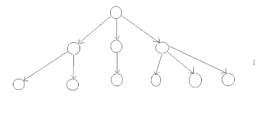
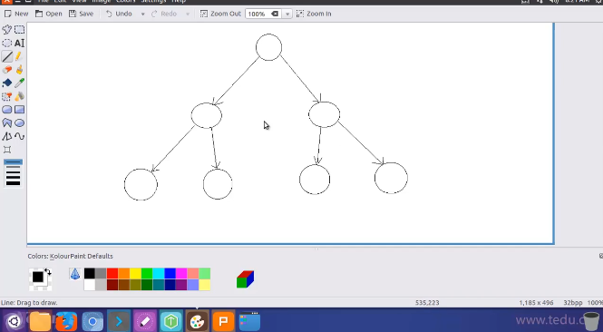

# 数据结构学习

==研究如何在程序中存储数字以及使用数字==

不但要知道数字的值，还要知道数字与数字之间的关系

来源：[B站达内教育](https://www.bilibili.com/video/BV16G4y167qd/?p=20&spm_id_from=333.1007.top_right_bar_window_history.content.click)

## 数字间的关系

- 现实生活中数字之间的关系叫逻辑关系或==逻辑结构==:
  - 集合结构：所有数字可以别看做是一个整体：例如买菜，菜不是一颗一颗卖而是一筐一筐卖，一筐就是一个整体
  - 线性结构：可以用一条有顺序的线把所有数字串起来：公交车的所有站点符合线性结构
  - 树状结构：所有数字从一个数字扩展出来，扩展规则一致：家谱里的每个人之间符合树状结构
  - 网状结构：任何两个数字之间都可以有直接的联系，不同数字之间的联系相护无关：例如铁路网
  
- 计算机里数字的存储区之间的关系叫物理关系或物理==结构==:
  - **顺序结构**：数组、动态分配内存
    - 所有存储区连续排列
    
    - 每个存储区有一个唯一的编号，可以直接根据编号找到存储区（==随机访问能力==），例如找编号为5的存储区不用从0开始找，可以直接定位到5号
    
    - 缺点：难以调整存储区个数，例如在声明数组式必须定义数据个数，这个个数是死的
    
    - 缺点：不适合进行插入和删除操作：要进行插入或删除操作时必须对修改位置之前或之后的所有存储区都进行改动
    
      ```cpp
       10 20 30 40 50 60 0 0 0
           35//把35插入到30和40之间
      ```
  
  - **链式结构**
  
    - 由多个==结构体类型==的存储区构成，这些存储区叫==节点==
  
    - 这些结构体存储区之间可以用指针建立起互相联系
  
    - 最简单的链式物理结构是**线性链式物理结构**（每个节点里只需包含一个指针）
  
    - 适合进行插入和删除操作
  
    - 采用动态分配节点就可以自由调整节点个数

> 在C中定义结构体类型变量
>
> ```cpp
> struct student{    char no[20];       *//学号*
> char name[20];    *//姓名*      
> char sex[5];    *//性别*
> int age;          *//年龄* };
> 
> struct student stu1,stu2;
> 
> // 每次定义变量时都要使用struct，一般这样：
> typedef struct student{
> char no[20];       //学号
> char name[20];    //姓名
> char sex[5];    //性别
> int age;          //年龄
>  }STUDENT;
>  STUDENT stu1;
>    ```


```c
// 实现一个线性链式物理结构
#include<stdio.h>
typedef struct node{
    int val;	// 用来记录数字
    struct node *p_next;	// 用来指向后一个节点
} node;	//代表线性链式物理结构中节点的结构体
int main(){
    node node1 = {10}, node2 = {20}, node3 = {30};
    node head = {0}/*无效头节点*/, tail = {0}/*无效尾节点*/;
    node *p_tmp = NULL;
    head.p_next = &node1;
    head1.p_next = &node2;
    head2.p_next = &node3;
    head3.p_next = &tail;
    
    // 指针循环变量p_tmp从头节点开始向后一次指向每个节点，直到最后一个有效节点为止
    for(p_tmp = &head; p_tmp != &tail; p_tmp = p_tmp->p_next){
        // 以下三个指针永远指向三个相邻的节点
        // 其中p_first指向其中最前面的节点
        // p_last指向最后面的节点
        node *p_first = p_tmp;
        node *p_mid = p_first->p_next;	//从第一个有效节点一直指向到尾节点
        node *p_last = p_mid->p_next;
    }
    return 0;
}
```

```cpp
// 对线性链式结构进行插入和删除结构
#include<stdio.h>
typedef struct node{
    int val;	// 用来记录数字
    struct node *p_next;	// 用来指向后一个节点
} node;	//代表线性链式物理结构中节点的结构体
int main(){
    node node1 = {10}, node2 = {20}, node3 = {30};
    node node4 = {25};	//想把node4插入到2和3之间
    node head = {0}/*无效头节点*/, tail = {0}/*无效尾节点*/;
    node *p_tmp = NULL;
    head.p_next = &node1;
    node1.p_next = &node2;
    node2.p_next = &node3;
    node3.p_next = &tail;
    
    // 把node4插入到线性链式物理结构中，插入后保持左右数字仍是前小后大
    for(p_tmp = &head; p_tmp != &tail; p_tmp = p_tmp->p_next){
        node *p_first = p_tmp;
        node *p_mid = p_first->p_next;	
        node *p_last = p_mid->p_next;
        if(p_mid == &tail/*node4的值比p_mid里的大p_mid指针指向尾节点*/|| p_mid->val > node4.val/*p_mid指针指向节点里的数字第一次比node4里的数字大*/){
            p_first->p_next = &node4;
            node4.p_next = p_mid;
            break;
        }
    }
    
    // 把20所在的节点从链式结构中删除
    for(p_tmp = &head; p_tmp != &tail; p_tmp = p_tmp->p_next){
        node *p_first = p_tmp;
        node *p_mid = p_first->p_next;	
        node *p_last = p_mid->p_next;
        if(p_mid->val == 20){	
            p_first->p_next = p_last;
            break;
        }
        

    return 0;
}
```

## 数据结构

- 组成
  - 一组存储区：用来存放数字
  - 一组函数：用来操作存储区

实际操作中，数据结构以外的程序不能操作数据结构存储区，必须由数据结构的函数操作

### 栈

- 使用方法
  - 每次只能加入一个数字，每次只能拿出一个数字
  - 栈里的数字有前后顺序，先进入的数字在前，后进入的数字在后
  - 每次从栈里获得的数字一定是最后放进去的数字（==后进先出==）

- 实现方法

```cpp
// stack
// 声明栈结构体
typedef struct{
    int buf[SIZE];	// 定义一个数组用来记录栈里的数字，
                    // SIZE通过宏定义提前定义栈可以存储的最大数字个数
    int qty;	// 记录栈里的实际数字个数
} stack;	// 代表栈的结构体

// 栈管理函数
// 栈的初始化函数：把一个没有使用过的栈设置为可以使用的状态
void stack_init(stack *p_stack){ // 结构体指针形参p_stack代表一个栈
    p_stack->qty = 0;	// 表示栈里没有数字
}

// 栈的清理函数：把一个使用过的栈里的所有数字删除
void stack_deinit(stack *p_stack){
    p_stack->qty = 0;	// 栈里没有数字就相当于删除所有数字
    				   // 清理函数和初始化函数的内容是一样的，但使用场景不同，初始化函数操作一个没有使用过的栈，清理函数操作的是使用过的栈
}

// 获得栈里数字个数的函数
int stack_size(const stack *p_stack){// int类型返回栈数字个数，
    							// const代表这个函数不会修改栈的内容
    return p_stack->qty；
}

// 判断栈是否空的函数
int stack_empty(const stack *p_stack) {//const代表这个函数不会修改栈的内容
    return !p_stack->qty;	// 如果栈是空的则返回真
}

// 判断栈是否满函数
int stack_full(const stack *p_stack) {
    return p_stack->qty >= SIZE；	// 如果SIZE等于qty则说明栈满了，为了保险也考虑大于这种情况
}

// 向栈里加入数字的函数
int stack_push(stack *p_stack, int val) { //因为向栈里加入数字可能失败（栈满了）int返回值用来返回加入数字是否成功
    if (p_stack->qty >= SIZE) {
        // 如果栈已经满了就不可能加入新数字了
        return 0；	// 加入数字失败
    }
    p_stack->buf[p_stack->qty] = val;	// 以qty做下标到数组里找一个存储区把新的数字赋值给这个存储区
    p_stack->qty++;	//栈里的数字个数多了一个
    return 1；	// 加入数字成功
}

// 从栈里获得数字的函数（同时删除栈里的数字）
int stack_pop(stack *stack, int *p_val) { // int返回是否获取成功，int*指针用来返回获得的数据值，**用指针来向调用函数传递数据**
    if (!p_stack->qty) {
        // 如果栈里没有数字就无法获得数字
        return 0；// 获取失败
    }
    // 用指针来向调用函数传递数据
    *p_val = p_stack->buf[p_stack->qty -1];	// 找到qty-1做下标的存储区，它里面就是最后面的数字，把这个数字传递给调用函数
    p_stack->qty--;	// 数字个数减一
    return 1；	// 表示成功获取数字
}

// 从栈里获得数字的函数（但不删除栈里的数字）
int stack_top(const stack *p_stack, int *p_val) { // const表示不修改栈内容
    if (!p_stack->qty) {
        // 如果栈里没有数字就无法获得数字
        return 0；// 获取失败
    }
    *p_val = p_stack->buf[p_stack->qty -1];	// 找到qty-1做下标的存储区，它里面就是最后面的数字，把这个数字传递给调用函数
    return 1；
}
```

对上述栈进行编译检查

```bash
$ gcc -DSIZE=5 -c stack_1.c
```

> -DSIZE表示对宏SIZE进行设置；-c是因为没有主函数 

==预处理指令:==

```cpp
#ifndef				__STACK_1_H__
#define				__STACK_1_H__
...
#endif				// __STACK_1_H__
```

>  把结构体定义和函数声明放在.h文件下，把函数实现放在.c文件下，.c文件要包含.h文件
>
> .h和.c文件在同一个文件夹下时，include用双引号“” 

> 编译多个源文件：每个c文件都要编译下，h文件时包含在c文件中的

```bash
$ gcc -DSIZE=5 stack_1.c stack_main.c
```

### 队列

- 使用方法
  - 每次只能加入一个数字，每次只能拿出一个数字   同栈
  - 栈里的数字有前后顺序，先进入的数字在前，后进入的数字在后   同栈
  - 每次从栈里获得的数字一定是==最先==放进去的数字（==先进先出==）  ==与栈不同点==

- 实现方法

```cpp
// 声明队列结构体
typedef struct {
    int buf[SIZE];	// 记录队列里的数字
    int head;	// head和tail都是记录队列元素下标的；head记录第一个数字所在的存储区下标，如果队列为空则head应等于tail
    int tail;	// tail记录下一个数字应该放置的下标，也就是最后一个的位置喽
} queue;

// 队列初始化函数
void queue_init(queue *P_queue) {
    p_queue->tail = 0;	// 下一个数字应该放置下标为0的存储区里
    p_queue->head = 0;	// head等于tail时表示队列里没有数字
}

// 队列的清理函数
void queue_deinit(queue *P_queue) {
    p_queue->tail = 0;	// 下一个数字应该放置下标为0的存储区里
    p_queue->head = 0;	// head等于tail时表示队列里没有数字
}

// 获得队列数字个数的函数
int queue_size(const stack *p_queue){// int类型返回栈数字个数，
    							// const代表这个函数不会修改栈的内容
    return p_queue->tail - p_queue->head; // tail表示最后一个数字应该放置的下标，head表示第一个数字的下标，相减得到队列数字个数
}

// 判断队列是否为空的函数
int queue_empty(const queue *p_queue) {//const代表这个函数不会修改栈的内容
    return p_queue->tail == p_queue->head ;	// 如果队列为空则head=tail
}

// 判断队列是否满函数
int queue_full(const queue *p_queue) {
    return p_queue->tail >= SIZE；	// 如果SIZE等于tail则说明最后一个存储区已经填上数了，为了保险也考虑大于这种情况
}

// 向队列加入数字的函数
int queue_push(queue *p_queue, int val) { //因为向队列里加入数字可能失败（队列满了）int返回值用来返回加入数字是否成功
    if (p_queue->tail >= SIZE) {
        // 如果栈已经满了就不可能加入新数字了
        return 0；	// 加入数字失败
    }
    p_queue->buf[p_queue->tail] = val;	// 以tail做下标到数组里找一个存储区把新的数字赋值给这个存储区
    p_queue->tail++;	//把tail向后移动一步
    return 1；	// 加入数字成功
}

// 从队列里获得数字的函数（同时删除队列里的数字）
int queue_pop(queue *queue, int *p_val) { // int返回是否获取成功，int*指针用来返回获得的数据值，**用指针来向调用函数传递数据**
    if (p_queue->tail == p_queue->head) {
        // head==tail说明队列是空的
        return 0；// 获取失败
    }
    // 用指针来向调用函数传递数据
    *p_val = p_queue->buf[p_queue->head];	// 把数组里以head做下标的存储区里的数字传递给调用函数
    p_queue->head++;	// !!!!!把head向后移动一步，这表示删除这个数字
    return 1；	// 表示成功获取数字
}

// 从队列里获得数字的函数（但不删除队列里的数字）
int queue_top(const queue *p_queue, int *p_val) { // const表示不修改栈内容
    if (p_queue->head == p_queue->tail) {
        // 如果队列里没有数字就无法获得数字
        return 0；// 获取失败
    }
    *p_val = p_queue->buf[p_queue->head];	// 把数组里以head做下标的存储区里的数字传递给调用函数
    return 1；
}
```

### 循环队列

- 当数组里最后一个存储区也被放上数字后，可以继续把后来的数字放在下标为0的存储区里，尾和头相连（但是这个存储区里必须没有有效数字）

- 实现方法

```cpp
// 定义一个循环队列
typedef struct{
    int buf[SIZE];	// 记录数字的数组
    int qty;		// 队列里实际存放 的数字个数
    int tail;		// 下一个数字所在的下标
    				// 没有定义第一个数字的下标，因为它可以通过qty和tail运算出来
} queue;

// 获得第一个数字所在下标的函数
int get_head(const queue *p_queue) {
    int ret  = p_queue->tail - p_queue->qty;
    if (ret < 0) {
        ret +=SIZE; 
        return ret;
    }
}
```

### 链表

- 用来管理线性链式物理功能的数据结构
- 不用每次使用线性链式物理结构时都自己编写代码直接操作存储区
- 链表提供功能来管理线性链式物理结构，只要使用就可以了，不用自己编函数
- 实现方法：

```cpp
// 定义链表物理结构的节点
// 节点有数据和下一个节点数据的地址
typedef struct {
    int val;	// 记录数字的成员变量
    struct node *p_next;	//指向下一个节点的指针
} node;

// 定义链表，链表就是一系列节点，链表结构就只需要包含头结点和尾节点
// 由于链表之间的互相指向关系，只要知道了头节点和尾节点就相当于知道了整个链表的数据，因此链表结构里只需要定义头节点和尾节点
typedef struct {
    node head;	// 头节点
    node tail;	// 尾节点
} link;
```

***链表功能***

- 辅助功能

```cpp
// 链表初始化函数：把一个没有使用过的链表设置为可以使用的状态
void link_init(link *p_link) {
    p_link->head.p_next = & p_link->tail;// 把头节点和尾节点连接起来形成一个空的线性链式物理结构
    // -> 和 . 优先级相同，都是自左至右
    // p_link是指向链表的指针，
    // p_link->head表示用指针访问链表link的成员head，
    // head是node类型的对象，head.p_next是用对象名访问node类型对象head的成员p_next
    // 指针p_next又是node类的成员，它指向的类型也是node！
    // 把链式结构link的尾节点的地址赋给p_next指针
    // 综上，链式结构link的头节点head的指针指向了尾节点tail，也就是说头结点的下一个节点就是尾节点，那不就是没有元素存在链表里嘛
    p_link->tail.p_next = NULL;// 把尾节点里的指针设置为空指针，否则就是野指针
}

// 链表清理函数：删除链表里的所有数字
void link_deinit(link *p_link) {
    // 初始化时可以把头指向尾生成一个空链表，但释放时不能这样，因为
    // 链表中可能存在动态分配节点，必须把所有的动态分配节点都释放掉，否则一致占着内存
    // 做法：不断释放最前面的有效节点
    node *p_first = NULL, *p_mid = NULL, *p_last = NULL;// 这三个指针是指向node类型的
    // 每次循环把最前面的有效节点删除并释放（头节点和尾节点是无效节点）
    // 由于不知道有多少数据需要循环多少次，适合使用while循环
    // ==头节点后面不是尾节点就说明存在有效节点，循环就应该继续==
    while (p_link->head.p_next != &p_link->tail) {
        // 让三个结点指针指向链表最前面的三个节点
        // 这三个指针是指向node类型的
        p_first = &p_link->head;
        p_mid = p_first->p_next;	//p_mid就是我们要清理的数字
        						  // p_next成员是个指针，它存的下一个节点的地址，因此这句把次节点的地址传给p_mid
        p_last = p_mid->p_next;      // 把第三个节点的地址传给p_last
        // 把p_mid指针指向的节点从链式物理结构中摘除
        // 直接让p_first指针指向p_last节点，这样p_mid就脱离了链式物理结构，实现了删除
        p_first->p_next = p_last;
        // 释放p_mid指针指向的节点
        free(p_mid);// <stdlib.h> 释放内存
        p_mid = NULL;// 养成好习惯   
    }
}

// 获得数字个数的函数
int link_size(const link *p_link){
    int cnt = 0; // 用来记录链表数字个数
    const node *p_tmp = NULL;// 节点指针循环变量
    // 注意：由于结构体指针形参P_link声明的时候是有const关键字的，这表示不可以通过这个形参去修改链表内容，如果声明内部的循环变量指针p_tmp不加const则说明他可以修改链表内容，这个指针声明和结构体指针声明是有矛盾的，编译会有警告，因此p_tmp也要加const关键字
    for (p_tmp = &p_link->head;p_tmp != &p_link->tail;p_tmp = p_tmp->p_next) {
        const node *p_first = p_tmp;//const 原因同上
        const node *p_mid = p_first->p_next;
        const node *p_last = p_mid->P_next;
        // 只要p_mid指针不指向尾节点就一定指向一个有效节点
        if (p_mid != &p_link->tail) {
            cnt++;// 数一个数字
        }
    }
    return cnt;
}

// 判断链表是否为空的函数
int link_empty(const link *p_link) {
    // 如果头结点的指针就是指向尾节点的那么就为空
    return p_link->head.p_next == &p_link->tail;// 返回表达式逻辑值
}
```

- 插入功能
  - 在链表中加入数字
  - 往链表中插入数字时一定需要动态分配一个节点来存放新数字，而动态分配都有可能是失败的，因此插入功能的函数都需要一个返回值，返回真时插入成功
  - 插入功能的函数都需要一个结构体指针形参来代表要操作的链表
  - 会修改链表，所以这个结构体指针形参都不用const关键字
  - 还需要一个int型形参表示我们需要加入的这个数字

```cpp
// 在链表的最前面插入数字的函数
int link_add_head(link *p_link, int val) {
    node *p_first = NULL, *p_mid = NULL, *p_last = NULL;// 老套路
    // 用malloc函数动态分配一个节点，把结果记录在一个节点指针里
    node  *p_node = (node*)malloc(sizeof(node));
    // 检查动态分配是否成功
    if (!p_node) {
        return 0;// 分配失败
    }
    // 分配成功
    p_node->val = val;// 把新的数字记录到动态分配节点里
    P_node->p_next = NULL;// 好习惯
    // 把三个循环节点指针指向链表最前面的三个节点
    p_first = &p_link->head;
    p_mid = p_first->P_next;
    p_last = p_mid->p_next;
    // 吧新节点插入到p_first和p_mid中间即可
    // 方法：first指针指向新节点，新节点指向原来的第一个节点
    p_first->p_next = p_node;
    p_node->p_next = p_mid;
    return 1;//返回插入成功
}

// 在链表末尾插入数字的函数
int link_append(link *p_link, int val) {
    node *p_tmp = NULL;// for循环循环变量
    node  *p_node = (node*)malloc(sizeof(node));
    // 检查动态分配是否成功
    if (!p_node) {
        return 0;// 分配失败
    }
    // 分配成功
    p_node->val = val;// 把新的数字记录到动态分配节点里
    P_node->p_next = NULL;// 好习惯
    // 编写for循环找到链表末尾的位置 
    for (p_tmp = &p_link->head;p_tmp != &p_link->tail;p_tmp = p_tmp->p_next) {
        node *p_first = p_tmp;
        node *p_mid = p_first->p_next;
        node *p_last = p_mid->P_next;
        // 链表结尾就是P_mid指向尾节点的时候
        // 因为插入功能是在p_first和p_mid之间插的，所有只有p_mid指向tail节点之后插入的数字才是最后一个有效数字；要是p_last指向tail节点时插入就插到倒数第二个了
        if (p_mid == &p_link->tail) {
            p_first->p_next = p_node;
            p_node->p_next = p_mid;
            break;//结束循环
        }
    }
    return 1;// 插入成功
}

// 按从小到大的顺序在链表中间插入新数字的函数
int link_insert(link *p_link, int val) {
    node *p_tmp = NULL;// for循环循环变量
    node  *p_node = (node*)malloc(sizeof(node));
    // 检查动态分配是否成功
    if (!p_node) {
        return 0;// 分配失败
    }
    // 分配成功
    p_node->val = val;// 把新的数字记录到动态分配节点里
    P_node->p_next = NULL;// 好习惯
    // 编写for循环找到插入位置
    for (p_tmp = &p_link->head;p_tmp != &p_link->tail;p_tmp = p_tmp->p_next) {
        node *p_first = p_tmp;
        node *p_mid = p_first->p_next;
        node *p_last = p_mid->P_next;
        // p_mid指针指向的数字比要插入的数字大的时候把数字插入到p_first和p_mid中间就行
        if （p_mid->val > val || p_mid == &p_link->tail/*p_mid一直指到尾节点了*/）{
            p_first->p_next = p_node;
            p_node->p_next = p_mid;
            break;// 结束循环
        }
    }
    return 1;//插入成功
}
```

- 删除功能
  - 需要返回值来表示删除是否成功
  - 没有const关键字

```cpp
// 删除最前面数字的函数
int link_remove_head(link *p_link) {
    node *p_first = NULL, *p_mid = NULL, *p_last = NULL;
    // 如果头结点后面就是尾节点则无法删除任何节点
    if（p_link->head.p_next == &p_link->tail）{
        return 0;// 无法删除
    }
    // 把三个循环节点指针指向链表最前面的三个节点
    p_first = &p_link->head;
    p_mid = p_first->P_next;
    p_last = p_mid->p_next;
    // 此时p_mid指向的就是第一个有效节点
    // 把p_mid指向的节点摘出来
    p_first->p_next = p_last;
    // 释放p_mid指向的节点
    free(p_mid);
    p_mid = NULL;
    return 1;// 删除成功
}

// 删除最后一个有效数字的函数
int link_remove_tail(link *p_link, int val) {
    node *p_tmp = NULL;// for循环循环变量
    // 编写for循环找到最后一个有效数字所在节点
    for (p_tmp = &p_link->head;p_tmp != &p_link->tail;p_tmp = p_tmp->p_next) {
        node *p_first = p_tmp;
        node *p_mid = p_first->p_next;
        node *p_last = p_mid->P_next;
        // 当p_last指向尾节点时删掉p_mid节点的数据就是删除了最后一个有效数据
        if (p_last == &p_link->tail) {
            // 把p_mid指向的节点摘出来
            p_first->p_next = p_last;
            // 释放p_mid指针指向的节点
            free(p_mid);
            p_mid = NULL;
            return 1;//成功删除后直接返回1表示删除成功
        }
    }
    // 循环到这里说明链表没有有效节点，无法删除因此返回0
    return 0;// 
}

// 删除链表中间某个数字的函数
int link_remove(link *p_link, int val) {
    node *p_tmp = NULL;
    // 编写for循环找到要删除数字所在节点位置
    for (p_tmp = &p_link->head;p_tmp != &p_link->tail;p_tmp = p_tmp->p_next) {
        node *p_first = p_tmp;
        node *p_mid = p_first->p_next;
        node *p_last = p_mid->P_next;
        // p_mid指针指向的数字和val值相等时，p_Mid指的节点就是要删除的
        if （p_mid->val == val || p_mid != &p_link->tail/*防止p_mid删掉尾节点*/）{
            // 摘出p_mid节点
            p_first->p_next = p_last;
            // 释放掉p_mid节点
            free(p_mid);
            return 1;// 成功删除，函数返回，当然循环也结束了
        }
    }
    return 0；//循环结束还未删除说明删除失败，返回0
}
```

- 查找功能
  - 从链表里获得数字
  - 不用修改链表内容，因此查找函数结构体指针形参加const
  - 查找函数需要向调用函数传递得到的数字，因此需要一个int型指针形参

```cpp
// 获得最前面数字的函数
int link_get_head(const link *p_link, int *p_val) {
    const node *p_first = NULL, *p_mid = NULL, *p_last = NULL;// 因为形参p_link有const
    if(p_link->head.p_next == &p_link->tail) {
        // 头结点指向尾节点说明没有有效数字，因此无法获得数字
        return 0;
    }
    // 让三个结点指针指向链表最前面的三个节点
    p_first = &p_link->head;
    p_mid = p_first->P_next;
    p_last = p_mid->p_next;
    // 把p_mid指针指向节点的数字传递给调用函数
    *p_val = p_mid->val;
    return 1；
}

// 获得链表最后一个数字的函数
int link_get_tail(const link *p_link, int *p_val) {
    const node *p_tem = NULL;// 与const link一致
    for (p_tmp = &p_link->head;p_tmp != &p_link->tail;p_tmp = p_tmp->p_next) {
        const node *p_first = p_tmp;
        const node *p_mid = p_first->p_next;
        const node *p_last = p_mid->P_next;
        // p_last指向尾节点，p_mid就指向最后一个有效数字
        if (p_last == &p_link->tail) {
            *p_val = p_mid->val;//传值 
            return 1;//获得数字成功
        }
    }
    return 0； // 删除失败
}

// 根据编号获得数字的函数
int link_get(const link *p_link, int val, int sn) {// sn为表示节点编号的参数
    int cnt = 0;// 虚拟的数字编号，每次循环加一来代表编号
    const node *p_tem = NULL;// 与const link一致
    // 编写循环找到指定节点
    for (p_tmp = &p_link->head;p_tmp != &p_link->tail;p_tmp = p_tmp->p_next) {
        const node *p_first = p_tmp;
        const node *p_mid = p_first->p_next;
        const node *p_last = p_mid->P_next;
        // p_last，p_mid
        if (cnt == sn && p_mid != &p_link->tail/*p_mid指针不是指向尾节点*/) {
            *p_val = p_mid->val;//传值 
            return 1;//获得数字成功
        }
        cnt++;
    }
    return 0； // 删除失败
}
```

- 改造双向链表
  - 之前定义的链表都是从前往后依次处理节点的，这叫单向链表
  - 双向链表既可以从前往后处理也可以从后往前处理
  - 在节点结构体里添加一个指向前面节点的指针，这样每个节点包含两个指针，分别指向前一个节点和后一个节点
  - 之前凡是处理最后节点的操作都可以从尾节点开始一步完成

```cpp
// 定义双向指针
typedef struct {
    int val;				// 记录数字的成员变量
    struct node *p_prev;	//指向前一个节点的指针
    struct node *p_next;	//指向下一个节点的指针
} node;

// 链表初始化函数：把一个没有使用过的链表设置为可以使用的状态
void link_init(link *p_link) {
    p_link->head.p_next = &p_link->tail;
    p_link->tail.p_prev = &p_link->head; //把尾节点向前指向头结点
    p_link->tail.p_next = NULL;
    p_link->head.p_prev = NULL;// 把头结点的前指针设置为空指针

// 链表清理函数：删除链表里的所有数字
void link_deinit(link *p_link) {
    node *p_first = NULL, *p_mid = NULL, *p_last = NULL;
    while (p_link->head.p_next != &p_link->tail) {
        // 让三个结点指针指向链表最前面的三个节点
        // 这三个指针是指向node类型的
        p_first = &p_link->head;
        p_mid = p_first->p_next;	
        p_last = p_mid->p_next;      
        p_first->p_next = p_last;
        p_last->p_prev = p_first;  // 这里加了一句
        // 释放p_mid指针指向的节点
        free(p_mid);// <stdlib.h>
        p_mid = NULL;// 养成好习惯
    }
}

// 获得数字个数的函数  // 不用修改
int link_size(const link *p_link){
    int cnt = 0; // 用来记录链表数字个数
    const node *p_tmp = NULL;
    for (p_tmp = &p_link->head;p_tmp != &p_link->tail;p_tmp = p_tmp->p_next) {
        const node *p_first = p_tmp;//const 原因同上
        const node *p_mid = p_first->p_next;
        const node *p_last = p_mid->P_next;
        // 只要p_mid指针不指向尾节点就一定指向一个有效节点
        if (p_mid != &p_link->tail) {
            cnt++;// 数一个数字
        }
    }
    return cnt;
}

// 判断链表是否为空的函数    // 不用修改
int link_empty(const link *p_link) {
    // 如果头结点的指针就是指向尾节点的那么就为空
    return p_link->head.p_next == &p_link->tail;// 返回表达式逻辑值
}
    
// 在链表的最前面插入数字的函数  // 改
int link_add_head(link *p_link, int val) {
    node *p_first = NULL, *p_mid = NULL, *p_last = NULL;// 老套路
    // 用malloc函数动态分配一个节点，把结果记录在一个节点指针里
    node  *p_node = (node*)malloc(sizeof(node));
    // 检查动态分配是否成功
    if (!p_node) {
        return 0;// 分配失败
    }
    // 分配成功
    p_node->val = val;// 把新的数字记录到动态分配节点里
    P_node->p_next = NULL;// 好习惯
    P_node->p_prev = NULL;
    // 把三个循环节点指针指向链表最前面的三个节点
    p_first = &p_link->head;
    p_mid = p_first->P_next;
    p_last = p_mid->p_next;
    // 吧新节点插入到p_first和p_mid中间即可
    // 方法：first指针指向新节点，新节点指向原来的第一个节点
    p_first->p_next = p_node;
    p_node->p_next = p_mid;
    p_mid->prev = p_node;		//改
    p_node->prev = p_first;
    return 1;//返回插入成功
}

// 在链表末尾插入数字的函数
int link_append(link *p_link, int val) {
    node *p_tmp = NULL;// for循环循环变量
    node  *p_node = (node*)malloc(sizeof(node));
    // 检查动态分配是否成功
    if (!p_node) {
        return 0;// 分配失败
    }
    // 分配成功
    p_node->val = val;// 把新的数字记录到动态分配节点里
    P_node->p_next = NULL;// 好习惯
    p_node->p_prev = NULL;
    // 编写for循环找到链表末尾的位置 
    for (p_tmp = &p_link->head;p_tmp != &p_link->tail;p_tmp = p_tmp->p_next) {
        node *p_first = p_tmp;
        node *p_mid = p_first->p_next;
        node *p_last = p_mid->P_next;
        // 链表结尾就是P_mid指向尾节点的时候
        // 因为插入功能是在p_first和p_mid之间插的，所有只有p_mid指向tail节点之后插入的数字才是最后一个有效数字；要是p_last指向tail节点时插入就插到倒数第二个了
        if (p_mid == &p_link->tail) {
            p_first->p_next = p_node;
            p_node->p_next = p_mid;
            p_mid->prev = p_node;
            p_node->prev = p_first;
            break;//结束循环
        }
    }
    return 1;// 插入成功
}

// 按从小到大的顺序在链表中间插入新数字的函数
int link_insert(link *p_link, int val) {
    node *p_tmp = NULL;// for循环循环变量
    node  *p_node = (node*)malloc(sizeof(node));
    // 检查动态分配是否成功
    if (!p_node) {
        return 0;// 分配失败
    }
    // 分配成功
    p_node->val = val;// 把新的数字记录到动态分配节点里
    P_node->p_next = NULL;// 好习惯
    p_node->p_prev = NULL;
    // 编写for循环找到插入位置
    for (p_tmp = &p_link->head;p_tmp != &p_link->tail;p_tmp = p_tmp->p_next) {
        node *p_first = p_tmp;
        node *p_mid = p_first->p_next;
        node *p_last = p_mid->P_next;
        // p_mid指针指向的数字比要插入的数字大的时候把数字插入到p_first和p_mid中间就行
        if （p_mid->val > val || p_mid == &p_link->tail/*p_mid一直指到尾节点了*/）{
            p_first->p_next = p_node;
            p_node->p_next = p_mid;
            p_mid->prev = p_node;
            p_node->prev = p_first;
            break;// 结束循环
        }
    }
    return 1;//插入成功
}
    
    
// 删除最前面数字的函数  改
int link_remove_head(link *p_link) {
    node *p_first = NULL, *p_mid = NULL, *p_last = NULL;
    // 如果头结点后面就是尾节点则无法删除任何节点
    if（p_link->head.p_next == &p_link->tail）{
        return 0;// 无法删除
    }
    // 把三个循环节点指针指向链表最前面的三个节点
    p_first = &p_link->head;
    p_mid = p_first->P_next;
    p_last = p_mid->p_next;
    // 此时p_mid指向的就是第一个有效节点
    // 把p_mid指向的节点摘出来
    p_first->p_next = p_last;
    p_last->p_prev = p_frst;
    // 释放p_mid指向的节点
    free(p_mid);
    p_mid = NULL;
    return 1;// 删除成功
}

// 删除最后一个有效数字的函数
int link_remove_tail(link *p_link, int val) {
    node *p_tmp = NULL;// for循环循环变量
    // 编写for循环找到最后一个有效数字所在节点
    for (p_tmp = &p_link->head;p_tmp != &p_link->tail;p_tmp = p_tmp->p_next) {
        node *p_first = p_tmp;
        node *p_mid = p_first->p_next;
        node *p_last = p_mid->P_next;
        // 当p_last指向尾节点时删掉p_mid节点的数据就是删除了最后一个有效数据
        if (p_last == &p_link->tail) {
            // 把p_mid指向的节点摘出来
            p_first->p_next = p_last;
            p_last->p_prev = p_frst;
            // 释放p_mid指针指向的节点
            free(p_mid);
            p_mid = NULL;
            return 1;//成功删除后直接返回1表示删除成功
        }
    }
    // 循环到这里说明链表没有有效节点，无法删除因此返回0
    return 0;// 
}

// 删除链表中间某个数字的函数
int link_remove(link *p_link, int val) {
    node *p_tmp = NULL;
    // 编写for循环找到要删除数字所在节点位置
    for (p_tmp = &p_link->head;p_tmp != &p_link->tail;p_tmp = p_tmp->p_next) {
        node *p_first = p_tmp;
        node *p_mid = p_first->p_next;
        node *p_last = p_mid->P_next;
        // p_mid指针指向的数字和val值相等时，p_Mid指的节点就是要删除的
        if （p_mid->val == val || p_mid != &p_link->tail/*防止p_mid删掉尾节点*/）{
            // 摘出p_mid节点
            p_first->p_next = p_last;
            p_last->p_prev = p_frst;
            // 释放掉p_mid节点
            free(p_mid);
            return 1;// 成功删除，函数返回，当然循环也结束了
        }
    }
    return 0；//循环结束还未删除说明删除失败，返回0
}

    
// 获得数字的函数不受影响 
```

 ```cpp
 // 使用链表的主函数
 int main() {
     link lnk = {0};
     link_init(&lnk);// 链表初始化
     link_add_head(&lnk,50);
     link_add_head(&lnk,10);
     link_append(&lnk,70);
     /*...*/  
     link_deinit(&lnk);// 清理链表
 }
 ```

- 增加遍历功能
  - get函数可以找到元素，但每次都是从头开始找
  - 链表结构体里增加指针用来记录遍历过程中上一次操作的节点
  - 链表有两个状态，一个是遍历状态，一个是非遍历状态
  - p_cur为空指针时代表没有经过遍历，非遍历状态
  - 遍历结束后应该设置p_cur为空指针
  - 在所有可能修改链表的函数可能会破坏遍历过程，因此在执行这些函数时都应该让遍历结束，即设p_cur为空  

```cpp
typedef struct {
    node head;
    node tail;
    node *p_cur;// 记录遍历过程中上一个操作的节点
}
```

```cpp
// 开始从前向后遍历的函数
void link_begin(link *p_link) {
    p_link->p_cur = &p_link->head; // 把头节点设置为上一个操作的节点，这样下一次操作的就是第一个有效节点
}

// 在从前向后遍历过程中获得下一个数字的函数
int link_next(link *p_link, int *p_val) {
    // 只有处于遍历过程中才能进行遍历操作
    if (!p_link->p_cur) {
        // 链表没有处于遍历过程中
        return 0；// 由此可以看出要是没有begin函数是没有办法开始遍历过程的
    }
    p_link->p_cur = p_link->p_cur->p_next;// 找到这次要操作的节点并记录下来
    // 如果这次操作的节点是尾节点就表示遍历过程已经结束了
    if(p_link->p_cur == &p_link->tail) {
        p_link->p_cur = NULL;  // 结束遍历过程
        return 0;// 获得数字失败  
    }
    else {
        *p_val = p_link->p_cur->val; // 把这次要操作的节点内容传递给调用函数
        return 1; // 成功获得数字
    }
}


// 开始从后向前遍历过程的函数
void link_rbegin(link *p_link){
    p_link->p_cur = &p_link->tail;// 把尾节点设置为上一次操作的节点
}

// 在从后向前遍历过程中获得前一个数字的函数 
int link_prev(link *p_link, int *p_val) {
    if (!p_link->p_cur) {
        // meiyou处于遍历状态
        return 0;
    }
    p_link->p_cur = p_link->p_cur->p_prev;// 找到这次要操作的节点并记录下来 
    if (p_link->p_cur == &p_link->head) {
        // 这次要操作的额节点是头结点
        p_link->p_cur = NULL;// 遍历过程结束
        return 0；
    }
    else {
        *p_val = p_link->p_cur->val; //把这次要操作的节点内容传给调用函数
        return 1;
    }
        
}
```

```cpp
//遍历功能主函数部分
/* ... */
link_begin(&lnk);
while (1) {
    // 如果不能获得数字就结束循环
    if (!link_next(&lnk,&val)) {
        break;
    }
    printf("%d ",val);
}
link_rbgin(&lnk);
while (1) {
    if (!link_prev(&lnk,&val)) {
        break;
    }
    printf("%d ",val);
}
```

### 树

- 也是一种链式物理结构，只不过一个节点指向了多个节点
- **树**也是一种数据结构，用来管理树型链式物理结构




- 树的节点分很多层，不同层之间符合线性规则；
- 树的最上面一层只能有一个节点，这个节点叫**根节点**
- 根节点可以代表整个树，找到根节点就可以找到任何人一个节点；
- 如果两个节点之间存在直接联系就表示他们之间存在父子关系，其中靠近根节点的叫**父节点**，另一个叫**子节点**

- 任何一个节点最多只能有一个父节点
- 如果每一个树里每个节点最多只能有两个子节点，这个树叫**==二叉树==**



- 二叉树里任何节点的两个子节点用左右来区分
- 二叉树里的任何节点可以代表一个二叉树
- 一个节点的左子节点代表的二叉树叫做节点的==左子树==，右子节点代表的二叉树叫做节点的==又子树==
- 任何一个二叉树都可以分为三部分：==根节点==、==根节点的左子树==、==根节点的右子树==，只要操作这三部分就相当于操作整个二叉树，这是通过==**递归**==实现的

---

- 数的遍历

  - 按顺序处理树里的每个节点，这是树最典型的操作方法
  - 遍历树的时候一个**==先处理左子树==**然后处理右子树，（先处理的那个就叫左子树，即使画在右面）
  - 根节点的处理时机有三种：
    - ==前序遍历==：最先处理根节点
    - ==中序遍历==：左子树完了处理根节点在处理右子树
    - ==后序遍历==：先左后右再根节点

- 数的实现

  ==采用两个结构体相互交替的形式来实现一个树==

```cpp
struct node;
typedef struct {
    struct node *p_node; 
} tree;
typedef struct {
    int val;
    tree left;
    tree right;
} node;
```


圆圈代表node类型的结构体变量，方块代表tree类型的结构体变量

最大的圆圈代表一个树的根节点，每个圆圈包含两个方块，也就是tree类型的结构体变量

每个tree类型的结构体变量也就是每个方块包含一个指针，这个指针指向另外的圆圈（节点）

除了根节点外，每个节点（圆圈）都挂在一个tree（方块）下面，为了保持一致在根节点上面虚构一个方块，这样所以的节点都在一个方块下面

==任何时候一个圆圈上面都有一个方块，他的里面也包含两个方块==

```cpp
// 实现一个树
#incliude<stdlib.h> // free函数
struct node;
typedef struct {
    struct node *p_node; 
} tree;
typedef struct {
    int val;
    tree left;
    tree right;
} node;

// 树的管理函数
// 树的初始化函数:让树处于一种可使用的状态
void tree_init(tree *p_tree) {
     p_tree->p_node = NULL;// 吧树设置为没有节点的空树
}

// 树的清理函数
void tree_deinit(tree *p_tree) {
    if (!p_tree->p_node) {
        // 如果最上面的方块里下面没有圆，也就是空指针，就表示树没有一个节点，这种时候不需要清理
        return ;// 直接返回，递归也是通过这句结束的
    }
    // 采用后序遍历先删除作业子树的所有动态分配节点，最后删除根节点
    // 通过遍历实现，递归调用清理函数
    tree_deinit(&(p_tree/*指向最上面的方块*/->p_node/*指向最大的圆*/->left/*代表左子树的方块*/));//清理左子树
    tree_deinit(&(p_tree/*指向最上面的方块*/->p_node/*指向最大的圆*/->right/*代表右子树的方块*/));//清理右子树
    free(p_tree->p_node);//删除并释放根节点，（最上面方块下的圆）
    p_tree->p_node = NULL;
}

// 树的插入函数 
// 有序二叉树：
// 在有序二叉树里查找某个数字所在位置的函数
tree * tree_search(const tree *p_tree, int val) {//返回一个方块表示位置，val代表要找的数字
    if (!p_tree->p_node) {
        // 如果根节点不存在
        return (tree *)p_tree;// 直接返回跟节点上面的方块
    }
    // 仅在三部分的任一部分寻找就可以了 
    if (p_tree->p_node->val == val) {
        // 跟节点里的数字就是要查找的数字
        return (tree *)p_tree;// p_tree形参是有const的但是直接返回它会有警告，相当于强制去除掉const
    }
    // 负责才左子树里查找
    // dang根节点里的数字比要找的数字大就应该在左子树里继续查找
    else if (p_tree->p_node->val > val) {
        return tree_search(&p_tree->node->left,val);
        }
    else {
        return tree_search(&p_tree->node->right,val);
        }
}

// 在有序二叉树里插入数字的函数
int tree_insert(tree *p_tree, int val) {
    node *p_node = NULL; // 一会记录动态分配的结果
    tree *p_tmp = tree_search(p_tree, val);// 在有序二叉树里查找要插入数字的位置
    // 如果这个数字存在则方块下面是有圆圈的
    if (p_tree->p_node) {
        return 0;//插入失败
    }
    p_node = (node *)malloc(sizeod(node));
    // 动态分配失败
    if (!p_node) {
        return 0;
    }
    p_node->val = val;// 吧要插入法人数字记录到动态分配节点里
    p_node->left.p_node = NULL;
    p_node->right.p_node = NULL;
    // 把动态分配节点挂在找到的方块下面
    p_tmp->p_node = p_node;
    return 1;
}

//显示找到数字的函数（这个函数不应该是数据结构的函数）
void print_cb(int val) {
    printf("%d ", val);
}

//以中序遍历方式处理树里所有节点的函数
void tree_miter(const tree *p_tree) {
    
}
```

看到了p23 06:51
