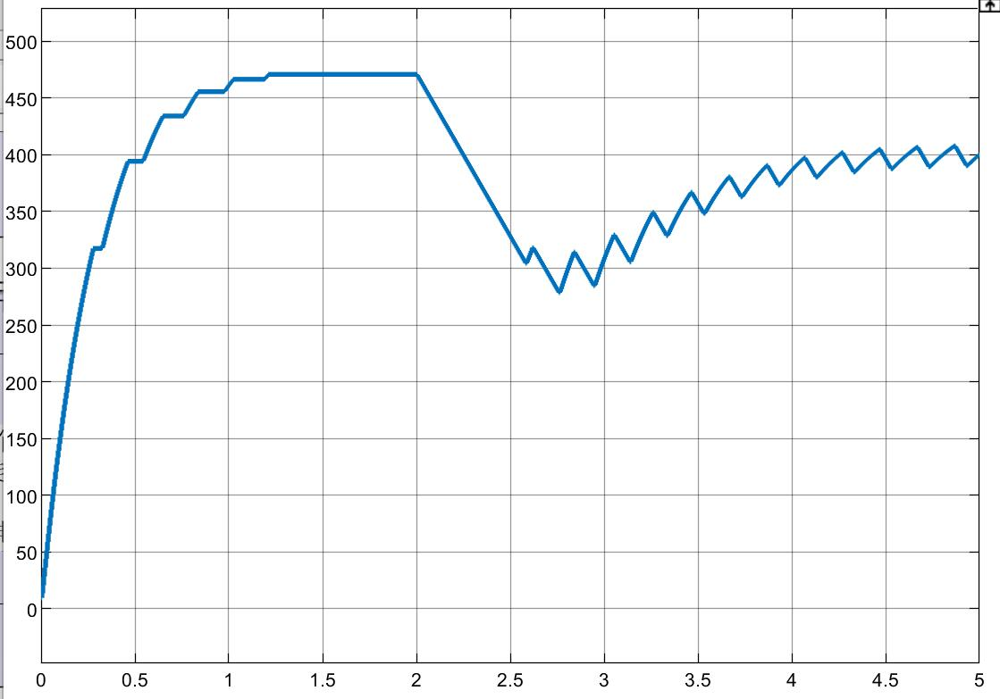
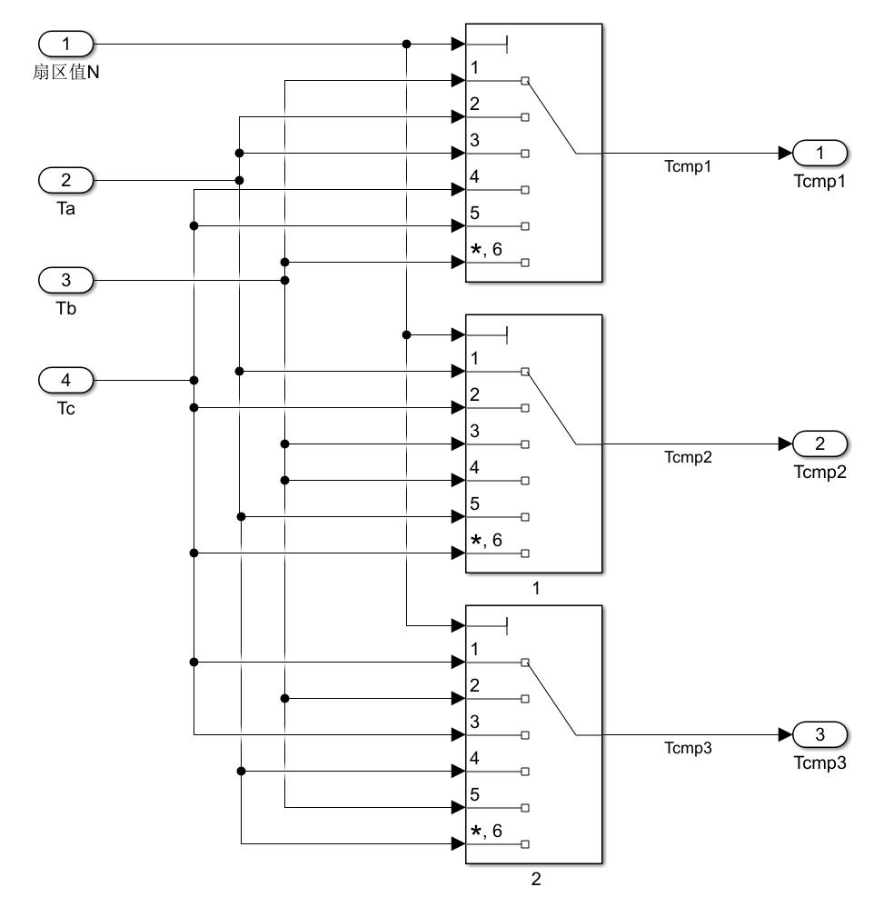
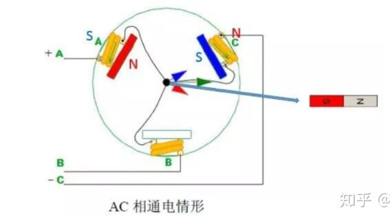
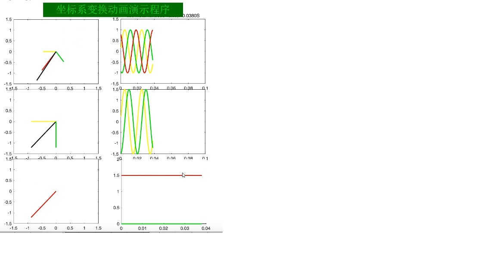

# 直流电机

感应电动势与电磁转矩：
$$
E=C_E\Phi n \\
T_{em}=C_T\Phi I_a
$$
其中：$C_E, C_T$为常数，$\Phi$ 为磁通，$n$为转速，$I_a$为转子电枢电流

> 注：不区分发电机与电动机！只要转子在磁场下旋转，转子上就会产生这样的感应电动势和电磁转矩
>

## 发电机

**电枢回路电压平衡方程**：
$$
E=U+I_aR_a
$$

**输入功率**：
$$
P_1
$$

**电磁功率**：
$$
P_{em}=E\cdot I_a=(U+I_aR_a)
\cdot I_a=P_2+P_{cua} 
$$

**功率平衡方程**：
$$
P_1=P_{em}+P_0
$$

**注：**$P_1$为发电机外部输入功率,$P_0$为空载损耗,$P_2$为发电机输出电功率，$P_{cua}$为发电机转子电枢铜损耗。空载损耗=机械损耗+铁芯损耗+杂散损耗。

> 外部输入机械功率 - 空载损耗 -> 电磁功率
>
> 电磁功率 - 铜损耗 -> 输出电功率

**转矩平衡方程**：

由功率平衡方程同除转速得来
$$
T_1=T_{em}+T_0
$$

## 电动机

**电枢回路电压平衡方程**：
$$
U=E+I_aR_a
$$

**输入功率**：
$$
P_1=UI=(E+I_aR_a)\cdot I=P_{em}+P_{cua}
$$

**电磁功率**：
$$
P_{em}=P_2+P_0
$$

**功率平衡方程**：
$$
P_{em}=P_2+P_0
$$

**注：**$P_1$为电动机输入电功率,$P_0$为空载损耗,$P_2$为电动机输出机械功率，$P_{cua}$为电动机转子电枢铜损耗。空载损耗=机械损耗+铁芯损耗+杂散损耗。

> 输入功率 - 电枢铜损耗 -> 电磁功率
>
> 电磁功率 - 空载损耗 -> 输出机械功率

**转矩平衡方程**：

1. 稳态转矩平衡方程（由功率平衡方程同除转速得来）

$$
T_{em}=T_2+T_0
$$

2. 瞬态转矩方程
   $$
   T_{em}=T_2+T_0+J\frac{\mathrm{d} \omega }{\mathrm{d} t} =T_l+J\frac{\mathrm{d} \omega }{\mathrm{d} t}\\
   (\frac {30}{\pi}\omega=n)
   $$
   其中 $T_l$ 为负载总转矩：

$$
T_l=T_2+T_0
$$

## 直流电机仿真模型搭建

### **等效电路图：**

### **数学模型**

$$
U=E_a+iR+L\frac{\mathrm{d} i}{\mathrm{d} t}  \\
E_a=C_e\Phi n \\
T_e-T_l=J\frac{\mathrm{d} \omega }{\mathrm{d} t}\\
T_{e}=C_t\Phi i
$$

其中，$E_a$ 为电枢电动势，$C_e$ 为电动势常数 ，$\Phi$ 为主磁通，他俩都是电机参数常量。$T_e$ 为电磁转矩，$T_l$ 为负载转矩，$C_t$ 为转矩常数，$C_t=9.55C_e$ 。

### **对数学模型进行拉氏变换**

$$
U(s)=E_a(s)+i(s)(R+sL)  \\
E_a(s)=C_e\Phi n(s) \\
T_e(s)-T_l(s)=sJ\omega(s)\\
T_{e}(s)=C_t\Phi i(s)
$$

### **根据频域表达式画系统框图**

首先从电压平衡方程入手，从输入电压出发最终可以得到其绕组上的电流：

再根据电磁转矩方程，由电枢电流得到电磁转矩：

电磁转矩与负载转矩作差再经过积分环节在除以转动惯量得到转到角速度：

再通过转动角速度得到电枢电动势：

这样就得到了整个直流电机的系统框图！

### **根据系统框图求系统的传递函数**

整个直流电动机系统的传递函数包含两部分：

1. 输入量 $U(s)$ 即电机端电压与电机角速度 $\omega$ 之间的传递函数
2. 扰动量负载转矩 $T_l$ 与电机角速度 $\omega$ 之间的传递函数

根据叠加原理，求某个输入量的传递函数时，对另一个输入量置零即可。

**【 $U(s)$ 与 $\omega$ 的传递函数】：**
$$
\begin{align} 
\frac{\omega(s)}{U(s)}=&\frac{G(s)}{1+G(s)H(s)}\\
=&\frac{C_t \Phi / J}{L s^2+R s+30 C_t C_e \Phi^2 / J / \pi}
\end{align}
$$
其中，$G(s)$ 为前向通道部分，$H(s)$ 为反馈通道部分

**【$T_l(s)$ 与 $\omega$ 的传递函数】**

对系统框图进行一点变换：

同样根据负反馈系统的公式：
$$
\begin{align} 
  \frac{\omega(s)}{-T_l(s)}&=\frac{G_1(s)}{1+G(s)H(s)} \\
=&\frac{(Ls+R)/ J}{L s^2+R s+30 C_t C_e \Phi^2 / J / \pi}
\end{align}
$$
前向通道部分有所变化。

**【根据叠加原理进行求和】**

电机总的传递函数表达式为：
$$
\begin{align} 
  \omega(s)&=\frac{G(s)}{1+G(s) H(s)} U(s)-\frac{G_1(s)}{1+G(s) H(s)} T_l(s)\\
  &=\frac{C_t \Phi / J}{L s^2+R s+30 C_t C_e \Phi^2 / J / \pi}U(s)-\frac{(Ls+R)/ J}{L s^2+R s+30 C_t C_e \Phi^2 / J / \pi}T_l(s)
\end{align}
$$

令$U(s)$ 与 $\omega$ 的传递函数为 $G_U(s)$ ,$T_l(s)$ 与 $\omega$ 的传递函数为 $G_T(s)$ ，则：
$$
\omega(s)=G_U(s)U(s)-G_T(s)T_l(s)
$$

### 搭建直流电机仿真模型

模型文件 `simulink_learn/zhi_liu_dian_ji_model.slx`

### 根据传递函数进行电机的动态系统分析

文件 `zhi_liu_dian_ji_dynamic_properties_yan_zheng.slx`

根据传递函数表达式，可以看出是一个二阶系统。典型二阶系统的传递函数模型：
$$
\Phi(s)=\frac {\omega_n^2}{s^2+2\zeta\omega_ns+ \omega_n^2}
$$
$\zeta$ 为阻尼比，$\omega_n$ 为自然振荡频率。典型二阶系统的阶跃响应有如下规律：

这个规律可以直接应用于电动机的动态性能分析，因为直流电动机启动或负载转矩波动时，都可以认为是给了一个阶跃激励。

根据电动机的传递函数可以求出阻尼比和自然振荡频率：
$$
\omega_n=\sqrt{\frac{30C_tC_e\Phi^2}{JL\pi}}\\
\zeta=\frac{R\sqrt{J\pi}}{2\sqrt{30C_tC_e\Phi^2L}}
$$
结合典型二阶系统的阶跃响应规律，可以得出如下结论：

在 `simulink` 中进行验证：

见文件 `zhi_liu_dian_ji_dynamic_properties_yan_zheng.slx`

### 稳态性能分析

$$
G_U(s)=\frac{C_t \Phi / J}{L s^2+R s+30 C_t C_e \Phi^2 / J / \pi} \\
G_T(s)=\frac{(Ls+R)/ J}{L s^2+R s+30 C_t C_e \Phi^2 / J / \pi}
$$

令 $s=\mathrm j \omega$ ,由于输入是直流信号，因此，$\omega=0$ ,因此 $s=0$ ：
$$
G_U(\mathrm j0)=\frac{  \pi}{30 C_e \Phi  }
$$
也就是说，电机稳态时的角速度就是输入电压乘以这个常量，因此，稳态角速度与 电阻 电感 转动惯量都无关。

## 直流电机驱动电路拓扑

1. `buck` 电路驱动

   只能调速，不能反转，且减速很慢

   `buck` 电路 `PWM控制信号` 的调制形式：

   

2. `H` 桥驱动

   既能调速又能反转，减速很快

   `H桥` 电路 `PWM控制信号` 的调制形式：

   

文件在 `zhi_liu_dian_ji_PI_control.slx`

## 直流电机闭环调速系统原理及仿真

### 直流电机简化模型

直流电机端电压及负载转矩对电机转速的传递函数为：
$$
G_U(s)=\frac{C_t \Phi / J}{L s^2+R s+30 C_t C_e \Phi^2 / J / \pi} \\
G_T(s)=\frac{(Ls+R)/ J}{L s^2+R s+30 C_t C_e \Phi^2 / J / \pi}
$$
通常情况下
$$
L<<R
$$
因此，为简化直流电机的模型，方便后续分析及控制器参数的设计，可简单认为电感 $L=0$ ，这样就省去了传递函数中的二阶项。此时传递函数简化为：
$$
G_U(s)\approx \frac{C_t \Phi / J}{R s+30 C_t C_e \Phi^2 / J / \pi} =\frac{K_2}{s+K_1}\\
G_T(s)\approx \frac{R/ J}{R s+30 C_t C_e \Phi^2 / J / \pi}=\frac{K_3}{s+K_1}
$$
此时，直流电机的模型变为一阶模型。简化后电机的仿真模型为

简化模型的动态响应与精确电机模型的对比：

若减小精确电机模型的电感并增大电阻，二者会基本重合。电感比电阻越大，简化模型与精确模型的一致度越高。

### 直流电机转速闭环控制（调速）系统设计

>  转速单闭环控制

简化直流电机的系统框图：两个输入应该是 $U(s)$ 和 $T_l(s)$ ，图片上错了，输	出为角速度 $\omega(s)$ 

#### 1、纯比例控制：

> $k_{pwm}$ 即为 `PWM` 调制中的直流电压 `Vdc`。

纯比例控制得到的闭环系统传递函数为： （这里漏掉了 $\frac {30}\pi$）
$$
\begin{aligned}
& n(s)=\frac{k_p k_{p w m} k_2}{s+k_1+k_p k_{p w m} k_2} n_{r e f}(s)-\frac{k 3}{s+k_1+k_p k_{p w m} k_2} T_L(s) \\
\end{aligned}
$$
将 $s=\mathrm j0$ 带入，得到稳态时的表达式为：
$$
n(\infty)=\frac{k_p k_{p w m} k_2}{k_1+k_p k_{p w m} k_2} n_{r e f}(\infty)-\frac{k 3}{k_1+k_p k_{p w m} k_2} T_L(\infty)
$$
可以看出，电机稳态时的转速并不能完全跟踪参考信号 $n_{r e f}$ ，并且负载转矩的波动也会对转速产生影响，说明抗干扰能力不强。随着增大比例系数 $k_p$ 可以使得稳态时的转速慢慢逼近与参考转速，同时也会降低负载转矩波动对转速的影响，但最终是无法做到无静差控制的。

#### 2、PI控制

将纯比例控制器替换为PI控制器，将闭环传递函数中控制器的传递函数 $k_P$ 替换为 $k_P+k_i\frac 1s$ 。得到 PI控制的整个系统的传递函数：
$$
n(s)=\frac{k_p k_{p w m} k_2 s+k_i k_{p w m} k_2}{s^2+\left(k_1+k_p k_{p w m} k_2\right) s+k_i k_{p w m} k_2} n_{r e f}(s)-\frac{k_3 s}{s^2+\left(k_1+k_p k_{p w m} k_2\right) s+k_i k_{p w m} k_2} T_L(s)
$$
同时得到稳态时候的表达式：
$$
n(\infty)=n_{r e f}(\infty)
$$
此时，可以发现系统稳态时的的输出转速完全跟踪了参考信号。

#### 3、PWM调制知识

**【描述】：** PWM模块输入为**待调制波**和**载波**，输出为三相桥臂的开关控制信号。调制波描述了占空比的变化规律（调制波由控制器输出），载波频率即为开关频率，最终三相桥臂的输出电压值为 $占空比 \times 直流电源电压值$

**【目的】**：PWM 搭配三相桥，可实现类似理想受控电压源的效果。即使用 PWM 输出信号作为三相桥臂的开关控制信号，三相桥臂输出的电压就可等效为理想受控电压源。三相桥输出等效电压由 PWM 信号的占空比决定，PWM 的占空比由调制波和高频载波的差值决定。

【三相桥臂】：（共需6路PWM信号，其中上下桥臂的PWM信号相位相反）

【调制波与载波】：

将要调制成PWM形式的调制波和一个高频周期三角波信号（载波）做对比，如果某时刻调制波的值小于载波的值，那么输出为低；反之，调制波值大于载波值，那么输出为高。

> 【注意】：调制波和载波的幅值应该是匹配的，如都是 [0,1] 或者都是 [-1。不能一个[0,1] 另一个 [0,100] 

1. 普通PWM

   调制波为一常值，如果载波幅值为 [0,1] 的话，这个值就是占空比值。因此PWM信号占空比在每个周期内都是一样的。

2. SPWM

   调制波为正弦信号形式，由于调制波随时间变化，因此PWM输出信号每个开关周期内的占空比不同。

> 【注意】：载波的频率即开关频率对最终的输出电压效果有很大影响：

|     开关频率     |                  5Hz                  |                 10Hz                  |                 50Hz                  |
| :--------------: | :-----------------------------------: | :-----------------------------------: | :-----------------------------------: |
| **PWM输出波形**  |  |  |  |
| **电机转速波形** |  |  |  |

仿真文件在： `zhi_liu_dian_ji_PI_control.slx` 下的 `pwm_buck ` 子系统下。

陈诚电器讲的 PWM 在 `PWM_DC_motor.slx` 下

#### 4、直流电机转速闭环控制仿真验证

见文件 `zhi_liu_dian_ji_PI_control.slx` 。

### 直流电机转速电流双闭环控制

通过H桥，转速单闭环已经能很好的控制电机转速了，但这种控制方式仍然存在弊端。如：电机启动或堵转时电流很大，容易烧毁电机。因此，最好转速电流双闭环控制，在转速换内增加一个电流环，控制电机电流的大小，这样就能在调速的同时控制电机的电流，使其不会超过一定限制。

将转速环 ` PI控制器` 输出作为电流参考信号，便构成了转速电流双闭环控制。其中，转速环 ` PI控制器` 的输出需增加一个限幅模块，用来限制电动机的电流。加入绕组允许的最大电流为 20A ，那限幅模块限幅 `[-20,20]` 。

> 为什么可以这样控制？
>
> 因为转速的动态过程与其电流的动态过程规律是一致的，如果转速低于转速参考信号，此时转速PI控制器的输出会增大，进而通过电流内环，电流环PI控制器输出也增大，此时开关管的占空比增大，进而电动机的端电压增大，最后电动机的电流增大；反之毅然，这是符合实际规律的，因此这种控制方式是奏效的。

这样就可以实现在精确调速的同时，又控制了电动机的电流。电机的电流被限制在一定幅值下，因此在启动和堵转时电流均不会过大。双闭环控制效果优于单闭环。

见文件 `zhi_liu_dian_ji_PI_control.slx` 。

# 感应电机

感应电机又称异步电机，是交流电机的一种

主要作为电动机使用，是当今应用最广，需要量最大的一种电机。

转差率是决定异步电机运行状态的重要变量

# 永磁同步电机/无刷电机

## 0、预备知识–三相坐标系与相图

### 1、三相坐标系

三相坐标系：

【含义】：电机或者电源三个相中每个相在某个时刻对应的电流或者电压值是多少

【几点解释】：

> 1. 三相坐标系即系统的状态通过Ia，Ib，Ic三个量来描述，相当于用一个三维向量表示系统的状态。而这三个量并不是独立（正交？）的，他们之间存在关系（相位相差120度），因此可以利用这层关系进一步化简，用两个量来描述系统的状态，这样就得到了α-β坐标系。这两个坐标系都完全描述了系统的状态，只不过一个三维直观，一个二维简洁。一个a-b-c坐标系下的量对应一个唯一的α-β坐标系下的量，反之亦然。
> 2. 在三相坐标系下，三相电流可以作为3个分量合成一个矢量，这个矢量是随时间旋转的，而且幅值不变。此时我们假设只有两相电流来合成这个电矢量，这样就得到了α-β坐标系下的两相交流分量。再进行park变换得到d-q坐标系下的两相直流分量。
> 3. Ia+Ib+Ic =0恒成立，但 $I_\alpha+I_\beta$ 可不为零。但他们的矢量和相同，都是那个旋转矢量

### 2、相图（phasor diagram）

#### 1 、引入

相图就是对正弦波的另一种描述形式。即正弦波可以被理解成复平面上的旋转矢量在实轴上的投影。这一矢量的模是正弦波的幅值，矢量的幅角为 $\omega t+\theta$，初始相位 $\theta$ 代表复矢量于$t=0$时刻与实轴的夹角。

> 相量？向量？
>
> **相量**（**phasor**）是振幅（*A*）、相位（*θ*）和频率（*ω*）均为[非时变](https://zh.wikipedia.org/wiki/时不变系统)的正弦波的一个**复数**，将正弦信号用复数表示后进行电路分析方法称为**相量法**，而在**相量图**中利用**向量**表示正弦交流电的图解法称为**向量图法**。
>
> 相量法可以将这几个参数的相互依赖性降低，使这3个参数相互独立，这样就能简化特定的计算。Phasor是**Phase Vector**的[混成词](https://zh.wikipedia.org/wiki/混成詞)。Phasor也被称作**复振幅**。
>
> **只有同频率的正弦量才能进行相量运算**，因此相量是一种简化的表示方法，只纪录一正弦波的**振幅**和**相位**数据。

#### 2 、定义

相量最大的用处就是简化正弦函数的计算，两个三角函数做加法可太复杂了，但使用相量来计算就很容易。

其实相量也就是一个复数，相量的运算也就是复数的运算。

首先欧拉公式：
$$
\text e^{ix}=cosx+isinx \\
\sin x=\frac{e^{i x}-e^{-i x}}{2 i}, \cos x=\frac{e^{i x}+e^{-i x}}{2} 
$$
引入复数：
$$
\text a+\text b\text j=\text r\cos\theta+\text r\sin\theta \text j=\text r\text e^{\text j\theta}
$$
把复数中的$\theta$ 改为$\omega t+\varphi$:
$$
\text r\text e^{j(\omega t+\varphi)}=\text r\cos(\omega t+\varphi)+\text r\sin(\omega t+\varphi)\text j
$$
通过[欧拉公式](https://zh.wikipedia.org/wiki/欧拉公式)，我们可以将[正弦信号](https://zh.wikipedia.org/wiki/正弦信号)表示为复数$A \cdot e^{j(\omega t+\theta)}$的[实部](https://zh.wikipedia.org/wiki/實部)：
$$
\begin{aligned}
A \cdot \cos (\omega t+\theta) & =\operatorname{Re}\left\{A \cdot e^{j(\omega t+\theta)}\right\} \\
& =\operatorname{Re}\left\{A e^{\text j \theta} \cdot e^{j \omega t}\right\}
\end{aligned}
$$
即复数$A \cdot e^{\text j(\omega t+\theta)}$在只取**实部**的时候就表示一个角频率为 $\omega$，幅值为$A$，初相位为$\theta$的正弦量信号。

 $e^{j \omega t}$ 表示匀速旋转的部分，若所分析电路为线性，由于信号源只为单一固定频率ω而不产生其他杂项（例如[谐波](https://zh.wikipedia.org/wiki/谐波)），因此可以**只取其复数的常数部分$A e^{j \theta}$** 来分析，一般把这部分定义为相量。

#### 3 、运算

多个相量相加可以得到另一个相量，因为同频率的正弦波相加可得到频率相同的合成正弦波：
$$
\begin{aligned}
A_1 \cos \left(\omega t+\theta_1\right)+A_2 \cos \left(\omega t+\theta_2\right) & =\operatorname{Re}\left\{A_1 e^{j \theta_1} e^{j \omega t}\right\}+\operatorname{Re}\left\{A_2 e^{j \theta_2} e^{j \omega t}\right\} \\
& =\operatorname{Re}\left\{A_1 e^{j \theta_1} e^{j \omega t}+A_2 e^{j \theta_2} e^{j \omega t}\right\} \\
& =\operatorname{Re}\left\{\left(A_1 e^{j \theta_1}+A_2 e^{j \theta_2}\right) e^{j \omega t}\right\} \\
& =\operatorname{Re}\left\{\left(A_3 e^{j \theta_3}\right) e^{j \omega t}\right\} \\
& =A_3 \cos \left(\omega t+\theta_3\right),
\end{aligned}
$$
其中：
$$
\begin{aligned}
A_3^2 & =\left(A_1 \cos \theta_1+A_2 \cos \theta_2\right)^2+\left(A_1 \sin \theta_1+A_2 \sin \theta_2\right)^2 \\
\theta_3 & =\arctan \left(\frac{A_1 \sin \theta_1+A_2 \sin \theta_2}{A_1 \cos \theta_1+A_2 \cos \theta_2}\right)
\end{aligned}
$$
这种计算方法的关键是A3和θ3 并不取决于ω或t，因为只有在这种情况下才可以使用相量法。方程中的时间和频率因子可以在计算时去掉，在相量运算完成后的结果中乘以这一因子即可。

另外一个考虑问题的角度是将加法运算视为两个向量：$[A_1 \cos \left(\omega t+\theta_1\right)，A_1 \sin \left(\omega t+\theta_1\right)]$与$[A_2 \cos \left(\omega t+\theta_2\right)，A_2 \sin \left(\omega t+\theta_2\right)]$的矢量和，最终得到矢量$[A_3 \cos \left(\omega t+\theta_3\right)，A_3 \sin \left(\omega t+\theta_3\right)]$。如下图所示：

注意：电流的大小仅仅是旋转矢量的实部部分，这一部分呈正弦形式变化；而旋转矢量的长度是固定的，它只是在旋转。切记！矢量在旋转但长短不变，变得只是实部的长短（这就代表标量电流的大小）。这就能够解释为什么三相电流的和为零了。

但是，三相坐标系就不是这样了，它的三个轴是固定的不旋转，它描述的仅仅是标量三相电流的值，即已经是旋转矢量的实部了。因此它们在三个轴上的长短是变化的，因此总电流直接加就行，不用求矢量和。

## 1、数学模型

**【坐标关系：】**

**【旋转坐标系下的数学模型：】**

1. 电压方程
   $$
   \begin{cases}
   u_d=Ri_d+L_d \frac{d}{dt}i_d-\omega_eL_qi_q \\
   u_q=Ri_q+L_q \frac{d}{dt}i_q+\omega_e(L_di_d+\psi_f)
   \end{cases}  \\
   $$

2. 转矩方程

$$
T_e=\frac32pi_q\left[i_d(L_d-L_q)+\psi_f\right]
$$

其中：$\psi_f$ 为永磁体磁链，$p$ 为磁极对数

## 2、原理

定子线圈拓扑结构：每一相引出导线的一头，而另一头和其他相两两相连：

给不同的两相（或三相）线圈通电后，受磁场力的作用，转子会转动并稳定到以下 6 种状态：

每个状态相隔60度，6个过程完成后转子就转动了一圈。期间共进行了6次换相（6种通电形式）。因此，只需不断的重复这六步换向就可以让BLDC转动起来。

**【原理验证】：**

文件 `PMSM_simulink`

如图所示，分别设置不同的 $V_A$  $V_B$ $V_C$ ,观测电机转子的位置。例如：

$Va=Vb=30，Vc=0$：转子就会转到60度位置处

$Va=40\sqrt3,Vb=20\sqrt3，Vc=0$ ：转子会转到30度位置处

$\vdots$

## 3、坐标变换

上面的验证只是一种静态电压时的形式，而且只用了两相电流，第三相完全没用。而且怎么去自动地计算让转子转到任意位置时对应 $Va、Vb、Vc$ 分别是多少呢？

这里引入**空间电压矢量**的概念，只需将任意角度的电矢量投影到 a,b,c 三个轴上就可以了：

假如 $V_n$ 是任意角度的电矢量，将其投影到三个轴上的表达式为：
$$
\begin{align}
&V_A=V_n\cos(\theta) \\
&V_B=V_n\cos(\theta - 2/3\pi)\\
&V_C=V_n\cos(\theta + 2/3\pi)
\end{align}
$$
这样就得到了转子转到任意角度 $\theta$ 时对应三相电压的大小。如果转子要连续转动，那么施加给电机的三相电压也就应该是呈正弦信号形式的波形，而且三者相位相差120°。

在最终的`DQ坐标系`下，电矢量就是由 $V_d，V_q$ 二者合成的，而 $V_q$ 始终比 $V_d$ 超前 90度，因此由 $V_d，V_q$ 合成的三相电压为：
$$
\begin{align}
&V_A=V_d\cos(\theta)-V_q\sin(\theta) \\
&V_B=V_d\cos(\theta - 2/3\pi)-V_q\sin(\theta- 2/3\pi)\\
&V_C=V_d\cos(\theta + 2/3\pi)-V_q\sin(\theta- 2/3\pi)
\end{align}
$$
这其实就是 DQ反变换。

## 4、转矩闭环控制

文件 `PMSM_simulink`

## 5、转速电流双闭环控制

文件 `PMSM_simulink`

## 6、用三相桥替代理想电压源

文件 `PMSM_simulink`

> 引入闭环控制就是为了可以根据当前电机的状态做出调整策略，即实时调整输入给电机的电压，从而达到我们的控制目的：如控制电流，控制转速等。
>
> 施加给电机的这个电压值是理想受控电压源根据控制信号实时加的，而现实中并不存在这样的设备。现实中是用PWM+三相桥代替的理想电压源。因此将仿真中输给理想电压源的控制信号输给PWM调制器，再通过三相桥输出的电压就等效为理想电压源。

##  7、总结

1. **PMSM** 给一个简单的直流电源就能转了，只是会转到某个特定位置处稳定下来。
2. 要让电机稳定在一个特定的位置，需要通过分解电矢量来求出加在三相绕组上的电压值，就是令 *$U_d=0$*  将 $U_q$ 投影到三个轴上，这就是 `d-q反变换` 
3. 以上都是给电机一个静态的电压，使电机转到某个位置停下来。要使电机连续旋转就要给每相施加正弦规律的电压波形，三者相位差 120 度。
4. 如何给电机添加三相正弦波形？按照 `d-q` 变换原理，只要给定常量 $U_d$ 和 $U_q$ ，再实时获得电机转子的位置 $\theta$ ，那经过 `d-q` 变换后的输出就是三相正弦波形。（旋转时一般控制 $U_d=0$）
5. 上面是开环控制，为了稳定电机转矩的波动，引入电流反馈，对电流 $I_d$ 和 $I_q$ 进行 `PI` 闭环控制。（电流对应转矩）
6. 为了稳定转速的波动，引入转速反馈，在电流 $I_q$ 控制前再加一层转速 `PI` 闭环控制。
7. 之前的模拟都是基于理想受控电压源来给电机供电的，也就是说经过坐标变换后，我想要什么样的 $V_a,V_b,V_c$ 就可以得到这样的 $V_a,V_b,V_c$ 施加给电机。现实中给电机施加电压的设备是 **三相桥**。
8. 之前是 `d-q` 变换后的输出作为理想电压源的控制信号，使其输出想要的电压；使用三相桥后，是使用 `PWM` 信号作为三相桥的开关控制信号。
9.  `PWM` 信号是将 `d-q` 变换后的输出作为**调制波**，特定***开关频率***的三角波作为**基波**，将 `d-q` 变换后的输出波形进行调制后输给三相桥就可以等效为 将 `d-q` 变换后的输出输给受控电压源。

# 关于 SVPWM调制

**空间电压矢量脉宽调制**

|                |                             SPWM                             |                            SVPWM                             |
| :------------: | :----------------------------------------------------------: | :----------------------------------------------------------: |
|  **控制方式**  |                          调制正弦波                          |                   调制的是任意空间电压矢量                   |
|  **波形质量**  | 输出波形包含较高次谐波，这可能导致电机的电流和电压波形不够理想，从而产生谐波失真和电能损耗。 | 输出波形通常更接近理想的正弦波形，减小了谐波含量，降低了谐波失真，提高了电机的效率。 |
| **效率和性能** | SPWM通常用于中低功率应用，对性能要求不太严格的情况下表现良好。 | SVPWM通常在高性能和高功率应用中表现更出色。它可以更精确地控制电机的电流和电压，提供更高的效率和精度。 |
|   **复杂性**   | SPWM的实现通常相对简单，只涉及脉冲宽度的调整，适用于一些低成本和较简单的应用 | SVPWM的实现相对复杂，涉及矢量计算和更复杂的算法，通常在高端应用中更常见，例如电动汽车驱动或高性能伺服电机。 |
|  **开关次数**  |                              高                              |                              低                              |

## 1、空间电压矢量

虚拟出来的一个矢量

如图，输入**100**的状态：

此时等效电路如图：

因此电机中三个**相电压**（每相相对于电机中间连接点的电压）可以表示为：
$$
\begin{aligned}
& U_a=U_A-U_N=\frac{2}{3} U_{d c} \\
& U_b=U_B-U_N=-\frac{1}{3} U_{d c} \\
& U_c=U_C-U_N=-\frac{1}{3} U_{d c}
\end{aligned}
$$

其实就是个最简单的分压电路，其中$U_{d c}$是母线电压，也就是电源电压。假设指向中心的方向为正，反之为负。那么可以画出下图中的三个电压矢量$\vec {U_a},\vec{U_b},\vec{U_c}$（左边），以及它们的合成电压矢量 $\vec{U}$ （右边）：

这个合成矢量 $\vec{U}$ 就是所谓的空间电压矢量，即在这个状态下可以认为电机中存在一个电压（电流）矢量 $\vec{U}$ ，且磁场的磁力线方向也是和矢量$\vec{U}$一致的。

同理，改变三相桥臂的输入状态还可以得到其余 7 个空间电压矢量，总共有8种。

> 有的文献称合成电压的大小为 $\frac23U_{dc}$，它是考虑了等幅值变换的系数，如果不考虑等幅值变换系数，合成电压的大小就是 $U_{dc}$

## 2、开关状态

**SVPWM算法的目的**，就是使用**三相桥的开关状态**把在空间中旋转的矢量表示出来。

由于转子会努力旋转到内部磁力线和外部磁场方向一致，所以空间电压矢量 $\vec{U}$ 就可以表征我们希望转子旋转到的位置，也即所需要生成的磁场方向了。空间电压矢量的模为相电压峰值 $U_{d c}$ ，且以角速度$\omega=2\pi f$匀速旋转。

为了研究各相上下桥臂不同开关组合时逆变器输出的**空间电压矢量**，我们定义开关函数$S_x(x\in a,b,c)$为：
$$
s_x=\left \{ \begin{array} {l}
1,上桥臂导通 \\
0,下桥臂导通
\end{array} \right.
$$
 ($S_a,S_b,S_c$) 的全部可能组合共有8个，包括 6个非零矢量 ：

$U_1(001),U_2(010),U_3(011),U_4(100),U_5(101),U_6(110)$

和两个零矢量：

$U_0(000),U_7(111)$

可以看出零矢量状态下电机三相间电压都为0不产生转矩。

开关状态为 $S_x=U_4(100)$ 时：

此时的电压矢量为AO方向，大小为$U_{dc}$，如图：

同理，上图中还可以看出其余5个空间电压矢量，它们的端点组成了一个正六边形，同时把平面划分成了六个扇区（也就是图中的Ⅰ、Ⅱ、Ⅲ、Ⅳ、Ⅴ、Ⅵ）。

## 3、伏秒平衡原则

6个开关管所有的导通状态只能输出上图的 6 个空间电压矢量，假设电机处于0°位置，那么要想让电机转动起来就需要产生一个90°的矢量，如何产生90度的电压矢量？只需要在一个PWM周期内将矢量2和矢量6作用的时间各占一半即可产生一个90°的矢量，其中的原理就是**伏秒平衡原则**：

**使用6个基本空间电压矢量中的两个作为基向量可以合成任意方向的电压矢量**。即在一个PWM周期内，按不同的扇区，选择相邻两个基本电压矢量以及零矢量来合成每个扇区内的任意电压矢量。数学公式即：
$$
U_{r e f} \cdot T=U_x \cdot T_x+U_y \cdot T_y+U_0^* \cdot T_0^*
$$
 $U_{r e f}$ 是期望得到的电压矢量，T为一个PWM周期。$U_x$ 和 $U_y$ 分别是用于合成 $U_{r e f}$  的两个基本空间电压矢量，也就是上面说的6个基向量中的两个。至于是哪两个？这跟  $U_{r e f}$  所在的扇区有关，比如 $U_{r e f}$ 在Ⅰ扇区，那么$U_x$ 和 $U_y$ 就是 $U_4$ 和 $U_6$  ； $T_x$ 和 $T_y$ 就是在一个PWM周期 $T$ 中$U_x$ 和 $U_y$ 的时间。$U_0^*$ 指的是两个零矢量，可以是$U_0$也可以是 $U_7$ ，零矢量可以帮助控制合成矢量的大小。

> 通过控制两相邻矢量的导通时间比例可以控制合成矢量的**方向**，通过插入0矢量可以改变合成矢量的**大小**，因此通过8个矢量的配比可以产生**任意方向**和**任意大小**的合成矢量。

【例子】：假设要合成图中所示的 $U_{r e f}$  ，其在Ⅰ扇区：

显然我们可以通过 $U_4$ 和 $U_6$ 来合成 $U_{r e f}$  ，只需求出 $T_4，T_6$  及 $T_0^*$ 的大小即可：

根据正弦定理：
$$
\frac{\left|U_{r e f}\right|}{\sin \frac{2 \pi}{3}}=\frac{\left|\frac{T_6}{T} \cdot U_6\right|}{\sin \theta}=\frac{\left|\frac{T_4}{T} \cdot U_4\right|}{\sin \left(\frac{\pi}{3}-\theta\right)}
$$
又因为 $|U_4|=|U_6|=\frac23 U_{dc}$，所以：
$$
\left\{\begin{array}{l}
T_4=m T \sin \left(\frac{\pi}{3}-\theta\right) \\
T_6=m T \sin \theta
\end{array}\right.
$$
其中:
$$
m=\sqrt 3 \cdot \frac{U_{r e f}}{U_{dc}}
$$
称其为为SVPWM的调制比。

> m 越大说明 $U_{r e f}$ 越大，即期望力矩越大

零矢量的时间采用平均分配：
$$
T_0=T_7=\frac 12 (T-T_4-T_6)
$$
## 4、扇区判断

不同扇区使用不同的基本电压矢量，为了对电矢量所在扇区的位置进行判断，定义以下三个电压分量：
$$
\left\{\begin{array}{l}
U_1 = U_β \\
U_2 = \frac{\sqrt3}  2  U_α - \frac12U_β \\
U_3 = -\frac{\sqrt3}  2  U_α  - \frac12U_β
\end{array}\right.
$$
再定义： $U_1>0$ 时 A=1, 否则 A=0；  $U_2>0$ 时B=1, 否则 B=0；  $U_3>0$ 时 C=1, 否则 C=0； 

设 N=4C+2B+A，

𝐴、𝐵、𝐶共有 6 种组合，不同的组合对应着不同的扇区，因此可由𝐴、𝐵、𝐶的组合判断所在的扇区。为区别扇区的六种状态，令：𝑁 = 𝐴 + 2𝐵 + 4𝐶，则*N*值与扇区号 的关系为：

| 扇区         | U1>0 (A) | U 2>0 (B) | U3>0 (C) | 扇区值 N |
| ------------ | -------- | --------- | -------- | -------- |
| Ⅰ(0°-60°)    | 1        | 1         | 0        | 3        |
| Ⅱ(60°-120°)  | 1        | 0         | 0        | 1        |
| Ⅲ(120°-180°) | 1        | 0         | 1        | 5        |
| Ⅳ(180°-240°) | 0        | 0         | 1        | 4        |
| Ⅴ(240°-300°) | 0        | 1         | 1        | 6        |
| Ⅵ(300°-0°)   | 0        | 1         | 0        | 2        |

通过 **N** 的值就可以判断出在哪个扇区，由上可以搭建如下扇区判断的𝑆𝑖𝑚𝑢𝑙𝑖𝑛𝑘模型：

文件 `SVPWM.slx`

## 5、计算矢量作用时间及顺序

根据伏秒平衡原则，在某时刻，电压空间矢量 $u_s$ 旋转到某一个区域中，可以由这个区域的两个相邻非零矢量 $u_k,u_{k+1}$ 和零矢量 $u_0$ 在时间上的不同组合来得到。先作用 $u_k$的称为**主矢量**，后作用的 $u_{k+1}$ 称为**辅矢量**。作用时间分别为 $t_k,t_{k+1}$ ，零矢量作用时间为  $t_0$ 。 

为了方便判定，可以令：
$$
\left\{\begin{array}{l}
X=\frac{\sqrt{3} T_0 u_\beta}{u_d} \\
Y=\frac{3 T_0 u _\alpha}{2 u _d}+\frac{\sqrt{3} T_0 u_\beta}{2 u_ d} \\
Z=-\frac{3 T 0 u \alpha}{2 u_ d}+\frac{\sqrt{3} T_0 u_\beta}{2 u_d}
\end{array}\right.
$$
此时可以得出各个扇区内，$t_1,t_2,t_0$ 的作用时间：

| 扇区值N |       1       |       2       |       3       |       4       |       5       |       6       |
| :-----: | :-----------: | :-----------: | :-----------: | :-----------: | :-----------: | :-----------: |
|  $t_1$  |      $Z$      |      $Y$      |     $-Z$      |     $-X$      |      $X$      |     $-Y$      |
|  $t_2$  |      $Y$      |     $-X$      |      $X$      |      $Z$      |     $-Y$      |     $-Z$      |
|  $t_0$  | $T_0-t_1-t_2$ | $T_0-t_1-t_2$ | $T_0-t_1-t_2$ | $T_0-t_1-t_2$ | $T_0-t_1-t_2$ | $T_0-t_1-t_2$ |

> 注意：上表中的1 2 3指的是计算出的扇区值 N，不是第1 2 3个扇区

如果当 $t_1+t_2>T_0$，必须进行调制（等比例缩小原则）处理，则令：
$$
\left\{\begin{array}{l}
t_1=\frac{t_1}{t_1+t_2} T_0 \\
t_2=\frac{t_2}{t_1+t_2} T_0
\end{array}\right.
$$

模型搭建：

现在任意周期内的 $t_1,t_2$ 得到了，但每个扇区内的主矢量和辅矢量怎么分配，即哪个矢量先作用？

以**开关损耗最小**和**谐波分量最小**为原则，在减少开关次数的同时，尽量使`SVPWM`输出波型对称，以减少谐波分量。 具体是采用**零矢量分散**的实现方法，以第Ⅰ扇区为例子：按开关损耗较小的原则，将零矢量平均分为4份，在开关周期的首、尾各放1份，在中间放两份，将两个基本电压矢量的作用时间平分为2份，插在零矢量间。如下图：

信号很有对称规律，而且在每个状态切换的时候，都只有一个相发生了转变：**000**->**100**->**110**->**111**->**110**->**100**->**000，**这就是所谓的**七段式SVPWM调制法**。

推广到各个扇区，最后得到在各扇区的矢量作用顺序表：

| 扇区 | $\frac{t_0}4$ | $\frac{t_1}2$ | $\frac{t_2}2$ | $\frac{t_0}4$ | $\frac{t_0}4$ | $\frac{t_2}2$ | $\frac{t_1}2$ | $\frac{t_0}4$ |
| :--: | :-----------: | :-----------: | :-----------: | :-----------: | :-----------: | :-----------: | :-----------: | :-----------: |
|  Ⅰ   |     $u_0$     |     $u_1$     |     $u_2$     |     $u_7$     |     $u_7$     |     $u_2$     |     $u_1$     |     $u_0$     |
|  Ⅱ   |     $u_0$     |     $u_3$     |     $u_2$     |     $u_7$     |     $u_7$     |     $u_2$     |     $u_3$     |     $u_0$     |
|  Ⅲ   |     $u_0$     |     $u_3$     |     $u_4$     |     $u_7$     |     $u_7$     |     $u_4$     |     $u_3$     |     $u_0$     |
|  Ⅳ   |     $u_0$     |     $u_5$     |     $u_4$     |     $u_7$     |     $u_7$     |     $u_4$     |     $u_5$     |     $u_0$     |
|  Ⅴ   |     $u_0$     |     $u_5$     |     $u_6$     |     $u_7$     |     $u_7$     |     $u_6$     |     $u_5$     |     $u_0$     |
|  Ⅵ   |     $u_0$     |     $u_1$     |     $u_6$     |     $u_7$     |     $u_7$     |     $u_6$     |     $u_1$     |     $u_0$     |

到这里就得到了每个扇区内矢量的作用顺序和作用时长。

>  注意，这里的电压矢量标号顺序是按下图所示标的，和常见的不太相同：

## 6、计算矢量的切换点

以参考电压矢量在第一扇区来说明。此时一个周期内的矢量作用顺序是 $u_0,u_1,u_2,u_7,u_7,u_2,u_1,u_0$ ，开关状态分别是000、100、110、111、111、110、100、000。由此可以画出一个周期内的三相桥臂作用时间：

为确定扇区矢量切换点，令：
$$
\left\{\begin{array}{l}
T_a=\left(T_0-t_1-t_2\right) / 4 \\
T_b=T_a+\frac{t_1}{2} \\
T_c=T_b+\frac{t_2}{2}
\end{array}\right.
$$
其中：$T_A$ 即从开始到零矢量 $u_0$ 第一次作用完时间 $t_0/4$，$T_B$为从开始（经过零矢量第一次作用后）到 $u_1$ 第一次作用完所用的时间，$T_C$ 为从开始（经上述过程）到 $u_2$ 第一次作用完成所用的时间。接着如果要继续进行作用应该是零矢量 $u_7$ 作用 $t_0/2$ ，接着继续是 $u_2$作用 $t_2/2$ ，然后 $u_1$作用 $ t_1/2$，最后零矢量 $u_0$ 作用 $t_0/4$。

各扇区对应的矢量切换点 $T_{cmp1},T_{cmp2}，T_{cmp3}$ 可表示如下：

|  扇区值 N  |   1   |   2   |   3   |   4   |   5   |   6   |
| :--------: | :---: | :---: | :---: | :---: | :---: | :---: |
| $T_{cmp1}$ | $T_b$ | $T_a$ | $T_a$ | $T_c$ | $T_c$ | $T_b$ |
| $T_{cmp2}$ | $T_a$ | $T_c$ | $T_b$ | $T_b$ | $T_a$ | $T_c$ |
| $T_{cmp3}$ | $T_c$ | $T_b$ | $T_c$ | $T_a$ | $T_b$ | $T_a$ |

模型搭建：

 

## 7、生成SVPWM

知道每个扇区的 $T_{cmp1},T_{cmp2}，T_{cmp3}$ 后，将这三个值用一个周期为 $T_0$，幅值为 $\frac {T_0}2$ 的三角载波进行PWM调制，就可以得到各矢量的作用时间。

这个三角波可表示为图中的红色等腰三角形。它的高是底边的一半，三角形的底边长是一个开关周期  $T_0$  ，高度即为半个开关周期。这样设置具有如下特点：

在前半个开关周期，时间经过 $\frac {T_0}4$ 后，三角波的值沿高度也增加到了  $\frac {T_0}4$ 。也就是说在前半个开关周期，当该三角波的值达到 $T_{cmp1}$ 时即可知道时间过去了 $T_{cmp1}$ 。因此，可以通过比较三角波的值和预设定的  $T_{cmp1},T_{cmp2}，T_{cmp3}$  来得出何时做出开关动作。在 $\frac {T_0}2$  时，三角波的值达到最大，时间也走到了三角形底边的中点。如果在前半个开关周期三角波的值越过 $T_{cmp3}$ 达到最大所需要的时间是  $\frac {T_0}2-T_{cmp3}$ ，那么在后半个开关周期三角波的值经过同样的时间 $\frac {T_0}2-T_{cmp3}$ 也会变为 $T_{cmp3}$ ，在这一时刻 `c `相开关就从导通切换到了关断状态。在后半个开关周期随着时间的增加，三角波的值是下降的。

模型搭建：

## 8、总结

SVPWM算法主要按以下3个步骤来实现：

1. 判断参考电压矢量$ U_{ref}$所在的扇区，以得到需要作用的两个相邻矢量
2. 计算这两个相邻矢量的作用时间。
3. 计算空间电压矢量的切换点。
4. 与三角波对比，产生PWM脉冲。

# 稚晖君讲解FOC算法与SVPWM技术

## 0. 前言

### 什么是FOC

**FOC（Field-Oriented Control）**，磁场定向控制，也被称作**矢量控制** **（VC，Vector Control）**，是目前无刷直流电机（**BLDC**）和永磁同步电机（**PMSM**）高效控制的最优方法之一。

## 1. 无刷电机原理

### 1.1**无刷电机原理**

如上图所示，无刷电机定子三相的连接方式是**每一相引出导线的一头，而另一头和其他相两两相连**。这个情况下假如我们对A、B极分别施加正电压和负电压，那么由右手螺旋定则可以判断出线圈磁极的方向如下图：

和CO（O为中心点）连线平行的时候，磁铁会受到A、B两个磁极一推一拉的作用，直到旋转到与AB连线平行的且磁铁**内部磁力线**方向和AB间磁力线方向一致的时候，受合力矩为0且稳定，也就是上图中右边的状态。换句话说，**AB相通电会让转子努力转到上图中右边的状态**。

同理，我们下一阶段换成AC相通电，这时候转子会倾向于转到下图右边水平的角度：

然后BC相通电：

...

以此类推，可以得到每个通电状态下转子的角度，就是下图中的6个状态，每个状态相隔60度，6个过程即完成了完整的转动，共进行了6次换相：

可以看出，我们只需要像步进电机那样不断的重复这六步换向就可以让BLDC转动起来。

> 是不是我们换向越快电机转的越快呢？
>
> 答案是:否，这里我们一定要认识到，是当转子处于特定位置时才去触发换向操作，换向是被动换向，想要提高转速一定是要提高电流，让定子产生的磁场更强，让转子更快的达到目标点然后触发换向。

因此，要控制电机就得提前获取转子的位置。

**换向的操作，就是需要驱动器去完成的**。这也是**无刷电机**和**有刷电机**最大的区别，即不像有刷电机的机械换向，无刷电机是通过电子换向来驱动转子不断地转动，**电机的电压和KV值决定了电机转速，而电机的转速又决定了换向的频率。**

至于什么时候怎么知道该换到哪个供电相？如何产生更平滑的换向电压？如何提高电源的利用效率？这些都是FOC控制方法要探讨和解决的问题。

### 1.2 **关于BLDC和PMSM的区别**

**要控制好一个无刷电机首先要控制它的电流大小来控制力矩，其次要控制它电流的频率来映射力的变化进而控制速度，最后我们要控制它速度的持续时间来控制位置。**

无刷电机其实可以分为**无刷直流电机（BLDC）**和**永磁同步电机（PMSM）**，结构大同小异，主要区别在于制造方式（线圈绕组方式）不同导致的一些特性差异（比如反电动势的波形）。

从上面分析的无刷电机模型其实可以看到，由于转子在磁场中只有6个稳定的状态，因此旋转过程其实是不平滑的，存在扭矩的抖动（没有通电的时候可以用手转一下无刷电机，会感受到这种“颗粒感”）。因此为了解决这个问题，从“硬件”和从“软件”出发有两个解决方案，这就衍生出了**BLDC**和**PMSM**的区别。

简单地说，BLDC由于反电动势接近梯形波，所以肯定是会有上面说的抖动问题的，但是转一圈抖6下太明显了，如果我增加电机槽、极对数（也就是磁铁对数），那以前是360度里面抖6下，现在变成120度里面抖6下，甚至更小，这样“颗粒感”不就变得更小了嘛？实际中买到的BLDC电机基本都是**多极对**的（比如下图），原理跟之前的分析是一样的，出来的都是三相信号（图中的三根线），可以自己进行类推。BLDC也可以结合抗齿槽算法的FOC进行力矩补偿实现平滑控制。

而另一方面，为什么我们非得用**方波**这种不平滑的波来驱动电机呢，用**正弦波**它不香吗？是的，这就是PMSM解决问题的方式，由于PMSM的反电动势被设计为**正弦波**的形状，我们用**软件和算法**结合**PWM技术**将方波转变成等效的SPWM正弦波或者SVPWM马鞍波，再来驱动电机，结果美滋滋，控制效果很理想。当然为了产生更好的波形、更好的旋转磁场，驱动器、控制算法就变得非常复杂，**这也是FOC的实现原理，后面会进行详细介绍**。

### 1.3 **驱动电路**

无刷电机的驱动电路主要使用**三相逆变电路**来实现，如下图：

逆变电路具体的实现一般是采用**半桥MOS电路**来制作的。半桥电路的原型如下，就是两个MOS管组成的**上桥臂**和**下桥臂**，中间引出一条输出线：

用3个半桥电路就可以组合成三相逆变电路，每个半桥引出的一根输出线跟无刷电机的一根相线相连，就完成了最基本的无刷驱动电路。

原理方面，MOS管可以看作电压控制的高速电子开关，在MOS管的栅极施加高电平或者低电平，就可以控制MOS源极和漏极的导通或者关闭。比如在下图中，我们打开第一组半桥的上桥臂、第二组和第三组半桥的下桥臂（其余的关闭），那么就可以让电流**从电源正极流过电机的a相，流经b、c相，然后回到电源负极**：

于是通过控制三个半桥的不同开关状态，我们可以控制电流在电机中的不同流向了。

> **注意**，在这个电路中，每个状态下电机的三相线圈都会有电流；而在上一节的示例中我们同一时刻只会让两相线圈有电流，另一相不起作用。通过上图中的方式驱动原理也是和之前分析一致的，但是可以产生更大的扭矩。

接下来我们将半桥电路的状态做一个编码，首先限定一个半桥只有两种状态：

- 上桥开通下桥关断定义为状态**1**
- 上桥关断下桥开通定义为状态**0**

这样，三组半桥就一共有8种组合方式，编码分别为：**000**、**001**、**010**、**011**、**100**、**101**、**110**、**111**。

> **为什么一个半桥只能上桥臂和下桥臂有一个导通呢？都关闭或者都导通不行？？**
> **上下都导通**：  显然相当于把电源短路了
> **上下都断开 **： 相当于这一相断开，这时候电机有一相不起作用，浪费。

### 1.4 **旋转的三相电机波形**

按照前面的无刷电机基本模型，假设我们拿到这样一个电机，**手动匀速转动它的转子，然后用示波器观察它的三相输出电压（也就是反电动势产生的电压）**，产生的波形如下：

> 实际上三相发电机的发电原理就是这样的，输出的就是三相幅值为220V的交流电（线电压为380V，即 $\sqrt3 *120$ V）。

**发电机反过来就是电动机**，所以假如反过来我们在三相无刷电机的三相线圈上输入上述三相正弦电压，那么就可以驱动无刷电机平稳高效地旋转了。

这就是FOC驱动无刷电机的基本手段，**即通过计算所需电压矢量，使用*SVPWM*技术产生调试信号，驱动三相逆变电路，合成出等效的三相正弦电压驱动电机。**

## **2.  FOC控制原理**

### **2.1 FOC算法的Pipeline**

我们先来看一下FOC控制的整个流程图景：

稍微解释一下，这幅图是以电流闭环控制为例的，也就是让电机始终产生一个恒定的力矩（也就是恒定的电流，因为力矩和电流成正比）。

可以看到控制器的输入是最左边的$I_{q\_ref}$和$I_{d\_ref}$，两个变量经过PID控制器进行反馈调节，其中还涉及到几个变换模块，有`Park变换`和`Clark变换`；最后通过前面提到的`SVPWM模块`作用到三相逆变器上进而控制电机；而PID控制器的反馈量，是对电机输出电流的采样值。

**上面的过程不好理解没关系，先概括一下，FOC控制的整个过程是这样的：**

1. 对电机三相电流进行采样得到 $I_a, I_b, I_c$
2. 将 $I_a, I_b, I_c$经过`Clark变换`得到 $I_\alpha, I_\beta$
3. 将  $I_\alpha, I_\beta$经过`Park变换`得到$I_d,I_q$
4. 计算 $I_d,I_q$ 和其设定值$I_{q\_ref}, I_{d\_ref}$的误差
5. 将上述误差输入两个PID（只用到PI）控制器，得到输出的控制电压$U_d, U_q$
6. 将$U_d, U_q$ 进行`反Park变换`得到$U_\alpha, U_\beta$
7. 用 $U_\alpha, U_\beta$合成电压空间矢量，输入`SVPWM模块`进行调制，输出该时刻三个半桥的状态编码值（前文有提到）
8. 按照前面输出的编码值控制三相逆变器的MOS管开关，驱动电机
9. 循环上述步骤

### 2.2 SPWM驱动方式

前面分析了，如果要平稳地让三相电机转动，我们就需要给电机施加三个相位相差120度的正弦形式的电压波形。由于**我们最终的控制对象是MOS管的开通和关断**，只有**电压最大值**和**0值**两个状态，因此需要使用**PWM技术**来生成连续变化的正弦波，所谓**SPWM**就是用来生成正弦信号的PWM波形，如下图：

观察一下上图的波形，用上面坐标系中的正弦波和三角波的**交点**投影到下面的坐标轴，以此确定PWM的占空比变化规律，这样合成的PWM波，经过低通滤波器之后，其实就等效为了一个正弦波！所以**SPWM就是在PWM的基础上用正弦波来调制合成的具有正弦波规律变化的方波。**

> **SPWM调试方式在FOC实现中并不常用，原因是SPWM要**比**SVPWM**的母线电压利用率要低15%。

### **2.3 坐标变换**

**从控制的角度来看，我们不想跟正弦波打交道！**

因为要对于非线性的信号进行准确控制就要使用复杂的高阶控制器，这对于建模成本、处理器算力、控制实时性等都是不利的。简单地说就是，控制器的反馈输入变量如果是三个电流采样值，要稳稳地跟踪三个正弦信号很困难。若能将输入控制器的信号变换为一个常数，去跟踪控制一个常量就可以很容易地通过PID控制实现。

**通过坐标变换就可以将正弦形式的电压/电流信号变换为常量信号**

#### **1、Clark变换**

**FOC控制过程9个步骤**的第1步，就是对电机的三个相电流进行采样，这一步会使用串联的采样电阻进行电流采样。

> 实际电路设计时可以不使用三个采样器，只需要两个就够了。因为由**基尔霍夫电流定律（KCL）**，在任一时刻，流入节点的电流之和等于流出节点的电流之和，也就是说:
> $$
> I_a+I_b+I_c=0
> $$
> 只需要知道其中两个就可以计算出第三个了。

这三个电流值的波形就是三个相位相差120度的正弦波，如果直接把这些正弦信号输入到控制器进行反馈控制的话，控制器的信号流为交流信号，这对PID控制的来说太难了。要达到良好的控制效果，输入PID控制器的信号最好为直流量。

三相坐标系 ($I_a, I_b, I_c$) 如下：

把新的直角坐标系命名为**$\alpha-\beta$坐标系**，变换公式如下：

$$
\left\{\begin{array}{l}
I_\alpha=I_a-\cos \left(\frac{2 \pi}{3}\right) I_b-\cos \left(\frac{2 \pi}{3}\right) I_c \\
I_\beta=\sin \left(\frac{2 \pi}{3}\right) I_b-\sin \left(\frac{2 \pi}{3}\right) I_c
\end{array}\right.
$$
**其实就是个很简单的坐标轴投影计算**，写成矩阵形式如下：
$$
\left[\begin{array}{c}
I_\alpha \\
I_\beta
\end{array}\right]=\left[\begin{array}{crc}
1 & -\frac{1}{2} & -\frac{1}{2} \\
0 & \frac{\sqrt{3}}{2} & -\frac{\sqrt{3}}{2}
\end{array}\right]\left[\begin{array}{l}
I_a \\
I_b \\
I_c
\end{array}\right]
$$
变换前后的波形如下：

可以看到变换后其实还是正弦波，只不过**少了一个需要控制的变量了**，现在只需要控制 $I_\alpha,I_\beta$这两个变量，让其满足上图的下面的波形变化规律就可以控制电机旋转 了。

>  $I_\alpha,I_\beta$ 实际上是虚拟出来的变量，在计算出一组 $I_\alpha,I_\beta$后，通过上述公式的反向变换公式变换回去再应用到电机的三相上。

虽然 $\alpha-\beta$**坐标系**下少了一维变量，但是新的变量还是非线性的（正弦），进一步把它们线性化：`Park变换`就是做这个工作的。

#### **2、Park变换**

接着`Clark变换`将 $\alpha-\beta$**坐标系**旋转 $\theta$ 度，其中 $\theta$**是转子当前的角度**，如下图：

变换公式如下：
$$
\left\{\begin{array}{l}
I_d=I_\alpha \cos (\theta)+I_\beta \sin (\theta) \\
I_q=-I_\alpha \sin (\theta)+I_\beta \cos (\theta)
\end{array}\right.
$$
也很简单，就是作用了一个旋转矩阵，写成矩阵形式：
$$
\left[\begin{array}{l}
I_d \\
I_q
\end{array}\right]=\left[\begin{array}{cc}
\cos \theta & \sin \theta \\
-\sin \theta & \cos \theta
\end{array}\right]\left[\begin{array}{c}
I_\alpha \\
I_\beta
\end{array}\right]
$$
也就是说，这个 **d-q坐标系**是始终跟着转子旋转的！

> 自己思考：
>
> 第一次变换使得描述系统的状态量的维度减少一维，用两个量 $I_\alpha,I_\beta$ 就能描述。但 $I_\alpha,I_\beta$ 还是正弦形式的信号，即旋转矢量，不好直接跟踪控制。如果能够实时知道旋转矢量的旋转角度，就可以再剔除掉这个旋转的因素。这样的话这两个状态量就成为了一个常数了（就是旋转矢量在旋转坐标系的分量），常数很好控制跟随。

转子的实时旋转角度通过编码器可以获得，所以这个角度始终是一个已知数。经过这一步的变换，参考系相对于该旋转向量静止了，这个坐标系下两个控制变量都被线性化了！

接下来如果我们以$I_d,I_q$这两个值作为反馈控制的对象，就可以使用一些简单的**线性控制器**来进行控制了。

至此我们已经理解完上面**FOC控制过程9个步骤**的前3步了。

#### 3、d-q变换$*$

就是Clark变换+Park变换，三相交流转两相直流

【作用】：

1. 减少一路控制回路，控制回路只有两回

2. 控制流为直流信号

3. 实现正弦信号的无静差控制

   > 对于一个带有PI控制器的系统，当输入控制信号为直流，即频率 $\omega=0$ 时，稳态情况下系统的幅值响应接近为1，也就是传递函数为1，这样的话输出信号完全跟踪输入信号，实现无静差控制。若输入信号为交流即频率 $\omega\ne 0$ 时,无法达到无静差控制，这也是需要坐标变换的一个原因。

 由图像可以看出，变换后的波形振幅是原来的1.5倍，因此给变换矩阵乘以 $\frac 23$ 来保证变换前后波形的振幅一致，这叫 **恒幅值变换** ；还有一种 **恒功率变换** ，保证变换前后的功率不变，给变换矩阵乘以 $\sqrt \frac 23$ 

### **2.3 PID控制**

**PID（比例、积分、微分）**，详见 **《控制》**一文

在FOC控制中主要用到三个PID环，从内环到外环依次是：**电流环**、**速度环**、**位置环。**

也就是说：我们**通过电流反馈来控制电机电流（扭矩）** -> 然后**通过控制扭矩来控制电机的转速** -> 再**通过控制电机的转速控制电机位置**。

其中最内环的电流换控制框图如下：

可以看出来，这也就是前面提到的FOC控制9个步骤所描述的过程。实际只用到了PI控制，没有引入微分，因为如果推导一下电压和电流的传递函数会发现**这其实就是一个一阶惯性环节（而且实际上我们可以通过零极点对消来简化掉PI参数，只需要控制一个参数即电流带宽即可）。**

特别说明一下其中的 $I_d,I_q,I_{d}\_ref,i_{q}\_ref$，前两者大家知道是通过`Clark变换`和`Park变换`得到的，而后两者是我们预期希望前两者达到的值，这个值具体代表了什么物理量呢？参考一下下图：

也就是说我们一通操作将转子磁链进行了解耦，分解为了转子旋转的**径向**和**切向**这两个方向的变量：

- 其中 $I_q$是我们需要的，代表了期望的力矩输出
- 而 $I_d$是我们不需要的，我们希望尽可能把它控制为0

通过PID控制器使用上述输入（电流采样值、编码器位置）和输出（MOS管开关状态）完成对电机电流的闭环控制。

然后进入到下一层的速度环：

在上图中，$Speed\_Ref$是速度设定值，$\omega$是电机的转速反馈，可以通过电机编码器或者霍尔传感器等计算得到，依然是使用**PI控制**。

将计算得到的电机速度 $\omega$ 与速度设定值$Speed\_Ref$进行误差值计算，代入速度PI环，计算的结果作为电流环的输入，就实现了速度-电流的双闭环控制。

最外一层是位置环，也就是可以控制电机旋转到某个精确的角度并保持，控制框图如下：

同理应该很简单可以理解，上图中位置控制PID只用了P项（也可以使用PI）。

在实际使用中，由于编码器无法直接返回电机转速$\omega$ ，一般是通过计算一定时间内的编码值变化量来表示电机的转速（也即用**平均速度**代表**瞬时速度**）。当电机转速比较高的时候，这样的方式是可以的；但是在位置控制模式的时候，电机的转速会很慢（因为是要求转子固定在某个位置嘛），这时候用平均测速法会存在非常大的误差（转子不动或者动地很慢，编码器就没有输出或者只输出1、2个脉冲）。

所以为了避免速度环节带来的误差，在做位置控制的时候可以只使用位置和电流组成的双环进行控制，不过此时需要对位置环做一定的变化，控制框图如下：

由于去掉了速度环，这里的位置环我们使用完整的**PID控制**，即把微分项加上（因为位置的微分就是速度，这样可以减小位置控制的震荡加快收敛；积分项的作用是为了消除静态误差）。

**好了，至此整个控制回路基本上捋清楚了**，但是还有一些细节我们没讲到，就是上面框图中的`SVPWM模块`。

细心的同学可会发现，在整个控制流程图里面有`Park变换`和对应的`反Park变换 `，但是却没有`Clark变换`对应的`反Clark变换` ，取而代之的是一个`SVPWM模块`。

### 2.4 SVPWM 

见前文

