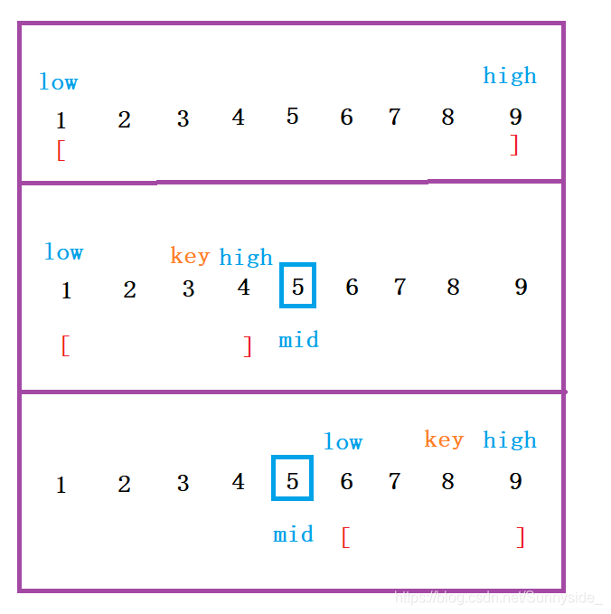
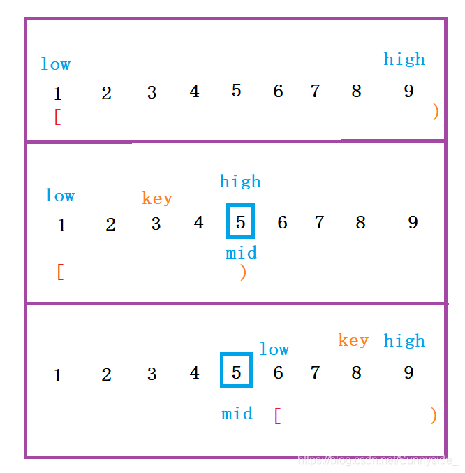

# 常见输入输出形式

## 1.1 单行数字，用空格/逗号分割

**输入描述**

> 输入数据有1行数字,**空格**分开，表示一组输入数据。
> 或
> 输入数据有1行数字,**逗号','**分开，表示一组输入数据。

```undefined
4 1 2 3 4
或
4,1,2,3,4
```

**代码1：空格或逗号分隔均可**

```C++
#include <iostream>
using namespace std;

int main(){
    vector<int> data;
    int tmp;
    while (cin >> tmp) {
	data.push_back(tmp);// 处理数据
	if (cin.get() == '\n') break;
    }
  
    return 0;
}
```

**代码2（输入为两行，第一行为元素个数，第二行为各元素值）**

```cpp
#include <iostream>
#include <vector>
using namespace std;

int main(){
    int m;  // 已知元素个数
    cin >>  m;
    char sep;  // 分隔符
    vector<int> nums(m);
    
    for (int i = 0; i < m - 1; ++i){
        cin >> nums[i] >> sep;
    }
    cin >> nums[m - 1];

}
```

> 很巧妙，接收一个元素再接收一个分隔符

## 1.2 单行字符串，用空格/逗号分割

**输入描述**：

> 输入数据有1行字符串,**空格**分开，表示一组输入数据。
> 或
> 输入数据有1行字符串,**逗号','**分开，表示一组输入数据。

```csharp
string char xiao meng
或
string,char,xiao,meng
```

**代码**

```C++
#include <iostream>
using namespace std;

int main(){
    string str;
    vector<string> v;

    getline(cin, str);
    stringstream ss(str);  // /定义流对象 复制str到ss
    while (getline(ss, str, ' ')) {//用空格为分隔符, 从流ss中取字符到str
    //while (getline(ss, str, ',')) {//用','为分隔符
	v.push_back(str);
    }
    return 0;
}
```

> `getline(cin, str)；`
>
> `stringstream ss(str);`

## 2.1 多行数字/字符串，用空格分割

**输入描述**

> 输入数据有多组, 每行表示一组输入数据。
> 每行不定有n个**整数**，空格隔开。(1 <= n <= 100)。
> 或
> 输入数据有多组, 每行表示一组输入数据。
> 每行不定有n个**字符串**，空格隔开。(1 <= n <= 100)。

```css
1 2 3
4 5
或
a c bb
f dddd
```

**代码**

```C++
#include <iostream>
using namespace std;
#include <vector>
#include <algorithm>
#include <sstream>

int main(){
    // 字符串
    vector<string> v;
    string s;
    while(cin >> s){
        v.push_back(s);
        if(getchar() == '\n'){
            // 处理数据
            v.clear();
        }
    }
    // 整形数字
    vector<int> v;
    string str;
    while(getline(cin,str)){
        stringstream ss(str);//定义流对象 复制str到ss
        while(getline(ss, str, ' ')){//分隔符, 从流ss中取字符到str
            v.push_back(stoi(str));  // string to int
        }
        // 处理数据
        v.clear();
    }
    
    // 另一种整形数字思路
    vector<int> v;
    string input;
    while(getline(cin,input)){ // 读取一行
        stringstream ss(input);
        int num =0;
        while(ss >> num){  // stringStream -> int
            v.push_back(num);  // string to int
        }
        // 处理数据
        v.clear();
    }    
    return 0;
}
```

## 2.2 多行数字/字符串，用逗号分割

**输入描述**

> 输入数据有多组, 每行表示一组输入数据。
> 每行不定有n个**整数**，','隔开。(1 <= n <= 100)。
> 或
> 输入数据有多组, 每行表示一组输入数据。
> 每行不定有n个**字符串**，','隔开。(1 <= n <= 100)。

```css
1,2,3
4,5
或
a,c,bb
f,dddd
nowcoder
```

**代码**

```C++
#include <iostream>
using namespace std;
#include <sstream>
#include <vector>
#include <algorithm>

int main(){
    // 数字
    vector<int> v;
    string str;
    while(getline(cin,str)){
        stringstream ss(str);//定义流对象 复制str到ss
        while(getline(ss, str, ',')){//分隔符, 从流ss中取字符到str
            v.push_back(stoi(str));
        }
        // 处理数据
        v.clear();
    }
    
    // 字符串
    vector<string> v;
    string str;
    while(getline(cin,str)){
        stringstream ss(str);//定义流对象 复制str到ss
        while(getline(ss, str, ',')){//分隔符, 从流ss中取字符到str
            v.push_back(str);
        }
        // 处理数据
        v.clear();
    }
    return 0;
}
```

> `#include <sstream>`
>
> `v.push_back(stoi(str));`

## 3.1 二维数组，逗号/空格隔开，同时接收换行符

**输入描述**

> 二维数组,用空格或','隔开。

```undefined
12 23 34
23 45 56
34 45 76
或
12,23,34
23,45,56
34,45,76
```

**代码**

```C++
#include <iostream>
using namespace std;
#include <sstream>
#include <vector>
#include <algorithm>

int main(){
    int num;
    vector<vector<int>> v;
    vector<int> tmp;
    int n =3;//二维数组行数
    while (cin>>num){
        tmp.push_back(num);
        if (cin.get() == '\n'){
            v.push_back(tmp);
            n++;
            tmp.clear();
        }
        if(n == 3){
            break;
        }
    }
    
    //二维数组遍历
    for (int i = 0; i < v.size(); i++){
        for(int j = 0; j < v[i].size(); j++){
          cout << *it <<" "<<endl;
        }
        cout << endl;
    }

    return 0;
}
```

> `v.size();`
>
> `v[i].size()`


# 时间&空间复杂度

## 时间复杂度

**时间增长的趋势**

【大O表示法】算法的渐进时间复杂度
$$
T(n)=O(f(n))
$$
他计算的就是当一个问题的量级增加的时候，时间增长的趋势。

$f(n)$代表代码执行的次数，$O$表示正比例关系

$O(f(n))$代表的是当n趋于无限大时候的一个比例，设计到高数的无穷

### $O(N)$时间复杂度：

```cpp
for(i=1;i<n:i++) {
    x++;
}
```

### $O(N^2)$时间复杂度：

```cpp
for(i=1;i<n:i++) {
    for(i=1;j<n;j++){
       x++; 
    }
}
```

### $O(1)$时间复杂度：

```cpp
int x=0;
int y=1;
int temp=x;
x=y;
y=temp;
```

这段代码中，算法的时间复杂度不会随着任何一个变量的增大而变长。

### $O(log(N))$时间复杂度：

```cpp
int i=1;
while(i<n) {
    i=i*2;
}
```

这段代码中，循环$log(N)$次就能结束

## 空间复杂度

**内存增长的趋势**

常用空间复杂度：$O(1),O(n),O(n^2)$

### $O(1)$空间复杂度：

```cpp
int x=0;
int y=0;
x++;
y++;
```

这段代码需要的内存空间就是一个常数量，不论`x`或者`y`再大，也不会影响空间分配

### $O(n)$空间复杂度：

```cpp
int[] newArray = new int[n];
for (int i=0;i<n;i++) {
    newArray[i]=i;// 给元素赋值
}
```

需要的空间就是数组的长度n，n越大内存需求越大

### $O(n^2)$空间复杂度：

二维数组，矩阵等n行n列，n*n就是n的平凡

# 数组

## 二分法

二分查找的前提条件是有序数列，普通查找则不需要。
查找到返回该元素的下标，否则返回-1。
普通查找的[时间复杂度](https://so.csdn.net/so/search?q=时间复杂度&spm=1001.2101.3001.7020)为O(N), 二分查找的时间复杂度为O(logN)。

根据区间的定义二分法有以下两种写法：

|                       第一种:左闭右闭                        |                       第二种:左闭右开                        |
| :----------------------------------------------------------: | :----------------------------------------------------------: |
|  |  |

```cpp
class solution {
public:
    // 左闭右闭区间版，闭区间的意思就是right=num.size()-1
    int binarySearch1(vector<int>& nums, int target) { // 接受一个数组和目标元素，返回目标元素在数组中的下标
        int left = 0, right = nums.size() - 1;  // left和right为元素下标，定义target在左闭右闭的区间里，[left, right]
        while(left <= right) { // 当left==right，区间[left, right]依然是个合法区间，还得查找一下，所以用 <=
            int mid = (left + right) / 2;
            if (nums[mid] > target) {
                right = mid-1; // mid-1是因为，num[mid]已经判断了比target大，所以下次就不用再把num[mid]再比一次了，直接排除
            }
            else if (nums[mid] < target) {
                left = mid + 1;
            }
            else { // nums[mid] == target
                return mid;
            }
        }
        return -1; // 未找到目标值
    }
    // 左闭右开区间版，左闭右开区间的意思就是right=num.size()
    int binarySearch2(vector<int>& nums, int target) {
        int left = 0;
        int right = nums.size();
        while (left<right) {
            int mid = (left + right) / 2;
            if (nums[mid] > target) {
                right = mid;    // 从第一步开始就不考虑nums[right],所以以后每一步都不考虑nums[right]
            }
            if (nums[mid] < target) {
                left = mid + 1;   // left还仍旧要把上一次比较的排除掉
            }
            else { // nums[mid] == target
                return mid;
            }
        }
        return -1;
    }
};
```

## 移除元素

