# 网络编程

## ping命令

```bash
1. ping 127.0.0.1/localhost
```

- 本地回环地址，能`ping`通则说明本地网卡以及`TCP/ip`协议的安装正常；如果不通，一般是网卡驱动有问题
- 这个不联网也能`ping`通，因为就发生在本机上

```bash
2. ping 本地IP地址
```

- 这个是要联网的
- 能`ping`通说明网卡的硬件是工作正常的，IP地址的设置也是正常的

```bash
3. ping 默认网格IP地址
```

- 网关负责将数据包转发到互联网上，一般就是路由器
- 有线网`ping`不通说明机器到网关的线路有问题，比如网线断了
- 无线网`ping`不通大概率是路由器发出的信号有问题

```bash
4. ping 远程主机（www.baidu.com）
```

- TTL值表示数据包经过了几跳路由器，TTL值=默认值-路由器跳数

##  CS架构与BS架构

### CS架构

CLient 		<===>		Server   

编写软件的时候编写两部分：

客户端软件	<===>	服务端软件

客户端软件和服务端软件会装在两台计算机上，但并不是客户端软件和服务端软件直接通信！应用程序装在操作系统上，操作系统又装在计算机硬件上，所以两个软件的通信其实是两台计算机硬件(网卡)的通信：

抖音APP				抖音服务端

操作系统				操作系统

计算机硬件<===>计算机硬件

### BS架构

本质也是CS架构

Browser		<===>		Server

开发软件的时候只需要发开服务端软件，客户端就一个浏览器搞定

## 网络通信物理连接

网络通信必须要有物理连接介质

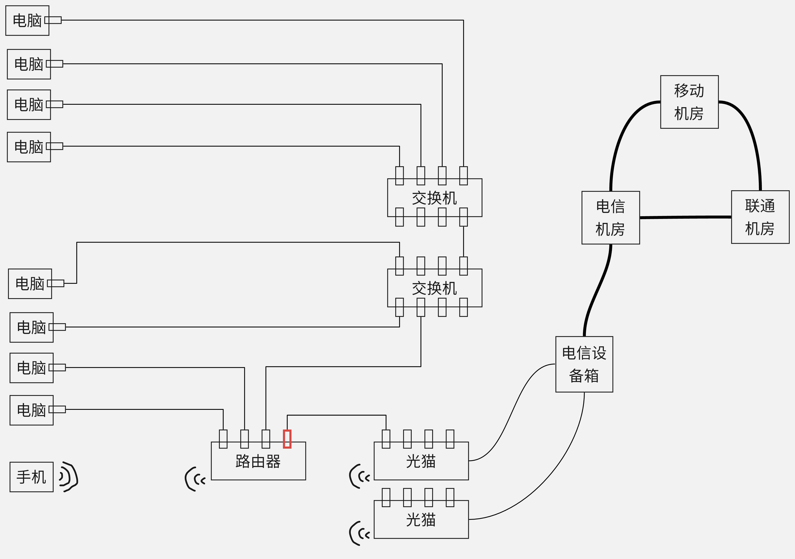

但并不是有了物理介质连接就可以进行数据通信了，从各种客户端（电脑、手机）到各种服务端还存在以下问题：

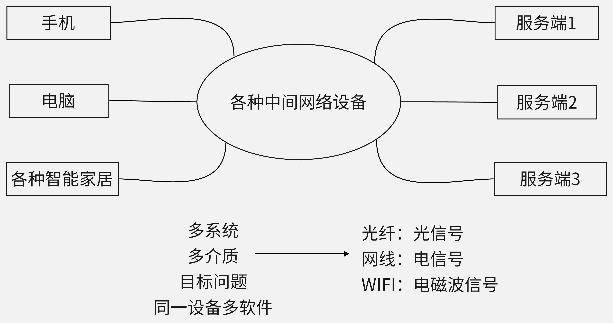

只要所有使用网络的人遵循同一**协议**那么就可以进行数据传输！协议有很多，但不论哪种协议都要遵循**==OSI七层模型==**，以它为参考设计协议，这样全世界的网络就通用了。

## OSI七层模型

### 物理层：

解决信号转换的问题   

- 电信号光信号等->01010101

### 数据链路层：

解决发给谁的问题

- mac地址，每块网卡都有，全世界唯一；申请入网许可证的过程就是在给网卡分配mac地址，不管是有线网卡还是无线网卡还是蓝牙他们都有mac地址。因此有了mac地址就结局了之间的目标问题，也就是知道了mac地址客户端就可以准确的找到特定的服务端而不会发错人。mac地址分配组织是IEEE

### 网络层：

IP地址，解决发到哪里的问题

- 公网IP	也是全世界唯一，专门组织(IANA)负责分配；相当于快递地址
- 内网ip 也叫私网IP；相当于某个快递地址不同的房间号，在同一个内网里IP地址不能重复---局域网唯一
- IP地址与mac地址都是用来定位的，他们的区别可以理解为：mac地址代表一个具体的人，一个特定的人肯定是全球唯一的，但要找到你的话肯定得知道你的地址，要不怎么找得到，这个地址就是IP地址；再比如网购，你不能只写个你的名字还要写上你的地址，你再成都那就写成都的地址，你再重庆就写重庆的地址。对应电脑，今天你在成都联网那你的公网ip就是成都的ip，明天你再重庆联网那你的公网ip就是重庆的ip。

### 传输层：

解决用什么方式发的问题（中通？顺丰？）

- tcp协议	可靠，速度慢	长距离传输
  - 100M文件=>小包(1500Byte) 00001 收到回答 00002 收到回答 00003 收到回答...
- udp协议    不可靠，速度快    短距离传输（局域网）
- 端口：每个设备上每个程序一个编号，让一台计算机上的多个程序同时使用网络。如果没有端口，一台电脑只能让一个程序使用网络，别的程序只能排队。有了端口号，不论是给那个程序发的，发的时候都可以一起打包，到目的地拆包的时候再看是找那个端口的就分给哪个端口
- tcp和udp都有端口

### 会话层：

决定什么时候开始发，什么时候开始收

- 就跟打电话一样，要先把电话打通再开始说话，你不可能电话拿起来就开始说话，要先把通话建立好，然后数据传输完成后再说拜拜。这就是建立和断开会话，不断开的话会一直占用计算机内存

### 表示层：

描述文件类型

- 我发一段二进制数据，如果不告诉对方是什么类型的数据，那对方就打不开我发送的数据，所以发数据的同时还要告诉对方我发的是什么类型的数据，表示层就是用来描述文件类型的；表示层会把我们发送的二进制数据前加上文件的类型

### 应用层：

电脑上的一个程序或进程（微信、QQ、浏览器）


合并七层模型的后三层叫五层模型，再合并前两层叫四层模型


## TCP/IP协议的五层模型

基于OSI七层协议设计出来用的最多的协议

协议：规定数据的组织格式

> 协议 = 头部 + 数据

就跟寄快递一样，不是直接把东西丢给快递公司，而是要打包一下，写上收件人，收件地址，发件人，发件地址；打包就是给数据加上头部，拆包就是拆到头部拿出数据

互联网用到的协议很多，要包含很多头部

TCP/IP就是五层模型

[TCP/IP协议的封包和解包流程（up:小飞有点东西）](https://www.ixigua.com/7166955505498358272?id=7170538522309296692&logTag=fca6a2226f743aeb35aa)

`ping`命令：使用是去掉http头部和尾部，例如`https://www.baidu.com/` ping的时候是

```bash
$ ping www.baidu.com
```

ping命令是个包探测器，他可以探测本机和目标计算机之间的网络是否通畅

目标计算机多次访问时IP地址不一样是因为服务器为了实现负载均衡，为一个域名配置了多个IP地址，也就是对应多台服务器设备，这样使用用一个域名访问服务器时会给你匹配到最优的那一个服务器

- 应用层协议：Hypertext Transfer Protocol（http）
- 传输层协议：Transmission Control Protocol（tcp）
- 网络层协议：Internet Protocol Version 4（IPV4）
- 数据链路层协议：Ethernet Ⅱ（以太网协议）
- 物理层

从应用层到物理层就是数据一层一层加上各种头部打包的过程，真正的数据是在应用层，中间的数据只是为了说明数据要发给谁、往哪发、怎么发、然后物理层做信号转换

## 五层模型剖析

### 物理层：

- 010101101011101001...无头无尾

- 一组数据称之为一个bit流

### 数据链路层：

- 以太网协议Ethernet

- 一组数据为一个数据帧，一个数据帧分为两部分（头部+数据）

- （头部=发送者mac、接收者mac，上层模型类型）+（数据=网络层所有内容）

  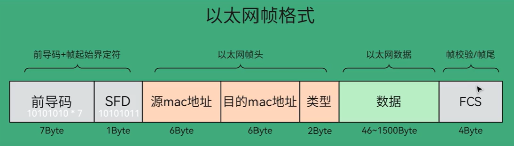

- 这样收发数据的时候，一个数据帧既有头也有尾，这样就可以从看似没有意义的大量二进制信号中读取到一个个数据帧，信号从此变得有了意义
- 有了物理层和数据链路层后理论上已经可以实现全世界计算机的通信了，因为以太网协议的工作方式是广播，计算机通信基本靠吼。但是这样的话就得让全世界的计算机都在同一个广播域内，只有在这个范围内吼一声所有的计算机才能听到。连接在同一个交换机上的所有计算机是一个广播域。路由器就有交换机的作用，也就是说你手机向交换机发送的数据包能被连接在这台路由器上的所有设备接收到。所以只要把全世界的计算机都连接到同一个交换机就能实现全世界计算机通信，显然不可能，广播风暴

### 网络层：

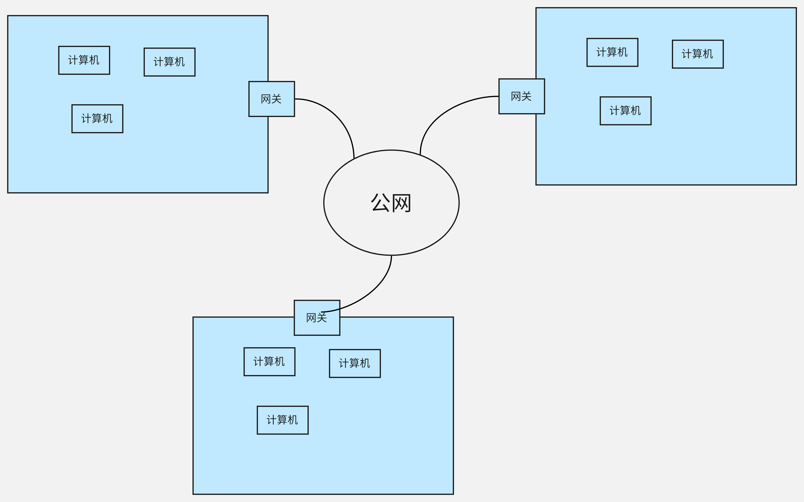

- 就是把全世界的计算机放在一个个小的广播域（局域网）里面，但是这样只能实现局域网内计算机的通信，不同的局域网之间就不能通信了 。
- 如何实现夸局域网的通信：网络层规定，每个小房间（局域网）都要有一个出口---网关
- 网关有两个地址
  - 局域网地址：局域网内的设备要找网关就找这个地址
  - 对外地址：和公网连通的地址
- 夸局域网通信时，首先由局域网内的某个计算机吼一嗓子，网关在局域网内所以可以收到数据，同时网关又作为桥梁就可以把这个数据往公网发了。数据往公网发的时候用的是路由协议。这份数据跨过公网后到达了一个局域网的网关 ，然后它吼一嗓子，这个局域网内的目标设备就会收到数据信息，从而实现了两台设备跨局域网通信
- 协议：IP协议 
- 一组数据为一个数据包，一个数据包分为两部分（头部+数据）
- （头部=发送者IP、接收者IP，上层模型类型）+（数据=传输层所有内容）

#### IP地址：

 IPV4：

```cpp
00000000.00000000.00000000.00000000=>0.0.0.0
...
11111111.11111111.11111111.11111111=>255.255.255.255
43亿个，显然不够用，
 
```

- 解决方案之一是把一部分ip地址剥离出来让这一部分IP地址可以重复使用---NAT技术

- NAT技术：network address translation。把一部分IP地址专门给内网使用，也就是局域网，所有的内网计算机都使用这一部分IP地址。当需要发送公网的时候，数据包就会通过网关做一次NAT地址转换，把内网IP转换成网关的公网IP，公网IP全世界唯一，局域网内的所有计算机都可以通过这种方式共享上网。数据出去的时候通过网关，最后把IP地址转换为公网IP，数据回来的时候网关就会通过NAT地址转换，把公网IP转化为内网IP最后到达计算机

- 三个内网IP段：

  ```py
  10.0.0.0 ~ 10.255.255.255  一千六百多万
  172.16.0.0 ~ 172.31.255.255 104万
  192.168.0.0 ~ 192.168.255.255 65536个（用的最多）
  ```

- 保留地址：如果数据包的目的地是127开头的地址，那么这个数据包不会离开本机，不会出现在网络上，一般用于测试。

  ```cpp
  127.0.0.0 ~ 127.255.255.255
  ```

- 其他的都是公网IP
- 解决IPV4地址不够用的第二种方式就是ipv6，IPV6 128位！肯定用不完

#### 子网掩码

大多情况下子网掩码都是`255.255.255.0`

IP地址完整写法：

```cpp
windows:192.168.3.88/255.255.255.0
Linux:192.168.3.88/24
```

IP地址必须和子网掩码配合使用，或者说一个合法的IP地址就是由IP地址和子网掩码组成的，所以IP地址和子网掩码是一起出现的。

为什么要有子网掩码呢？

之前说过，为了解决IP地址不够用的问题，我们划分了很多不同的广播域，而子网掩码和IP地址共同使用就是为了区分不同的广播域。如果只写一个IP地址其实是没有意义的，因为单纯的IP地址并不能让我们知道我们在哪个广播域里面，所以必须配合子网掩码

怎么划分广播域？

```cpp
255.255.255.0 => 11111111.11111111.11111111.11111111
192.168.3.88  => 11000000.10101000.00000011.01011000
    			 [			网络位		   ]  [ 主机位 ]
192.168.3.0  => 11000000.10101000.00000011.00000000 保留，作为网络号使用，用来表示这个网络
192.168.3.1  => 11000000.10101000.00000011.00000001 这个网段的第一个可用IP地址
...
192.168.3.254  => 11000000.10101000.00000011.111111110 这个网段的最后一个可用IP地址
192.168.3.255  => 11000000.10101000.00000011.11111111 保留，作为广播地址使用
所以在24位子网掩码下，可用IP地址个数是256-2个
```

只要IP地址的网络位相同，它，们就属于同一个网段，在同一个网段下只要物理线路接通就可以直接通信，也就是吼一嗓子就可以传输数据；如果不在同一网段，即便物理线路接通也不能通信；子网掩码的作用就是划分不同的网段，也就是不同的局域网

子网掩码就是用来固定网络位的，只要是网络位相同的IP地址，他们就属于同一个网段

只要知道了对方的IP地址，我们自己有IP地址和子网掩码，一计算就可以知道我们自己网段的范围。然后和对方IP地址一对比，立马就可以知道它是不是在我们的子网范围内。如果是就直接通过MAC地址通信，如果不是那就要跨子网通信，把数据发给网关。网关走路由协议，通过IP地址把数据传给对方的子网

#### ARP协议

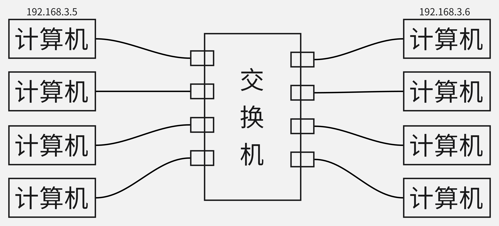

在同一个局域网里面的计算机要通信，只知道对方的IP地址的话是找不到的，因为不知道它连的是交换机的那个接口。。虽然广播可以实现，但是私密数据不想让局域网里的所有计算机都收到。

局域网内通信二层交换机就够了，二层交换机的意思就是他可以把数据解析到第二层，也就是数据链路层，数据链路层的头部是MAC地址。所以二层交换机拿到数据后可以看到MAC地址，交换机看到MAC地址后就知道数据该发给谁了。二层交换机解析不到第三层，也就是说看不到IP地址，因此只知道IP地址的话是没办法把数据发给计算机的，因为交换机需要看对方的MAC地址才知道下一步要把数据发送给谁，要不然就只能用广播给每个人都发一份，但广播没有私密性，这时候就用到了ARP协议，也叫地址解析协议。

ARP协议工作在二层和三层之间，他的作用就是把IP地址解析成MAC地址，这样交换机拿到MAC地址后就知道该发给谁了。

ARP协议是怎么通过IP地址解析到对方的MAC地址呢？

也是通过广播，这个广播叫ARP广播。他的内容就是：`谁是192.168.3.6，把你的MAC地址给192.168.3.5`。这个ARP广播会被交换机转发给局域网内的所有计算机，但只有要找的那个会做出回应。这个计算机会向192.168.3.5回一个数据包`我是198.168.3.6，我的MAC地址是xxxxxxxxxxxxx`。这个时候198.168.3.5就拿到对方的MAC地址了，它拿到MAC地址后会做一个表格记录---ARP缓存表：记录这个IP地址对应的MAC地址。这个ARP缓存表不是永久的，因为IP地址可以改，如果不相应更新ARP缓存表就会把信息发错。

把网线插在交换机接口上，它并不知道你的计算机的MAC地址是多少，只有经过一次通信后交换机就会记住这个接口对应的MAC地址。交换机里面也有个MAC地址表，连接到它上面的所有计算机。只要发生了一次通信，交换机就会记录对应接口的MAC地址。这样交换机就会记住每个计算机的MAC地址，而不用每次都广播一次问MAC地址是多少

#### 总结：

学习完网络层和数据链路层后，我们就知道：两台计算机要想通信。就必须知道对方的IP地址，在发数据之前会通过IP地址和子网掩码进行计算，判断对方是否和我们在一个子网内，如果在一个子网内那就通过ARP协议拿到对方的MAC地址，然后把数据通过交换机传给他：

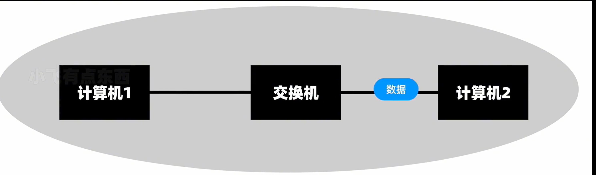

如果两者不在同一个子网内，发数据的时候还是要通过ARP协议，但这时候拿的就不是对方的MAC地址了，而是拿网关的MAC地址。网关的IP地址计算机里面都是有的，只要有网关的IP地址就可以通过ARP协议拿到网关的MAC地址。对方如果不在我们的局域网内，那就只能把数据交给网关，让网关帮我们转发：

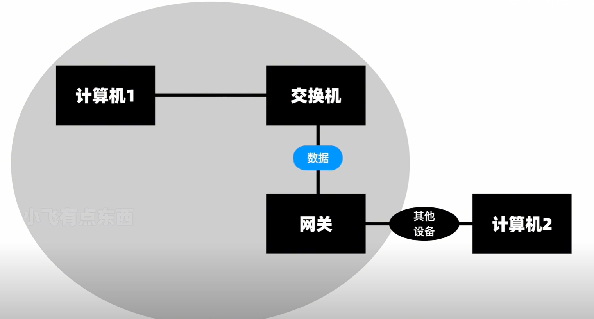

现在也有很多三层交换机，他可以工作在网络层，也就是集成了部分路由器的功能。如果一个子网内设备过多就可以用它来进行更多子网的划分，他可以作为子网间通信的网关。

家里的网关就是路由器，LAN口接内网设备，WAN口接运营商运营商网络。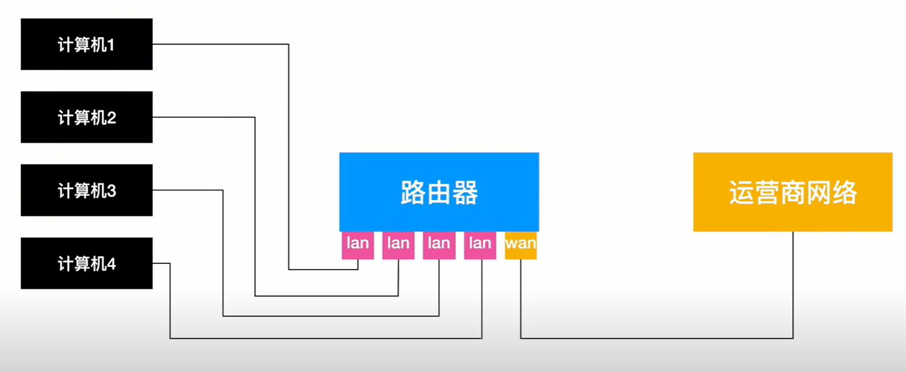

如果只用LAN口不用WAN口，那就可以吧路由器看成一台二层交换机，有了WAN口之后路由器才有了网关的作用，也就可以工作在三层了。

网关一般有两张网卡，分别配置两个子网的IP地址，这样他就可以在两个网络之间做数据转发了。实际上只要你的计算机有两张以上网卡，那你的电脑就可以做成一台路由器，而且是性能很好的路由器。

路由器上的LAN口和WAN口接入的就是两个不同的子网，所以从局域网访问公网就是跨子网通信。 

NAT技术又分为两种：SNAT和DNAT

##### SNAT

源地址转换

访问公网设备时，路由器把内网设备的IP转换为公网IP再进行访问

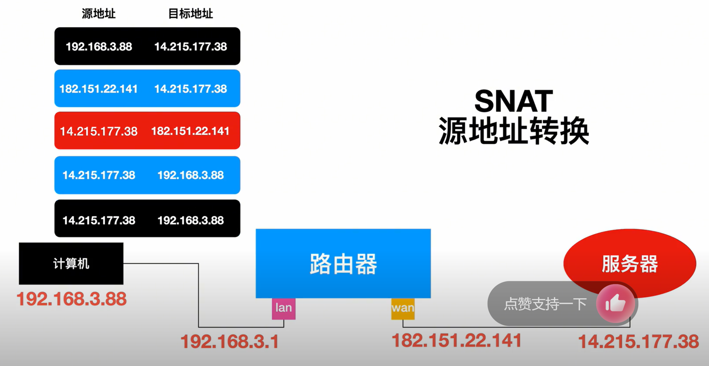

实际上转换的过程中会带上内网计算机的端口号，否则两台计算机同时访问一个服务器时，服务器发给路由器的数据路由器就不知道发给内网内的那个计算机了

##### DNAT

目标地址转换

如果内网计算机要提供对外服务，公网上发过来的请求是不太能直接到达内网计算机的，这时候就需要路由器做目标地址转换。外网先访问到路由器网关，然后路由器再转换到内网提供服务的计算机。

### 传输层

MAC地址仅限于局域网通信，夸局域网通信时不需要MAC地址只需要IP地址就可以了。夸局域网通信的时候MAC地址的作用仅仅是让我们找到网关或者让网关找到局域网的计算机 。

假设现在有一个数据，这个数据到网络层后会被打上IP头部：也就是源IP和目标IP：`（源IP，目标IP）数据`；到数据链路层后就会被打上以太网头部，也就是源MAC地址和对方MAC地址`(源MAC地址，目标MAC地址)（源IP，目标IP）数据`；如果是跨局域网通信那目标MAC地址就是网关的MAC地址，但目标IP还是对方的IP地址：`(源MAC地址，网关MAC地址)（源IP，目标IP）数据`

网络编程的目的就是写一个客户端软件和一个服务端软件，让他们通过网络进行通信，在通信的时候就需要定位到对面的这个软件在全世界的那个位置。目前已知两种定位方式：MAC地址和IP地址。MAC地址只能用来标识局域网内唯一一台计算机，MAC地址配合IP地址才能知道他在那个子网内。也就是说有了MAC地址和IP地址就可以定位到全世界任意一台计算机了，由于通过ARP协议也可以通过IP地址解析MAC地址，因此也可以说有了IP地址就可以定位到全世界唯一一台计算机了。

找到世界上唯一一台计算机还没完，因为我们要找到运行在计算机上的某一款软件，这时候就需要用到第四层传输层了。

传输层协议是TCP协议和UDP协议，这一层定义了一个端口的概念。端口不仅仅是在NAT地址转换的时候产生作用，还能帮我们定位到计算机上的某一款应用和程序。电脑上的软件只要走网络通信，不管是用tcp还是UDP一定要有一个端口，通过这个端口就可以定位到计算机上运行的具体软件了。

也就是说通过IP+Mac+port就可以定位到全世界运行的唯一一款基于网络通信的应用程序。

数据到了传出层之后的格式：

```cpp
tcp头部+数据或udp头部+数据
头部里都包含源端口和目标端口，tcp协议不止包含端口还包含数据段的序列号
```

数据帧---数据包---数据段

为什么叫数据段？

如果应用层下来的数据比较大的话，不可能一次就传完了，他会把这个数据拆成一段一段的，每一段都有一个编号，这个编号就是数据段的序列号。

对于TCP协议，我给你发了一个数据段过去，然后你收到这个数据段之后就会根据序列号给我做一个回应，我收到你的回应之后就知道你哪个数据段收到了哪个数据段没收到。

UDP协议只管发不管你收没收到

TCP协议是可靠的，因为每个数据段都需要对方确认，如果数据段发出去之后一直没有收到对方的确认消息，那就会认为这个数据段丢了，然后重新发。

TCP不是一上来就发数据的，他会先探测一下网络是否通畅。如果不通就没必要发也没必要切分成很多数据段了。

tcp这个探测的过程叫做三次握手

客户端和服务端并不是指客户端程序和服务端程序，而是谁先发起请求谁就是客户端。tcp的标识有六种：

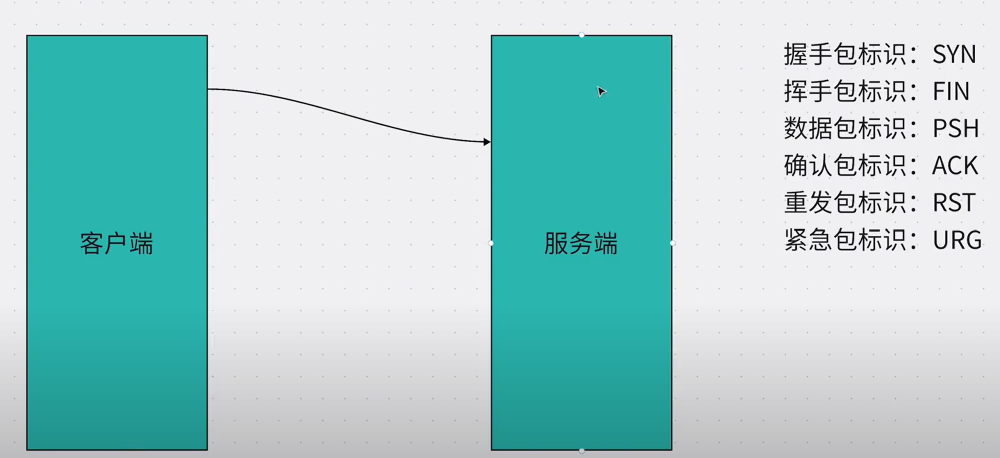

#### 三次握手：

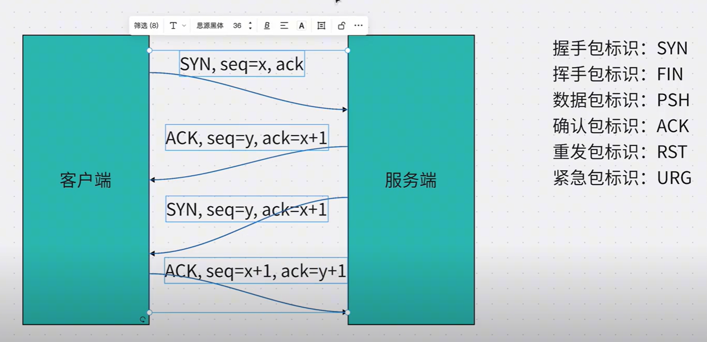

经过上面两个一来一回之后，就能够探测出来两边的线路是通畅的，握手也就完成了。之所有叫三次握手是因为中间的那两个数据包除了标识不一样外别的都是一样的，因此没有必要拆成两个包来发，把他俩合并发的时候带上两个标识符这样一个包就搞定了，速度相对来说会快一点：

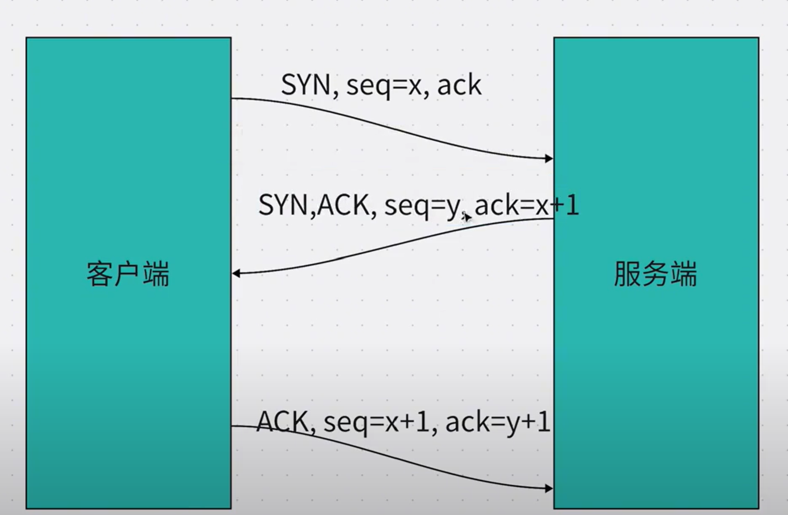

客户端发完确认包之后他就会进入连接状态，而服务端需要等收到客户端这个确认包之后他才会进入连接状态。所以客户端是比服务端先进入连接状态的，再之后他们就可以发真正的数据包了。

#### 四次挥手

四次挥手就是在数据完成传输之后断开连接的过程：

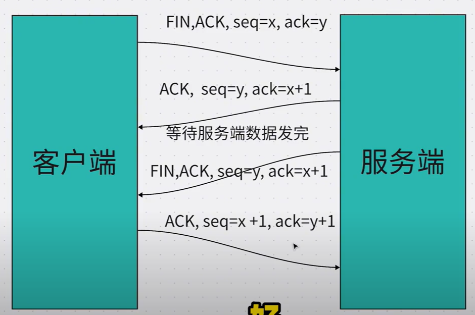

监听就是listen的意思，意思就是正在聆听，等待访问

由于传输层以下的工作内容基本固定，因此把这些内容封装好之后，只需要写应用层程序就可以了。所以传输层和应用层之间还有一层叫 **socket抽象层** ，他不属于互联网通信协议，只是对传输层及以下做了一个封装。socket翻译过来叫**套接字**，也就是说以后我们写应用程序就跟套接字打交道就可以了，传输层及以下就不用再管了。

#### dhcp

动态主机配置协议(Dynamic Host Configuration Protocol)

当电脑插上网线或手机连上WiFi之后并没有让我们配置IP地址，为什么也可以上网呢，这是因为有一个DHCP协议存在，他会自动帮我们配置。

当电脑插上网线或手机连上WiFi之后，操作系统的**网络协议栈**会自发送一个DHCP请求的数据包。当然这是广播的形式，因为刚插上网线，计算机不知道路由器是谁，然后路由器收到这个DHCP请求之后会为他分配一个IP地址，包括子网掩码网关地址等等，然后通过DHCP发送给他。操作系统收到回复之后就会把这个分配的IP分配到网卡上。

当然也可以把DHCP关掉自己手动配置IP地址，这是要保证不能喝局域网内其他IP冲突

#### DNS

客户端要和服务端通信就要知道对方的IP+端口（MAC地址交给ARP协议获取），客户端的端口每次打开都是随机的，但服务端的端口必须固定，否则经常变得话该怎么访问呢。web服务端口一般都是80端口，浏览器访问时也会自动加上80端口，所以访问web只需要记住ip就可以了。

但IP地址越来越多，全是数字根本不好记，因此IP地址也需要一个通讯录。只需要用一个文件写上IP和对应的名字，然后浏览器访问网站的时候自动读取这个文件，也就可以拿到对应的IP地址了，这样就不用记那么多IP地址了。

host文件

现在每个人电脑上都有了一个IP通讯录，也就是那个host文件。当然我们不可能每天自己去改这个文件，所以为了方便，就有一个专门的服务器，全世界的计算机都可以在这个服务器下载更新host文件，但host文件这种把IP存在一个文件里的方式已经淘汰了。

host文件淘汰之后他们又搭了一个服务，就叫DNS服务，然后把原来通讯录的所有数据都放在它的数据库里面，然后其他电脑只需要安装一个DNS客户端。这样每次访问一个域名的时候，DNS客户端就会向DNS服务器发一个请求，查询这个域名对应的IP地址，然后服务端就会回应一个IP地址给客户端。我们拿到IP地址之后就可以正常访问网站了，这就是DNS的由来

DNS服务端口是 53

web服务端口是 80/443

路由器上就配有DNS服务器地址，路由器收到DNS请求之后，它会帮我们去DNS服务器上获取，获取之后再转发给我们。

#### 常见的DNS服务器：

阿里：223.5.5.5

腾讯：119.29.29.29

百度：180.76.76.76

谷歌：8.8.8.8

类似QQ号，越早注册越可能获得靓号！

浏览器上直接用IP地址访问的话就没有DNS解析这一步了，但浏览器上还有一些其他的资源需要用到DNS，比如图片之类的等。这就是有时为什么浏览器上不了网，但是qq这些软件可以上网的原因。因为**浏览器上网需要用到DNS解析，而QQ是直接用IP地址和服务器进行通信**的，不需要DNS解析

**上面的DNS服务器都不是最终的dns服务器，他们只是代理服务器，是从别的地方同步过来的**

计算机访问 www.qq.com 网站的整个流程：

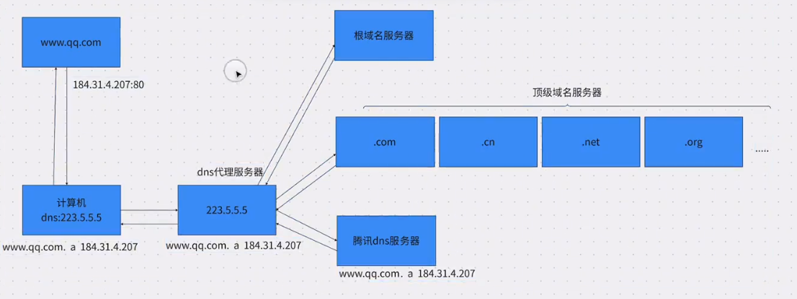

首先根据域名查一下dns获得网站对应的IP地址，dns代理服务器查看是否有这个域名的ip的缓存，如果没有他也要去一个特性的地方查：根域名服务器，世界上一共13台根域名服务器。所有的域名其实最后面都有一个点，这个点就代表根域名，但默认不显示。

跟域名服务器会**下放**域名到顶级域名服务器，顶级域名服务器有.com, .cn, .org等等。根域名服务器把.com的地址又返回给dns代理服务器，然后它又去找.com顶级域名服务器；之后.com服务器一看找的是qq，qq已经被腾讯注册过了，所以所有以.qq.com结尾的域名都会下放到腾讯的dns服务器，也就是说所有的以.qq.com结尾的域名都会交给腾讯的dns服务器来解析 。

至于.qq.com前面加什么都是由腾讯自己控制的，比如他可以把www.qq.com解析成一个IP地址1.1.1.1；mai.qq.com解析成一个IP地址2.2.2.2；game.qq.com解析成一个IP地址3.3.3.3，这都是.qq.com这个域名的所有者自己可以配置的。

你自己需要注册域名的话就可以上腾讯云，阿里，华为等等

.com域名服务器把腾讯dns服务器的地址给代理服务器，代理服务器拿到这个地址紧接着就去访问腾讯的dns服务器，在这里就能找到www.qq.com的a记录（IP地址）。

www.qq.com.中：

- .是根域名
- .com是顶级域名
- qq是权威域名，或者说二级域名
- 前面的www或者mail等等这些可以配置的叫主机名

从根域名到二级域名到主机名，查询到主机名后，主机名就对应一个IP地址，然后把对应的IP地址返回给代理服务器，这时候代理服务器才终于拿到了www.qq.com的IP地址了，会本地缓存这个ip，然后再返回给计算机，计算机也会先缓存下，然后计算机再向这个ip的80端口发起请求，这样就可以访问这个网站了，然后这个网站再返回我们需要的数据，这就是dns解析的整个流程。

#### url地址

数据链路层：MAC地址

网络层：IP地址

传输层：端口port

应用层还有一个地址：url地址

到端口的时候就定位到了应用程序，

比如随便打开一个网站：https://new.qq.com/rain/a/20230201A045A300，其中：

- `new.qq.com`这个域名就对应的ip，当然后面的端口被省略了
- 域名后面还有一串地址`/rain/a/20230201A045A300`，是用来在主机上定位到唯一一个资源的，比如一篇文章，一个文件等等

用mac+ip+端口+url就可以定位到唯一一个资源

一个完整的url地址包含三部分：

- `https://` 这是应用层的协议
- 域名加端口，也就是ip加端口
- 最后是`/rain/a/20230201A045A300`这个路径。ip+端口定位到应用程序之后，接下来就是把这个路径告诉应用程序，我需要这个路径下的文件，然后服务端再把这个文件返回给我们


#### 套接字socket

最早的套接字不是用来做网络通信的，只是用在一台计算机上两个进程之间的通信。

计算机上不同的进程之间，他们的数据在内存里面是隔离的，进程之间是不能访问对方内存空间的数据的，要实现两个进程之间传输数据即通信有两个解决办法：

1. 基于文件的通信：一台计算机上不同软件间的通信。既然内存是隔离的，那把数据存到硬盘，然后进程间去硬盘读取数据就行了。

- 套接字类型：AF_UNIX （Address Family）

2. 基于网络通信：不同计算机间软件的通信，封装了一些互联网协议进去

- 套接字类型：AF_INET

后面的东西篇细节技术，不深究了


# 并发编程

讲并发就涉及到操作系统的发展史

整个过程就是围绕着提高CPU的利用率进行的：穿孔卡片->联机批处理系统->脱机批处理系统

## 多道技术

目的：让单核实现并发

> 并发：看起开像同时运行的，实际上还是一个人在干
>
> 并行：真正意义上的同时运行，必须一个人干一个任务
>
> 并行也可以说是并发
>
> 单核计算机不能实现并行，但可以实现并发

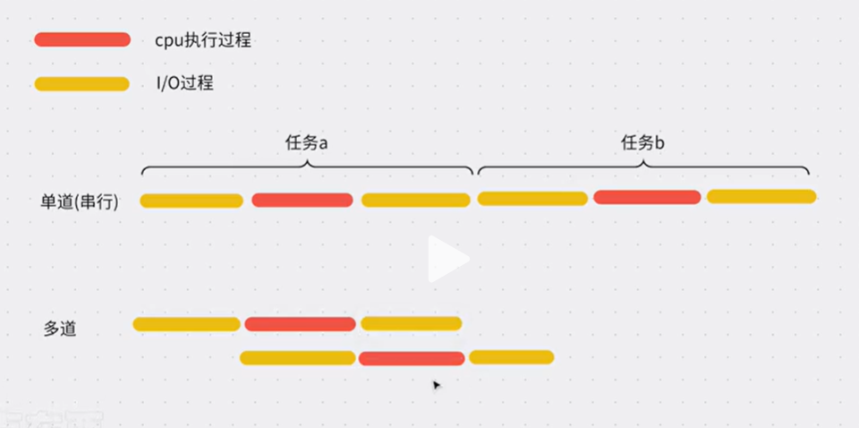

多道技术允许多个应用程序同时进入内存，并且CPU交替指向。当一道程序因为**I/O请求**暂停运行时，CPU便会立即去运行另外一道程序

多道技术的核心是切换+保存状态

切换是CPU在切换，CPU在切换的时候分为两种情况：

1. **当一个程序遇到I/O操作的时候，操作系统会剥该改程序CPU的执行权限。**也就是说，当一个程序运行的时候，需要打开一个文件，打开文件的过程CPU是没有工作的，这时候操作系统就会把CPU拿过来执行其他的程序，然后等前面的I/O操作执行完后，操作系统再把cpu调回去继续执行，这样就能提高CPU的利用率，同时还不影响程序的执行效率。正是有了多道技术的概念，计算机才第一次出现了操作系统的概念。多道技术的目的就是在单核情况下实现并发，就是CPU一刻也不要停。
1. **当一个程序长时间占用 cpu的时候，操作系统也会剥夺改程序cpu的执行权限。**还是以单核计算机为例，如果一个软件需要cpu执行10分钟，期间用户又点了其他程序，为了让用户感觉这些程序都在同时执行，这时候操作系统一看你这个任务占用CPU时间太长了，其他任务根本没法执行，这时候操作系统就会把这个任务先停下来，先把CPU拿去执行一下其他的程序，多个程序轮着来，这样用户就感觉实现并发了。

## 进程和程序

> 程序：存在硬盘上的一堆代码，是死的
>
> 进程：程序被执行的过程，是活的；
>
> 运行某个程序后，他会从硬盘加载到内存上，就可以使用各种功能了，也就是“活”起来了

## 进程调度

CPU要交替执行多个进程，但内存中有那么多进程等着执行，那CPU先执行谁呢？之前讲了 **切换+保存状态**，但CPU怎么切换怎么执行呢？这都得按照一定的规则进行操作，所以有了**进程调度**的概念。

几种发展而来的调度算法：

1. **先来先服务调度算法**：哪个进程先来CPU就先执行哪个进程。 显然，这种对长作业友好，对短作业不友好。

2. **短作业优先调度算法**：对短作业友好，对长作业又不友好。

3. **时间片轮转法+多级反馈队列**：显然比前两种方法更高级。时间片就是把时间切分成很多份，每一份就是一个时间片。比如进来了三个进程，那操作系统就会给每一个进程都分配一个时间片，他们每个人都先被CPU服务3秒，3秒之后，有的成可能就结束了，但有的人3秒完全不够，如果一个时间片不能结束的话那就把它往下一级队列请， 下一级队列又会分配一个时间片给他，当CPU执行完第一级队列里的时间片后就会来执行第二级里面的时间片，如果这一级还不能结束那就再往下放一级，越晚下走说民这个任务耗时越长，而且越往下走任务的优先级就会越低。 第一级队列的优先级是最高的，只要这里出现了任务，CPU就会立刻执行这里面的任务，这样给用户的感觉就是多个任务在同时执行。时间片长度肯定是毫秒级别的，因此CPU在各种时间片间切换的时候我们是感觉不来的，我们只能感觉所有任务在同时进行。

   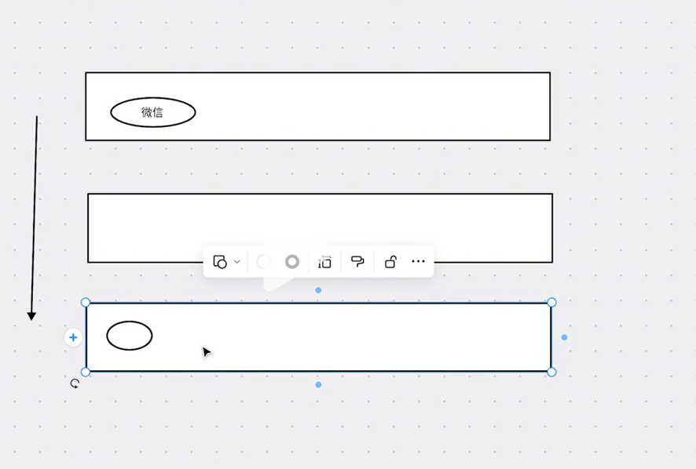

## 进程的三状态图

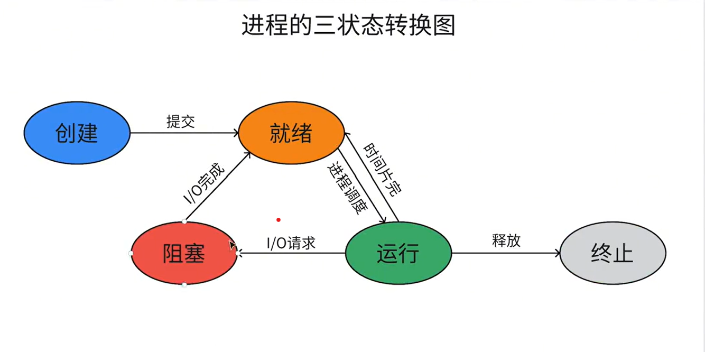

首先一个程序要想被运行，用户会双击这个程序或提交一个任务，这时候这个程序就会从硬盘加载到内存，进入**就绪态**。所有的程序要想被允许必须经过就绪态，也就是必须先准备好，然后等待CPU来执行。就绪态之后就会进入进程调度，即通过一些算法来调度。然后**运行**，运行的时候会出现几种情况：1. 时间片运行完了，程序也执行完了，就会立刻释放相应的资源，然后退出；2. 运行过程中遇到了I/O操作，比如读取、写入文件，发网络请求，input等待用户输入，print()等等，I/O操作是不需要CPU工作的，只要运行过程中遇到了I/O操作，操作系统就会把CPU拿走，拿去执行其他的时间片，当前程序就会进入**阻塞态**，然后当I/O请求完成的时候，就会结束阻塞态。<u>阻塞态结束后并不会立马进入运行态，而是回到就绪态里面排队，然后等待CPU来执行，也就是不能插队。</u> 

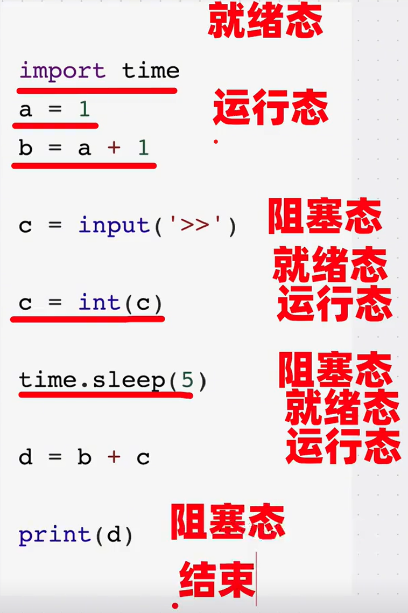

## 同步和异步

用来描述任务的提交方式

- 同步：任务提交之后原地等待任务的返回结果，等待的过程中不作任何事情
- 异步： 任务提交之后不在原地等待任务的返回结果，而是直接去做其他事情

这里的**任务指的就是一段代码或者一个函数**，调用一个函数就相当于提交了一个任务。如：

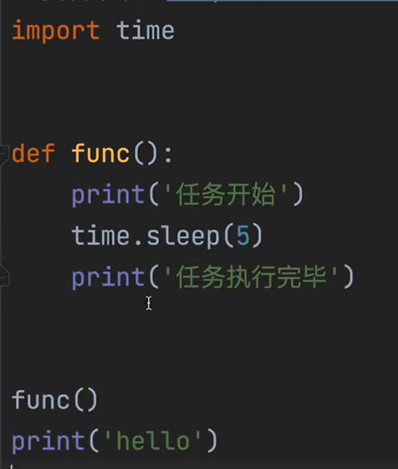

调用函数`func()`就相当于提交了一个任务，这里的`func()`肯定是**同步**调用，也就是说提交了这个任务之后，我们要原地等待这个任务执行完毕，拿到他的返回结果，然后才可以往后走。<u>普通的函数调用的方式就是同步调用，异步调用就要重新创建一个进程</u>，这是我瞎理解的一句话！

## 阻塞和非阻塞

描述进程的运行状态 

- 阻塞：进程三状态图的阻塞态
- 非阻塞：进程三状态图的就绪态和运行态


同步和异步、阻塞和非阻塞是非常重要的概念，他们可以有多种组合：

同步阻塞、同步非阻塞、异步阻塞、异步非阻塞

其中最高效的组合就是异步非阻塞：异步就是任务提交后不在原地等待，代码可以继续望下去执行，这样的话效率就上去了；而非阻塞就是程序不会处于阻塞态，永远都在就就绪态和运行态之间切换，这样不论是代码的利用率还是CPU的利用率 都是比较高效的。

以后写程序的时候，最理想的状态就是让我们写的代码永远在就绪态和运行态之间切换，最好没有一点阻塞。这样代码被CPU执行的时间间隔才会短，运行效率高。当然这是理想状态，程序大部分都是有阻塞的，比如打开pycharm，不做任何操作的话，它永远都是停在开始界面，这就是一个阻塞态，他在等待用户操作。

## 创建进程

最简单的创建进程的方式就是双击一个应用程序图标，就是让操作系统把你双击的应用程序代码从硬盘加载到内存，然后CPU来执行。

这里主要说的是**如何通过代码来创建进程！！！**

用代码来创建进程和创建线程是差不多的

用代码创建进程就是通过模块里的方法（函数），方法有很多。

创建进程这个或其实只能由操作系统完成，我们的代码只是告诉下操作系统，让他去创建，并不是我们的代码创建的进程。所以，多个进程的程序的执行顺序可能并不是我们代码写的顺序，而是完全随机的，因为操作系统只知道要创建几个进程，但是先创建哪个后创建哪个是完全随机的，并不会完全按照你代码写的那个顺去去挨个创建。

我们写完代码后直接运行这个代码，那么就会在内存中开辟一块内存空间，然后把这个代码丢进去，也就是说它就是一个进程。那如何**通过代码在这个进程的基础上在开一个进程**呢？直接调用模块里的方法，传给这个方法一些参数：即指定把什么内容作为一个进程来创建或者提交什么任务给子进程来执行（就是传个你要让子进程调用的函数名）。右键运行的这个进程叫**主进程**，通过代码创建的进程叫**子进程**。<u>这样的程序在运行之后，内存里面会开辟两块内存空间，主进程运行主进程的代码，子进程运行子进程的代码，他们是互不干涉的。而且在单核CPU下是并发的效果，在多核CPU下就是并行的效果。</u>

**总结：** 创建进程就是在内存中申请一块内存空间，然后把需要运行的代码放进去，多个进程的内存空间彼此是相互隔离的。进程与进程之间的数据，他们是没办法直接交互的，如果想要交互，就要借助第三方工具或模块。

## join方法

作用：让主进程等待子进程运行结束之后再继续执行，就是在创建多个进程的情况下实现像单个进程中的同步调用。

如何实现让主进程等着子进程呢？

1. 假如子进程需要执行3s，那我们让主进程睡上3s以上，等着子进程结束再执行主进程的内容---太简单粗暴了，不合理

2. 使用join方法

   ```py
   p=process(target=func,args=('写讲话稿',))	#创建子进程
   p.start()	# 子进程开始
   p.join()	# 主进程停在这里等待子进程p执行完毕
   print('主进程')
   ```

   这个join函数是主进程执行的，但主进程要执行这个就得等对应的子进程完全结束。

## 进程间数据隔离

**子进程起来的时候，会复制主进程的数据集，也就是主进程里面的变量**。因此子进程会有何主进程完全相同的变量和变量名称，但操作各进程的变量并不会改变其他进程的同名变量，只会操作自己进程中的该变量，这就是进程间数据隔离

## 进程号

一台计算机上运行了很多的进程，为了方便区分和管理这些进程，操作系统会给每个进程都分配一个pid号，也就是process_id,也叫进程号。在同一台计算机上，不同进程的进程号都是独一无二的，有点像端口号。

同代码中可以创建进程，通过代码也可以杀死进程，就像打开任务管理器结束任务一样。仍然和之前说的一样，创建和关闭进程都是操作系统才能干的，代码只是让操作系统帮忙下。通过代码杀死一个进程并不是瞬间的，要通过系统调用来让操作系统杀死，因此存在一定的时间差才能完全杀死。

## 僵尸进程和孤儿进程

- 僵尸进程

  子进程死后，还会有一些资源占用（比如进程号、进程的运行状态、运行时间等基本信息），会等待父进程通过系统调用进行资源回收。也就是说子进程死后需要父进程来为他**收尸**。除了init进程之外，所有的进程最后都会步入僵尸进程。

  例如有的代码，父进程明明已经运行完毕了，但是父进程并没有结束退出，他要等待子进程结束之后在结束，其实就是等待子进程结束之后给它收尸，或者说回收子系统的资源。

  正常来说，僵尸进程没有危害，主进程结束之后会自动回收僵尸进程，但有一种情况僵尸进程会带来危害：

  子进程退出之后父进程没有及时处理，僵尸进程就会一直占有计算机资源，它的进程号也会一直被占用，所以要壁面出现过多的僵尸进程。如果产生了大量的僵尸进程，资源就会被过渡占用，系统没有可用的进程号而导致系统不能产生新的进程。

- 孤儿进程

  子进程处于存活状态，但是父进程意外死亡。比如在终端里面强制把父进程杀死了，那就没人给子进程收尸了，没有人来释放子进程的资源了，这时候子进程就叫叫做孤儿进程。不过孤儿进程不用担心，因为操作系统会开设一个“孤儿院”，专门管理孤儿进程，回收孤儿进程的资源，这个孤儿院就是init进程。他就是孤儿进程的干爹，孤儿进程的亲爹死后，就由干爹来管理它

## 守护进程

后台默认在运行的一些服务，就称为守护进程。

他们守护的就是操作系统，只要操作系统起来了，那这些服务也就起来了，比如有的软件就会在电脑开机的时候跟着操作系统一起起来直到关机的时候这些软件才会关闭。那些随着操作系统的启动而启动，随着操作系统的关闭而关闭的服务就可以称之为守护进程。

创建守护进程就是在我这个进程死后，你也要跟着死。将一般的子进程改为守护进程就可以实现主进程死后子进程也跟着死的效果。这样主进程运行完结束后无论子进程执行到哪一步都会杀死他。

```py
p.daemon = True # 设置进程p为守护进程
```

## 互斥锁

12306买票网站！太形象了

当多个进程操作同一份数据的时候，会出现数据错乱的问题，解决方法就是加锁处理

锁的原理就是把并发改成串行，虽然牺牲了运行效率，但是保证了数据的安全。 

互斥锁基本不会用到，别人都会帮我们封装好，但还是要知道这个概念，知道怎么加锁。

加锁很简单，都是模块写好的。大概就是在主进程里生成一把锁，然后所有的子进程都来抢这把锁，谁先抢到谁就可以先买票，没抢到的只能在后面等，等上一个进程把锁释放出来，后面的人再接着抢锁。

```py

mutex=Lock() # 主进程生成锁
...
for i in range(1,9):
	p=Process(target=task,args=(i, mutex)) # 把锁传给所有子进程
    p.start()
    
def task(name,mutex): # 接收到锁
    search_ticket(name)
    # 给买票环节加锁
    mutex.acquire() # 抢锁
    buy_ticket(name)
    mutex.release() # 释放锁
```

注意，这个代码模拟的是12306服务器（不要想成个人电脑），代码是跑在12306服务器上的。查票就是查看服务器的文件，买票就是对应文件中的票数减一。

抢锁是随机的，我们不能决定谁先抢锁谁后抢锁。上述代码，查票环节大家可以一起查，但是到了买票环节，所有的子进程都要开始抢这把锁，谁先抢到锁谁先买票，就不能同时买票了。 一个人买完下一个人才能接着买。

加锁就是把并发变成了串行，虽然牺牲了效率但是保证了数据的安全。

除了互斥锁，还有行锁、表锁等等。

不管是什么锁，只要听到锁，那他就是把并发变成了串行，虽然牺牲了效率但是保证了数据的安全。

但也不能轻易加锁，加锁只应该在争抢数据源的环节加

## 消息队列

既然进程与进程之间是相互隔离的，那就要找一种方式实现进程与进程之间的通信。这里就用到了**消息队列**，或者**管道**。

在两个进程之间搭建一根管道或者创建一个第三方消息队列，两个进程交互的时候就基于第三方消息队列来交互：

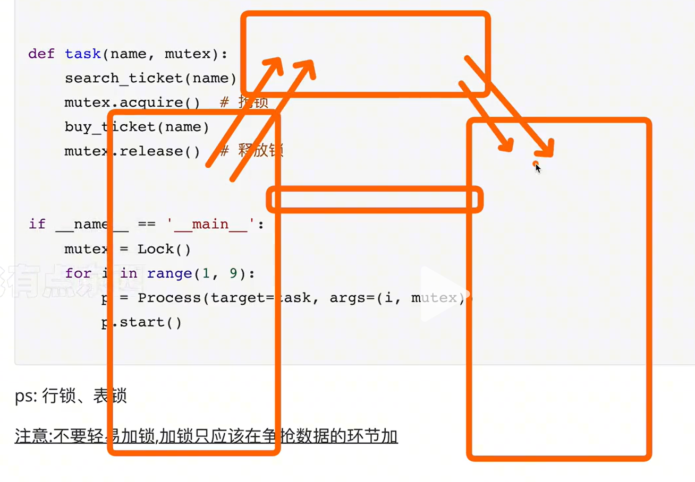

队列：先进先出

实例化一个队列对象后就可以往这个队列里传数据了：

```python
q = Queue(6) # 实例化队列，可以存六个数据
```

很多人可以往里面存，很多人也可以从里面取。拿一个数据队列里就少一个数据，你拿走之后别人就拿不到了。


管道：

管道和队列很像，数据在管道里面也只有一份。他和队列一样，拿一个数据队列里就少一个数据，你拿走之后别人就拿不到了。

 管道和队列使用谁？

应该用队列，因为队列其实就是管道加锁，队列比管道要好用的多。队列的锁都是底层加好了的。


## 进程间的通信 -IPC机制

**Inter-Process Communication**

```python
# 主进程和子进程通信
from multiprocessing import Process, Queue

def task1(q):
    q.put('宫保鸡丁')
    
if __name__ =='_main__':
	q = Queue() # 主进程和子进程之间通过这个队列通信
	p = Process(target=task1，args=(q,))# 开一个子进程
    p.start()
    print(q.get()) # 这个get()拿不到数据的话就会阻塞在原地，什么时候拿到什么时候再往下走
    
# 这段代码，打印是在主进程打印的，而数据是在子进程里面添加的，
# 这样就实现了主进程和子进程基于队列的通信了
    
# 子进程和子进程基于队列通信
from multiprocessing import Process, Queue

def task1(q):
    q.put('宫保鸡丁')
    
def task2(q):
    print(q.get())
    
if __name__ =='_main__':
	q = Queue() # 主进程和子进程之间通过这个队列通信
	p1 = Process(target=task1，args=(q,))# 开一个子进程
    p2 = Process(target=task2，args=(q,))# 再开一个子进程
    p1.start()
    p2.start()
    
# 开设两个子进程后，一个进程往队列里面放数据，一个进程从队列里取数据。
# 原本进程与进程之间的数据是隔离的，现在就打破了这个隔离。
```

## 生产者消费者模型

生产者（厨师）：生产或制造数据的

消费者（顾客）：消费或者处理数据的

媒介（桌子）：生产者和消费者不是直接做交互的，而是需要借助于媒介，这个媒介就是消息队列


```python
  # 具体代码看视频吧
```

爬虫框架就是一个生产者消费者模型

## 线程

进程：资源单位。

线程：执行单位。

进程是一块独立的内存空间，每创建一个进程，内存里就会开辟一块内存空间，可以理解为进程是资源单位；而真正干活的是进程里面的线程，所以说线程是执行单位。

如果把操作系统比喻成一个工厂的话，那进程就相当于工厂里的车间，而线程就相当于车间里面的流水线。就是进程只是一个车间，车间里干活的是流水线，而车间的作用就是给流水线提供各种资源的。

既然进程里面干活的是线程，那创建一个进程之后，这个进程里面一定是自带了一个线程的，不然他是没法干活的：

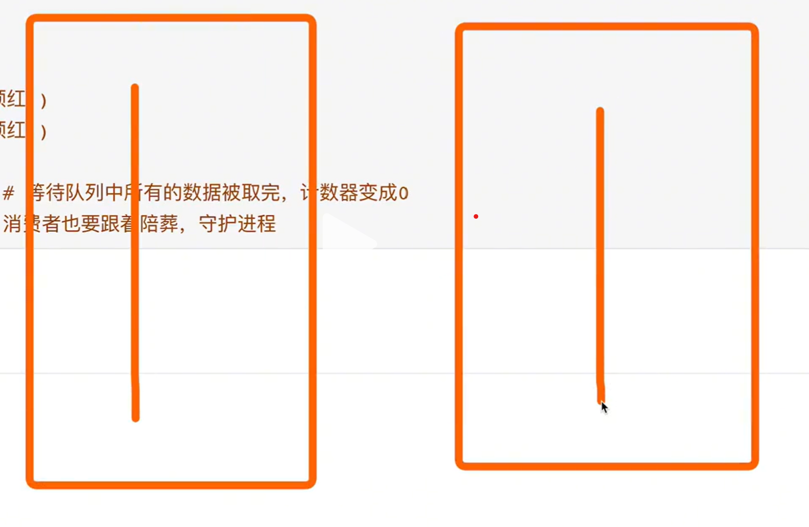

进程里面会自带一个线程，然后这个线程干活的时候，它需要的一些数据、变量之类的，就会找他所在的进程要。所以说进程是资源单位， 他是给线程提供各种资源的；而线程是执行单位，他是真正干活的。也就是说，CPU执行的其实是这个进程里面的线程，而线程就是代码的执行过程，执行过程中所需要的数据或资源都会找他所在的进程要。

为什么要有线程？

创建进程：

1. 申请内存空间    消耗资源
2. 拷贝代码     消耗资源

创建线程：

1. 不需要再次申请内存空间
2. 不需要拷贝代码

在一个进程里面可以创建多个线程，创建线程所消耗的资源要比创建进程所消耗的资源要小得多。而且在同一个进程内，多个线程之间的资源是共享的 ，因为他们用的都是同一个进程里面的资源。

既然创建线程所消耗的资源小，那我们是不是不用创建进程只创建线程就可以了？

不是，也要分情况

创建进程和创建线程的方法很像，操作线程的代码和操作进程的代码是基本一致的，会一个另一个就会

```py
from multiprocessing import Process
from threading import Thread

# 先定义一个函数
def task(name):
    print(f'{name} 任务开始')
    time.sleep(3)
    print(f'{name} 任务结束')

# 创建线程
t = Thread(target=task, args=('悟空',))
t.start()
print('主线程')

# 创建进程
p = Process(target=task, args=('悟空',))
p.start()
print('主进程')
```

创建进程需要申请内存空间，需要拷贝代码，这都是需要消耗资源消耗时间的。我们的代码只是向操作系统提交了创建进程的系统调用，然后代码继续往后走，代码的远程速度是很快的，给操作系统发了系统调用之后，程序立马就往后执行了。所以在创建进程的时候可以看到主进程先打印。而现在创建线程时，当执行 `t.start()`的时候，就是告诉操作系统在当前进程里面再创建一个线程，创建线程不需要重新申请内存空间，也不需要拷贝代码，所以说常见线程所消耗的资源非常低，可以说 `t.start()`一运行线程就已经起来了。

## 池

虽然有了进程和线程，相当于可以同时雇好多人干活，但是不能开上亿个线程同时用，计算机硬件肯定跟不上。

池是用来保证计算机安全的情况下，最大限度的利用计算机资源，降低了程序运行效率，但是保证了计算机硬件的安全，以此来保证我们的程序运行安全。

半连接池也是用来保证计算机硬件安全的，当服务端的服务能力到极限时，再后来的客户端只能在半连接池等着，半连接池就可以限制后面的用户，比如只能再来5个等着，再来就进不来了。如果没有半连接池的限制，所有的客户端都可以直接连进来，如果同时来一亿个客户端，那服务端就要同时维护这一亿个连接，很明显不合理，这一亿个客户端此刻享受不到服务，与其占着连接等，还不如不让他们连接，这样就能减轻服务端硬件的负担
